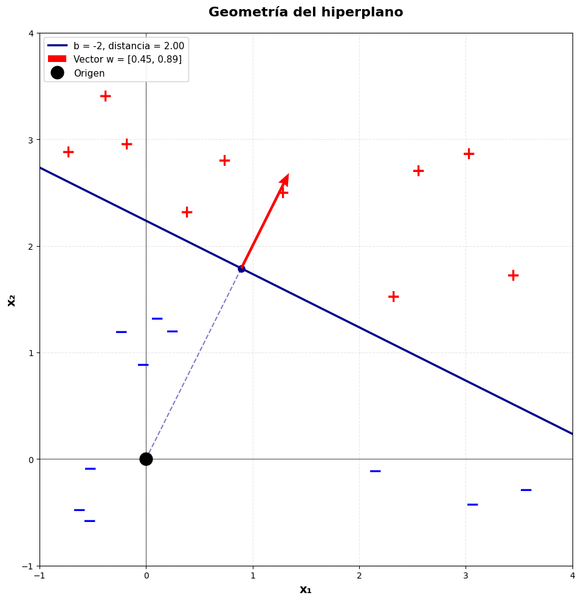
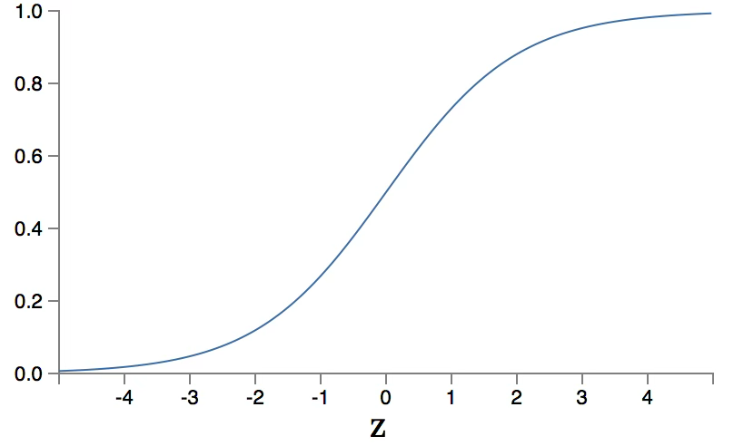
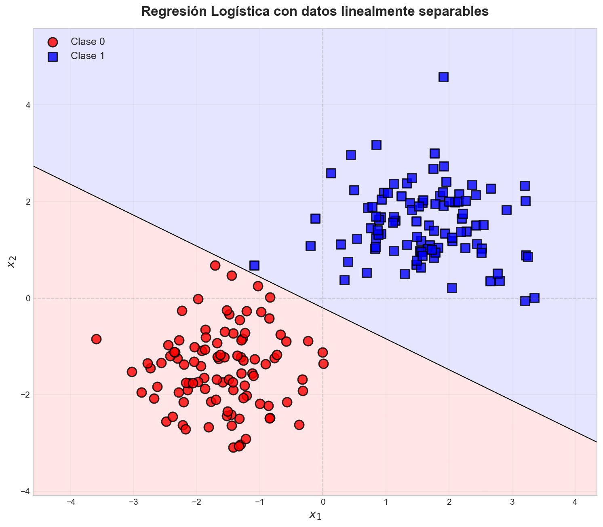
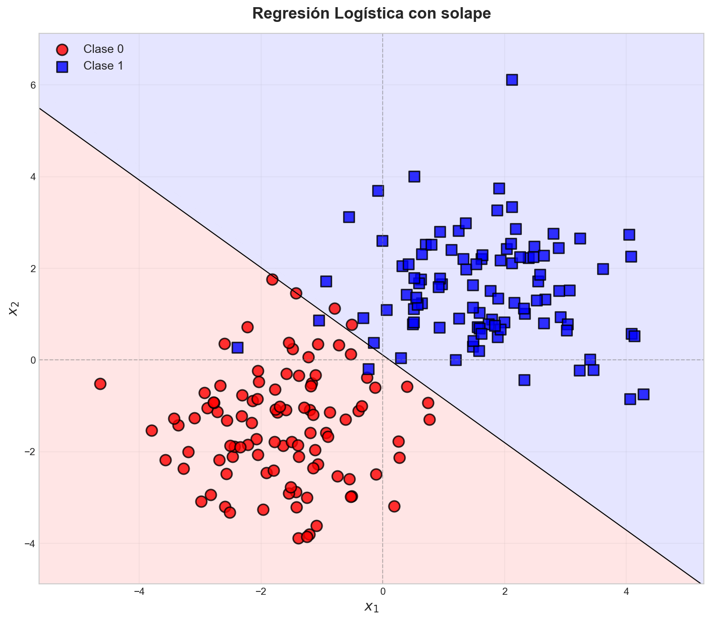
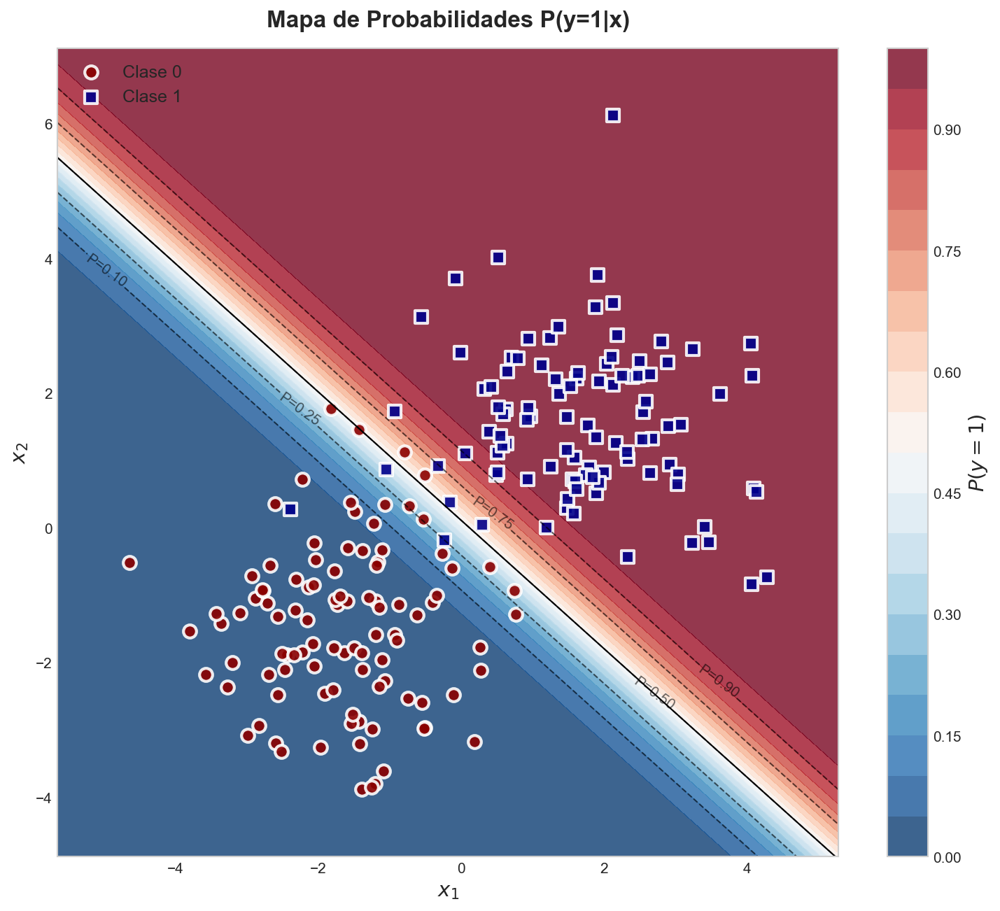
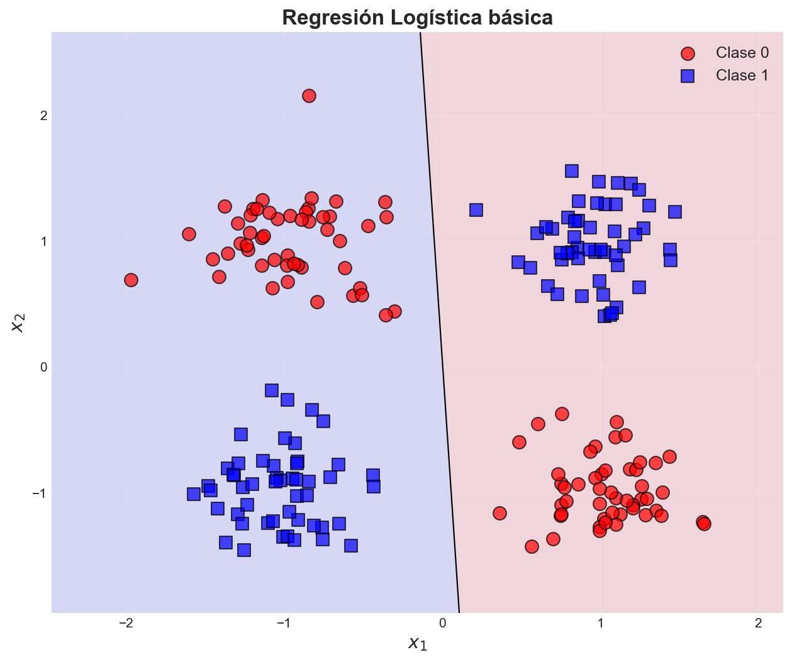
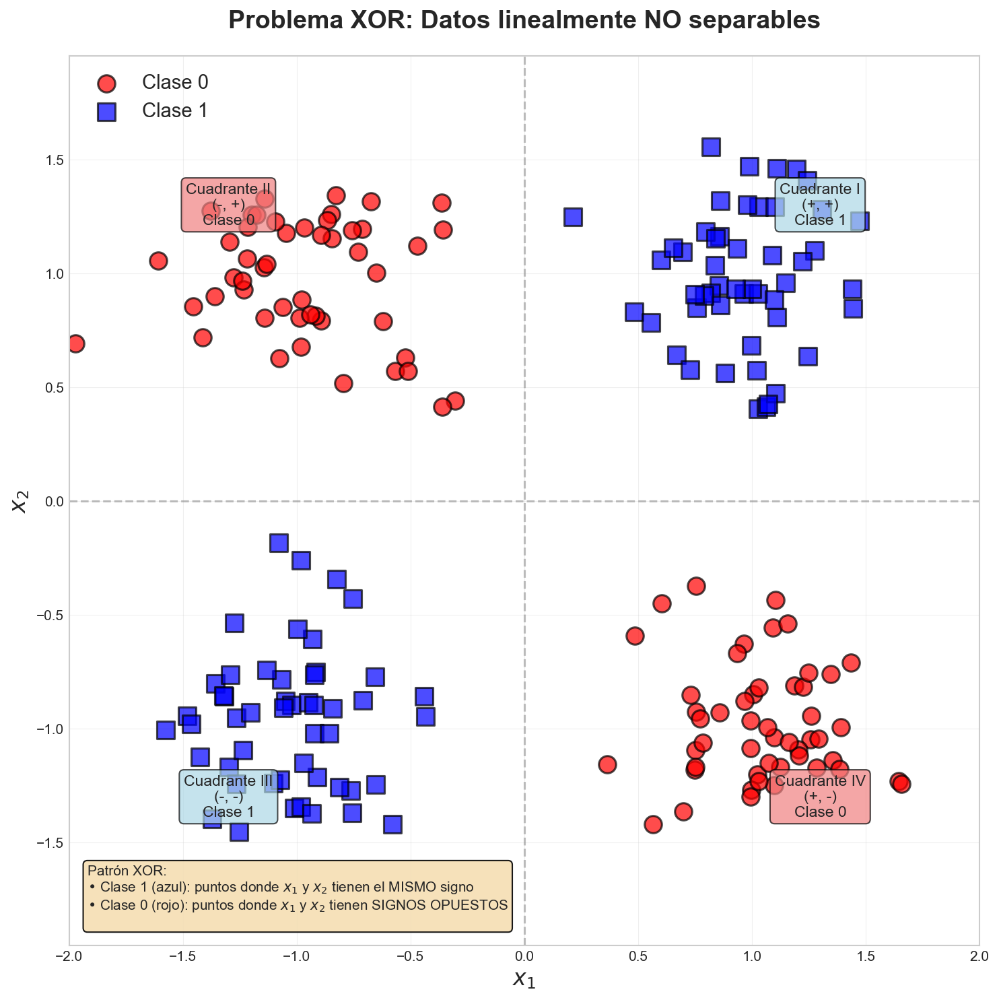
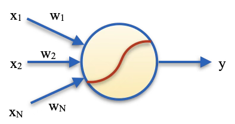
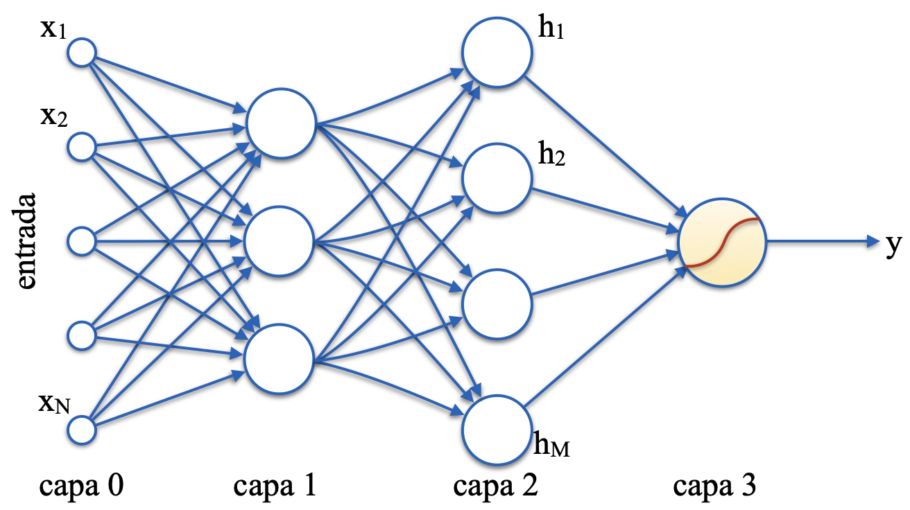

# Tema 1: Modelos paramétricos y no paramétricos

Los **modelos no paramétricos**, a diferencia de los modelos paramétricos, son una familia de modelos que no asumen una forma funcional fija. Una implicación importante de este hecho es que la complejidad del modelo puede crecer en función del conjunto de datos. 

En un modelo paramétrico se define de antemano la forma funcional, que podría ser por ejemplo lineal o cuadrática, y tendremos que estimar un número fijo de parámetros, pero si la estructura de los datos es más compleja y no conocemos su forma, puede que no puedan ajustarse de forma adecuada al modelo.

Los modelos no paramétricos no imponen una estructura fija, sino que permiten que sean los propios datos los que determinen la complejidad del modelo. 

Desde el punto de vista del compromiso (_trade-off_) entre **sesgo** (_bias_) y **varianza**, podemos intuir que los modelos paramétricos tenderán a tener un mayor sesgo, si el modelo no es lo suficientemente complejo como para poder representar los datos (riesgo de _underfitting_), mientras que los modelos no paramétricos tenderán a tener menor sesgo pero mayor varianza (riesgo de _overfitting_), siendo sensibles a los cambios en los datos de entrenamiento.

Vamos a ilustrarlo a continuación mediante un clasificador paramétrico sencillo.

## Modelos lineales

Una familia característica de modelos paramétricos son los modelos lineales, que son aquellos que asumen una relación lineal entre los datos de entrada y la variable objetivo.

El modelo lineal predice la salida como una combinación lineal ponderada de las variables de entrada, con la siguiente forma:

$$
\hat{y} = w_1 x_1 + w_2 x_2 + \ldots + w_N x_N = \mathbf{x}^T \mathbf{w} + b
$$

Donde $\mathbf{x}$ es el vector de características de entrada, $\mathbf{w}$ es el vector de coeficientes que el modelo aprende, $b$ es el sesgo o desplazamiento y $\hat{y}$ la predicción que nos da el modelo. 

Desde el punto de vista geométrico, esta ecuación define un hiperplano. Con esto, podemos dar la siguiente interpretación al funcionamiento de estos modelos:

- Tareas de **regresión**: Se busca el hiperplano que mejor se ajusta a los datos de entrada.
- Tareas de **clasificación**: Se busca el hiperplano que mejor separa los datos de dos clases. 

Vamos a centrarnos a continuación en la tarea de clasificación, y estudiaremos dos de los principales métodos lineales para clasificación: **Regresión Logística** y **SVM** [@hastie2009elements]. 

### Hiperplanos y clasificación

En un problema de clasificación, si contamos con datos linealmente separables podremos encontrar un hiperplano que nos permita clasificarlos sin errores. El hiperplano tendrá la siguiente forma:

$$
\mathbf{x^T} \mathbf{w} + b = 0
$$

Donde sus parámetros son $\mathbf{w}$, que representa un vector perpendicular al hiperplano, y $b$, como término de desplazamiento. 

Para facilitar la visualización, vamos a considerar el caso concreto de dos dimensiones, donde el hiperplano anterior sería una línea, con la siguiente ecuación:

$$
w_1 x_1 + w_2 x_2 + b = 0 \
$$

Por ejemplo, si consideramos como parámetros el vector $\mathbf{w} = [0.45, 0.89]$ y $b = -2$, tendremos la siguiente recta:

Figure: Ejemplo de hiperplano para separar dos conjuntos de datos {#fig-hiperplano}

En la  podemos observar que si el vector $\mathbf{w}$ es unitario, como en el ejemplo anterior, entonces el término $b$ coincide con la distancia del plano al origen. En el caso general en el que $\mathbf{w}$ no es unitario, la distancia al origen será $|b| / \lVert \mathbf{w} \rVert$.  

La ecuación del hiperplano nos proporciona una forma sencilla de clasificar los puntos según se encuentren a uno u otro lado, tomando dicha ecuación como función:

$$
f(\mathbf{\mathbf{x}}) = \mathbf{x^T} \mathbf{w} + b
$$

En la función $f(\mathbf{x})$, todos los puntos que pertenezcan al hiperplano nos darán $f(\mathbf{x})=0$ (cumplirían la ecuación del hiperplano), pero lo que realmente nos interesa es que todos los puntos que estén al lado al que apunta el vector $\mathbf{w}$ harán que $f(\mathbf{x})$ tenga signo positivo, mientras que los que estén al lado contrario harán que tenga signo negativo.  Es decir, podemos utilizar el signo de dicha función como clasificador:

$$
G(\mathbf{x}) = signo[f(\mathbf{x})]
$$

De esta forma, diferentes puntos de datos quedarían clasificados tal como se muestra en la 

Figure: Ejemplo de clasificación con un hiperplano {#fig-clf-hiperplano}

> Además, en caso de que $\mathbf{w}$ sea unitario, la función $f(\mathbf{\mathbf{x}})$ nos dará la distancia (con signo) desde cada punto al plano. Podemos ver esto de forma intuitiva, considerando que el producto escalar $\mathbf{x^T} \mathbf{w}$ nos da la proyección de $\mathbf{x}$ sobre el vector $\mathbf{w}$ perpendicular al hiperplano. Esto nos dará la distancia al hiperplano si pasara por el origen, y el término $b$ introduce un desplazamiento.

Existen diferentes métodos que nos permiten aprender, a partir de un conjunto de datos, un hiperplano que separe los datos de dos clases. 

### Regresión Logística

Aunque el nombre pueda resultar confuso, se trata de un **método de clasificación**, y no de regresión. Si bien con el método de regresión lineal se busca ajustar un hiperplano a un conjunto de puntos, de forma que se minimice la distancia entre los puntos del conjunto de entrada y el hiperplano, en el caso de la regresión logística buscamos el hiperplano que mejor separe dos clases de datos. Hablamos en este caso de regresión logística **binomial**, en la que contamos únicamente con dos clases, aunque también podríamos extender este método a un mayor número de clases, hablando en este caso de regresión logística **multinomial**. Vamos a centrarnos de momento por simplicidad en el caso binomial.  

Como hemos visto anteriormente, a partir de la ecuación del hiperplano podemos determinar si un punto está a uno u otro lado a partir del signo de la función $f(x)$ anterior.

Este modelo destaca por su interpretabilidad, y es ampliamente utilizado como modelo base en numerosos problemas de clasificación. 

La clave principal de la regresión logistica consiste en aplicar sobre la función anterior la función sigmoide, modelando mediante esta función la probabilidad de pertenencia a cada clase.

#### Función sigmoide

La función sigmoide $\sigma(z)$ tiene la siguiente forma:

$$
\sigma(z) = \frac{1}{1+ e^{-z}}
$$

Podemos verla representada en la .

Figure: Forma de la función sigmoide {#fig-sigmoide}

Como podemos observar, esta función presenta una transición suave desde $0$ (cuando $z \rightarrow -\infty$) hasta $1$ (cuando $z \rightarrow \infty$), teniendo su punto medio en $\sigma(0) = 0.5$. 

La función es siempre creciente y derivable, lo cual es una propiedad importante para la optimización.

La función sigmoide tiene la siguiente derivada:

$$
\sigma'(z) = \sigma(z) (1 - \sigma(z))
$$

Esta forma simplifica mucho el cálculo del gradiente.

Podemos sustituir $z$ por nuestra función $f(x)$ que nos permite clasificar los puntos en función del signo, teniendo:

$$
h_w(\mathbf{x}) = \sigma(f(x)) =  \frac{1}{1 + e^{-f(x)}} = \frac{1}{1 + e^{-(\mathbf{x}^T \mathbf{w} + b)}}
$$

Podemos interpretar $h_w(x)$ como la probabilidad estimada de que $y = 1$ (es decir, de que pertenezca a la clase positiva). Podemos expresarlo como:

$$
h_w(\mathbf{x}) = P(y=1 | \mathbf{x}, \mathbf{w}, b)
$$

Estimaremos los parámetros mediante máxima verosimilitud, lo cual equivale a minimizar la pérdida logarítmica (_log-loss_).

#### Función de coste

La función de pérdida logarítmica (_log-loss_) para una sola muestra tiene la siguiente forma:

$$
L(h_w(\mathbf{x}), y) = -y \log (h_w(x)) - (1-y) log(1-h_w(x))
$$

Esta función tiene la propiedad de que penaliza fuertemente las predicciones confiadas pero incorrectas. Es decir, si la salida esperada es $y=1$ pero la predicción $h(\mathbf{x}) \rightarrow 0$, entonces la penalización será alta.

Consideremos ahora que tenemos un conjunto de entrenamiento con $N$ pares $(\mathbf{x_i}, y_i)$ con $\mathbf{x_i} \in \mathbb{R}^d$ y $y_i \in \{0, 1\}$ (problema binomial), siendo $d$ el número de _features_.

Con todo ello, para el conjunto de muestras podemos construir la siguiente función de coste:

$$
J(\mathbf{w}) = -\frac{1}{N} \sum_{i=1}^N [y_i \log (h_w(\mathbf{x}_i)) + (1-y_i) \log (1 - h_w(\mathbf{x}_i))]
$$

Esta función tiene la propiedad de que es convexa (tiene un único mínimo global) y diferenciable, y como hemos comentado, penaliza las predicciones claramente incorrectas.

#### Optimización

Buscamos encontrar los pesos $\mathbf{w}$ que minimicen la función de coste anterior. 

$$
\mathbf{\hat{w}} = \arg \min_{\mathbf{w}} J(\mathbf{w}) 
$$

Obtenemos el gradiente de la función, mediante la derivada parcial respecto a cada peso $w_j$:

$$
\frac{\partial J(\mathbf{w})}{\partial w_j} = \frac{1}{N} \sum_{i=1}^N (h_w(\mathbf{x}_i) - y_i) x_{ij}
$$

Podemos expresar el gradiente en forma vectorial, para todos los pesos, de la siguiente forma:

$$
\nabla J(\mathbf{w}) = \frac{1}{N} \mathbf{x}^T (h_w(\mathbf{x}) - y) 
$$

Donde $\mathbf{x}$ es una matriz de dimensión $N \times d$, $h_w(\mathbf{x})$ es un vector de predicciones de dimensión $N \times 1$ y $y$ es un vector de etiquetas de dimensión $N \times 1$ (una fila para cada ejemplo de entrada). 

De la misma forma, podemos obtener la derivada parcial respecto al sesgo ($b$):

$$
\frac{\partial J(\mathbf{w})}{\partial b} = \frac{1}{N} \sum_{i=1}^N (h_w(\mathbf{x}_i) - y_i)
$$

Con esto, podremos aplicar **Descenso por Gradiente** o **Descenso por Gradiente estocástico (SGD)** para optimizar los pesos. También tenemos otros algoritmos de optimización como **Coordinate Descent** [@hsieh2008dual], en el que en lugar de aplicar descenso por gradiente a la vez sobre todas las coordenadas, se selecciona de forma iterativa una coordenada, se congela el resto, y se optimiza para la coordenada seleccionada. El algoritmo itera por las diferentes coordenadas hasta la convergencia. Encontramos también otros métodos de optimización, como el método de **Newton** [@nocedal2006numerical] que utiliza segundas derivadas y presenta la ventaja de una convergencia más rápida, aunque resulta algo costoso. Tenemos también **L-BFGS** [@liu1989limited] que es una aproximación eficiente del método de Newton y es el utilizado por defecto en la [implementación de `LogisticRegression` en sklearn](https://scikit-learn.org/stable/modules/generated/sklearn.linear_model.LogisticRegression.html). Esta implementación  incluye diferentes _solvers_ alternativos que podemos utilizar para la optimización. 

#### Regularización

Podemos añadir a la función de coste un término de penalización para prevenir el _overfitting_ y controlar la complejidad del modelo. Encontramos diferentes tipos de regularización:

##### Regularización L2 (Ridge)

Busca penalizar pesos grandes, para favorecer soluciones más simples:

$$
\begin{align*}
J(\mathbf{w}) = &-\frac{1}{N} \sum_{i=1}^N [y_i \log (h_w(\mathbf{x}_i)) + (1-y_i) \log (1 - h_w(\mathbf{x}_i))] +
\\
& + \frac{\lambda}{2N} \sum_{k=1}^d w_k^2
\end{align*}
$$

##### Regularización L1 (Lasso)

Favorece que algunos pesos puedan ser exactamente $0$, actuando de esta forma como una selección de características:

$$
\begin{align*}
J(\mathbf{w}) = &-\frac{1}{N} \sum_{i=1}^N [y_i \log (h_w(\mathbf{x}_i)) + (1-y_i) \log (1 - h_w(\mathbf{x}_i))] +
\\
& + \frac{\lambda}{N} \sum_{k=1}^d | w_k |
\end{align*}
$$

##### Regularización Elastic Net

Combina L1 y L2:

$$
\begin{align*}
J(\mathbf{w}) = &-\frac{1}{N} \sum_{i=1}^N [y_i \log (h_w(\mathbf{x}_i)) + (1-y_i) \log (1 - h_w(\mathbf{x}_i))] +
\\
& + \frac{\lambda_1}{N} \sum_{k=1}^d | w_k | + \frac{\lambda_2}{2N} \sum_{k=1}^d w_k^2 
\end{align*}
$$

En todos estos casos tenemos un hiper-parámetro $\lambda$ con el que podemos ajustar la regularización. Con $\lambda = 0$ no aplicamos regularización, con lo que tendremos mayor riesgo de _overfitting_, mientras que con valores muy altos podríamos tener mayor riesgo de _underfitting_. 

 

## Limitaciones de los modelos lineales

Como hemos visto, los modelos lineales como regresión logística buscan el hiperplano que mejor separe los datos de las diferentes clases. Sin embargo, esto no siempre será posible.

### Regresión logística con datos linealmente separables

En caso de tener datos linealmente separables, como los que se muestran en la  , existirá un hiperplano que los separe. En este caso, un clasificador lineal con solo 3 parámetros ($w_1, w_2, b$) será suficiente para representar los datos.

Figure: Conjunto de datos linealmente separables {#fig-separable}

Con esta distribución de los datos, incluso si apareciese algún solape entre las dos clases o algún _outlier_, seguiría siendo posible encontrar un hiperplano que nos permita clasificarlos con una alta precisión, y solo un pequeño porcentaje de errores (ver ).

Figure: Conjunto de datos separables con solape {#fig-solape}

Podemos además ver en la  el mapa de probabilidades que nos proporciona el modelo de regresión logística.

Figure: Mapa de probabilidades {#fig-prob}

### Regresión logística con datos linealmente no separables

Sin embargo, si la distribución de los datos cambiase, y pasaran a ser no separables, como los que se muestran en la , el modelo anterior no sería suficiente para representarlos.

Figure: Conjunto de datos linealmente no separables {#fig-xor}

En este caso los datos siguen un patrón conocido como XOR, distribuido en $4$ cuadrantes, y no es posible encontrar ningún hiperplano que los separe. Cualquier hiperplano nos dará siempre un error aproximado del $50\%$, que equivale a lanzar una moneda al aire para predecir la clase, tal como se ve en la figura anterior. 

Vemos en este caso como el no poder adaptar la complejidad del modelo a los datos (estaríamos limitados a $3$ parámetros $w_1, w_2, b$) hace que el modelo no pueda ajustarse de forma adecuada.

### Posibles soluciones

Para clasificar los puntos del último ejemplo minimizando el error de clasificación, podríamos optar por:

- **Clasificador lineal con ingeniería de características**: Crear manualmente características no lineales (por ejemplo $x_1^2,x_2^2,x_1 \cdot x_2$) y usar un modelo lineal sobre ellas. Esto requiere tener conocimiento del dominio, para determinar qué características necesitaríamos para que la función pueda ajustarse a nuestros datos.

- **Clasificador paramétrico no lineal**: Por ejemplo, una red neuronal con número fijo de parámetros. Necesitaremos determinar la arquitectura más adecuada.

- **Clasificador no paramétrico**: En este caso no será necesario conocer previamente la estructura de los datos (su forma funcional), sino que el modelo se adaptará automáticamente a su complejidad.

Veremos a continuación ejemplos de cada una de estas soluciones.

## Ingeniería de características

Vamos en primer lugar a ver cómo podríamos utilizar ingeniería de características para separar el conjunto de datos anterior (ejemplo XOR). 

Al estar en dos dimensiones contamos con las _features_ $x_1$ y $x_2$. Lo que vamos a hacer es añadir además las _features_ $x_1^2$, $x_1 x_2$ y $x_2^2$. Nótese que se trata de _features_ derivadas de las originales. Esto nos va a permitir definir una frontera curva entre los datos, donde el papel de la característica $x_1 x_2$ será fundamental, ya que según su signo podremos inferir la clase en una operación XOR. Podemos ver esto ilustrado en la .

Figure: Ingeniería de características {#fig-xor-feat}

Si aplicamos a este conjunto de datos el modelo de regresión logística introduciendo las _features_ indicadas anteriormente, obtenemos la frontera de clasificación que se muestra en la .

Figure: Frontera de decisión con ingeniería de características {#fig-frontera}

Lo que hemos hecho ha sido crear $M$  características de entrada $h(\mathbf{x}) = (h_1(\mathbf{x}), h_2(\mathbf{x}), \ldots, h_M(\mathbf{x}))$ a partir de las características originales $\mathbf{x}$. Es decir, con $h(\mathbf{x})$ estamos proyectando las características originales en un nuevo espacio de características. Con esto, el hiperplano de separación quedaría de la siguiente forma:

$$
f(\mathbf{x}) = h(\mathbf{x})^T \mathbf{w} + b
$$

Podemos observar que aunque el modelo sigue siendo lineal respecto a las características proyectadas $h(\mathbf{x})$, puede que ya no lo sea en el espacio original de características de $\mathbf{x}$. Esto es lo que ocurre en el caso del ejemplo anterior, en el que las características proyectadas son $h(\mathbf{x}) = (x_1, x_2, x_1 x_2, x_1^2, x_2^2)$, y por lo tanto tenemos un polinomio de grado 2 en el espacio original.

## Modelos paramétricos no lineales

Un tipo destacado modelo paramétrico no lineal son las Redes Neuronales. Vamos a establecer la relación de la Regresión Logística con las Redes Neuronales y a estudiar como estos modelos pueden resolver problemas no lineales como el planteado.

Es fácil determinar que el modelo de regresión logística es equivalente a un perceptrón con $N$ entradas que aplique una función sigmoide como función de activación (ver ). 

Figure: Perceptrón con $N$ entradas y función de activación Sigmoide {#fig-perceptron}

En este caso, la salida de la neurona sería:

$$
y = \sigma(\sum_{i=1}^N w_i x_i + b)
$$

Donde $x_i$ son las entradas, $w_b$ los pesos para cada entrada y $b$ el sesgo o _bias_. 

Cuando a la red le añadimos varias capas ocultas (ver ), lo que estaremos haciendo es aprender a transformar el espacio original de características $\mathbf{X}$ en un espacio latente $\mathbf{H}$ que facilite su clasificación. Podremos encontrar estas características en la última capa de la red, y sobre ellas se aplicará una clasificación equivalente a la regresión logística.

Figure: Red neuronal profunda con neurona de salida Sigmoidea {#fig-deep}

Esta transformación del espacio de características nos podría permitir mapear nuestros datos de entrada no linealmente separables sobre un espacio en el que si que lo sean. En este caso tenemos un modelo **paramétrico pero no lineal**. 

Cabe destacar que aplicando ingeniería de características debemos diseñar manualmente las nuevas características que derivamos del conjunto original, por lo que es necesario tener conocimiento sobre la forma funcional de los datos. Sin embargo, en este caso es la propia red quien aprende de forma automática las características más adecuadas para resolver el problema.

## Modelos no paramétricos

Nuestra tercera opción es el uso de modelos no paramétricos. Estos modelos cuentan con la ventaja de que su complejidad se adapta a los datos. 

Dentro de este grupo encontramos por ejemplo modelos basados en vecindad como **K-NN**, que son capaces de adaptarse sin problema al problema XOR anterior y a formas más complejas. En la  vemos la frontera de decisión obtenida cuando aplicamos K-NN al conjunto de datos que sigue el patrón XOR.

Figure: Aplicación de K-NN al problema XOR {#fig-knn}

En la próxima sesión veremos el modelo **SVM**, que originalmente se plantea como un modelo paramétrico lineal, pero que puede transformarse en un modelo no paramétrico mediante el conocido como _kernel trick_. 

Encontramos muchos otros modelos no paramétricos, parte de los cuales enumeramos a continuación:

- **Métodos basados en vecindad**. Encontramos **K-NN** tanto para clasificación como para regresión, así como variantes como K-NN ponderado por distancia, así como métodos de estimación de densidad como **Kernel Density Estimation (KDE)**

- **Métodos de kernel**, como **SVM** y sus variantes. 

- **Métodos basados en árboles**. Encontramos los **árboles de decisión**, que nos permiten abordar problemas de clasificación y regresión, y **métodos de _ensemble_** que combinan diferentes clasificadores "débiles" para construir un clasificador "fuerte". Dentro de este último subgrupo, encontramos métodos como **Random Forest**, **AdaBoost**, **Gradient Boosting** y **XGBoost**.

- **Métodos de clustering**, como **DBSCAN**,  **Gaussian Mixture Models (GMM)** y **Spectral Clustering**.  

- **Métodos de aprendizaje por refuerzo**, como **Q-learning** y **SARSA**.

- **Métodos de reducción de la dimensionalidad**, como **t-SNE** y **UMAP**.

En las próximas sesiones estudiaremos varios de estos modelos.

\bibliography