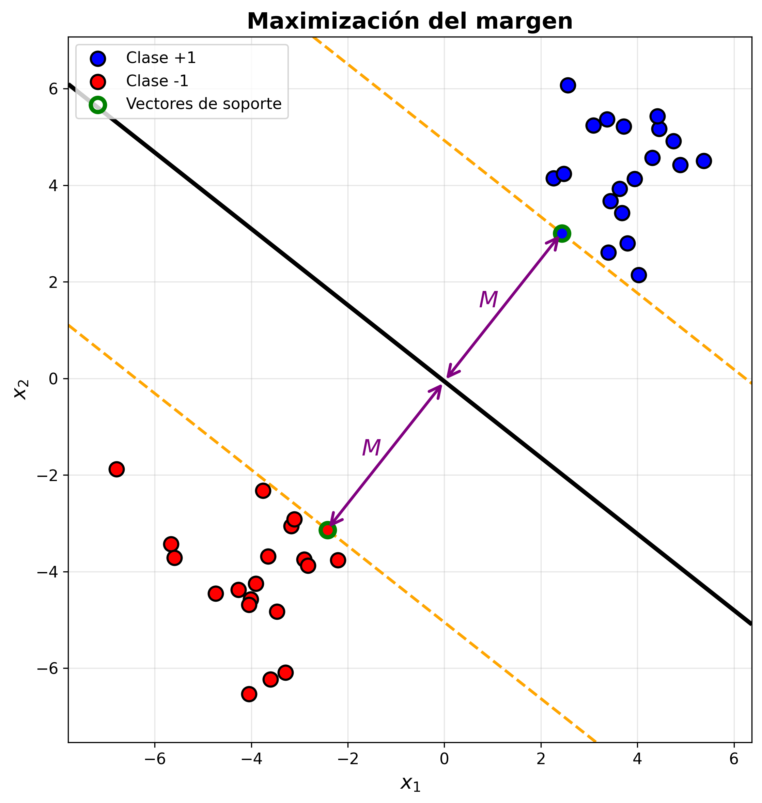
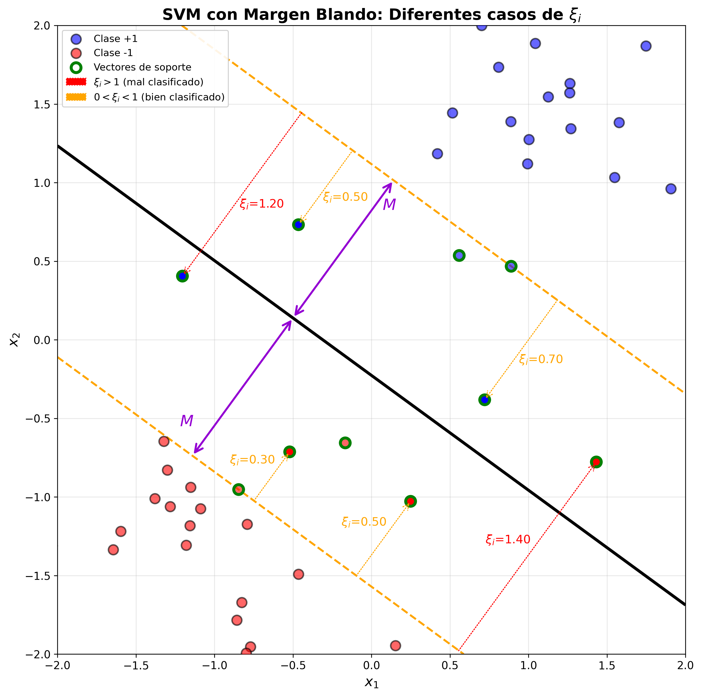
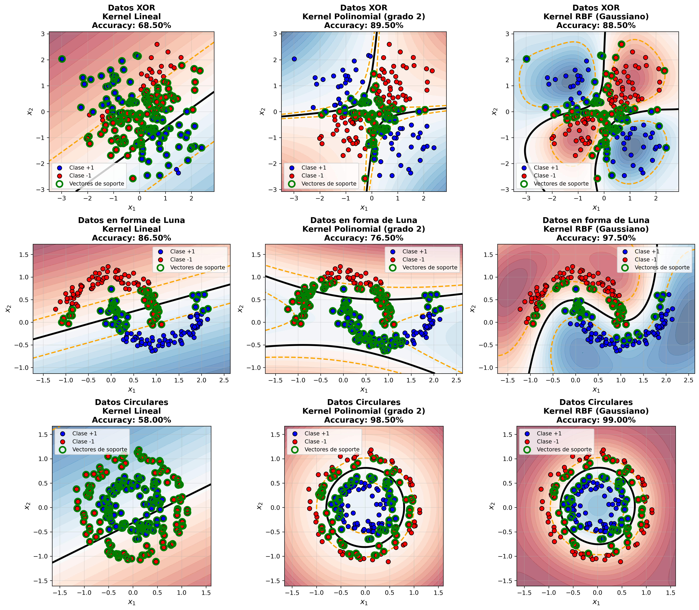

# Sesión 2: Support Vector Machines (SVM)

Las Support Vector Machines (SVM) [@cortes1995svm] son algoritmos de aprendizaje supervisado utilizados principalmente para clasificación, aunque también pueden aplicarse a regresión. 

## Aplicaciones de SVM

Aunque en la actualidad los modelos basados en aprendizaje profundo dominan en campos como la Visión por Computador (CV) o el Procesamiento del Lenguaje Natural (NLP), y en general cuando contamos con extensos conjuntos de datos y disponibilidad de gran capacidad de computación, modelos como SVM pueden ser competitivos cuando contemos con datos tabulares de tamaño pequeño o mediano.

SVM ofrece un buen rendimiento con  conjuntos de datos pequeños. A modo orientativo, con conjuntos de menos de 1.000 ejemplos puede resultar la opción más adecuada, y podría mantenerse competitivo incluso con _datasets_ del orden de 10.000 ejemplos.  Encontramos otros modelos que siguen ofreciendo resultados competitivos en estos casos, como XGBoost o Random Forest. 

Por ejemplo, un área en la que estos modelos pueden resultar de interés es en el análisis de datos médicos, en los que contamos con **_datasets_ pequeños** (datos de pacientes) pero con **alta dimensionalidad** (por ejemplo teniendo en cuenta la expresión de diferentes genes). Además, tenemos la ventaja de que este tipo de modelos facilita la **interpretabilidad**, lo cual los hace especialmente interesantes en estos ámbitos. 

## Maximización del margen

Como hemos visto anteriormente, en un problema de clasificación binaria buscamos encontrar un hiperplano que separe los datos de las dos clases, pero, ¿cuál es el hiperplano de separación óptimo? Lo que plantea SVM es buscar el hiperplano que **maximiza el margen** entre las dos clases, a diferencia del modelo de regresión logística en el que lo que se buscaba era maximizar la verosimilitud. Es decir, regresión logística proporciona probabilidades bien calibradas, mientras que SVM prioriza la robustez del margen, sin producir probabilidades de forma directa.

El margen será la distancia desde el hiperplano hasta los puntos más cercanos de cada clase. Estos puntos más cercanos son conocidos como **vectores de soporte** (ver ). 

Figure: Maximización del margen {#fig-margenduro}

Además, como veremos más adelante, SVM se puede generalizar para casos en los que los datos no sean separables de forma líneal. 

### Margen duro

Vamos en primer lugar a suponer que los datos son linealmente separables. Hablamos entonces de margen duro, ya que estableceremos la restricción de que los puntos pertenecientes a cada clase deben quedar siempre al lado correcto del margen.

Consideremos que tenemos un conjunto de entrenamiento con $N$ pares $(\mathbf{x_i}, y_i)$ con $\mathbf{x_i} \in \mathbb{R}^d$ y $y_i \in \{-1, 1\}$ (problema de clasificación binaria), siendo $d$ el número de _features_.

En caso de que el vector $\mathbf{w}$ sea unitario, la función $f(\mathbf{x})$ nos dará la distancia desde el hiperplano a cada punto $\mathbf{x}$. 

Con esto, para buscar el hiperplano que maximice el margen $M$, deberemos resolver el siguiente problema de optimización:

$$
\begin{align*}
\max_{\mathbf{w}, b, \lVert \mathbf{w}  \rVert=1} \quad  & M \\
\text{s.a.} \quad & y_i(\mathbf{x}_i^T\mathbf{w} + b) \geq M, i = 1, \ldots, N
\end{align*}
$$

Podemos eliminar la restricción de que $\mathbf{w}$ sea unitario dividiendo la ecuación del hiperplano entre $\lVert \mathbf{w} \rVert$. Si dividimos toda la ecuación seguirá representando al mismo hiperplano y nos permitirá  reemplazar la condición con:

$$
\frac{1}{\lVert \mathbf{w} \rVert} y_i(\mathbf{x}_i^T\mathbf{w} + b) \geq M
$$

O lo que es lo mismo:

$$
y_i(\mathbf{x}_i^T\mathbf{w} + b) \geq M \lVert \mathbf{w} \rVert
$$ 

En este caso, el hiperplano seguirá siendo el mismo independientemente del valor de $\lVert \mathbf{w} \rVert$. Por lo tanto, podemos considerar de forma arbitraria que $\lVert \mathbf{w} \rVert = 1 / M$, lo cual nos permite reescribir la restricción anterior de la siguiente forma:

$$
y_i(\mathbf{x}_i^T\mathbf{w} + b) \geq 1 
$$ 

#### Forma primal

Con lo anterior, el problema de optimización a resolver tendría la siguiente forma:

$$
\begin{align*}
\min_{\mathbf{w}, b} \quad & \mathbf{\lVert w \rVert} \\
\text{s.a.} \quad & y_i(\mathbf{x}_i^T\mathbf{w} + b) \geq 1, i = 1, \ldots, N
\end{align*}
$$

Esta es la conocida como **forma primal**, en la que tenemos nuestra función objetivo y una serie de restricciones. Podríamos resolver este problema aplicando algún método de optimización como descenso por gradiente, o descenso por gradiente estocástico (SGD), para buscar los parámetros $\mathbf{w}$ y $b$ óptimos. 

Sin embargo, vamos a utilizar el método de los **multiplicadores de Lagrange** [@boyd2004convex] para transformar este problema con restricciones a un problema en el que las restricciones se transforman en penalizaciones a la función objetivo.

El problema de optimización anterior sería equivalente al siguiente, ya que el mínimo de $\mathbf{\lVert w \rVert}$ será el mismo que el de $\frac{1}{2} \mathbf{\lVert w \rVert}^2$:

$$
\begin{align*}
\min_{ \mathbf{w}, b} \quad  & \frac{1}{2} \mathbf{\lVert w \rVert}^2 \\
\text{s.a.} \quad & y_i(\mathbf{x}_i^T\mathbf{w} + b) \geq 1, i = 1, \ldots, N
\end{align*}
$$

Sin embargo, esta segunda forma nos da ventajas importantes, especialmente la diferenciabilidad de $\frac{1}{2} \mathbf{\lVert w \rVert}^2$, que es derivable en todos sus puntos, mientras $\mathbf{\lVert w \rVert}$ no es derivable cuando $\mathbf{\lVert w \rVert}$ = 0. 

Debemos recordar que estamos asumiendo de momento que los datos son separables (**margen duro**), y por lo tanto consideramos únicamente dos casos posibles:

- $y_i(\mathbf{x}_i^T\mathbf{w} + b) > 1$ : correctamente clasificados fuera del margen.
- $y_i(\mathbf{x}_i^T\mathbf{w} + b) = 1$ : Vectores de soporte, pertenecientes al margen.

Para resolver el problema de optimización mediante multiplicadores de Lagrange, la función Lagrangiana primal que deberemos minimizar respecto a $\mathbf{w}$ y $b$ es la siguiente:

$$
L_P(\mathbf{w}, b, \alpha) = \frac{1}{2} \lVert \mathbf{w} \rVert^2 - \sum_{i=1}^N \alpha_i [ y_i ( \mathbf{x}_i^T \mathbf{w} + b ) - 1 ]
$$

Hemos transformado cada restricción en un término de la función a minimizar, y aplicado a cada uno de estos términos un multiplicador $\alpha_i$ (multiplicador de Lagrange). 

Derivamos la función anterior respecto a $\mathbf{w}$ y $b$, y establecemos las derivadas a $0$ para buscar el punto en el que la función presenta un mínimo (condición de estacionariedad). Tenemos entonces:

$$
\begin{align*}
\frac {\partial L(\mathbf{w}, b, \alpha)}{\partial \mathbf{w}} &= \mathbf{w} - \sum_{i=1}^N \alpha_i y_i \mathbf{x}_i = 0 & \Rightarrow \mathbf{w} = \sum_{i=1}^N \alpha_i y_i \mathbf{x}_i 
\\
\frac {\partial L(\mathbf{w}, b, \alpha)}{\partial b} &= \sum_{i=1}^N \alpha_i y_i  = 0  & \Rightarrow 0 = \sum_{i=1}^N \alpha_i y_i
\end{align*}
$$

Sustituyendo $\mathbf{w}$ en la Lagrangiana (teniendo en cuenta que $\lVert \mathbf{w} \rVert^2 = \mathbf{w}^T \mathbf{w}$) tenemos:

$$
\begin{align*}
L_D(\mathbf{w}, b, \alpha) &= \frac{1}{2}  \sum_{i=1}^N \alpha_i y_i \mathbf{x}_i^T \sum_{j=1}^N \alpha_j y_j \mathbf{x}_j   - \sum_{i=1}^N \alpha_i [ y_i ( \mathbf{x}_i^T \sum_{j=1}^N \alpha_j y_j \mathbf{x}_j + b ) - 1 ] = \\
&= \frac{1}{2}  \sum_{i=1}^N \alpha_i y_i \mathbf{x}_i^T \sum_{j=1}^N \alpha_j y_j \mathbf{x}_j    
- \sum_{i=1}^N \alpha_i y_i  \mathbf{x}_i^T \sum_{j=1}^N \alpha_j y_j \mathbf{x}_j 
- b \sum_{i=1}^N \alpha_i y_i  
+ \sum_{i=1}^N \alpha_i =
\\ 
&= \sum_{i=1}^N \alpha_i -
\sum_{i=1}^N \sum_{j=1}^N \alpha_i \alpha_j y_i y_j \mathbf{x}_i^T \mathbf{x}_j 
\end{align*}
$$

#### Forma dual

Tenemos entonces el problema dual. A diferencia del problema primal donde minimizábamos la norma de $\mathbf{w}$, ahora buscamos maximizar la función $L_D(\alpha)$:

$$
\begin{align*}
\max_\alpha \quad & L_D(\alpha) =  \sum_{i=1}^N \alpha_i -
\sum_{i=1}^N \sum_{j=1}^N \alpha_i \alpha_j y_i y_j \mathbf{x}_i^T \mathbf{x}_j 
\\
s.a.\quad  & \sum_{i=1}^N \alpha_i y_i  = 0 
\\
&\alpha_i \geq 0 \  \forall i=1, \ldots, N
\end{align*}
$$

Esto ocurre porque al transformar el problema mediante multiplicadores de Lagrange, la función dual nos proporciona una cota inferior del valor óptimo del problema primal, por lo que para encontrar la mejor solución debemos maximizar esta cota. 

Debemos destacar en este punto que en el caso de la forma dual deberemos optimizar los multiplicadores $\alpha_i$, en lugar de los parámetro $\mathbf{w}$ y $b$ como ocurría en el caso de la forma primal. 

Nos encontramos con un problema de **programación cuadrática (QP)** convexo con restricciones lineales. Este tipo de problemas tienen la siguiente forma general:

$$
f(\mathbf{\alpha}) = \frac{1}{2} \mathbf{\alpha}^T Q \mathbf{\alpha} + c^T \mathbf{\alpha}
$$

Para que el problema sea convexo, la matriz $Q$ debe ser semidefinida positiva, y esto se cumple en el caso de SVM, ya que tenemos:

$$ 
Q_{ij} = y_i y^j \mathbf{x}^T_i \mathbf{x}_j
$$

Podremos por lo tanto aplicar algún algoritmo de optimización para este tipo de problemas. Encontramos diferentes _solvers_, como por ejemplo [CVXOPT](https://cvxopt.org) o [OSQP](https://osqp.org/) en Python. 

En la práctica, el algoritmo más utilizado es SMO (_Sequential Minimal Optimization_) [@platt1998smo]. Este es el algoritmo utilizado por ejemplo por [LIBSVM](https://www.csie.ntu.edu.tw/~cjlin/libsvm/), que es la librería que encontramos integrada en [scikit-learn](https://scikit-learn.org/stable/). En este caso, en lugar, de resolver un problema QP completo con $N$ variables, selecciona solo dos variables $\alpha_i$ y $\alpha_j$ iterativamente, fijando el resto, las optimiza, e itera hasta la convergencia. 

#### Condiciones KKT

En un problema de optimización convexo con restricciones para que un punto sea óptimo debe satisfacer un conjunto de condiciones conocidas como condiciones KKT (Karush-Kuhn-Tucker) [@kuhn1951nonlinear;@boyd2004convex]:

1. **Estacionariedad**. Buscamos que la función Lagrangiana tenga gradiente $0$. Se cumple al haber igualado las derivadas a $0$. 
2. **Factibilidad**. El punto debe ser factible y cumplir las restricciones.
3. **Signo**. Todos los multiplicadores asociados a restricciones de desigualdad deben tener signo positivo:
$$
\alpha_i \geq 0 \quad \forall i=1, \ldots, N
$$  

4. **Complementariedad**. Además de las condiciones anteriores, es importante cumplir también la siguiente condición:

$$
\alpha_i [ y_i ( \mathbf{x}_i^T \mathbf{w} + b) - 1 ] = 0 \quad \forall i=1, \ldots, N
$$

Esta última condición nos dice que:

- Si $\alpha_i > 0$, entonces la restricción es activa y debe cumplirse $[ y_i ( \mathbf{x}_i^T \mathbf{w} + b) - 1 ] = 0$. Estos serán los puntos conocidos como **vectores de soporte**, que se encuentran justo en el margen de separación.

- En caso de que $y_i (\mathbf{x}_i^T \mathbf{w} + b) > 1$, entonces el punto estará fuera del margen y la restricción no será activa, siendo $\alpha_i = 0$. En este caso no se tratará de un vector de soporte.

Es importante destacar que solo los puntos con $\alpha_i > 0$ (vectores de soporte) contribuyen a la solución. El resto de puntos no afectarán al hiperplano. 

Podemos observar que $\mathbf{w}$ se obtendrá como combinación lineal de los vectores de soporte $\mathbf{x}_i$ (aquellos con $\alpha_i > 0$). El parámetro $b$ se puede obtener resolviendo la condición de complementariedad para cualquiera de los vectores de soporte.

### Margen blando

Todo lo anterior es válido bajo la suposición de que los datos son linealmente separables, pero si esto no se cumple entonces el problema primal no tendrá solución. 

Supongamos ahora que existe un solape entre los datos. Una forma de tratar con este solape es maximizar $M$ permitiendo que algunos datos estén en el lado incorrecto del margen, para lo cual se definen las variables $\xi = (\xi_1, \xi_2, \ldots, \xi_N)$, relajando la restricción del primal de la siguiente forma:

$$
y_i(\mathbf{x}_i^T\mathbf{w} + b) \geq 1 - \xi_i \quad \forall i, \xi_i \geq 0
$$ 

Podemos interpretar $\xi_i$ como la cantidad proporcional que permitimos que una predicción esté en el lado incorrecto del margen (ver ). Si tenemos $\xi_i > 1$ entonces la correspondiente predicción estaría mal clasificada, mientras que con valores $0 < \xi_i < 1$ estaría correctamente clasificada pero en el lado incorrecto del margen.

Figure: Margen blando y variables $\xi_i$ {#fig-margenblando}

Si acotamos el sumatorio $\sum_{i=1}^N \xi_i$ a un valor constante, entonces estaremos acotando el número máximo de errores de clasificación de los datos de entrenamiento a dicha constante. Esto lo trasladaremos como una penalización a nuestra función objetivo.

#### Forma primal

Al igual que hicimos en el caso con margen duro, describimos el problema como una solución de programación cuadrática utilizando multiplicadores de Lagrange, en este caso introduciendo las variables $\xi_i$, con la siguiente función objetivo:

$$
\begin{align*}
\min_{ \mathbf{w}, b} \quad  & \frac{1}{2} \mathbf{\lVert w \rVert}^2 + C \sum^N_{i=1} \xi_i \\
\text{s.a.} \quad & \xi_i \geq 0,\ y_i(\mathbf{x}_i^T\mathbf{w} + b) \geq 1 - \xi_i, \quad \forall i = 1, \ldots, N
\end{align*}
$$

Podemos ver que el parámetro $C$ gradúa la penalización de las variables $\xi_i$. Cuanto más alto sea $C$, más penalizará cada punto fuera del margen. En el caso extremo, con $C=\infty$ equivaldría al caso con margen duro y no se permitiría ningún punto en el lado incorrecto del margen.

La función de Langrange primal en este caso es:

$$
L_P(\mathbf{w}, b, \xi, \alpha, \mu) = \frac{1}{2} \lVert \mathbf{w} \rVert^2 + C \sum^N_{i=1} \xi_i - \sum_{i=1}^N \alpha_i [ y_i ( \mathbf{x}_i^T \mathbf{w} + b ) - (1-\xi_i) ] - \sum_{i=1}^N \mu_i \xi_i
$$

Tendremos que minimizar esta función respecto a $\mathbf{w}$, $b$ y $\xi_i$, por lo que igualaremos las correspondientes derivadas a $0$:

$$
\begin{align*}
\frac {\partial L_P(\mathbf{w}, b, \xi, \alpha, \mu)}{\partial \mathbf{w}} &= \mathbf{w} - \sum_{i=1}^N \alpha_i y_i \mathbf{x}_i = 0 & \Rightarrow \mathbf{w} = \sum_{i=1}^N \alpha_i y_i \mathbf{x}_i 
\\
\frac {\partial L_P(\mathbf{w}, b, \xi, \alpha, \mu)}{\partial b} &= \sum_{i=1}^N \alpha_i y_i  = 0 
& \Rightarrow 0 = \sum_{i=1}^N \alpha_i y_i  
\\
\frac {\partial L_P(\mathbf{w}, b, \xi, \alpha, \mu)}{\partial \xi_i} &= C - \alpha_i - \mu_i = 0
& \Rightarrow \alpha_i = C - \mu_i
\end{align*}
$$

#### Forma dual

Sustituyendo las derivadas anteriores en la función primal, obtenemos la forma dual:

$$
\begin{align*}
\max_\alpha \quad & L_D(\alpha) =  \sum_{i=1}^N \alpha_i -
\sum_{i=1}^N \sum_{j=1}^N \alpha_i \alpha_j y_i y_j \mathbf{x}_i^T \mathbf{x}_j 
\\
s.a.\quad  & \sum_{i=1}^N \alpha_i y_i  = 0 
\\
&0 \leq \alpha_i \leq C \quad  \forall i=1, \ldots, N
\end{align*}
$$

La función $L_D$ nos da una cota inferior de la función objetivo para cualquier punto viable, por lo que buscaremos maximizarla. 

Además, se deben cumplir las diferentes condiciones KKT:

1. **Estacionariedad**. Se cumple habiendo igualado las derivadas a $0$.

2. **Factibilidad**. Deben cumplirse las restricciones originales del problema primal:
$$ 
y_i(\mathbf{x}_i^T\mathbf{w} + b) \geq 1 - \xi_i \quad \forall i
\\
\xi_i \geq 0 \quad \forall i
$$

3. **Signo**. Los multiplicadores asociados a restricciones de desigualdad no deben ser negativos:
$$ 
\alpha_i \geq 0 \quad \forall i
\\
\mu_i \geq 0 \quad \forall i
$$

4. **Complementariedad**. Esta es la más importante a tener en cuenta, ya que define qué restricciones son activas (aquellas con parámetros $\alpha_i > 0$ y $\mu_i > 0$), indicando de esta forma cuáles son los **vectores de soporte**. 
$$
\alpha_i[y_i(\mathbf{x}_i^T \mathbf{w} + b) - 1 + \xi_i] = 0 \quad \forall i
\\
\mu_i \xi_i = 0 \Rightarrow (C-\alpha_i) \xi_i = 0 \quad \forall i 
$$

Podemos distinguir varios casos:

- $\alpha_i = 0$. Son puntos correctamente clasificados, que no son vectores de soporte. En este caso siempre tendremos $\xi_i = 0$ debido a las condiciones de complementariedad.

- $0 <  \alpha_i < C$. Estos son los vectores de soporte que se sitúan exactamente en el margen. En estos casos $\mu_i > 0$, y por lo tanto $\xi_i = 0$, por lo que no hay violación del margen.

- $\alpha_i = C$. En este caso tenemos vectores de soporte que violan el margen. En estos casos $\mu_i = 0$, por lo que podemos tener $\xi_i > 0$. Teniendo en cuenta que se debe cumplir $y_i (\mathbf{x}^T_i \mathbf{w} + b) = 1 - \xi_i$, si $0 < \xi_i < 1$ entonces el vector viola el margen pero estará bien clasificado, mientras que en caso de que $\xi > 1$ entonces estará mal clasificado.

Una vez resuelto el problema de optimización y obtenidos los $\alpha_i$ óptimos, podemos observar que los coeficientes $\mathbf{w}$ se obtendrían como combinación lineal únicamente de los vectores de soporte (entradas $\mathbf{x_i}$ para las que $\alpha_i > 0$):

$$
\mathbf{w} = \sum_{i=1}^N \alpha_i y_i \mathbf{x}_i 
$$

Una vez obtenidos los coeficientes, para despejar $b$, podemos utilizar cualquiera de los puntos del margen ($\alpha_i > 0$, $\xi_i = 0$) en la primera ecuación de la restricción de complementariedad, aunque habitualmente se suele hacer una media de la estimación de todos ellos para tener una mayor estabilidad numérica. 

#### Efecto del parámetro C

Es importante entender el rol del parámetro $C$:

- Con valores altos de $C$, se penalizarán $\xi_i$ positivos, y podremos tender al _overfitting_. 
- Por el contrario, con valores bajos de $C$ se tenderá a valores pequeños de $\lVert \mathbf{w} \rVert$, lo que causará que la frontera sea más suave (ampliando el margen).

### Primal VS Dual

Como hemos visto, SVM lineal puede resolverse de ambas formas. Son dos formas complementarias que resuelven el mismo problema. La clave está en que en cada caso cambian las variables a optimizar. En el caso de la forma primal optimizamos directamente los parámetros del modelo $(\mathbf{w}, b)$, donde $\mathbf{w} \in \mathbb{R}^d$ (siendo $d$ el número de _features_), mientras que en el caso de la forma dual estaremos optimizando los $N$ multiplicadores $\alpha_i$ (uno para cada ejemplo de entrenamiento).

Por lo tanto, la conclusión más inmediata es que si $N \gg d$ convendría utilizar la forma primal, mientras que en el caso de tener $N < d$ sería preferible la forma dual. 

La [implementación SVCLinear de sklearn](https://scikit-learn.org/stable/modules/generated/sklearn.svm.LinearSVC.html) nos permite elegir entre utilizar la forma dual o la forma primal, e incluso nos permite dejar que la implementación seleccione el problema automáticamente en función del número de _samples_, el número de _features_ y otros parámetros. Esta implementación utiliza internamente como optimizador el método **Coordinate Descent** [@hsieh2008dual], implementado en la librería [LIBLINEAR](https://www.csie.ntu.edu.tw/~cjlin/liblinear/). Recordemos que es un método similar a descenso por gradiente, pero en el que se seleccionan características una a una. Se fijan todas las variables excepto una, se optimiza para esa variable, y repite iterativamente para cada variable, iterando hasta la convergencia. 

Por otro lado, en caso de contar con un extenso conjunto de datos, puede ser conveniente utilizar **Descenso por Gradiente Estocástico**. En este caso, contamos con [SGDClassifier](https://scikit-learn.org/stable/modules/generated/sklearn.linear_model.SGDClassifier.html) que nos permite especificar diferentes funciones de pérdida para diferentes modelos lineales. Por defecto, utiliza la función de pérdida `hinge` que equivale a **SVM Lineal** (maximizar el margen es equivamente a minimizar el _hinge loss_). En este caso estaremos resolviendo siempre el problema primal (hemos de tener en cuenta que utilizaremos esta implementación cuando el número de _samples_ sea muy grande). Si como función de pérdida utilizamos `log_loss` entonces tendremos un clasificador de regresión logística.   

Además del criterio de número de _samples_ frente a número de _features_, otra ventaja de la forma dual es la esparsidad de la solución, ya que solo unos pocos puntos tienen $\alpha_i > 0$ y contribuyen.

Pero la ventaja más destacada de utilizar la forma lineal es que nos permite aplicar el conocido como _Kernel trick_, con el que podremos transformar el modelo en no lineal, e incluso en no paramétrico.

## _Kernel trick_

Hemos visto como mediante ingeniería de características podemos proyectar las características originales $\mathbf{x}$ en un nuevo espacio de características $h(\mathbf{x})$. El clasificador SVM presenta una extensión de esta idea, que nos permite que la dimensión del nuevo espacio de características sea muy alta, e incluso infinita en algunos casos.

Para que esto sea abordable, la idea es representar el problema de optimización de forma que las características de entrada se presenten solo como producto escalar. 

Podemos representar la función dual de la siguiente forma:

$$
L_D(\alpha) =  \sum_{i=1}^N \alpha_i - \frac{1}{2} \sum_{i=1}^N \sum_{j=1}^N \alpha_i \alpha_j y_i y_j \langle h(\mathbf{x}_i), h(\mathbf{x}_j) \rangle
$$

Donde hemos sustituido el producto escalar de $\mathbf{x_i}^T \mathbf{x_j}$ por el producto escalar entre las características transformadas. 

De esta forma, la función del hiperplano de separación quedaría expresada de la siguiente forma:

$$
f(x) = h(\mathbf{x})^T \mathbf{w} + b 
$$

Recordando que los pesos se calculan como una combinación lineal de los vectores de soporte, tendríamos:

$$
\begin{align*}
f(x) &= h(\mathbf{x})^T  \sum_{i=1}^N \alpha_i y_i h(\mathbf{x}_i)  + b =
\\
&= \sum_{i=1}^N \alpha_i y_i \langle h(\mathbf{x}), h(\mathbf{x}_i) \rangle  + b
\end{align*}
$$

Podemos ver entonces que tanto en la formulación del problema dual como en la función de separación solución del problema las variables de entrada $h(\mathbf{x})$ están involucradas únicamente en forma de producto escalar, por lo que lo único que necesitamos conocer de ellas es lo que conocemos como función de Kernel:

$$
K(\mathbf{x}_i, \mathbf{x}_j) = \langle h(\mathbf{x}_i), h(\mathbf{x}_j) \rangle
$$

La función $K$ produce el producto escalar de las características en el espacio transformado, y solo necesitamos conocer esta función, no hace falta que trabajemos en el espacio transformado. Esto es lo que se conoce como Kernel _trick_ [@boser1992]. Hay que destacar que la aplicación de este Kernel _trick_ **solo es posible con la formulación del problema dual**. Por lo tanto, en la implementación [SVC de sklearn](https://scikit-learn.org/stable/modules/generated/sklearn.svm.SVC.html) siempre se resolverá el problema dual, permitiendo de esta forma el uso de diferentes Kernels.

Utilizando diferentes funciones de Kernel podremos aplicar de forma sencilla y eficiente diferentes transformaciones del espacio de características (ver ). Vamos a ver los Kernels más comunes.

Figure: Comparativa de SVM con diferentes Kernels aplicados a datos no separables linealmente: lineal (izquierda), polinomial (centro) y RBF (derecha) {#fig-kernels}

### Kernel lineal

Generalizando el uso de los Kernels, podemos ver que el modelo SVM lineal que hemos estudiado hasta el momento se podría considerar un caso particular en el que se utiliza el siguiente Kernel:

$$
K(\mathbf{x}_i, \mathbf{x}_j) =\mathbf{x}_i^T \mathbf{x}_j
$$

Este Kernel podrá resultar adecuado cuando sepamos que los datos son linealmente separables o en casos en los que tengamos alta dimensionalidad. Este tipo de Kernel facilita la interpretabilidad.

### Kernel polinomial

Está relacionado con el uso de características polinomiales, pero tiene la ventaja de que no es necesario definir las características explícitamente, sino que se apoya en el Kernel _trick_ para obtener una mayor eficiencia. Tiene la siguiente forma:

$$
K(\mathbf{x}_i, \mathbf{x}_j) = (\gamma  \mathbf{x}_i^T \mathbf{x}_j + r) ^d
$$

Donde $d$ es el grado del polinomio, $\gamma$ controla la influencia de cada _sample_ en la frontera de decisión y $r$ es un término de sesgo en el polinomio. 

En este caso, el Kernel está mapeando las características a un espacio de mayor dimensionalidad, pero la dimensión sigue siendo finita y fija, por lo que seguimos teniendo un modelo paramétrico. En este caso la frontera de decisión puede que ya no sea lineal en el espacio original de características (aunque lo seguirá siendo en el transformado), tal como hemos visto anteriormente en el caso de ingeniería de características.

En la  podemos ver el efecto del parámetro de grado $d$ en el Kernel polinomial. Con un mayor grado podemos tener fronteras más complejas, pero también mayor riesgo de _overfitting_.

Figure: Efecto del grado en el Kernel polinomial {#fig-polinomial}

### Kernel Radial Basis Function (RBF)

Se trata de uno de los Kernels más utilizados, y permite representar relaciones no lineales complejas. Se basa en crear campanas de similaridad alrededor de los puntos, generando algo parecido a un mapa de calor. Tiene la siguiente forma:

$$
K(\mathbf{x}_i, \mathbf{x}_j) = e^{- \gamma \lVert \mathbf{x}_i - \mathbf{x}_j \rVert^2}
$$

El parámetro $\gamma$ controla la influencia de cada _sample_ en la frontera de decisión, permitiendo así ajustar la suavidad de la frontera. 

En este caso, el Kernel Gaussiano mapea a un espacio de dimensión infinita.  Intuitivamente, esto significa que crea una función base (una 'campana gaussiana') centrada en cada punto del conjunto de datos, permitiendo representar fronteras de decisión arbitrariamente complejas. El modelo seleccionará como vectores de soporte únicamente aquellos puntos necesarios para definir la frontera, lo que permite que la complejidad del modelo se adapte automáticamente a los datos de entrada. Por ello, en este caso el modelo pasa a ser **no paramétrico**.

En la figura  podemos ver el efecto del parámetro $\gamma$ en el Kernel RBF. Con valores altos de este parámetro ($\gamma = 10$) podemos observar fronteras muy irregulares y un mayor número de vectores de soporte, indicando tendencia al _overfitting_. Por el contrario, con valores bajos de $\gamma$ (por ejemplo $\gamma=0.1$) se obtienen fronteras más suaves que generalizan mejor, aunque si es demasiado bajo podría causar _underfitting_.  

Figure: Efecto del parámetro $\gamma$ en el Kernel RBF {#fig-rbf}

### Kernel sigmoide

También conocido como Kernel _neural network_, tiene un comportamiento similar a redes neuronales de una capa, y tiene la siguiente forma:

$$
K(\mathbf{x}_i, \mathbf{x}_j) = \tanh (\gamma  \mathbf{x}_i^T \mathbf{x}_j + r)
$$

Donde, al igual que en los casos anteriores, $\gamma$ controla la influencia de cada _sample_ en la frontera de decisión y $r$ es un término de sesgo que desplaza los datos en una dirección y otra.

Es menos utilizado actualmente, y su uso se limita a casos muy concretos en los que los datos tienen una forma sigmoidal. 

## Problemas multi-clase

Las SVM son originalmente clasificadores binarios, pero podemos aplicarlos a problemas multiclase siguiendo estrategias como _One-vs-Rest_ (OvR) o _One-vs-One_ (OvO), como vimos en la sesión anterior.

### Implementación con `SVC`

En sklearn, cuando presentamos a `SVC` un problema multi-clase, internamente siempre entrenará utilizando la estrategia OvO, es decir, en caso de tener $K$ posibles clases, entrenará $K (K-1) / 2$ clasificadores binarios.

Sin embargo, con el parámetro `decision_function_shape` podemos decidir la forma de salida de la función de decisión (función `decision_function()`). Esta función nos dice, para cada ejemplo de entrada y para cada clasificador binario, la distancia (o un valor proporcional a la distancia si el vector $\mathbf{w}$ no es unitario) del ejemplo de entrada al hiperplano de separación. 

Si el parámetro `decision_function_shape` toma como valor `'ovo'`, entonces `decision_function()` nos devolverá un array de dimensión $(N, K(K-1)/2)$. Es decir, para cada ejemplo de entrada (filas), tendremos una columna para cada clasificador binario, y habrá un clasificador binario para cada par de clases. 

Sin embargo, si `decision_function_shape` toma como valor `'ovr'`, la función de decisión interna de OvO se transformará en OvR, y pasará a tener dimensión $(N, K)$, es decir, tendremos un valor para cada clase.

Es importante remarcar que este parámetro solo afecta la forma de salida de `decision_function()`, pero no cambia la estrategia de entrenamiento interna, que siempre es OvO.

### Implementación con `LinearSVC`

Si utilizamos la versión lineal de SVC, con la clase `LinearSVC`, el comportamiento será diferente. En este caso contamos con un parámetro `multi_class` que nos permite determinar la estrategia a seguir si tenemos más de dos clases. En este caso tenemos dos opciones: `ovr`, para utilizar la estrategia _One-vs-Rest_, y `crammer_singer` para utilizar la estrategia Crammer-Singer, que optimiza una función objetivo conjunta para todas las clases.

### Estrategia **Crammer-Singer**

La estrategia **Crammer-Singer** tiene interés fundamentalmente a nivel teórico, pero es poco utilizada en la práctica. Esta estrategia se basa en optimizar simultáneamente $K$ funciones de decisión, como se muestra a continuación:

$$
\begin{align*}
\min_{ \mathbf{w}, \xi} \quad  & \frac{1}{2} \sum_{k=1}^K \lVert \mathbf{w}_k \rVert^2  + C \sum^N_{i=1} \xi_i \\
\text{s.a.} \quad & \mathbf{x}_i^T \mathbf{w}_{y_i} - \mathbf{x}_i^T\mathbf{w}_k \geq  1 - \xi_i , \quad \forall k \neq y_i
\end{align*}
$$

En este caso tendremos un único modelo, pero que contendrá $K$ funciones de clasificación, lo cual supone un significante incremento del coste del entrenamiento. 

## SVM para regresión

En regresión, las SVM funcionan de forma conceptualmente similar a la clasificación, pero en este caso el objetivo cambiará.

Si bien en el caso de la clasificación buscábamos maximizar el margen de separación de las dos clases, en el caso de regresión buscamos un "tubo" de tolarancia alrededor de la función de predicción. Intentaremos que la gran mayoría de puntos estén contenidos dentro de este tubo.

Figure: Tubo de tolerancia en SVM para regresión {#fig-svr}

### Tubo $\epsilon$-_insensitive_

Una de las claves será un parámetro $\epsilon$, que regulará la anchura del tubo de tolerancia (ver ). La anchura total del tubo será de $2 \epsilon$, y todos los puntos que estén contenidos dentro de este tubo no supondrán ninguna penalización en la función de pérdida (es decir, los puntos que estén a una distancia máxima $\epsilon$ del la función de predicción).

Tendremos la siguiente función de pérdida:

$$
L(y, f(\mathbf{x})) = \max (0, |y - f(\mathbf{x})| - \epsilon)
$$

Tal como vemos en la función, no se penalizarán los errores menores que $\epsilon$. Por este motivo se conoce esta función como _epsilon-insensitive loss_. Solo los puntos fuera del tubo contribuirán a la pérdida, permitiendo de esta forma cierta tolerancia al ruido.

### Forma primal

Queremos en este caso encontrar la función de predicción $f(\mathbf{x}) = \mathbf{x}^T \mathbf{w} + b$ minimizando $\lVert \mathbf{w} \rVert^2$ para reducir la complejidad del modelo, buscando que la mayor parte de los puntos estén dentro del tubo $\epsilon$:

$$
\min_{\mathbf{w}, b} \quad   \frac{1}{2}  \lVert \mathbf{w} \rVert^2  + C \sum^N_{i=1} \max (0, |y_i - f(\mathbf{x}_i)| - \epsilon) 
$$

Este problema primal es optimizado directamente por la implementación [LinearSVR](https://scikit-learn.org/stable/modules/generated/sklearn.svm.LinearSVR.html#sklearn.svm.LinearSVR). 

El problema anterior puede ser expresado como un problema de optimización sujeto a restricciones, dando lugar a la siguiente forma primal:

$$
\begin{align*}
\min_{ \mathbf{w}, b, \xi, \xi^*} \quad  & \frac{1}{2}  \lVert \mathbf{w} \rVert^2  + C \sum^N_{i=1} (\xi_i + \xi_i^*) \\
\text{s.a.} \quad & y_i - (\mathbf{x}^T \mathbf{w} + b) \leq \epsilon + \xi_i \\
& (\mathbf{x}^T \mathbf{w} + b) - y_i \leq \epsilon + \xi_i^* \\
& \xi_i, \xi_i^* \geq 0
\end{align*}
$$

Donde $\xi_i$ y $\xi_i^*$ son las holguras para desviaciones por arriba y por abajo del tubo, respectivamente, y el parámetro $C$ controla el _trade-off_ entre complejidad del modelo y tolerancia a errores. Aquellos puntos que estén fuera del tubo $\epsilon$ penalizarán con $\xi_i$ o $\xi_i^*$ según estén arriba o debajo del tubo, mientras que los que estén dentro del tubo no penalizarán.

### Forma dual

El problema dual asociado es el siguiente (expresado de forma matricial):

$$
\begin{align*}
\min_{ \alpha, \alpha^*} \quad  & \frac{1}{2} (\alpha - \alpha^*)^T Q(\alpha - \alpha^*) + \epsilon e^T (\alpha + \alpha^*) - \mathbf{y}^T(\alpha - \alpha^*) \\
\text{s.a.} \quad & e^T (\alpha - \alpha^*) = 0 \\
& 0 \leq \alpha_i, \alpha_i^* \leq C, \quad i=1, \ldots, N
\end{align*}
$$

Donde $e$ es un vector de unos, y $Q$ es una matriz semi-definida positiva, donde $Q_{ij} = K(\mathbf{x}_i, \mathbf{x}_j)$ es el valor del _kernel_ entre los puntos $\mathbf{x}_i$ y $\mathbf{x}_j$. De esta forma, podremos aplicar diferentes _kernels_ al igual que en el caso de clasificación.

En el caso de regresión, los vectores de soporte serán:

- Puntos que están exactamente en el borde del tubo: $(|y-f(\mathbf{x})| = \epsilon)$
- Puntos que quedan fuera del tubo: $(|y-f(\mathbf{x})| > \epsilon)$

Los puntos dentro del tubo no influirán en la solución final, al igual que ocurría en el caso de la clasificación con los puntos al lado correcto del margen. 

### Ajuste de hiper-parámetros

Tenemos en este caso dos hiperparámetros clave: $C$ y $\epsilon$.

- $C$: Penalización por quedar fuera del tubo. A mayor $C$, habrá menos tolerancia a errores fuera del tubo, y con un $C$ menor el modelo será más robusto frente a _outliers_.
- $\epsilon$: Ancho del tubo de tolerancia. A mayor $\epsilon$ tendremos un modelo más simple, con menos vectores de soporte, mientras que con un $\epsilon$ menor el ajuste será más preciso y habrá más vectores de soporte.

La implementación [SVR](https://scikit-learn.org/stable/modules/generated/sklearn.svm.SVR.html) optimizará el problema dual y permitirá utilizar los _kernels_ `'linear'`, `'poly'`, `'rbf'` y `'sigmoid'` al igual que en el caso de clasificación.

## Consideraciones finales

Hemos visto que las SVM representan un enfoque elegante y con rigor matemático para abordar problemas tanto de clasificación como de regresión:

- Busca el **hiperplano óptimo** que maximiza el margen entre clases en caso de clasificación, o el **tubo** que contiene la mayor parte de ejemplos en caso de regresión.
- Permite utilizar el **kernel trick** para resolver problemas no lineales sin necesidad de calcular de forma explícita transformaciones de alta dimensionalidad.
- La solución se calcula a partir únicamente de un reducido subconjunto de los puntos de entrada, los conocidos como **vectores de soporte** que dan nombre al método.

Las SVM han sido durante décadas uno de los algoritmos dominantes en el campo del Machine Learning, ofreciendo excelentes resultados en problemas de dimensionalidad media y alta y con _datasets_ de tamaño moderado. Sin embargo, presentan también una serie de limitaciones prácticas que comentaremos a continuación.

Una cuestión a tener muy en cuenta es la **sensibilidad al preprocesamiento**. Realizar un correcto **escalado** de los datos es crítico. Supongamos que una de las características maneja valores de orden muy superior al resto. Por ejemplo, consideremos que nuestras características de entrada son _edad_ y _salario_. La primera se situará normalmente en el rango de $[0, 100]$, mientras que la segunda tomará habitualmente valores en el rango de $[1000, 5000]$. La característica con mayor rango dominará el cálculo de las distancias, y esto puede causar que las de menor rango sean ignoradas. Por ello, importante realizar un escalado previo de los datos para conseguir que todas las características tengan media $\mu = 0$ y desviación típica $\sigma = 1$, de forma que contribuyan de forma equitativa a las distancias. Con esto conseguiremos que el modelo necesite menos vectores de soporte y que generalice mejor.

Al utilizar SVM también será importante **seleccionar el _kernel_ adecuado** y sus parámetros, lo cual no siempre es intuitivo. Habrá que ajusta de forma cuidadosa los diferentes parámetros. El caso más común es el encontrar el _trade-off_ entre $(C, \gamma)$ en el caso del _kernel_ RBF. 

Otra limitación del método es su **escalabilidad computacional**, con complejidades $O(N^3)$ o $O(N^2d)$ según la implementación. Esto puede hacer que el coste computacional sea prohibitivo en caso de contar con _datasets_ grandes que contengan millones de muestras. Además, el coste espacial en memoria también crece cuadráticamente por la necesidad de almacenar el _kernel_.

También podemos encontrar una **interpretabilidad limitada**, especialmente con _kernels_ no lineales, en los que el modelo se convierte en una "caja negra". En estos casos es complicado establecer qué características son más importantes, y el motivo por el que el modelo ha tomado una decisión. 

En los próximos temas vamos a abordar una familia diferente de modelos: los Árboles de Decisión. Mientras que Regresión Logísitica y SVM son algoritmos basados en geometría (hiperplano de separación), los Árboles de Decisión están basados en reglas. Como veremos, estos modelos nos darán una serie de ventajas como su alta interpretabilidad, la no necesidad de escalar los datos, la posibilidad de manejar datos categóricos de forma natural y la eficiencia computacional incluso con _datasets_ grandes.

\bibliography