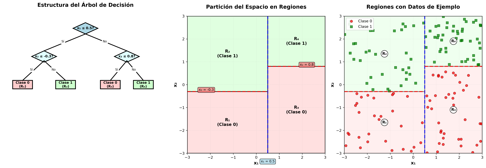
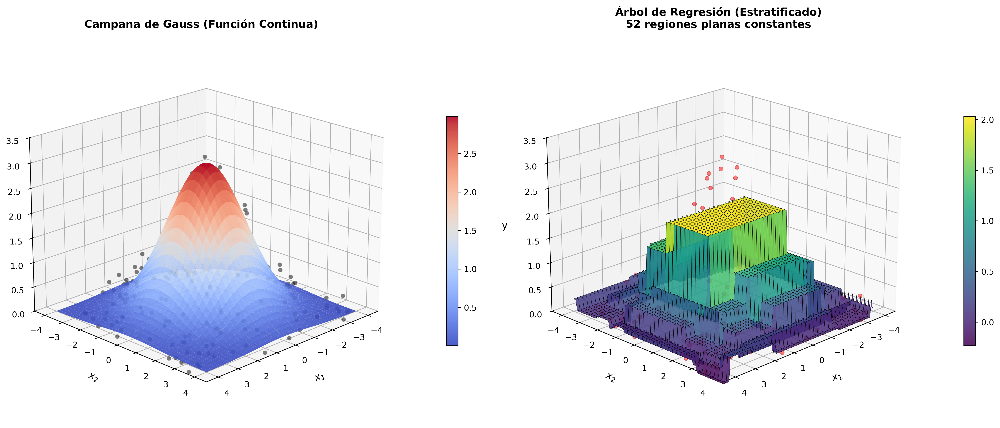
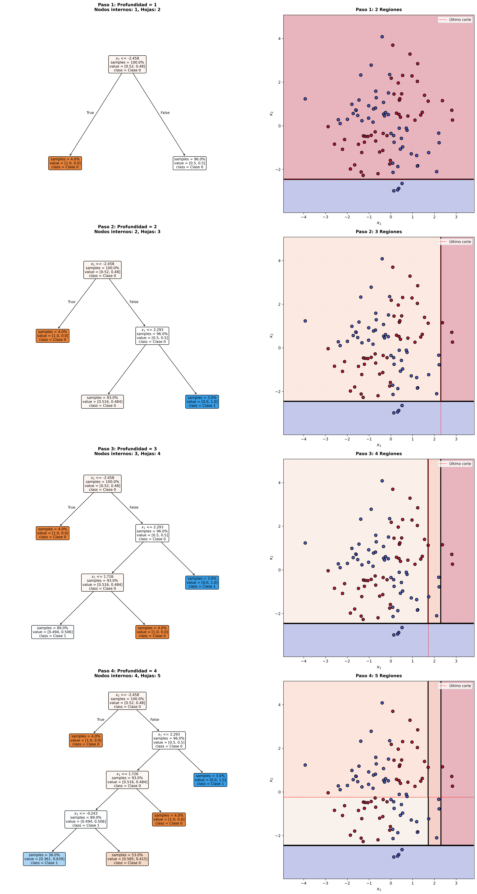
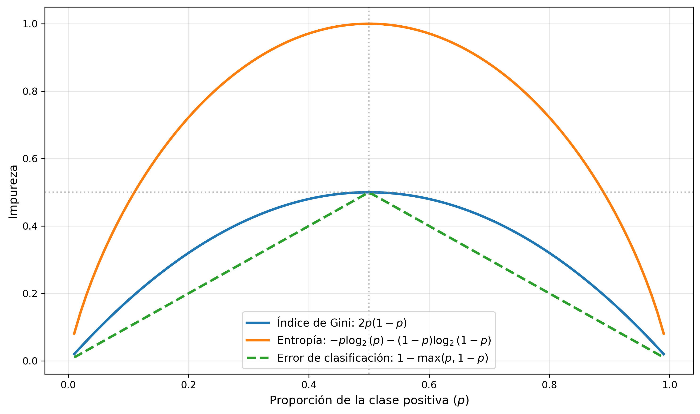
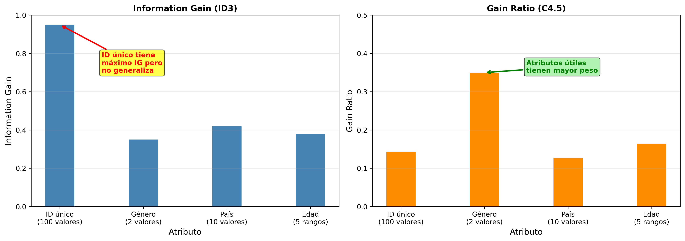

# Sesión 3: Árboles de decisión

Los árboles de decisión [@breiman1984classification;@james2023introduction] son modelos de aprendizaje supervisado que nos permiten hacer tanto tareas de clasificación como de regresión. Se basan en una estructura jerárquica de decisiones, y su principal ventaja es la interpretabilidad del modelo, ya que podemos interpretarlos como un diagrama de flujo en el que en cada nodo debe tomarse una decisión (ver -izquierda).

## Estructura

El árbol tiene un **nodo raíz** que abarcará todo el espacio de características, conteniendo todo el conjunto de datos de entrada. 

Cada **nodo interno** del árbol divide el espacio de características mediante una  **condición** sobre los atributos. Considerando que nuestros datos tienen un conjunto de $d$ atributos o _features_  $\{x_1, x_2, \ldots, x_d \}$, la condición de cada nodo tendrá habitualmente una forma del tipo $x_i \leq \text{valor}$. Es decir, podemos ver cada nodo como un modelo sencillo que separa los datos en dos subramas.

El nodo tendrá diferentes **subramas** que lo conectan con sus hijos. Estas subramas representan los resultados de la condición. Aplicando la condición a cada dato de entrada, se seleccionará una de las subramas y llegaremos al correspondiente nodo hijo. Los hijos, a su vez, podrán definir nuevas condiciones que vuelvan a particionar el espacio de características. 

Llegaremos finalmente a **nodos hoja** que no tienen hijos y corresponden a las predicciones finales, que podrán corresponder a las diferentes clases en problemas de clasificación o valores en problemas de regresión. 

De este forma, para un determinado ejemplo de entrada, el árbol se recorrerá desde la raíz, tomando en cada nodo la subrama que corresponda al resultado de aplicar la condición del nodo al ejemplo, hasta llegar a un nodo hoja. El nodo hoja que alcancemos nos dará la predicción que devolverá el modelo.

Desde el punto de vista de dos dimensiones, este árbol estará dividiendo el espacio de características en diferentes rectángulos (ver -centro). 

Figure: Estructura del árbol de decisión (izquierda) y división del espacio de características en regiones (centro y derecha) {#fig-estructura}

Esta división generará $J$ regiones $R_1, R_2, \ldots, R_J$ no solapadas, de forma que cada datos de entrada $\mathbf{x}$ pertenecerá a una, y solo una de estas regiones. Cada región $R_j$ corresponde a uno de los nodos hoja del árbol, y estará asociada a una categoría en el caso de los árboles de clasificación, o a un valor en el caso de árboles de regresión. 

Figure: Estratificación de la salida de los árboles de regresión. Aproximación de datos con forma de campana de Gauss {#fig-estratificacion}

Es importante destacar que la salida de los árboles de decisión estará estratificada, ya que dentro de cada región se generará siempre un valor constante (ver ). 

## Construcción

Vamos a ver en este punto cómo construir el árbol a partir de un conjunto de datos. Consideramos que nuestro conjunto de datos $\mathcal{D}$ contiene $N$ ejemplos $(\mathbf{x}_i, y_i)$ para $i = \{1, 2, \ldots, N \}$, con $\mathbf{x}_i = ( x_{i1}, x_{i2}, \ldots, x_{id} )$.

Como hemos comentado, el árbol dividirá el espacio de características en $J$ regiones $R_1, R_2, \ldots, R_J$ no solapadas, de forma que cada dato $\mathbf{x}_i$ corresponderá a una de estas regiones.

Buscamos encontrar la división del espacio que se ajuste de forma óptima a los datos. Por ejemplo, en caso de árboles de regresión podemos tomar como criterio encontrar el particionamiento que minimice el error cuadrático medio (MSE) total del conjunto de datos:

$$
\frac{1}{N} \sum_{j=1}^J \sum_{i \in R_j} (y_i - \hat{y}_{R_j})^2
$$

Donde $\hat{y}_{R_j}$ es la media de la salida de las observaciones pertenecientes a la región $R_j$. 

Dado que no es viable considerar todas las posibles particiones del espacio, se opta por un algoritmo voraz que va dividiendo el espacio recursivamente. Partiendo del conjunto de entrenamiento completo, este algoritmo funciona de la siguiente forma:

1. Seleccionamos el **mejor atributo** y **punto de corte** para dividir el conjunto de datos actual.
2. Creamos un **nodo** con una condición basada en los parámetros seleccionados.
3. Particionamos el conjunto de datos en dos **subconjuntos**, en función del resultado de la condición anterior.
4. Repetimos este proceso recursivamente para cada uno de los subconjuntos anteriores hasta cumplir un **criterio de parada** (por ejemplo hasta conseguir regiones suficientemente homogéneas).

Figure: Proceso de construcción de un árbol de decisión paso a paso {#fig-construccion}

En la  se ilustra el proceso de construcción paso a paso, en el que en cada iteración particionamos uno de los nodos en dos regiones.

Una de las cuestiones más críticas es establecer un **criterio de división** de los datos para establecer cuáles son los mejores parámetros para particionar nuestros datos. Deberemos seleccionar tanto una característica $j \in \{1, 2, \ldots, d\}$ como un valor de corte $t$. De esta forma, la condición dividiría el espacio en dos subregiones y separará los datos en dos subconjuntos: 

$$
\mathcal{D}_L = \{ \{\mathbf{x}_i, y_i \} : x_{ij} \leq t \}
\\
\mathcal{D}_R = \{ \{\mathbf{x}_i, y_i \} : x_{ij} \gt t \}
$$

Definimos una función de impureza $H$ que nos indicará la calidad de la partición. Buscamos minimizar esta función para conseguir que la división genere regiones lo más homogéneas posible. Las posibles funciones alternativas de impureza diferirán según si las orientamos a problemas de clasificación o de regresión. Veremos más adelante las funciones utilizadas comúnmente para ambos tipos de problemas.

Con esta función $H$, podemos calcular la impureza de la división (_split_) con parámetros $(j, t)$ de la siguiente forma:

$$
H_{split}(j,t) = \frac{N_L}{N} H(\mathcal{D}_L) + \frac{N_R}{N} H(\mathcal{D}_R)
$$

Donde $N_L = |\mathcal{D_L}|$ y $N_R = |\mathcal{D_R}|$ indican el número de ejemplos que quedarían en cada una de las particiones. Es decir, la impureza de la división se calcula como la suma de las impurezas de cada una de las particiones creadas, ponderada por el número de ejemplos de cada partición.

De esta forma, se deberán buscar los parámetros $(j,t)$ que minimicen la función $H_{split}(j,t)$. Para ello, se puede realizar una búsqueda exhaustiva para todos los pares $(j,t)$, o realizar un muestreo aleatorio de algunos posibles valores para reducir el coste computacional. 

Vamos a continuación a ver de forma específica las principales funciones de impureza utilizadas en problemas de regresión y clasificación. 

### Árboles de regresión

En caso de árboles de regresión, dentro de cada región se devolverá como predicción $\hat{y}_i$ siempre el mismo valor constante, que se calculará habitualmente como la **media de todas las observaciones** $\bar{y}_i$ del conjunto de entrenamiento que pertenezcan a dicha región. 

Figure: Construcción de un árbol de regresión {#fig-construccion-reg}

En la  se muestra cómo se construye un árbol de regresión conforme aumenta la profundidad del árbol. En la parte inferior de la figura se muestra el particionamiento en regiones, mientras que en la parte superior se muestra en 3D la estratificación creada en cada caso, donde cada región tiene un valor constante correspondiente a la media de todas las observaciones de dicha región.

Como función de impureza en árboles de regresión habitualmente se utiliza el **error cuadrático medio (MSE)**:

$$
H_{MSE}(\mathcal{D}) = \frac{1}{N} \sum_{i=1}^N (y_i - \bar{y}_i)^2
$$

Vemos que en la función calculamos la diferencia entre el valor observado $y_i$ y la predicción, que en este caso es la media $\bar{y}_i$. Podemos observar también que esta función coincide con la **varianza** de las salidas esperadas del conjunto $\mathcal{D}$. 

En la práctica se utiliza también habitualmente la suma de los cuadrados de los errores (SSE), que es equivalente a la formulación anterior, ya que la única diferencia es que el valor no está promediado:

$$
H_{SSE}(\mathcal{D}) = \sum_{i=1}^N (y_i - \bar{y}_i)^2
$$

Esta es la función de impureza más comunmente utilizada, siendo el valor por defecto en las principales librerías. Esta función asume ruido gaussiano y penaliza los errores grandes.

También puede utilizarse el **error absoluto medio (MAE)**, aunque en estos casos como predicción utilizamos la **mediana** $\tilde{y}_i$ en lugar de la media:

$$
H_{MAE}(\mathcal{D}) = \frac{1}{N} \sum_{i=1}^N |y_i - \tilde{y}_i|
$$

Esta función es más robusta frente a _outliers_, y no penaliza tanto grandes errores como el caso anterior, aunque el proceso de optimización resulta más costoso. 

También contamos con otras funciones como **Poisson deviance**, que se define de la siguiente forma:

$$
H_{Poisson}(\mathcal{D}) = \frac{2}{N} \sum_{i=1}^N (y_i \log \frac{y_i}{\bar{y}_i} - y_i + \bar{y}_i)
$$

Este criterio puede ser de interés cuando la variable objetivo sea un conteo (por ejemplo, número de estudiantes aprobados) o frecuencia (por ejemplo, número de suspensos por estudiante).

### Árboles de clasificación

En este caso buscamos clasificar cada ejemplo de entrada en un número $K$ de clases. 

Considerando un nodo $m$ del árbol que representa un región $R_m$ que contiene un conjunto de $N_m$ ejemplos, calculamos la proporción de las observaciones de la clase $k$ dentro del nodo $m$ de la siguiente forma:

$$
p_{mk} = \frac{1}{N_m} \sum_{\mathbf{x}_i \in R_m} I(y_i = k)
$$

Buscamos medir cómo de mezcladas están las clases dentro de cada nodo. Para ello, varias de las funciones de impureza utilizadas están basadas en teoría de la información. 

Una de las funciones más utilizadas es el **índice de Gini**, que se define de la siguiente forma para un nodo $m$:

$$
H_{Gini} = 1 - \sum_{k=1}^K p_{mk}^2
$$

En este caso, si el nodo es puro y solo contiene una única clase tendremos $H_{Gini} = 0$. El valor será máximo cuando todas las clases estén equilibradas. Es utilizada por el algoritmo CART y en Random Forest.

También se utiliza habitualmente la **entropía**:

$$
H_{Entropía} =  - \sum_{k=1}^K p_{mk} \log_2 (p_{mk})
$$

Se trata de una medida basada en teoría de la información, que mide la incertidumbre del conjunto. Nos dará máxima incertidumbre cuando las clases están equilibradas, y penaliza más que Gini. Se utiliza  en los algoritmos ID3 y C4.5.

Figure: Forma de las diferentes funciones de impureza para clasificación {#fig-impureza}

En la  podemos observar la forma de las diferentes funciones de impureza para el caso de clasificación binaria. Se muestra el valor de la función de impureza en función de la proporción de ejemplo de cada clase, pudiendo observar que es máxima en el centro (reparto equilibrado entre las dos clases) y mínima en los extremos (todas las observaciones de una misma clase).

## Poda de árboles

Los árboles individuales tienen bajo sesgo pero alta varianza, ya que al construirse de forma voraz tienen una alta dependencia con los datos de entrada. Un pequeño cambio en los datos puede producir árboles muy diferentes. 

Cuando con el algoritmo descrito el árbol se hace crecer en exceso, tendremos tendencia al _overfitting_. Clasificará bien los datos de entrenamiento, pero dará malos resultados de _test_. Para ilustrar este efecto, en la  se muestra la aproximación de una función de una sola variable (1D) mediante un árbol de regresión. Podemos observar la forma escalonada (estratificada) de la función, y como conforme aumenta la profundidad del árbol estos estratos se ajustan de forma más precisa a los datos. Sin embargo, cuando se aumenta demasiado la profundida del árbol, como se observa a la derecha de la figura, la aproximación se ajusta demasiado a los datos, teniendo estratos creados para una única observación (alta varianza).

Figure: Efecto del _overfitting_ al construir un árbol de decisión {#fig-overfitting}

Reduciendo el número de regiones podemos reducir la varianza y mejorar la capacidad de generalización y la interpretabilidad. Una posible forma de abordar esta tarea es evitar que el árbol crezca en exceso, esto es lo que se conoce como **poda previa**.

### Poda previa

La poda previa consiste en detener el crecimiento del árbol antes de que alcance su tamaño máximo imponiendo criterior de parada. Algunos de estos criterios pueden ser:

- Limitar la profundidad máxima
- Establecer un número mínimo de muestras que debe tener un nodo
- Exigir que la mejora de la impureza se encuentre por encima de un mínimo

Aunque es una forma rápida y sencilla de simplificar el grafo, existe riesgo de _underfitting_. Por ejemplo, si  establecemos como criterio de parada dejar de crecer cuando la mejora de la medida de impureza esté por debajo de cierto umbral, puede ocurrir que en un nivel tengamos una división que no mejora apenas, pero en el siguiente encontremos una gran mejora, con lo cual, si paramos de forma anticipada, nos estaremos perdiendo esa gran mejora en la clasificación.

Por ello, es mejor estrategia dejar crecer el árbol hasta obtener un gran árbol $T_0$, y tras ello aplicar una **poda posterior**. 

### Poda posterior

La poda posterior consiste en reducir el tamaño del árbol eliminando nodos o subárboles que no aportan una mejora significativa en la capacidad de generalización. 

El proceso de poda se hará siempre desde abajo hacia arriba, es decir, desde las hojas hacia la raíz. Para cada **nodo interno**, tendremos la opción de mantener el subárbol que depende de él, o bien podarlo y convertir dicho nodo en un nodo hoja.

Tras aplicar la poda, buscaremos quedarnos con aquel subárbol $T \subset T_0$ que haga que no empeore, o incluso consiga que mejore, su error de generalización respecto a $T_0$. Este error de generalización será el error obtenido con datos no vistos durante la construcción del árbol.

Dado un subarbol, podemos estimar su error de generalización mediante un **conjunto de validación separado** o mediante **validación cruzada**. Sin embargo, dado que normalmente existirá un número muy elevado de posibles subárboles, no será posible computacionalmente evaluar el error de todos ellos. 

Necesitaremos tener un criterio que nos permita seleccionar un pequeño conjunto de subárboles para tener en consideración. Una forma de hacer esto es mediante la **poda basada en complejidad de coste** [@breiman1984classification].

### Poda basada en complejidad de coste

La idea es generar una secuencia de subárboles candidatos con la siguiente forma:

$$
T_0 \supset T_1 \supset T_2 \supset \ldots \supset T_k
$$

Para cada uno de estos árboles candidatos, se calculará su error de validación y seleccionaremos aquel con menor error de validación. 

#### Función de complejidad de coste

Lo fundamental será encontrar un criterio que nos permita generar la secuencia de árboles a considerar. Para ello se define la siguiente función de coste:

$$
R_{\alpha}(T) = R(T)+ \alpha |\tilde{T}|
$$

Donde $R(T)$ es el error empírico obtenido con el árbol $T$ con los datos de entrenamiento, $\alpha \geq 0$ es un parámetro para controlar la complejidad del árbol, y $|\tilde{T}|$ es el número de hojas del árbol $T$. 

#### Generación de la secuencia de subárboles

Buscamos generar árboles que minimicen el coste anterior con diferentes valores de $\alpha$. Podemos interpretar este parámetro como un factor de penalización por el número de hojas. En el caso de $\alpha = 0$, al no existir penalización el error mínimo nos lo dará el árbol completo, pero conforme incrementemos la penalización deberemos reducir el número de hojas. 

Para cada nodo interno del árbol $t$, consideraremos el error $R(t)$ (o impureza) dentro del propio nodo $t$, como si se tratara de un hoja, y la suma de los errores $R(T_t)$ de todas las hojas del subárbol con raíz en $t$. Es decir, comparamos el error empírico $R(T_t)$ del subárbol completo con raíz en $t$, con el error empírico $R(t)$ si dicho subárbol se reemplazase por una hoja, aplicando la poda. 

En general, $R(T_t) < R(t)$, ya que de no ser así no deberían haberse seguido generando hijos durante la construcción del árbol. Sin embargo, si introducimos la penalización con el parámetro $\alpha$ entonces tenemos:

$$
R_\alpha (t) = R(t) + \alpha \\
R_\alpha (T_t) = R(T_t) + \alpha |\tilde{T}_t|
$$

En este caso podemos buscar el valor de $\alpha$ que haga $R_{\alpha}(T_t) = R_\alpha (t)$. Para cada uno de los nodos internos calculamos:

$$
\alpha_t = \frac{R(t) - R(T_t)}{|\tilde{T}_t| - 1}
$$

Buscaremos el nodo $t$ con menor $\alpha_t$, y podaremos ese nodo, obteniendo así $T_1$.

Aplicaremos el mismo proceso sobre $T_1$ para obtener $T_2$, y así iterativamente hasta quedarnos con un único nodo. 

#### Selección final del árbol

Una vez generados todos los árboles candidatos $T_0, T_1, \ldots, T_k$, los evaluaremos mediante validación cruzada y nos quedaremos con aquel que obtenga un mínimo error.

## Algoritmos

Vamos a ver a continuación los principales algoritmos para la construcción de árboles de decisión: CART, ID3 y C4.5.

### CART

CART es un algoritmo para construir **árboles de decisión binarios**, aplicable tanto a clasificación como a regresión. Fue propuesto por Breiman et al. (1984) [@breiman1984classification] y es la base de métodos como Random Forests.

Es el algoritmo que encontramos implementado en las clases [DecisionTreeClassifier](https://scikit-learn.org/stable/modules/generated/sklearn.tree.DecisionTreeClassifier.html#sklearn.tree.DecisionTreeClassifier) y [DecisionTreeRegressor](https://scikit-learn.org/stable/modules/generated/sklearn.tree.DecisionTreeRegressor.html#sklearn.tree.DecisionTreeRegressor) en _sklearn_.

#### Criterio de división

CART construye el árbol mediante un proceso recursivo y voraz, donde en cada nodo se selecciona la mejor división posible según los siguientes criterios de impureza:

- **MSE**, para árboles de regresión.
- **Índice de Gini**, para árboles de clasificación.

Para cada nodo se consideran todos los atributos $j$ y todos los posibles puntos de corte $t$, y para cada _split_ candidato $(j,t)$ se calcula la ganancia de la siguiente forma:

$$
\Delta H(j,t) = H(\mathcal{D}) - \left[  \frac{N_L}{N} H(\mathcal{D}_L) + \frac{N_R}{N} H(\mathcal{D}_R) \right]
$$

Es decir, se mide cuanto mejora la pureza de los conjuntos al realizar la división, respecto a la impureza del nodo padre. Se seleccionará el _split_ $(j,t)$ que maximice la reducción de impureza.

#### Criterio de parada

El árbol se construirá recursivamente hasta que se alcance un criterio de parada:

- Se ha obtenido un nodo totalmente puro
- Se ha alcanzado la profundidad máxima del árbol
- Se ha alcanzado el número mínimo de observaciones por nodo
- No se ha obtenido mejora significativa respecto al nodo padre

#### Predicción en las hojas

En problemas de **regresión**, la predicción será la media del valor de todas las observaciones que pertenezcan al nodo hoja:

$$
\hat{y}_i = \bar{y}_i
$$

En problemas de **clasificación**, la predicción será o bien la clase mayoritaria del nodo hoja, o bien una distribución de probabilidades:

$$
\hat{p}_k = \frac{N_k}{N}
$$

Donde $N_k$ es el número de observaciones del nodo que pertenecen a la clase $k$, y $N$ es el número total de observaciones en el nodo.

#### Poda del árbol

El algoritmo CART utiliza **poda posterior basada en complejidad de coste**. Tal como se ha comentado anteriormente, generará con este criterio una secuencia de subárboles y seleccionará el mejor aplicando validación cruzada.

### ID3

ID3 [@quinlan1986induction] es un algoritmo histórico para la construcción de árboles de decisión destinado únicamente a la construcción de árboles de clasificación.

#### Estructura del árbol

Este algoritmo fue diseñado para la clasificación con atributos de entrada categóricos. Es decir, cada atributo de entrada puede tomar un conjunto finito de valores. Por ejemplo, podríamos tener como entrada los siguientes atributos:

$$
\begin{align*}
\text{Viento} &\rightarrow \{ \text{Débil}, \text{Fuerte} \} \\
\text{Temperatura} &\rightarrow \{ \text{Calor}, \text{Templado}, \text{Frio} \}
\end{align*}
$$

En caso de contar con atributos numéricos, deberíamos discretizarlos previamente en una serie de categorías. 

Este algoritmo construye árboles no binarios (multirama), ya que genera una subrama para cada cada posible valor del atributo seleccionado para la división. Por ejemplo, si en un nodo se selecciona el atributo $\text{Temperatura}$ como criterio de división, se crearán $3$ subramas: $\text{Calor}$, $\text{Templado}$ y $\text{Frio}$.

Figure: Comparación de árboles binarios (CART) con árboles multirama (ID3) {#fig-impureza}

En la  ilustramos la diferencia entre los árboles binarios, que utiliza CART, y los árboles multirama de ID3. En este último caso en lugar de atributos numéricos tenemos atributos categóricos, y al seleccionar un atributo se crean tantas subramas como posibles valores tenga dicha atributo.

#### Criterio de selección

En este caso se utiliza la **entropía** como medida de impureza. Para un conjunto de datos $\mathcal{D}$ tenemos:

$$
H_{Entropía}(\mathcal{D}) =  - \sum_{k=1}^K p_{k} \log_2 (p_{k})
$$

Donde $p_k$ se define como la proporción de observaciones de la clase $k$ dentro de $\mathcal{D}$.

Como criterio de selección de atributo se utiliza la **ganacia de información**, basada en la entropía. Busca con ello clasificar los ejemplos de entrenamiento reduciendo la incertidumbre sobre la clase.

Consideremos que cada atributo de entrada $x_j$ puede tomar un conjunto de posibles valores $\text{Valores}(x_j)$. La ganancia de información separando el conjunto de datos $\mathcal{D}$ con el atributo $x_j$  se define como:

$$
GI(\mathcal{D},j) = H(\mathcal{D}) - \sum_{v \in \text{Valores}(x_j)} \frac{|\mathcal{D}_v|}{|\mathcal{D}|} H(\mathcal{D}_v)
$$

Donde $\mathcal{D}_v$ es el subconjunto de $\mathcal{D}$ en el que el atributo $x_j$ toma como valor la categoría $v$.

ID3 seleccionará el atributo que produzca una mayor ganancia de información. 

#### Pasos del algoritmo

A continuación se muestra el algoritmo paso a paso:

1. Si todas las instancias pertenecen a la misma clase se crea una hoja.
2. Si no quedan atributos se crea una hoja con la clase mayoritaria.
3. Se calcula la ganancia de información para cada atributo.
4. Se elige el atributo con máxima ganancia.
5. Se crea  una subrama por cada valor del atributo.
6. Repite el proceso recursivamente en cada subrama.

### C4.5

El algoritmo C4.5 [@quinlan1993c45] se presenta como una evolución de ID3, también destinado únicamente a árboles de clasificación. Las principales mejoras introducidas sobre su predecesor son:

- Introduce la medida _Gain Ratio_ para evitar el sesgo de ID3 hacia atributos con muchos valores. 
- Permite el uso de atributos continuos.
- Aplica poda _post-pruning_ para reducir el _overfitting_.
- Permine manejar valores perdidos.

#### _Gain Ratio_

ID3 utiliza la ganancia de información $GI(\mathcal{D}, j)$, pero esto produce un sesgo hacia atributos con muchos valores. Por ejemplo imaginemos un atributo que tiene un valor diferente para cada ejemplo de entrada. Este atributo sería seleccionado ya que genera nodos hoja puros, pero no generaliza. 

Para evitar esto, se introduce la medida _Gain Ratio_. Para calcular esta medida, primero se calcula el factor de normalización _Split Info_:

$$
\text{SplitInfo}(\mathcal{D}, x_j) = - \sum_{v \in \text{Valores}(x_j)} \frac{|\mathcal{D}_v|}{|\mathcal{D}|} \log_2 \frac{|\mathcal{D}_v|}{|\mathcal{D}|}
$$

Este factor de normalización es una medida de entropía, pero no de las clases, sino sobre cómo estarían repartidos los tamaños de las particiones en las diferentes subramas. Será $0$ cuando todos los elementos del conjunto de datos tengan la misma categoría para el atributo $x_j$, mientras que será máximo cuando los diferentes valores del atributo estén presentes de forma homogénea. Pero además, tendrá un valor bajo cuando haya pocas subramas, y un valor alto cuando haya muchas. 

El _Gain Ratio_ se calculará de la siguiente forma:

$$
\text{GainRatio}(\mathcal{D}, x_j) = \frac{GI(\mathcal{D}, j)}{\text{SplitInfo}(\mathcal{D}, x_j)}
$$

De esta forma, el factor _Split Info_ se utiliza para penalizar subdivisiones excesivas y la falta de generalización. En la  se ilustra cómo _Gain Ratio_ penaliza la subdivisión excesiva frente a _Information Gain_.

Figure: Comparación entre Information Gain (ID3) y Gain Ratio (C4.5) {#fig-gain-ratio}

#### Atributos continuos

Aunque internamente el algoritmo sigue manejando atributos categóricos, permite introducir como entrada atributos continuas. En estos casos, el algoritmo discretizará de forma automática estos atributos. 

Para ello, dado un atributo numérico $x_j$, realiza lo siguiente:

- Ordena todos los valores de $x_j$.
- Prueba diferentes _splits_ binarios $t$, para dividir en dos categorías: $x_j \leq t$ y $x_j > t$. 
- Se elige el umbral $t$ que maximiza el _Gain Ratio_.

#### Valores perdidos

En caso de que existan valores perdidos, C4.5 asigna una probabilidad a cada posible valor del atributo en función de la distribución de probabilidad observada. Durante el cálculo de la entropía de los _splits_ cada ejemplo con un valor perdido contribuirá proporcionalmente a cada subrama.

#### Poda posterior

Otra de las mejoras que introduce el algoritmo C4.5 frente a ID3 es la poda.

Este algoritmo utiliza **poda posterior con estimación del error**. No utiliza un conjunto de validación separado, sino que realiza de forma estadística una estimación pesimista del error a partir del error empírico. 

El algoritmo recorre el árbol de abajo a arriba, evaluando primero los subárboles más profundos. Para cada nodo interno, estima el error del subárbol, y estima el error si ese nodo fuera una hoja. Si la diferencia no es significativa, aplica la poda. 

#### Pasos del algoritmo

Los pasos del algoritmo son similares a los del algoritmo ID3, con algunas modificaciones:

1. Si todas las instancias pertenecen a la misma clase se crea una hoja.
2. Si no quedan atributos se crea una hoja con la clase mayoritaria.
3. Se calcula el _Gain Ratio_ para cada atributo.
4. Se elige el atributo con mayor _Gain Ratio_.
5. Se crea una subrama por cada valor del atributo (o umbral si es un atributo continuo).
6. Repite el proceso recursivamente en cada subrama.
7. Aplica poda posterior para reducir el _overfitting_.

## Limitaciones de los árboles de decisión

A pesar de su simplicidad e interpretabilidad, los árboles de decisión presentan limitaciones importantes, especialmente su elevada varianza y su sensibilidad a pequeñas perturbaciones en los datos de entrenamiento. Un árbol profundo puede producir _overfitting_, mientras que una poda excesiva puede conducir al _underfitting_. 

Estas limitaciones han motivado el desarrollo de métodos que combinan múltiples árboles con el objetivo de mejorar la capacidad de generalización. Los **métodos de ensemble** se basan precisamente en esta idea: combinar de forma adecuada un conjunto de modelos sencillos, habitualmente árboles de decisión, buscando reducir tanto sesgo como varianza.