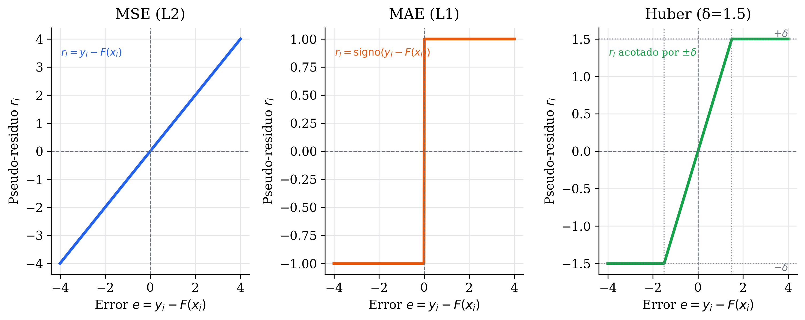
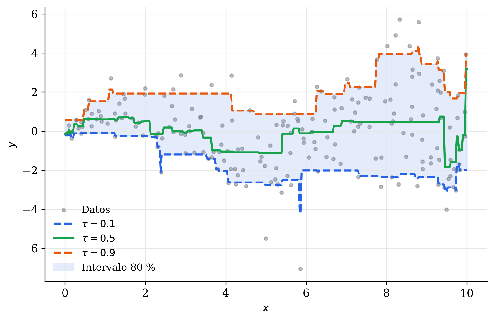
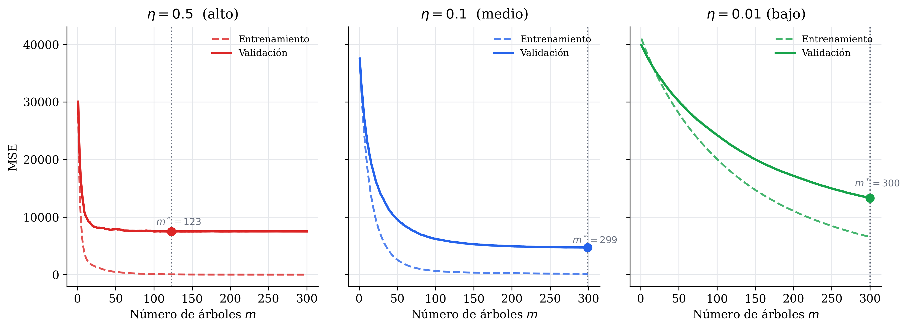
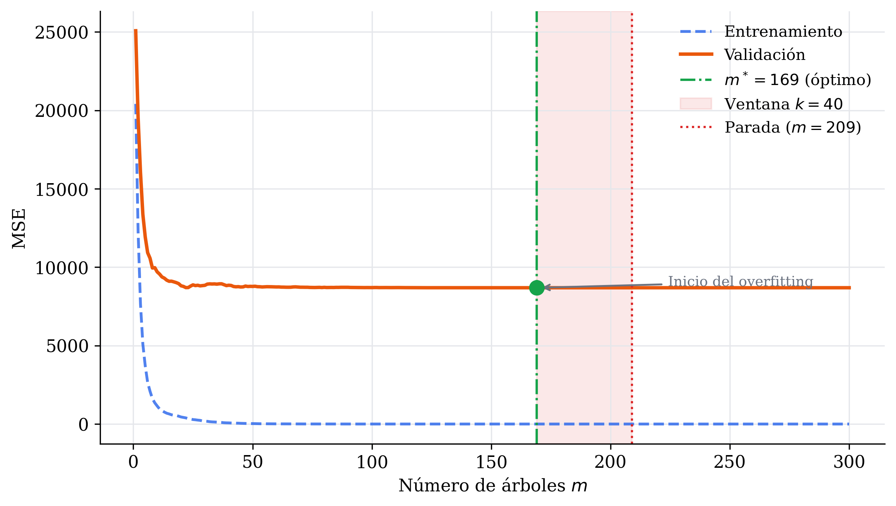
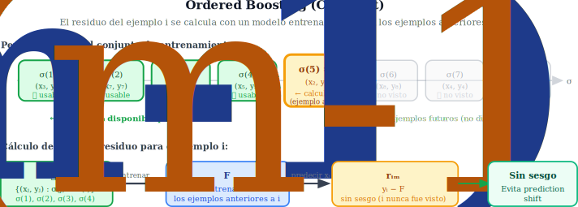
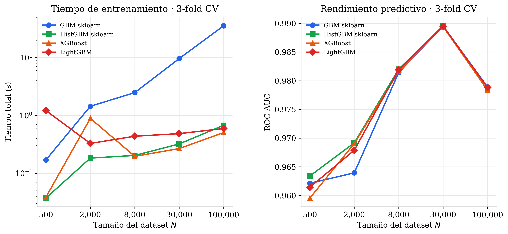

# Gradient Boosting

Gradient Boosting [@friedman2001greedy] generaliza la idea de boosting mediante una perspectiva de **optimización numérica**. En lugar de ajustar pesos de ejemplos (como AdaBoost), cada nuevo modelo se ajusta al **gradiente negativo de la función de pérdida**. Gradient Boosting es la base teórica de métodos modernos como XGBoost [@chen2016xgboost], LightGBM [@ke2017lightgbm] y CatBoost [@prokhorenkova2018catboost].

La idea clave tras Gradient Boosting es considerar el _boosting_ como un problema de optimización en el espacio de funciones. Tratamos de encontrar una función $F(x)$ que minimice la pérdida esperada:

$$F^* = \arg\min_F \mathbb{E}_{x,y}[L(y, F(x))]$$

Donde $L$ es una función de pérdida diferenciable.

Como aproximación, construiremos $F$ como una suma de funciones más simples:

$$F(x) = \sum_{m=0}^{M} f_m(x)$$

Donde cada $f_m$ es un modelo débil (típicamente un árbol).

Figure: Analogía del Descenso por Gradiente en el espacio de parámetros $\theta$, con Gradient Boosting en el espacio de funciones. {#fig-analogia}


Para entender el funcionamiento de Gradient Boosting, podemos establecer una **analogía con el método de descenso por gradiente** (ver [](#fig-analogia)). Con este método buscamos optimizar un conjunto de parámetros $\theta$, y para ello en cada iteración obtenemos el gradiente de la función de pérdida respecto a estos parámetros, y optimizamos los parámetros en la dirección contraria al gradiente:

$$
\begin{align*}
&\theta \leftarrow \theta_0 \quad \text{(Inicializamos los parámetros)} \\
& \text{Para cada } t \in \{1, \ldots, T\} \\
& \quad G \leftarrow \nabla L(\theta) \quad \text{(Gradiente respecto a los parámetros)}\\
& \quad \theta \leftarrow \theta - \eta G \quad \text{(Actualización de los parámetros)}
\end{align*}
$$

En Gradient Boosting haremos algo similar, pero en el **espacio de funciones**. Recordemos que al tratarse de un método de _boosting_, iremos añadiendo estimadores al _ensemble_ de forma secuencial. De esta forma, en cada iteración $m$ calculamos el gradiente de la función de pérdida con el _ensemble_ obtenido hasta el momento, y añadiremos un nuevo estimador $h_m$ que será entrenado a partir de los gradientes obtenidos.

$$
\begin{align*}
&F \leftarrow F_0 \quad \text{(Inicializamos el ensemble)} \\
& \text{Para cada } m \in \{1, \ldots, M\} \\
& \quad G \leftarrow \nabla L(F) \quad \text{(Gradiente respecto a las predicciones)}\\
& \quad h_m \leftarrow fit(G) \quad \text{(Ajustamos un nuevo modelo a los gradientes)}\\
& \quad F \leftarrow F - \eta h_m \quad \text{(Actualizamos el ensemble)}
\end{align*}
$$

Donde $\eta \in (0, 1]$ es el _learning rate_, que gradúa la contribución de cada modelo al _ensemble_. 

## Algoritmo de Gradient Boosting

Vamos a continuación a detallar los diferentes pasos del algoritmo.

### Inicialización

Como primer paso deberemos **inicializar** el _ensemble_. Consideremos que tenemos un _dataset_ $\mathcal{D}$ con $N$ ejemplos de entrenamiento $(\mathbf{x}_i, y_i)$, con $i = 1, 2, \ldots, N$. Vamos a buscar un valor constante $\gamma$ que minimice la pérdida para el conjunto completo de observaciones $y_i$:

$$
F_0 = \arg \min_\gamma \sum_{i=1}^N L(y_i, \gamma)
$$

 La forma de buscar este valor diferirá según si se enfoca a un problema de clasificación o de regresión. Tipicamente utilizaremos las siguientes funciones como inicialización:

#### Regresión

 Considerando que la pérdida es MSE, minimizaremos el error si devolvemos como constante la media de las observaciones del conjunto de entrenamiento:
$$
F_0 = \frac{1}{N} \sum_{i=1}^N y_i = \bar{y} 
$$ 

#### Clasificación binaria

En este caso, debemos tener en consideración la función de pérdida utilizada. Consideremos el caso de _log-loss_ para clasificación binaria, con $y_i \in \{0, 1\}$:

$$
L(y_i, F) = - [y_i \ln p_i + (1-y_i) \ln(1-p_i)], \quad p_i = \sigma(F(\mathbf{x}_i))
$$

Nótese que en este caso la función $F(\mathbf{x}_i)$ clasificará los ejemplos en función de $\text{signo}(F(\mathbf{x}_i))$, al igual que ocurría con la clasificación mediante un hiperplano. Si aplicamos la función Sigmoide ($\sigma$) entonces podemos interpretar $p_i$ como la probabilidad de el ejemplo de entrada $\mathbf{x}_i$ pertenezca a la clase positiva, al igual que ocurría en el caso de Regresión Logística.

Si minimizamos esta función de pérdida _log-loss_ respecto a una constante $\gamma$, obtenemos el siguiente valor óptimo para la inicialización:

$$
F_0 = \ln \left( \frac{\bar{p}}{1-\bar{p}} \right) 
$$

Donde $\bar{p} = \bar{y}$ (media de todas las observaciones) sería la proporción de ejemplos que pertenecen a la clase positiva.


#### Clasificación multiclase

En este caso se generaliza con $K$ funciones, una para cada clase, inicializadas de la siguiente forma:

$$
F_0^{(k)}  = \ln \frac{N_k}{N}, \quad k = 1, \ldots, K
$$

Donde $N_k$ es el número de ejemplos que pertenecen a la clase $k$. De este forma, estamos inicializando a partir de la probabilidad de que un ejemplo pertenezca a cada clase.

Es decir, estamos en este caso siguiendo una estrategia _One-vs-Rest_ implícita, en la que entrenamos $K$ clasificadores binarios en paralelo y obtenemos la predicción final aplicando una función _softmax_ a todos ellos.

### Obtención del siguiente modelo

Una vez inicializada la función del _ensemble_, deberemos generar $M$ modelos de forma iterativa. El siguiente modelo $h_m$, con $m \in \{1, 2, \ldots, M \}$, se entrenará teniendo en cuenta los gradientes de la función de pérdida con la función $F_{m-1}$ actualizada hasta la iteración anterior, de forma que el nuevo modelo se centre en corregir los errores existentes. Esta función se calcula como:

$$
F_{m-1}(\mathbf{x}) = F_0 + \sum_{j=1}^{m-1} \eta h_j(\mathbf{x}) 
$$

Donde $\eta \in (0, 1]$ es el **_learning rate_**, como hemos visto anteriormente, que permite reducir la contribución de cada modelo al _ensemble_, y así dar pasos más pequeños en cada actualización para reducir el _overfitting_.  

Vamos a continuación a ver los pasos a seguir para obtener el siguiente modelo $h_m$. Nótese que en la primera iteración $m=1$ nuestro modelo anterior será unicamente $F_0$, tal como se ha inicializado en el paso anterior.

#### Calcular los pseudo-residuos

Cuando hablamos de pseudo-residuos nos referiremos a los errores que el siguiente modelo $h_m$ debe corregir, y que obtendremos a partir del gradiente negativo. Para cada ejemplo de entrada $i \in \{1, 2, \ldots, N\}$ tenemos:

$$
r_{im} = - \left[ \frac{\partial L(y_i, F(\mathbf{x}_i))}{ \partial F(\mathbf{x}_i)} \right]_{F=F_{m-1}}
$$

Por ejemplo, en caso de **clasificación binaria** con _log-loss_, donde $p_i = \sigma(F_{m-1}(\mathbf{x}_i))$, tendríamos:

$$
r_{im} = y_i - p_i
$$

Es decir, la diferencia entre la etiqueta observada y la probabilidad predicha por el modelo. 

En el caso de **regresión** con MSE tendríamos:

$$
r_{im} = y_i - F_{m-1}(\mathbf{x}_i)
$$

En este caso coincide con los residuos clásicos en un problema de regresión.

#### Ajuste del modelo a los pseudo-residuos

Deberemos ajustar el siguiente modelo débil $h_m$ a estos residuos. Para ello tenemos un nuevo _dataset_ de entrenamiento, donde los valores de entrada son los mismos pero las salidas serán los residuos:

$$
\mathcal{D}_m = \{(\mathbf{x}_1, r_{1m}), (\mathbf{x}_2, r_{2m}), \ldots, (\mathbf{x}_N, r_{Nm}) \}
$$

Entrenaremos el nuevo modelo $h_m$ sobre este _dataset_, minimizando:

$$
h_m = \arg \min_h \sum_{i=1}^N (r_{im} - h(\mathbf{x}_i))^2
$$

Nótese que aunque el problema original fuera de clasificación, en este caso estamos entrenando siempre un modelo base de regresión, ya que los residuos son valores continuos. Como hemos comentado, normalmente utilizaremos árboles como modelos base, por lo que concretamente se tratará de **árboles de regresión**.

Como ya tratamos en el tema sobre árboles de decisión, cada hoja del árbol corresponde a una región, de forma que el árbol $h_m$ dividirá el espacio en $J$ regiones $R_{jm}$. Dentro de cada región (hoja), el árbol de regresión asignaría la media de los pseudo-residuos como predicción, pero en la práctica dentro de Gradient Boosting se podrá refinar este valor buscando el valor $\gamma_{jm}$ que minimice la función de pérdida original, como se hizo a la hora de obtener $F_0$:

$$
\gamma_{jm} = \arg \min_\gamma \sum_{\mathbf{x}_i \in R_{jm}} L(y_i, F_{m-1}(\mathbf{x}_i)+ \gamma)
$$

Esto será especialmente relevante en el caso de tener como función de pérdida _log-loss_, donde la media de los pseudo-residuos no es el óptimo para la pérdida original. En caso de que la función de pérdida fuera MSE, $\gamma_{jm}$ se obtendría como la media de los pseudo-residuos en cada hoja, al igual que en el caso de los árboles de regresión estándar.

### Actualización del modelo

Considerando que utilizamos árboles de regresión como modelo base, ajustados tal como se ha visto en el paso anterior, la actualización del _ensemble_ se hará de la siguiente forma:

$$
F_m(\mathbf{x}) = F_{m-1}(\mathbf{x}) + \eta \sum_{j=1}^J \gamma_{jm} 1[\mathbf{x} \in R_{jm}]
$$

Es decir, la función $F_{m-1}$ de la iteración anterior se "corrige" con un árbol de regresión que ha aprendido los residuales (las diferencias entre el valor observado y el valor predicho por la función anterior)

> **Nota**: En el algoritmo original de Friedman se contempla un multiplicador global $\rho_m$ para cada árbol, de forma análoga a los multiplicadores $\alpha_m$ de AdaBoost. De esta forma en cada iteración se actualizaría el _ensemble_ de la siguiente forma:
> $$
F_m(\mathbf{x}) = F_{m-1}(\mathbf{x}) + \eta \rho_m h_m(\mathbf{x}) $$
> Este multiplicador se obtiene de la siguiente forma:
> $$
\rho_m = \arg \min_\rho \sum_{i=1}^N L(y_i, F_{m-1}(\mathbf{x}_i) + \rho h_m(\mathbf{x}_i)) $$
> Es decir, una vez entrenado el árbol h_m se busca el escalar óptimo que más reduce la pérdida en esa dirección. Sin embargo, en la práctica la optimización por hoja $\gamma_{jm}$ lo hace redundante. Si ya ajustamos un valor óptimo por hoja, el multiplicador global no añade nada, por lo que habitualmente en la práctica se fija $\rho_m = 1$.


### Algoritmo completo

Con todo lo anterior, podemos escribir de forma completa el algoritmo de Gradient Boosting como se muestra a continuación:


$$
\begin{align*}
& \text{Entrada: } \text{Conjunto de entrenamiento } \mathcal{D} = \{(\mathbf{x}_i, y_i)\}_{i=1}^N, \text{ Tasa de aprendizaje } \eta \\
&F_0(\mathbf{x}) \leftarrow \arg \min_\gamma \sum_{i=1}^N L(y_i, \gamma) \quad \text{(Inicializamos el ensemble)} \\
& \text{Para cada } m \in \{1, \ldots, M\}: \\
& \quad r_{im} \leftarrow - \left[ \frac{\partial L(y_i, F(\mathbf{x}_i))}{ \partial F(\mathbf{x}_i)} \right]_{F=F_{m-1}}, \quad \forall i \text{ (Obtenemos los pseudo-residuos)}
\\
& \quad 
h_m \leftarrow \arg \min_h \sum_{i=1}^N (r_{im} - h(\mathbf{x}_i))^2 \quad \text{ (Entrenamos un nuevo modelo que aprenda los residuos)} \\
& \quad 
\gamma_{jm} \leftarrow \arg \min_\gamma \sum_{\mathbf{x}_i \in R_{jm}} L(y_i, F_{m-1}(\mathbf{x}_i)+ \gamma) \quad \forall j \text{ (Optimizamos el valor de cada hoja del nuevo modelo)} \\
& \quad 
F_m(\mathbf{x}) \leftarrow F_{m-1}(\mathbf{x}) + \eta \sum_{j=1}^J \gamma_{jm} 1[\mathbf{x} \in R_{jm}] \quad  \text{ (Actualizamos el modelo)} \\
& \text{Devuelve: } F_M(\mathbf{x})
\end{align*}
$$

Podemos ver el proceso paso a paso ilustrado en la [](#fig-proceso). Podemos ver iteración a iteración cómo se actualiza la función $F$ y se calculan los residuos. Al tratarse de un problema de regresión, la función $F$ se inicializa con la media $\bar{y}$, y en la fila inferior podemos ver los pseudo-residuos resultantes de predecir con dicha función inicial. El siguiente árbol débil se ajustará a estos residuos y de esa forma se obtiene la función de la segunda columna, para la cual se vuelven a calcular los residuos, y así iterativamente.

Figure: Proceso de Gradient Boosting paso a paso. En la fila superior se muestra la función ajustada en cada iteración, mientras que en la fila inferior se muestran los residuos resultantes con los que se ajustará el siguiente árbol débil. {#fig-proceso}


### Predicción final

Una vez obtenidos los $M$ árboles, el modelo final será la suma de todas las contribuciones:

$$
\hat{y} = F_M(\mathbf{x}) = F_0(\mathbf{x}) + \eta \sum_{m=1}^M h_m(\mathbf{x})
$$

#### Regresión

En el caso de **regresión**, la predicción final será directamente el valor de $F_M(\mathbf{x})$:

$$
\hat{y} = F_M(\mathbf{x})
$$

#### Clasificación binaria

En caso de **clasificación binaria** aplicaremos la Sigmoide para obtener la probabilidad de pertenencia a la clase positiva $\hat{p}$:

$$
\hat{p} = \sigma(F_M(\mathbf{x}))
$$

Si $\hat{p} > 0.5$ se predecirá la clase positiva, y en caso contrario se predecirá la clase negativa.

#### Clasificación multiclase

En caso de **clasificación multiclase**, tendremos $K$ funciones acumuladas $F_M^{(k)}(\mathbf{x})$, y aplicamos _softmax_ sobre ellas para obtener la probabilidad $\hat{p}_k$ de pertenencia a cada clase $k$:

$$
\hat{p}_k = \frac{e^{F_M^{(k)}(\mathbf{x})}}{\sum_{j=1}^K e^{F_M^{(j)}(\mathbf{x})}}
$$

Se predecirá la clase con mayor probabilidad.


## Funciones de pérdida

Hemos visto el caso de dos funciones de pérdida típicas como son MSE en caso de regresión y _log-loss_ para clasificación binaria. Vamos a ver ahora con mayor detalle las diferentes funciones de pérdida utilizadas comúnmente en Gradiente Boosting.

### Regresión

Comenzamos con las funciones utilizadas habitualmente en regresión. 

#### MSE (L2)

Es la más común, y óptima cuando los errores siguen una distribución normal. Tiene la desventaja de que es muy sensible a _outliers_ porque penaliza de forma cuadrática

$$
L(y_i, F(\mathbf{x}_i)) = \frac{1}{2}(y_i - F(\mathbf{x}_i))^2
$$

- **Inicialización**: 

$$
F_0 = \frac{1}{N} \sum_{i=1}^N y_i = \bar{y} 
$$

- **Pseudo-residuos** (en este caso se trata del residuo ordinario):

$$
r_i = y_i-F_{m-1}(\mathbf{x}_i)
$$

- **Valor óptimo por hoja** (media de los residuos):

$$
\gamma_{jm} = \frac{1}{|R_{jm}|} \sum_{\mathbf{x}_i \in R_{jm}} r_{i}
$$


#### MAE (L1)

Es más robusta a _outliers_, pero no es diferenciable en $0$, lo que complica su optimización. Es menos utilizada en la práctica.

$$
L(y_i, F(\mathbf{x}_i)) = |y_i - F(\mathbf{x}_i)|
$$

- **Inicialización**: 

$$
F_0 = \text{mediana}(\mathbf{y}) 
$$

- **Pseudo-residuos** (en este caso tienen signo pero no magnitud, siempre serán $1$ o $-1$):
$$
r_i = \text{signo} (y_i-F_{m-1}(\mathbf{x}_i))
$$

- **Valor óptimo por hoja**:

$$ \gamma_{jm} = \text{mediana}(y_i - F_{m-1}(\mathbf{x}_i): \mathbf{x}_i \in R_{jm}) $$

En este caso el valor por hoja se obtiene con la mediana de residuos, y no con la media. Es más robusto que MSE frente a _outliers_ pero más lento de entrenar.

#### Huber 

Combina L2 para errores pequeños y L1 para errores grandes.  Esto se controla mediante un umbral $\delta$. 

$$
L(y_i, F(\mathbf{x}_i)) = \begin{cases}
\frac{1}{2}(y_i-F(\mathbf{x}_i))^2  & \quad \text{si } |y_i - F(\mathbf{x}_i)| \leq \delta \\
\delta (|y_i-F(\mathbf{x}_i)| - \frac{\delta}{2})  & \quad \text{si } |y_i - F(\mathbf{x}_i)| > \delta
\end{cases}
$$


- **Inicialización**: 

$$
F_0 = \text{mediana}(\mathbf{y}) 
$$

- **Pseudo-residuos** (en este caso se trata del residuo ordinario):

$$
r_i = \begin{cases}
y_i-F_{m-1}(\mathbf{x}_i)  & \quad \text{si } |y_i - F_{m-1}(\mathbf{x}_i)| \leq \delta \\
\delta \cdot \text{signo} (y_i-F_{m-1}(\mathbf{x}_i))  & \quad \text{si } |y_i - F_{m-1}(\mathbf{x}_i)| > \delta
\end{cases}
$$

- **Valor óptimo por hoja**: Se utiliza un proceso iterativo, ya que no tiene una forma cerrada simple.

El hiperparámetro $\delta$ marca la frontera entre el comportamiento como L2 y L1. En la implementación de sklearn se actualiza adaptativamente en cada iteración a partir de los residuos.

En la [](#fig-residuos) podemos ver la forma que tiene la función para el cálculo de los pseudo-residuos para las funciones de pérdida vistas hasta el momento: MSE, MAE y Huber. Vemos como en el último caso $\delta$ acota el rango de la función.

Figure: Pseudo-residuos correspondiente a diferentes funciones de pérdida: MSE, MAE y Huber. {#fig-residuos}




#### Quantile Loss

Permite estimar percentiles/cuantiles en lugar de la media. 

$$
L_{\tau}(y_i, F(\mathbf{x}_i)) = \begin{cases}
\tau (y_i - F(\mathbf{x}_i)) & \text{si } y_i \geq F(\mathbf{x}_i) \\
(1-\tau) (F(\mathbf{x}_i)-y_i) & \text{si } y_i < F(\mathbf{x}_i)
\end{cases} 
$$

Donde $\tau \in (0,1)$ es el cuantil objetivo. Por ejemplo, con $\tau=0.5$ tendríamos la mediana (equivale a MAE), mientras que con $\tau=0.9$ estimaríamos el percentil $90$ (es decir, penaliza más la infravaloraciones que las sobrevaloraciones, por lo que forzará al modelo a predecir alto). 

- **Inicialización** (de forma coherente con el caso del MAE que correspondería a $\tau=0.5$, se inicializa como el cuantil de la variable objetivo): 

$$
F_0 = Q_\tau (\mathbf{y})
$$

- **Pseudo-residuos** (al igual que en el MAE, son valores discretos y no magnitudes continuas):

$$
r_i = \begin{cases}
\tau  & \text{si } y_i \geq F_{m-1}(\mathbf{x}_i) \\
-(1-\tau)  & \text{si } y_i < F_{m-1}(\mathbf{x}_i)
\end{cases} 
$$

- **Valor óptimo por hoja**: 

$$
\gamma_{jm} = Q_{\tau} \{y_i - F_{m-1}(\mathbf{x}_i): \mathbf{x}_i \in R_{jm}\}
$$

El uso principal de esta función de pérdida es entrenar múltiples modelos con diferentes $\tau$, por ejemplo $0.1$, $0.5$ y $0.9$, para así construir intervalos de predicción. En la [](#fig-quantile) podemos ver un ejemplo en el que se han entrenado 3 modelos para predecir dichos cuantiles.


Figure: Regresión por cuantiles con Quantile Loss {#fig-quantile}




### Clasificación Binaria

#### Logistic Loss (Deviance binomial)

Se trata de la pérdida estándar para clasificación binaria que hemos estado utilizando:

$$
L(y_i, F(\mathbf{x}_i)) = - [y_i \ln p_i + (1-y_i) \ln(1-p_i)], \quad p_i = \sigma(F(\mathbf{x}_i))
$$

- **Inicialización**: 

$$
F_0 = \ln \left( \frac{\bar{p}}{1-\bar{p}} \right), \quad \bar{p} = \bar{y}
$$

- **Pseudo-residuos** (en este caso se trata del residuo ordinario):

$$
r_i = y_i - p_i, \quad p_i = \sigma(F_{m-1}(\mathbf{x}_i))
$$

- **Valor óptimo por hoja**: 

$$
\gamma_{jm} = \frac{\sum_{\mathbf{x}_i \in R_{jm}}(y_i-p_i)}{\sum_{\mathbf{x}_i \in R_{jm}} p_i(1-p_i)}
$$


#### Exponential Loss

Equivale a AdaBoost cuando se utiliza con árboles. Como ya vimos, es menos robusta que _log-loss_ porque penaliza los _outliers_ de forma exponencial.

$$
L(y_i, F(\mathbf{x}_i)) = e^{-y_i F(\mathbf{x}_i)}, \quad y_i \in \{-1, +1\}
$$

- **Inicialización**: 

$$
F_0 = \frac{1}{2} \ln \frac{\sum y_i^+}{\sum y_i^-}, \quad y_i \in \{-1, +1\}
$$

- **Pseudo-residuos** (son proporcionales a los pesos de AdaBoost):

$$
r_i = y_i e^{-y_i F_{m-1}(\mathbf{x}_i)}
$$

- **Valor óptimo por hoja**: 

$$
\gamma_{jm} = \frac{\sum_{\mathbf{x}_i \in R_{jm}}r_i}{\sum_{\mathbf{x}_i \in R_{jm}} e^{-y_i F_{m-1}(\mathbf{x}_i)}}
$$


### Clasificación Multiclase

#### Softmax (Deviance multinomial)

Para la clasificación multiclase se generaliza con _softmax_ entrenando $K$ clasificadores binarios en paralelo (uno para cada clase). 

$$
L(y_i, F(\mathbf{x}_i)) = -\sum_{k=1}^K y_i^{(k)} \ln p_i^{(k)} , \quad p_i^{(k)} = \frac{e^{F^{(k)} (\mathbf{x}_i)}}{\sum_j e^{F^{(j)} (\mathbf{x}_i)}}
$$

Donde $y_i^{(k)} \in \{0, 1\}$ es la codificación _one-hot_ de la clase real, y $p_i^{(k)}$ es la probabilidad predicha para la clase $k$ obtenida mediante _softmax_. 

- **Inicialización** (para cada clase $k$): 

$$
F_0^{(k)} = \ln \hat{p}_k, \quad \hat{p}_k = \frac{N_k}{N}
$$

- **Pseudo-residuos** (para cada clase $k$):

$$
r_i^{(k)} = y_i^{(k)} - p_i^{(k)}, \quad p_i^{(k)} = \frac{e^{F_{m-1}^{(k)} (\mathbf{x}_i)}}{\sum_j e^{F_{m-1}^{(j)} (\mathbf{x}_i)}}
$$

- **Valor óptimo por hoja**: 

$$
\gamma_{jm}^{(k)} = \frac{K-1}{K} \cdot \frac{\sum_{\mathbf{x}_i \in R_{jm}}r_i^{(k)}}{\sum_{\mathbf{x}_i \in R_{jm}} p_i^{(k)} (1-p_i^{(k)}) }
$$


## Regularización

Vamos a ver diferentes estrategias de regularización en Gradient Boosting que nos permitan reducir el _overfitting_. Una de ellas, que ya hemos adelantado anteriormente, es el **_learning rate_** $\eta$. También existe una **variante estocástica** del algoritmo para buscar más diversidad entre los diferentes modelos, haciendo **subsampling** aleatorio de los datos en cada iteración. Además de estas estrategias, tenemos otros mecanismos, existen otros mecanismos de regularización habituales en Gradient Boosting.

### Learning Rate (Shrinkage)

Como hemos visto, el **learning rate** $\eta$ controla la contribución de cada árbol $h_m$ al _ensemble_:

$$F_m(\mathbf{x}) = F_{m-1}(\mathbf{x}) + \eta  h_m(\mathbf{x})$$

El **_learning rate_** es conocido también como _shrinkage_, debido a que tiene el efecto de "encoger" la contribución de cada modelo, pudiendo tomar valores en el intervalo $(0,1]$:

- Cuando el **valor es alto**, cercano a $1$, el algoritmo convergerá rápido con pocos estimadores, con lo cual tendremos riesgo de _overfitting_. 
- Sin embargo, si tenemos un **valor pequeño**, cercano a $0$, cada estimador contribuirá muy poco y al necesitar más estimadores para converger tendremos también mejor generalización.

Figure: Efecto del _learning rate_ en las curvas de entrenamiento y validación.  {#fig-lr}



Básicamente, con _learning rates_ más pequeños tendremos modelos más robustos, pero a costa de un mayor tiempo de entrenamiento. Se trata de avanzar con pasos más pequeños pero más seguros. En la [](#fig-lr) vemos como con un valor alto (izquierda) converge rápido pero obtiene un error mayor, mientras que con valores muy bajos (derecha) la convergencia es muy lenta y necesitaríamos un mayor número de árboles para obtener el valor óptimo.

Por lo tanto, será recomendable utilizar valores pequeños (por ejemplo $\eta = 0.01$ o $0.1$), aumentar el número de estimadores y utilizar _early stopping_ para encontrar el punto óptimo. 


### Stochastic Gradient Boosting

El algoritmo original de Gradient Boosting utiliza en cada iteración todos los ejemplos de entrenamiento para calcular los pseudo-residuos y ajustar el nuevo modelo. Aunque esto garantiza una estimación precisa del gradiente, tiene dos inconvenientes:

- Tiene un alto coste computacional si el _dataset_ es grande.
- Al ver siempre los mismos datos, tiende a haber una alta correlación entre árboles sucesivos, lo cual puede llevar al _overfitting_.

Para abordar estos problemas, se propuso una variante estocástica [@friedman2002stochastic]: **Stochastic Gradient Boosting (SGB)**. 

La modificación es conceptualmente sencilla: en cada iteración $m$, en lugar de usar el conjunto de entrenamiento completo se selecciona una **muestra aleatoria sin reemplazo** $\mathcal{S_m} \subset \{1, \ldots, N\}$ con tamaño $N'$:

$$
N' = \lfloor fN \rfloor
$$

Donde $f \in (0,1]$ es la **fracción de subsampling** y $N$ es el tamaño del _dataset_ completo. 

La única modificación en el algoritmo es que los residuos se calcularán solo sobre el _subsample_, y el nuevo modelo se ajustará únicamente mediante a partir de los ejemplos de este _subsample_, pero tras ello actualiza $F$ con todo el _dataset_:

$$
\begin{align*}
& \text{Entrada: } \text{Conjunto de entrenamiento } \mathcal{D} = \{(\mathbf{x}_i, y_i)\}_{i=1}^N, \text{ Tasa de aprendizaje } \eta, \text{ Fracción de subsampling } f \\
&F_0(\mathbf{x}) \leftarrow \arg \min_\gamma \sum_{i=1}^N L(y_i, \gamma) \quad \text{(Inicializamos el ensemble)} \\
& \text{Para cada } m \in \{1, \ldots, M\}: \\
& \quad \mathcal{S_m} \leftarrow \text{Muestreamos sin reemplazo subconjunto } \mathcal{S_m} \subset \{1, \ldots, N\} \text{ de tamaño } N' = \lfloor fN \rfloor \\
& \quad r_{im} \leftarrow - \left[ \frac{\partial L(y_i, F(\mathbf{x}_i))}{ \partial F(\mathbf{x}_i)} \right]_{F=F_{m-1}}, \quad \forall i \in \mathcal{S}_m \text{ (Obtenemos los pseudo-residuos del subsample)}
\\
& \quad 
h_m \leftarrow \arg \min_h \sum_{i \in \mathcal{S}_m} (r_{im} - h(\mathbf{x}_i))^2 \quad \text{ (Entrenamos un nuevo modelo que aprenda los residuos)} \\
& \quad 
\gamma_{jm} \leftarrow \arg \min_\gamma \sum_{\substack{\mathbf{x}_i \in R_{jm} \\ i \in \mathcal{S}_m}} L(y_i, F_{m-1}(\mathbf{x}_i)+ \gamma) \quad \forall j \text{ (Optimizamos el valor de cada hoja del nuevo modelo)} \\
& \quad 
F_m(\mathbf{x}) \leftarrow F_{m-1}(\mathbf{x}) + \eta \sum_{j=1}^J \gamma_{jm} 1[\mathbf{x} \in R_{jm}] \quad  \text{ (Actualizamos el modelo)} \\
& \text{Devuelve: } F_M(\mathbf{x})
\end{align*}
$$

El subsampling ayudará a reducir el _overfitting_, introduciendo diversidad, y hará más eficiente el proceso, ya que habrá menos datos por árbol. 


### Profundidad máxima del árbol

Limitar la profundidad máxima de los árboles base es una de las formas más efectivas de controlar la complejidad del modelo. Con profundidad $1$ tendríamos _decision stumps_, que solo capturan efectos individuales de cada variable. Con profundidad $2$ o $3$ ya podemos capturar interacciones de segundo y tercer orden. Es decir, un árbol de profundidad 2 permitiría establecer relaciones como _"si el salario es mayor que $1000$ y la edad mayor que $30$, entonces la clase debería ser positiva"_, y contribuir de esta forma al _ensemble_.  En la práctica se suelen utilizar valores entre $3$ y $8$. En la [](#fig-profundidad) se muestra el efecto de modificar la profundidad de los árboles en la frontera de decisión. 

Figure: Fronteras de decisión con diferente profundidad de los árboles. {#fig-profundidad}


De esta forma, al contrario que en métodos como Random Forest en los que no limitamos la profundidad, en Gradient Boosting utilizaremos normalmente **árboles poco profundos**, que resulten más rápidos de entrenar y que sean complementarios, capturando cada árbol un patrón residual diferente. 


### Column subsampling

Análogo al _subsampling_ de filas, podemos muestrear también un subconjunto de características en cada iteración (o incluso en cada división del árbol). Si denotamos por $c \in (0, 1]$ la fracción de columnas seleccionadas, en cada iteración $m$ el árbol $h_m$ solo tendrá acceso a $\lfloor cd \rfloor$ de las $d$ características originales. Esto reduce la correlación entre árboles y mejora la generalización.

### Regularización L1 y L2 sobre hojas

Podemos añadir términos de regularización sobre los valores de hoja $\gamma_{jm}$. Con regularización L2 (_ridge_), el valor óptimo de cada hoja se modifica de la siguiente forma para evitar valores extremos:

$$
\gamma_{jm} = \arg \min_\gamma \sum_{\mathbf{x}_i \in R_{jm}} L(y_i, F_{m-1}(\mathbf{x}_i)+ \gamma) + \lambda \gamma^2 
$$

Donde $\lambda \geq 0$ es el parámetro de regularización L2. El término $\lambda \gamma^2$ penaliza valores extremos de $\gamma$ forzando predicciones más conservadoras:

- Con $\lambda = 0$ no se aplica regularización y el valor óptimo por hoja es la media de los residuos.
- Con $\lambda$ grande las predicciones por hoja de acercarán a $0$, y el modelo aprende más despacio y de forma más conservadora. Actúa de forma similar a $\eta$, pero a nivel individual de hoja en lugar de a nivel global.

Con regularización L1 (_lasso_) se añade una penalización proporcional al valor absoluto de la hoja:

$$
\gamma_{jm} = \arg \min_\gamma \sum_{\mathbf{x}_i \in R_{jm}} L(y_i, F_{m-1}(\mathbf{x}_i)+ \gamma) + \alpha | \gamma |
$$

Donde $\alpha \geq 0$ es el parámetro de regularización L1. Este tipo de regularización produce _sparsity_, es decir, que hojas con poca evidencia (suma de residuos baja) no contribuyan nada al modelo. Es útil cuando el modelo tenga muchas hojas y solo queremos que contribuyan las más informativas.

Estos tipos de regularización son uno de los elementos que XGBoost introduce en su formulación.

## Implementación

En sklearn contamos con las clases [GradientBoostingClassifier](https://scikit-learn.org/stable/modules/generated/sklearn.ensemble.GradientBoostingClassifier.html) y [GradientBoostingRegressor](https://scikit-learn.org/stable/modules/generated/sklearn.ensemble.GradientBoostingRegressor.html) para problemas de clasificación y regresión respectivamente. 

### Clasificación

A continuación mostramos un ejemplo para el caso de **clasificación**:

```python
# Gradient Boosting para clasificación
gb_clf = GradientBoostingClassifier(
    n_estimators=100,         # Número de árboles
    learning_rate=0.1,        # Shrinkage
    max_depth=3,              # Profundidad de árboles (por defecto)
    min_samples_split=20,     # Mínimo para split
    min_samples_leaf=10,      # Mínimo en hojas
    subsample=0.8,            # Stochastic GB (fracción de muestras)
    loss='log_loss'          # Función de pérdida (por defecto)
)

gb_clf.fit(X_train, y_train)
```

Destacamos el parámetro `loss`, que nos permite elegir entre las funciones de pérdida `log_loss` y `exponential`.

### Regresión

En caso de **regresión** tenemos:

```python
# Gradient Boosting para regresión
gb_reg = GradientBoostingRegressor(
    n_estimators=100,
    learning_rate=0.1,
    max_depth=3,
    loss='squared_error'     # Para regresión (default)
)

gb_reg.fit(X_train, y_train)
```

En este caso el parámetro `loss` nos permite elegir entre las funciones de pérdida `squared_error` (MSE),  y `absolute_error` (MAE), `huber` y `quantile`. Para esta última, deberemos utilizar el parámetro `alpha` para seleccionar el cuantil. 

### Regularización

Una de las cuestiones a destacar en los dos casos anteriores es que, como hemos visto anteriormente, en Gradient Boosting utilizamos normalmente **árboles poco profundos** (típicamente entre 3 y 8 niveles), lo cual contrasta con Random Forest que utiliza árboles con profundidad máxima. Vemos que en la implementación por defecto tenemos una profundidad máxima (`max_depth`) de 3 niveles.

Destacamos también el parámetro `learning_rate` que por defecto toma valor $\eta = 0.1$ (tipicamente se utiliza $0.1$ o $0.01$). Con un valor más bajo de $\eta$, debemos aumentar el número de árboles (`n_estimators`) para compensar los pasos más pequeños en el aprendizaje (típicamente utilizaremos entre $100$ y $1000$ árboles). 

Observamos también que podemos utilizar la versión estocástica de Gradient Descent mediante el parámetro `subsample` para prevenir el _overfitting_. Otra forma de regularización es utilizar `min_samples_split` y `min_samples_leaf` para prevenir _splits_ con pocas muestras.

Debemos destacar que la implementación `GradientBoosting` de _sklearn_ no soporta regularización L1 ni L2. 

### _Early stopping_

Como hemos comentado, es conveniente utilizar **_early stopping_** junto a un valor bajo de $\eta$ y un alto número de árboles. La idea es monitorizar la función de pérdida sobre un conjunto de validación durante el entrenamiento y detenerlo cuando dicha pérdida deja de mejorar.

Formalmente, dado un conjunto de validación $\mathcal{V}$ y una ventana de paciencia $k$, el entrenamiento se detiene en la iteración $m^*$ tal que:

$$
m^* = \min\left\{m : \mathcal{L}_\mathcal{V}(F_{m'}) \geq \mathcal{L}_\mathcal{V}(F_m), \forall m' \in \{m+1, \ldots, m+k\}\right\}
$$

Es decir, si la pérdida de validación no mejora durante $k$ iteraciones consecutivas, se detiene el entrenamiento y se devuelve el modelo $F_{m^*}$ (ver [](#fig-early)).

Figure: Evo. {#fig-early}




Para activar este criterio de parada en la implementación debemos indicar la fracción de datos que utilizaremos como conjunto de validación $\mathcal{V}$ (parámetro `validation_fraction`), el tamaño de la ventana de paciencia $k$ en el parámetro  `n_iter_no_change`, y una tolerancia de mejora (parámetro `tol`). De esta forma, cuando el rendimiento de validación deje de mejorar el valor de tolerancia indicado durante $k$ iteraciones , el algoritmo terminará de forma temprana.

El _early stopping_ nos permitirá usar un valor de $M$ (`n_estimators`) alto como límite superior y dejar que el algoritmo determine el número óptimo de árboles automáticamente. En la práctica, típicamente se suele reservar entre un $10\%$ y un $20\%$ de los datos para validación, o bien usar validación cruzada.


## _Histogram-based Gradient Boosting_ 

[HistGradientBoostingClassifier](https://scikit-learn.org/stable/modules/generated/sklearn.ensemble.HistGradientBoostingClassifier.html) y [HistGradientBoostingRegressor](https://scikit-learn.org/stable/modules/generated/sklearn.ensemble.HistGradientBoostingRegressor.html) es la implementación moderna de Gradient Boosting en sklearn, inspirada en [LightGBM](https://github.com/Microsoft/LightGBM).

Su principal innovación es el uso de  **histogramas** para discretizar _features_ continuas, acelerando de esta forma la búsqueda de _splits_. Esto hará que esta implementación sea mucho más rápida cuando tengamos _datasets_ grandes (por encima de $10.000$ ejemplos), y además añade soporte para valores faltantes (NaNs) y soporte para variables categóricas. 

### Algoritmo basado en Histogramas

La idea tras este algoritmo es, en lugar de considerar todos los posibles valores para los _splits_, discretizar las _features_ en una serie de _bins_ (compartimentos), formando un histograma.

Por ejemplo, imaginemos una _feature_ continua con $1.000$ valores distintos. En este caso deberemos considerar $999$ posibles _splits_.

En lugar de esto, podemos discretizar los valores de la _feature_ en $255$ posibles valores (este es el valor por defecto del parámetro `max_bins`, y además es el valor máximo que puede tomar). Además, se creará un _bin_ adicional para los ejemplos con valores faltantes. De esta forma, únicamente deberemos considerar $255$ posibles _splits_. 

Con esto hemos independizado la complejidad del número de ejemplos de entrada. 

### Manejo de valores faltantes

Otra de las ventajas de esta implementación es el manejo de valores faltantes (_missing values_ o NaNs). Como hemos visto, el algoritmo trata los NaN como un valor especial en el histograma. 

Durante el entrenamiento, el modelo aprende si los ejemplos con valores faltantes de una _feature_ deben ir al _split_ derecho_ o al _izquierdo_, basándose en la ganancia de cada decisión. De esta forma, no requiere imputación manual.

En la predicción, aplicará siempre la decisión aprendida durante el entrenamiento cuando encuentre un valor faltante para una _feature_. 

Vemos a continuación un ejemplo de implementación con valores NaN:

```python
# Datos con valores faltantes
X_train[0, 3] = np.nan
X_train[5, 7] = np.nan

# GradientBoosting: ERROR
# gb = GradientBoostingClassifier()
# gb.fit(X_train, y_train)  # ValueError: Input contains NaN

# HistGradientBoosting
hgb = HistGradientBoostingClassifier()
hgb.fit(X_train, y_train)  # Aprende dirección óptima para NaN
```

### Soporte  para features categóricas

Con el parámetro `categorical_features` podemos indicar el listado de _features_ que queremos que trate como categóricas. De esta forma no será necesaria una codificación manual, y manejará las categorías de forma eficiente. 

```python
# Marcar features categóricas
categorical_features = [0, 3, 5]  # Índices de columnas categóricas

hgb = HistGradientBoostingClassifier(
    categorical_features=categorical_features
)

hgb.fit(X_train, y_train)
```

### Ajuste de hiperparámetros

Para controlar el número de árboles generados (número de iteraciones del proceso de _boosting_), en lugar de utilizar un parámetro `n_estimators` en este caso utilizaremos `max_iter`.

Como hemos comentado, el parámetro `max_bins` nos permite ajusta el número de _bins_ en los que se dividirán el histograma ($255$ es el valor por defecto y máximo).

Además, a diferencia de `GradientBoosting`, en la implementación `HistGradientBoosting` si que contamos con la posibilidad de aplicar regularización L2 en las hojas. Contamos para ello con el parámetro `l2_regularization` .

Otra diferencia que encontramos es que para controlar la complejidad, en lugar de `max_depth` por defecto utiliza `max_leaf_nodes`.

```python
# Clasificación
hgb = HistGradientBoostingClassifier(
    max_iter=100,              # Número de árboles (equivalente a n_estimators)
    learning_rate=0.1,         # Tasa de aprendizaje
    max_depth=None,            # Sin límite por defecto (usa max_leaf_nodes)
    max_leaf_nodes=31,         # Máximo número de hojas (default)
    min_samples_leaf=20,       # Mínimo en hojas
    l2_regularization=0.0,     # Regularización L2
    max_bins=255,              # Número de bins (default)
    categorical_features=None, # Índices de features categóricas
    early_stopping='auto',     # Early stopping automático
    scoring='loss',            # Métrica para early stopping
    validation_fraction=0.1,   # Fracción para validación
    n_iter_no_change=10       # Parar si no mejora
)

hgb.fit(X_train, y_train)
```

Podemos observar que se incluye también un parámetro adicional para controlar el `early_stopping`. Nos permite desactivarlo siempre, activarlo, o que se active o desactive de forma automática en función del número de ejemplos de entrenamiento.


## XGBoost

XGBoost (_eXtreme Gradient Boosting_) [@chen2016xgboost] es una implementación altamente optimizada de Gradient Boosting que introduce mejoras tanto teóricas como computacionales. Fue desarrollado por Tianqi Chen en 2014 y se convirtió rápidamente en el método dominante en competiciones de _machine learning_ como Kaggle.

### Función objetivo regularizada

La principal contribución teórica de XGBoost es la introducción explícita de regularización en la función objetivo. En la iteración $m$, la función objetivo a minimizar para el nuevo árbol $h_m$ es:

$$
\mathcal{L}^{(m)} = \sum_{i=1}^N L(y_i, F_{m-1}(\mathbf{x}_i) + h_m(\mathbf{x}_i)) + \Omega(h_m)
$$

Donde el término de regularización $\Omega$ penaliza la complejidad del árbol de la siguiente forma:

$$
\Omega(h_m) = \mu J + \frac{\lambda}{2} \sum_{j=1}^J \gamma_{jm}^2 + \alpha \sum_{j=1}^J |\gamma_{jm}|
$$

Donde:

- $J$ es el número de hojas del árbol.
- $\mu$ penaliza el número de hojas (controla la complejidad estructural del árbol).
- $\lambda$ es el parámetro de regularización L2 sobre los valores de hoja.
- $\alpha$ es el parámetro de regularización L1 sobre los valores de hoja.

### Aproximación de segundo orden

Gradient Boosting estándar utiliza únicamente el gradiente de primer orden (pseudo-residuos) para construir el siguiente árbol. XGBoost utiliza también la **segunda derivada** (Hessiana) de la función de pérdida para obtener una aproximación de Taylor de segundo orden más precisa:

$$
L(y_i, F_{m-1}(\mathbf{x}_i) + h_m(\mathbf{x}_i)) \approx L(y_i, F_{m-1}(\mathbf{x}_i)) + g_i h_m(\mathbf{x}_i) + \frac{1}{2} s_i h_m(\mathbf{x}_i)^2
$$

Donde definimos:

$$
g_i = \frac{\partial L(y_i, F_{m-1}(\mathbf{x}_i))}{\partial F_{m-1}(\mathbf{x}_i)}, \quad s_i = \frac{\partial^2 L(y_i, F_{m-1}(\mathbf{x}_i))}{\partial F_{m-1}(\mathbf{x}_i)^2}
$$

Es decir, $g_i$ es el gradiente (análogo a los pseudo-residuos) y $s_i$ es la curvatura local de la pérdida (segunda derivada), tal como se puede observar en la [](#fig-taylor).

> **Simil intuitivo:** Imaginemos que queremos estimar donde estará nuestro coche en el próximo instante. Si únicamente conocemos su posición actual será muy difícil hacer una estimación aproximada. Si además conocemos el ritmo al que está cambiando la posición (velocidad, primera derivada de la posición), podremos dar una estimación más precisa. Pero si además sabemos a qué ritmo está cambiando la velocidad (aceleración, segunda derivada de la posición) la estimación será todavía bastante más precisa. Esto es precisamente lo que buscamos con $g_i$ y $s_i$, que serían análogas a la "velocidad" y a la "aceleración", respectivamente, con la que cambia la función de pérdida. 

Figure: Aproximación de Taylor de segundo orden en XGBoost. {#fig-taylor}


Para cada hoja $j$, la función objetivo queda como:

$$
\mathcal{L}_j = \left(\sum_{i \in R_j} g_i\right) \gamma_j + \frac{1}{2}\left(\sum_{i \in R_j} s_i + \lambda\right) \gamma_j^2 + \mu
$$

> **Nota:** En esta función se ha excluído la regularización L1 (multiplicador $\alpha$), ya que con el término L1 la solución analítica se complica. La regularización L1 no aparecía en el artículo original de XGBoost, sino que fue incorporada posteriormente en la implementación software.

Minimizando analíticamente respecto a $\gamma_j$, el valor óptimo de cada hoja es:

$$
\gamma_j^* = -\frac{\sum_{i \in R_j} g_i}{\sum_{i \in R_j} s_i + \lambda}
$$

Y el valor mínimo de la función objetivo para esa hoja es:

$$
\mathcal{L}_j^* = -\frac{1}{2} \frac{\left(\sum_{i \in R_j} g_i\right)^2}{\sum_{i \in R_j} s_i + \lambda} + \mu
$$

Esta expresión resulta especialmente útil para evaluar la **ganancia** de una división del árbol. Para un nodo que se divide en hijo izquierdo $L$ e hijo derecho $R$:

$$
\text{Ganancia} = \frac{1}{2}\left[\frac{\left(\sum_{i \in R_L} g_i\right)^2}{\sum_{i \in R_L} s_i + \lambda} + \frac{\left(\sum_{i \in R_R} g_i\right)^2}{\sum_{i \in R_R} s_i + \lambda} - \frac{\left(\sum_{i \in R_j} g_i\right)^2}{\sum_{i \in R_j} s_i + \lambda}\right] - \mu
$$

Si la ganancia es negativa, la división no merece la pena dado el coste de regularización $\mu$.

Con todo esto, el proceso para construir el árbol es el siguiente:

1. Calculamos $g_i$ y $s_i$.
2. Buscamos la mejor estructura del árbol por **Ganancia**. Dividiremos mientras encontremos algún _split_ con ganancia positiva, en caso contrario dejaremos de dividir y el nodo se convertirá en hoja.
3. Asignamos a cada hoja su valor óptimo $\gamma_j^*$ calculado anteriormente de forma analítica.
4. Actualizamos el modelo como en cualquier _gradient boosting_. 
$$
F_m(\mathbf{x}) = F_{m-1}(\mathbf{x}) + \eta h_m(\mathbf{x}) $$

Gracias a esta formulación, el algoritmo XGBoost solo necesita los valores $g_i$ y $s_i$ en cada iteración, lo que permite adaptar la función de pérdida sin modificar el motor interno, siempre que dicha función sea dos veces diferenciable. De esta forma, el usuario podrá proporcionar su propia función de pérdida, siempre que proporcione una función que devuelva los gradientes ($g_i$) y _hessianas_ ($s_i$) correspondientes. 

> **Nota:** En el artículo original de XGBoost, así como en la documentación de la librería y en la mayoría de fuentes bibliográfica se hace referencia a los gradientes y hessianas como $g_i$ y $h_i$ respectivamente. En estos apuntes se ha optado por la notación $g_i$ y $s_i$ para evitar la confusión con la notación de los clasificadores débiles $h_m$ en _boosting_. 

### Implementación

XGBoost no se encuentra implementado en _sklearn_, pero podemos instalar e importar su propia librería:

```
pip install xgboost
```

En esta librería encontramos las clases [XGBClassifier](https://xgboost.readthedocs.io/en/latest/python/python_api.html#xgboost.XGBClassifier) y [XGBRegressor](https://xgboost.readthedocs.io/en/latest/python/python_api.html#xgboost.XGBRegressor) que se utilizan de forma similar a los modelos de _sklearn_:

```python
import xgboost as xgb

modelo = xgb.XGBRegressor(
    n_estimators=100,   # número de árboles (M)
    learning_rate=0.1,  # tasa de aprendizaje (nu)
    max_depth=4,        # profundidad máxima de cada árbol
    reg_lambda=1.0,     # regularización L2 (lambda)
    reg_alpha=0.0,      # regularización L1 (alpha)
    subsample=0.8,      # fracción de muestras por árbol
    colsample_bytree=0.8 # fracción de características por árbol
)

modelo.fit(X_train, y_train)
y_pred = modelo.predict(X_test)
```

Estos estimadores tienen un parámetro `objective` que nos permite indicar la función de pérdida a utilizar. Por defecto toma el valor `binary:logistic` en caso de clasificación, y `reg:squarederror` en caso de regresión. Podemos tanto seleccionar una de las funciones implementadas en la librería, como indicar nuestra propia función. Si indicamos una función propia, deberemos devolver tanto sus gradientes ($g_i$) como sus Hessianas ($s_i$). A continuación vemos un ejemplo con una función MSE personalizada:

```python
def mse_personalizada(y_true, y_pred):
    """
    Pérdida MSE: L(y, F) = 0.5 * (y - F)^2
      g_i = dL/dF =  F - y    (gradiente)
      s_i = d²L/dF² = 1       (hessiana, constante para MSE)
    """
    g = y_pred - y_true   # gradiente
    s = np.ones_like(y_true)  # hessiana
    return g, s

modelo_custom = xgb.XGBRegressor(
    n_estimators=100,
    learning_rate=0.1,
    max_depth=4,
    reg_lambda=1.0,
    objective=mse_personalizada
)
```


### Hiperparámetros principales

Los hiperparámetros más relevantes de XGBoost se pueden agrupar en:

- **Boosting**: `n_estimators` (número de árboles $M$), `learning_rate` ($\eta$), `subsample` ($f$).
- **Árbol**: Tenemos algunos parámetros que controlan el crecimientio máximo del árbol, como `max_depth` y `min_child_weight` (mínimo de $\sum s_i$ por hoja). También podemos controlar qué fracción de columnas se consideran en cada división, con `colsample_bytree` (fracción de columnas por árbol), `colsample_bylevel` (fracción de columnas por nivel) y `colsample_bynode`(fracción de columnas por nodo).
- **Crecimiento**: El orden de crecimiento del árbol puede ser de dos formas, según el parámetro `grow_policy`. Podemos hacerlo por niveles (por defecto), de forma que el árbol crece nivel a nivel como un árbol tradicional (`depthwise`), o bien expandiendo siempre el nodo con mayor ganancia potencial (`lossguide`). Esta segunda es la estrategia que utiliza por defecto LightGBM y produce árboles más asimétricos pero en ocasiones más eficientes. 
- **Regularización**: `reg_lambda` ($\lambda$, L2), `reg_alpha` ($\alpha$, L1), `gamma` ($\mu$, penalización por hoja).

### Optimizaciones computacionales

XGBoost incorpora varias técnicas para acelerar el entrenamiento:

- **Algoritmo exacto o aproximado para las divisiones:** El algoritmo exacto evalúa todos los posibles puntos de corte para cada característica, lo cual es óptimo pero costoso. El algoritmo aproximado construye histogramas de percentiles sobre las características y solo evalúa los puntos de corte propuestos por estos histogramas. El algoritmo a utilizar se puede seleccionar con el parámetro `tree_method`, que puede tomar como valor `exact` (algoritmo exacto), `approx` (utiliza histogramas recalculados en cada iteración, es decir, para cada árbol) y `hist`, que es la opción por defecto y la más eficiente, ya que los histogramas se construyen una vez y se van actualizando de forma incremental (este es el método que LightGBM popularizó y en el que también se inspira la implementación `HistGradientBoosting` de _sklearn_). Cuando utilizamos `approx` o `hist`, con el parámetro `max_bin` podemos controlar el tamaño del histograma (por defecto $256$).

- **Column Block:** Los datos se almacenan en bloques ordenados por característica, de forma que la búsqueda de divisiones óptimas se realiza de forma eficiente mediante acceso secuencial a memoria.

- **Cache-aware access_** Optimiza el acceso a caché durante el cálculo de gradientes y Hessianas, minimizando los _cache misses_.

- **Soporte nativo para valores perdidos:** XGBoost aprende automáticamente la dirección óptima (izquierda o derecha) para los valores perdidos en cada nodo durante el entrenamiento, sin necesidad de imputación previa. Por defecto, se considerarán valores perdidos aquellos que tomen valor `np.nan`, pero con el parámetro `missing` podemos indicar qué valores de la variable consideramos como valores perdidos,


## LightGBM

LightGBM (_Light Gradient Boosting Machine_) [@ke2017lightgbm] fue desarrollado por Microsoft en 2017 con el objetivo principal de reducir el tiempo de entrenamiento y el consumo de memoria de Gradient Boosting manteniendo una precisión comparable. Para ello introduce dos técnicas originales: **GOSS** y **EFB**.

### Crecimiento del árbol por hojas (_Leaf-wise_)

La diferencia fundamental en la construcción de los árboles respecto a XGBoost es la estrategia de crecimiento. XGBoost crece los árboles **nivel a nivel** (_level-wise_ o _depth-wise_): en cada nivel expande todos los nodos del mismo nivel antes de pasar al siguiente. LightGBM crece los árboles **hoja a hoja** (_leaf-wise_): en cada paso selecciona la hoja con mayor ganancia potencial y la divide, independientemente del nivel en que se encuentre (ver [](#fig-lgbm)).


Figure: Crecimiento del árbol en LightGM (por hojas) grande a GBM y XGBoost (por niveles). {#fig-lgbm}


Formalmente, en cada paso se elige la hoja $j^*$ tal que:

$$
j^* = \arg\max_j \text{Ganancia}(j)
$$

Esto permite conseguir una mayor reducción de la función de pérdida con el mismo número de hojas, pero con el riesgo de generar árboles muy desbalanceados. Por ello LightGBM añade el parámetro `num_leaves` como control principal de la complejidad en lugar de `max_depth`.

### GOSS: Gradient-based One-Side Sampling

En Gradient Boosting, los ejemplos con gradientes pequeños ya están bien predichos por el modelo actual y contribuyen poco al aprendizaje del siguiente árbol. La idea de GOSS es retener todos los ejemplos con gradiente grande y muestrear solo una fracción de los ejemplos con gradiente pequeño.

El procedimiento concreto es el siguiente. En cada iteración $m$:

1. Se ordenan los ejemplos por el valor absoluto de su gradiente $|g_i|$.
2. Se retienen los $\lfloor a N \rfloor$ ejemplos con mayor gradiente (fracción $a$).
3. Se muestrea aleatoriamente una fracción $b$ de los $N - \lfloor aN \rfloor$ ejemplos restantes.
4. Para compensar el sesgo introducido al muestrear menos los ejemplos de gradiente pequeño, estos últimos se multiplican por un factor $\frac{1-a}{b}$ al calcular la ganancia de cada división.

De esta forma, los datos de entrenamiento de cada iteración pasan de $N$ a $\lfloor aN \rfloor + \lfloor bN(1-a) \rfloor$ ejemplos, con una reducción significativa del coste computacional.

### EFB: Exclusive Feature Bundling

En _datasets_ con muchas características, especialmente cuando son dispersas (_sparse_), es frecuente que muchas características raramente tomen valores distintos de cero de forma simultánea. EFB aprovecha esta exclusividad para combinar varias características en un único _bundle_ sin pérdida significativa de información.

Formalmente, dos características $f_1$ y $f_2$ son **exclusivas** si $f_1 \neq 0$ y $f_2 \neq 0$ raramente ocurren al mismo tiempo. El problema de agrupar características para minimizar el número de _bundles_ es NP-difícil en general, pero LightGBM utiliza una heurística eficiente basada en el grado de los nodos de un grafo de conflictos.

Una vez formados los _bundles_, las características se fusionan mediante un desplazamiento de sus rangos de valores, de forma que los valores originales sean recuperables. Si $f_1 \in [0, b_1)$ y $f_2 \in [0, b_2)$, la característica fusionada tomará valores $f_1$ o $f_2 + b_1$ según cuál sea no nula. Es decir, si $f_1$ fuera la característica no nula, la característica fusionada tomaría valores entre $[0, b_1)$, mientras que si la característica no nula fuera $f_2$, entonces la fusionada tomaría valores entre $[b_1, b_1+b_2)$ (hemos desplazado sus valores para fusionarlas). Esto reduce el número efectivo de características de $d$ a $m \ll d$.

### Histogramas de características

LightGBM discretiza cada característica continua en $K$ _bins_ (típicamente $K=255$) construyendo un histograma de valores. La búsqueda del punto de corte óptimo se realiza sobre los $K$ _bins_ en lugar de sobre los $N$ valores distintos, lo que reduce la complejidad de cada búsqueda de $O(N)$ a $O(K)$.

Además, LightGBM aprovecha una propiedad de los histogramas: el histograma del hijo derecho puede obtenerse restando el del hijo izquierdo del histograma del nodo padre, lo que ahorra la mitad de los cálculos en cada división.

### Soporte nativo para variables categóricas

A diferencia de otros métodos que requieren codificación previa (_one-hot encoding_, _label encoding_, etc.), la implementación de LightGBM incluye soporte nativo para variables categóricas. En cada nodo, busca la partición óptima del conjunto de categorías en dos subconjuntos mediante un algoritmo eficiente basado en ordenar las categorías por $\sum g_i / \sum s_i$ y buscar el mejor punto de corte en ese orden.

### Implementación

Al igual que XGBoost, la implementación de LightGBM se encuentra en una librería independiente que debemos instalar previamente:

```
pip install lightgbm
```

Con ello, los estimadores [LGBMClassifier](https://lightgbm.readthedocs.io/en/stable/pythonapi/lightgbm.LGBMClassifier.html#lightgbm.LGBMClassifier) y [LGBMRegressor]() siguen la misma interfaz que los estimadores de _sklearn_:

```python
import lightgbm as lgb

modelo = lgb.LGBMRegressor(
    n_estimators=100,        # número de árboles (M)
    learning_rate=0.1,       # tasa de aprendizaje (nu)
    max_depth=-1,            # profundidad máxima (-1 = sin límite)
    num_leaves=31,           # número máximo de hojas por árbol (parámetro clave en LightGBM)
    min_child_samples=20,    # mínimo de muestras por hoja
    reg_lambda=0.0,          # regularización L2
    reg_alpha=0.0,           # regularización L1
    subsample=1.0,           # fracción de muestras por árbol (bagging)
    colsample_bytree=1.0,    # fracción de características por árbol
    boosting_type='gbdt'     # tipo de boosting 
)

modelo.fit(X_train, y_train)
y_pred = modelo.predict(X_test)
```

Llama la atención en primer lugar el parámetro `boosting_type`, que nos permite controlar el algoritmo de _boosting_ utilizado para construir los árboles secuencialmente. Acepta tres valores:

- `gbdt` (por defecto): _Gradient Boosting Decision Trees_ estándar. Es el algoritmo base descrito anteriormente: cada árbol se entrena sobre los gradientes y hessianas del modelo actual. Es la opción la recomendada en general.
- `dart`: _Dropouts meet Multiple Additive Regression Trees_. Adapta la idea del _dropout_ de las redes neuronales al _boosting_: en cada iteración, en lugar de usar todos los árboles anteriores para calcular los residuos, descarta aleatoriamente un subconjunto de ellos. Esto reduce el sobreajuste que puede producirse cuando los primeros árboles dominan demasiado el modelo. 
- `rf`: _Random Forest_. En este modo LightGBM no hace _boosting_ sino que entrena un Random Forest, usando _bagging_ en lugar de aprendizaje secuencial. 

### Hiperparámetros principales

A continuación enumeramos algunos de los principales hiperparámetros con los que contamos:

- **Boosting**: `n_estimators`, `learning_rate`, `subsample` (fracción GOSS o subsampling clásico).
- **Árbol**: `num_leaves` (control principal de complejidad), `max_depth`, `min_child_samples`, `colsample_bytree`.
- **Histograma**: `max_bin` ($K$).
- **Regularización**: `reg_lambda`, `reg_alpha`, `min_split_gain` (equivale a $\nu$ en XGBoost).


## CatBoost

CatBoost (_Categorical Boosting_) [@prokhorenkova2018catboost] fue desarrollado por Yandex en 2018 con un doble objetivo: manejar variables categóricas de forma nativa y eficiente, y abordar un problema teórico conocido como **_target leakage_** presente en las implementaciones clásicas de Gradient Boosting.

### El problema del _prediction shift_

En Gradient Boosting estándar, los pseudo-residuos $r_{im}$ del árbol $m$ se calculan usando el modelo $F_{m-1}$, que fue entrenado con los mismos ejemplos $(\mathbf{x}_i, y_i)$. Esto introduce un sesgo: el modelo $F_{m-1}$ ha visto el ejemplo $i$ durante su entrenamiento, por lo que los residuos calculados sobre ese mismo ejemplo tienden a ser menores de lo que serían sobre datos nuevos. Este sesgo acumulado a lo largo de las $M$ iteraciones se denomina **_prediction shift_** y puede conducir a _overfitting_.

Figure: Ejemplo de _Ordered Boosting_. El residuo para el ejemplo $i$ se calcula a partir un modelo entrenado únicamente con los ejemplos anteriores, para de esta forma evitar el _prediction shift_. {#fig-catboost}




CatBoost aborda este problema mediante dos variantes del algoritmo:

- **Ordered Boosting.** Para calcular el residuo del ejemplo $i$ en la iteración $m$, se construye un modelo $F_{m-1}^{\setminus i}$ entrenado únicamente con un conjunto de datos $\mathcal{D}_i$ que incluye solo los ejemplos anteriores a $i$ (siguiendo un orden $\sigma$ aleatorio de los datos). De esta forma, el residuo $r_{im}$ se calcula siempre sobre un ejemplo que el modelo no ha visto, eliminando el sesgo. Podemos ver este proceso ilustrado en la [](#fig-catboost). En la práctica, CatBoost aproxima esto manteniendo $s$ permutaciones aleatorias $\sigma$ del conjunto de entrenamiento y construyendo $s$ modelos en paralelo de forma incremental. Se toma como residuo para un ejemplo $i$ el correspondiente a la secuencia en la que $i$ aparezca más tarde.
- **Ordered TS para variables categóricas.** Una solución análoga se aplica a la codificación de variables categóricas, como se verá a continuación.


### Codificación de variables categóricas

CatBoost introduce una codificación basada en estadísticos de la variable objetivo condicionados a la categoría. Si tenemos una _feature_ categórica $k$, la idea es sustituir la categoría $x_i^k$ del $i$-ésimo ejemplo de entrada por una _feature_ numérica $\hat{x}_i^k$ igual a una determinada estadística objetivo (_Target Statistic_, TS). Comúnmente, esta TS estima la variable objetivo $y$ condicionada por la categoría: $\hat{x}_i^k \approx E(y | x^k = x_i^k) $. Una forma de estimar esta TS es tomar el valor medio de $y$ para todos los ejemplos que comparten la misma categoría de $x_i^k$:

$$
\hat{x}_i^k = \frac{\sum_{j=1}^N \mathbf{1}[x_j^k = x_i^k]  y_j + a p}{\sum_{j=1}^N \mathbf{1}[x_j^k = x_i^k] + a}
$$

Donde $p$ es la media global de $y$ y $a > 0$ es un parámetro de suavizado. El problema de esta codificación es que usa $y_i$ para calcular $\hat{x}_i^k$, introduciendo _target leakage_.

CatBoost resuelve esto con la variante **Ordered TS** (_Ordered Target Statistics_): para calcular el estadístico del ejemplo $i$, solo se utilizan los ejemplos que aparecen antes de $i$ en una permutación aleatoria $\sigma$ del conjunto de entrenamiento. De esta forma, para un ejemplo utilizaremos toda su "historia" disponible para calcular su TS, es decir, tomaremos como conjunto de datos $\mathcal{D}_i = \{\mathbf{x}_j: \sigma(j) < \sigma(i)\}$. 

Se utilizan múltiples permutaciones para estabilizar la estimación. Esta codificación evita el _leakage_ y es especialmente efectiva para categorías con alta cardinalidad.

### Árboles simétricos (_Oblivious Trees_)

A diferencia de XGBoost y LightGBM, CatBoost utiliza por defecto **árboles simétricos** (_oblivious trees_ o _symmetric trees_). Esto es, en cada nivel del árbol todos los nodos del mismo nivel utilizan exactamente la misma condición de división (misma característica y mismo umbral). Esto produce árboles completamente balanceados con $2^\text{profundidad}$ hojas.

Aunque esta restricción puede parecer una limitación, en la práctica tiene ventajas importantes: los árboles simétricos son más rápidos de evaluar, ya que para cada ejemplo tendremos que evaluar siempre tantas condiciones como profundidad tenga el árbol, son menos propensos al _overfitting_, y permiten cálculos vectorizados muy eficientes.

### Implementación

Al igual que en los casos anteriores, en primer lugar debemos instalar la librería CatBoost:

```
pip install catboost
```

Como en los casos anteriores, tenemos las clases [CatBoostClassifier](https://catboost.ai/docs/en/concepts/python-reference_catboostclassifier) y [CatBoostRegressor](https://catboost.ai/docs/en/concepts/python-reference_catboostregressor) que siguen la misma interfaz que los estimadores de _sklearn_:

```python
modelo = CatBoostRegressor(
    iterations=300,             # número de árboles (equivalente a n_estimators)
    learning_rate=0.1,          # tasa de aprendizaje
    depth=6,                    # profundidad máxima del árbol
    l2_leaf_reg=3.0,            # regularización L2 (equivalente a lambda)
    cat_features=cat_features  # columnas categóricas: sin codificación previa
)

modelo.fit(X_train, y_train)
y_pred = modelo.predict(X_test)
```

### Hiperparámetros principales

- **Boosting**: `iterations` ($M$), `learning_rate` ($\eta$), `subsample`.
- **Árbol**: `depth` (máximo $16$ para árboles simétricos), `min_data_in_leaf`.
- **Categorías**: `cat_features` (lista de índices de variables categóricas), `one_hot_max_size` (umbral de número de valores para usar _one-hot_ en vez de _target statistics_).
- **Ordered Boosting**: `boosting_type`. Para _datasets_ pequeños toma como valor por defecto `'Ordered'` para utilizar _Ordered Boosting_. Para _datasets_ grandes por defecto utilizará `'Plain'` que es equivalente a Gradient Boosting estándar.
- **Regularización**: `l2_leaf_reg` ($\lambda$), `random_strength` (ruido añadido a las ganancias para reducir el _overfitting_).


## Importancia de características en Gradient Boosting

Los métodos de Gradient Boosting ofrecen varias métricas para evaluar la importancia de cada característica $f$ en el modelo final. 

Gradient Boosting en _sklearn_ soporta los mismos tipos de importancia que ya vimos con Random Forest (MDI y permutación). Los frameworks especializados XGBoost y LightGBM añaden además  otros tipos que podemos observar en la comparativa de la [](#fig-importancia): _Split count_, _Gain_ y _Coverage_. 

Figure: Comparativa de diferentes métricas de importancia de catacterísticas en XGBoost y LightGBM {#fig-importancia}


En XGBoost podemos obtener directamente los valores de importancia de la siguiente forma:

```python
modelo = xgb.XGBClassifier()
modelo.fit(X_train, y_tr)ain

# Las tres métricas se obtienen directamente del booster
imp_gain     = modelo.get_booster().get_score(importance_type="gain")
imp_split    = modelo.get_booster().get_score(importance_type="weight")   # "weight" = split count
imp_coverage = modelo.get_booster().get_score(importance_type="cover")
```

De forma análoga, en LightGBM se obtienen de la siguiente forma:

```python
modelo = lgb.LGBMClassifier()
modelo.fit(X_train, y_train)

# importance_type solo acepta "gain" o "split"
imp_gain  = modelo.booster_.feature_importance(importance_type="gain")
imp_split = modelo.booster_.feature_importance(importance_type="split")
```

A continuación describiremos cada uno de estos tipos.


### Importancia por ganancia (_Gain_)

Es la más informativa. Mide la reducción media de la función de pérdida atribuida a las divisiones que usan la característica $f$:

$$
\text{Importance}_{\text{gain}}(f) = \frac{1}{|\mathcal{T}_f|} \sum_{t \in \mathcal{T}_f} \sum_{s \in \mathcal{S}_t(f)} \text{Ganancia}(s)
$$

donde $\mathcal{T}_f$ es el conjunto de árboles donde aparece la _feature_ $f$ y $\mathcal{S}_t(f)$ es el conjunto de _splits_ del árbol $t$ que usan la _feature_ $f$.

### Importancia por frecuencia (_Split count_)

Cuenta simplemente cuántas veces se utiliza la característica $f$ como criterio de división en todos los árboles:

$$
\text{Importance}_{\text{split}}(f) =   |\mathcal{S}(f)|
$$

Donde \mathcal{S}(f) es el conjunto de todos los _splits_ de todos los árboles que utilizan la _feature_ $f$. Es fácil de calcular pero puede ser engañosa: una característica puede dividirse muchas veces con ganancias pequeñas.

### Importancia por cobertura (_Coverage_)

Mide el número total de ejemplos de entrenamiento que pasan por los nodos donde se usa la característica $f$, promediado sobre todas las divisiones:

$$
\text{Importance}_{\text{cover}}(f) = \frac{1}{|\mathcal{S}(f)|} \sum_{s \in \mathcal{S}(f)} |p(s)|
$$

Donde $p(s)$ es el nodo donde se realiza el _split_ $s$, y $|p(s)|$ es el número de ejemplos en dicho nodo. 

### Importancia SHAP

Las importancias anteriores son intrínsecas al modelo y pueden ser inconsistentes. Una alternativa más fundamentada teóricamente son los valores SHAP (_SHapley Additive exPlanations_), que distribuyen la predicción del modelo entre las características de acuerdo con la teoría de juegos cooperativos. XGBoost, LightGBM y CatBoost calculan los valores SHAP de forma exacta y eficiente aprovechando la estructura de árbol.

Para una predicción $F(\mathbf{x})$, los valores SHAP $\phi_f(\mathbf{x})$ satisfacen:

$$
F(\mathbf{x}) = \mathbb{E}[F(\mathbf{x})] + \sum_{f=1}^d \phi_f(\mathbf{x})
$$

Es decir, la predicción se descompone como la suma de la predicción base más la contribución de cada característica. A diferencia de las importancias globales anteriores, los valores SHAP son **locales** (específicos para cada ejemplo) y permiten explicar predicciones individuales, aunque también pueden agregarse para obtener importancias globales.

Por ejemplo, en la [](#fig-shap) tenemos una vista global del modelo (_beeswarm_) en la que se muestra cómo afecta cada variable a las predicciones sobre todos los ejemplos del conjunto de _test_. Cada fila es una variable, ordenadas de mayor a menor importancia global (las que más influyen en media están arriba). Cada punto es un ejemplo concreto, y su posición horizontal indica el valor SHAP $\phi_f(\mathbf{x})$ de esa variable para ese ejemplo. El color de los puntos representa el valor original de cada variable.

Figure: Vista global SHAP _beeswarm_ {#fig-shap}


Por otro lado, en la [](#fig-shap-waterfall) tenemos una vista local (_waterfall_) que explica una única predicción concreta, descomponiendo por qué el modelo llegó a ese valor específico para ese ejemplo. Se presenta como una "cascada", parte del valor base $\mathbb{E}[F(\mathbf{x})]$ (la predicción media del modelo para todos los ejemplos), y cada barra añade (en rojo) o resta (en azul) la contribución $\phi_f(\mathbf{x})$ de cada variable hasta llega a la predicción final $\phi_f(\mathbf{x})$ para ese ejemplo $\mathbf{x}$.

Figure: Vista local SHAP _waterfall_ {#fig-shap-waterfall}


Estas vistas pueden obtenerse con la librería `shap`, que deberemos instalar previamente con 

```
pip install shap
```

Una vez instalada, encontramos módulos centrados en la explicabilidad de diferentes familias de modelos. Por ejemplo, tenemos `TreeExplainer` centrado en modelos de tipo árbol:

```python
import shap

modelo = xgb.XGBClassifier()
modelo.fit(X_train, y_train)

explainer   = shap.TreeExplainer(modelo)
shap_values = explainer(X_test)
```

Una vez obtenidos los `shap_values`, podemos obtener la representación _beeswarm_ con:

```python
shap.plots.beeswarm(shap_values, max_display=8, show=False,
                    color_bar=True, plot_size=None)
```

De igual forma, podemos obtener la representación _waterfall_ para un ejemplo concreto `shap_values[idx]`:

```python
shap.plots.waterfall(shap_values[idx], max_display=8, show=False)
```

## Consideraciones finales

En este tema hemos tratado desde los fundamentos 
teóricos del _boosting_ hasta sus implementaciones más modernas. 

Gradient Boosting presenta un conjunto de fortalezas que  explican su popularidad, pero también limitaciones que conviene tener presentes  a la hora de aplicarlo.

### Fortalezas de los métodos de Gradient Boosting

Las principales fortalezas que encontramos en los métodos de Gradient Boosting son:

- **Alto rendimiento predictivo:** En datos tabulares los métodos de Gradient Boosting son los más competitivos, dominando históricamente las competiciones de _machine learning_ sobre este tipo de datos.

- **Flexibilidad en la función de pérdida:** Al formular el problema como una  optimización numérica, es posible adaptar el algoritmo a cualquier función de  pérdida diferenciable: regresión, clasificación binaria y multiclase, regresión por cuantiles, pérdida de Huber, o incluso funciones de pérdida personalizadas (especialmente en XGBoost y LightGBM).

- **Manejo nativo de tipos de datos heterogéneos:** Las implementaciones modernas (LightGBM, CatBoost) incluyen soporte nativo para variables categóricas y valores faltantes, reduciendo la necesidad de preprocesamiento manual.

- **Interpretabilidad relativa:** A diferencia de las redes neuronales profundas, los métodos basados en árboles ofrecen métricas de importancia de características (MDI, ganancia, cobertura, valores SHAP) que facilitan la interpretación del modelo y el análisis de su comportamiento.

- **Robustez frente a variables irrelevantes y escalado:** Al estar basados en árboles de decisión, no requieren normalización de las variables de entrada y  son relativamente insensibles a la presencia de características irrelevantes o redundantes.

### Limitaciones de los métodos de Gradient Boosting

De la misma forma, enumeramos a continuación sus principales limitaciones:

- **Entrenamiento secuencial:** La naturaleza iterativa del _boosting_ impide la  paralelización directa entre árboles, a diferencia de Random Forest. Aunque  XGBoost y LightGBM paralelizan la búsqueda de _splits_ dentro de cada árbol, el entrenamiento sigue siendo más lento que el de métodos _bagging_ a igual 
número de estimadores.

- **Mayor sensibilidad al _overfitting_:** Comparado con Random Forest, Gradient  Boosting es más propenso al sobreajuste, especialmente con _learning rates_ altos, árboles profundos o ruido en las etiquetas. Una configuración cuidadosa  de los hiperparámetros de regularización y el uso de _early stopping_ son 
imprescindibles.

- **Coste de ajuste de hiperparámetros:** El rendimiento de estos métodos depende fuertemente de la combinación de `learning_rate`, `n_estimators`, 
`max_depth` y los distintos parámetros de regularización. Encontrar una buena configuración requiere búsqueda sistemática (como validación cruzada y _random search_), lo que puede ser costoso computacionalmente.

- **Rendimiento degradado en datos no estructurados:** Gradient Boosting no es adecuado para imágenes, texto o señales en crudo, donde las redes neuronales profundas son claramente superiores gracias a su capacidad para aprender representaciones jerárquicas. Su dominio se centra esencialmente en datos tabulares.

- **Extrapolación limitada:** Al estar basados en árboles de decisión, estos métodos no extrapolan fuera del rango de valores observados durante el entrenamiento. En problemas donde las variables de entrada en producción pueden tomar valores fuera de ese rango, el modelo devolverá predicciones constantes (el valor de la hoja más extrema), lo que puede ser problemático.

### Comparativa de métodos de Gradient Boosting

Los cinco métodos presentados (Gradient Boosting, Histogram-based Gradient Boosting, XGBoost, LightGBM y CatBoost) comparten la misma base teórica pero difieren en sus opciones de diseño, lo que los hace más o menos adecuados según el contexto.


| | **GBM** | **HistGBM** | **XGBoost** | **LightGBM** | **CatBoost** |
|---|---|---|---|---|---|
| **Crecimiento árbol** | Nivel a nivel | Hoja a hoja | Nivel a nivel | Hoja a hoja | Simétrico |
| **Expansión de Taylor** | 1er orden | 2º orden | 2º orden | 2º orden | 2º orden |
| **Muestreo de filas** | Subsampling | Subsampling | Subsampling | GOSS | Subsampling |
| **Muestreo de columnas** | Sí | No | Sí | Sí | Sí |
| **Histogramas** | No | Sí | Sí (`hist`) | Sí | No |
| **Categóricas nativo** | No | Sí | No | Sí | Sí (Ordered TS) |
| **Valores perdidos** | No | Sí | Sí | Sí | Sí |
| **Regularización L2 hoja** | No | Sí | Sí | Sí | Sí |
| **Soporte GPU** | No | No | Sí | Sí  | Sí  |
| **Velocidad entrenamiento** | Lenta | Rápida | Rápida (`hist`) | Rápida | Media |
| **Memoria** | Alta | Baja-Media | Baja-Media | Baja | Media-Alta (Ordered) |

En términos generales, **LightGBM** es la opción preferida cuando el _dataset_ es grande y el tiempo de entrenamiento es una restricción crítica. **CatBoost** destaca cuando hay muchas variables categóricas de alta cardinalidad y se quiere minimizar la necesidad de preprocesamiento. **XGBoost** es una opción equilibrada con una comunidad muy madura y gran cantidad de recursos. Dentro del ecosistema de _sklearn_, **Histogram-based Gradient Boosting** es la alternativa recomendada frente a **GBM** en cuanto el _dataset_ supera unos pocos miles de ejemplos, ya que ofrece velocidad y soporte para valores faltantes y variables categóricas sin salir de la librería, aunque no tiene tantas prestaciones y versatilidad como los métodos mencionados anteriormente, y no tiene soporte para GPU. **GBM** queda reservado para conjuntos de datos pequeños o como herramienta didáctica para comprender los fundamentos del algoritmo sin capas de optimización adicionales.

En la [](#fig-comparativa) se muestra una comparativa del tiempo de ejecución y del rendimiento predictivo de los diferentes modelos de Gradient Boosting con diferentes tamaños de conjunto de datos. Principalmente destaca el alto coste computacional de **GBM** frente al resto de alternativas, sin mejorar el rendimiento predictivo, lo cual nos lleva a reafirmarnos en las conclusiones anteriores y reservar este modelo únicamente para _datasets_ pequeños. 

Figure: Comparativa en tiempo y en rendimiento predictivo de los diferentes modelos de Gradient Boosting. {#fig-comparativa}




### Sesgo, varianza y diversidad

Todos los métodos de _ensemble_ que hemos estudiado en este bloque comparten una misma motivación:  combinar múltiples modelos permite compensar sus debilidades individuales. Sin embargo, los distintos métodos lo abordan de diferentes formas:

**Bagging y Random Forest** reducen la varianza promediando modelos entrenados en paralelo de forma independiente. La clave está en la diversidad entre los  árboles, conseguida mediante el muestreo con reemplazamiento y la selección aleatoria de características. Como consecuencia, son robustos y difíciles de sobreajustar, pero su capacidad para reducir el sesgo es limitada.

**Boosting**, en cambio, se centra en reducir el sesgo. Los modelos se construyen de forma secuencial, y cada uno se centra en corregir los errores 
del anterior. AdaBoost lo hace reponderando los ejemplos mal clasificados, mientras que Gradient Boosting lo hace ajustando cada nuevo modelo al gradiente negativo de la función de pérdida, convirtiendo el _boosting_ en un problema de optimización en el espacio de funciones. Esta potencia para reducir el sesgo tiene como 
contrapartida una mayor sensibilidad al ruido y al _overfitting_, lo que hace que la regularización sea un componente esencial de estos modelos.

### De la teoría a la práctica

Comprender los fundamentos matemáticos de estos métodos tiene un valor que va más allá de su aplicación directa. La perspectiva de Gradient Boosting como descenso por gradiente en el espacio de 
funciones, la conexión entre AdaBoost y la pérdida exponencial, o la relación entre la profundidad de los árboles y el orden de las interacciones que el modelo puede capturar, son ideas que nos ayudan a comprender el comportamiento de los algoritmos y 
permiten identificar y resolver problemas de forma fundamentada.

Entender por qué XGBoost usa la aproximación de segundo orden, o por qué CatBoost introduce el _Ordered Boosting_ para evitar el _prediction shift_, nos aporta una ventaja fundamental: nos permite adaptar estos métodos a situaciones nuevas, interpretar sus resultados con conocimiento y no limitarse a usar la librería como una caja negra.

Desde el punto de vista práctico, la elección entre métodos depende del problema concreto, pero algunas orientaciones generales son útiles. Random Forest es una opción sólida como primer intento, ya que requiere poca configuración, es robusto y da 
información sobre la importancia de las variables. Los métodos de Gradient Boosting, especialmente XGBoost, LightGBM y CatBoost, suelen superar a Random 
Forest en rendimiento cuando se ajustan correctamente, pero exigen más cuidado en la selección de hiperparámetros y en el uso de técnicas como el _early stopping_, valores bajos de  _learning rate_ y la regularización.

Un esquema razonable de trabajo sería el siguiente: 

1. Comenzar con un Random Forest para obtener una línea base y una primera estimación de la importancia de las variables.
2. A continuación, explorar Gradient Boosting con LightGBM o XGBoost para mejorar el rendimiento. Considerar CatBoost si el conjunto de datos 
contiene muchas variables categóricas de alta cardinalidad. 

En todos los casos, la validación cruzada y el análisis de los resultados del aprendizaje son herramientas indispensables para evaluar el balance entre sesgo y varianza.

### Conclusión

Con este tema finalizamos el bloque dedicado a los métodos de _ensemble_. Hemos visto que la idea de combinar modelos simples para obtener uno más potente es extraordinariamente útil, dando lugar a métodos con garantías teóricas sólidas (como los resultados de Schapire sobre _boosting_), a algoritmos de referencia en la práctica industrial (como XGBoost y LightGBM) y a técnicas que siguen siendo objeto de investigación. Los métodos de _ensemble_ basados en árboles siguen siendo, junto con las redes neuronales profundas, la familia de modelos más utilizada en aprendizaje automático sobre datos tabulares, y su dominio es una herramienta fundamental para cualquier profesional del ámbito de la Inteligencia Artificial.
