# Aprendizaje no supervisado. Clustering

El _aprendizaje no supervisado_ comprende un conjunto de técnicas cuyo objetivo es descubrir estructura oculta en los datos **sin contar con etiquetas**. A diferencia del aprendizaje supervisado, donde disponemos de pares entrada-salida $(\mathbf{x}_i, y_i)$, aquí solo tenemos las observaciones $\mathbf{x}_i$ y buscamos que el algoritmo encuentre patrones en los datos por sí solo. Dentro de este tipo de aprendizaje, los métodos más representativos son los de _clustering_, que buscan encontrar agrupaciones dentro de los datos. 

## Familias de métodos no supervisados

Antes de centrarnos en los métodos de _clustering_, vamos a realizar una revisión más amplia del aprendizaje no supervisado, identificando, además del _clustering_, qué otras tareas se pueden abordar mediante este tipo de aprendizaje. Las principales familias de métodos que encontramos son:

- **Clustering**: agrupa las observaciones en grupos (_clusters_) de forma que los elementos dentro de un grupo sean similares entre sí y distintos de los de otros grupos. Nos centraremos principalmente en esta familia de métodos.

- **Detección de anomalías**: identifica observaciones que difieren significativamente del resto. Puede surgir como subproducto del _clustering_ (identificando los puntos que ningún _cluster_ captura bien) o como objetivo explícito con algoritmos dedicados como Isolation Forest.

- **Reducción de dimensionalidad**: busca representaciones compactas de los datos que preserven su estructura esencial, eliminando redundancia. PCA, t-SNE y UMAP son los ejemplos más conocidos.

- **Modelos generativos**: aprenden la distribución de probabilidad subyacente de los datos, de forma que permiten generar nuevas muestras. En esta familia se encuentran los _Variational Autoencoders_ (VAEs), las _Generative Adversarial Networks_ (GANs) o los modelos de difusión.

- **Aprendizaje de representaciones**: el objetivo de esta familia de métodos es aprender representaciones o _features_ útiles de los datos (_embeddings_) que capturen su estructura interna. Para ello, utilizan señales de supervisión (variables objetivo) extraídas automáticamente de los propios datos sin etiquetar. Por ello, hablamos en este caso de _Self-Supervised Learning_ (SSL). Las representaciones aprendidas pueden usarse después en tareas posteriores (_downstream tasks_) como clasificación o _clustering_. Dentro de este grupo encontramos por ejemplo los _Autoencoders_ y métodos para encontrar embeddings de _tokens_ en el texto como BERT o Word2Vec. 

- **Estimación de densidad**: su objetivo es modelar la distribución subyacente de los datos. En esta familia se encuentran también los _Variational Autoencoders_ (VAEs), y métodos paramétricos como _Gaussian Mixture Models_ (GMM) y no paramétricos como _Kernel Density Estimation_ (KDE).

- **Reglas de asociación**: su objetivo es descubrir relaciones frecuentes entre elementos del conjunto de entrada. Apriori y FP-Growth son los algoritmos representativos de esta familia, y su aplicación más conocida es el análisis de cesta de la compra.

En este bloque nos centraremos especialmente en los métodos de _clustering_ y dedicaremos una última sección a la detección de anomalías.

## Introducción al _clustering_

El _clustering_ o agrupamiento es la tarea de particionar un conjunto de observaciones de entrada $\{\mathbf{x}_1, \mathbf{x}_2, \ldots, \mathbf{x}_N\}$ en un conjunto de grupos o _clusters_ $\{C_1, C_2, \ldots, C_K\}$ de forma que se maximice la similitud _intra-cluster_ (entre ejemplos que pertenezcan al mismo _cluster_) y se minimice la similitud _inter-cluster_ (entre ejemplos que pertenezcan a diferentes _clusters_). El número de grupos $K$ puede ser especificado a priori o determinado automáticamente según el método.

### Familias de métodos de _clustering_

A partir de esta idea general surgen diferentes familias de métodos de _clustering_:

- **Particionamiento**: divide los datos en $K$ grupos mutuamente excluyentes. Requiere especificar $K$ de antemano. K-Means es el representante más claro, siendo el algoritmo de _clustering_ más sencillo y más conocido. Este algoritmo itera asignando cada punto al centroide más cercano y actualizando los centroides hasta convergencia. Es eficiente y escalable, pero asume _clusters_ esféricos de tamaño similar.

- **Jerárquico**: construye una jerarquía de agrupamientos representada en un _dendrograma_. No requiere especificar $K$ a priori, sino que el número de _clusters_ se elige a posteriori cortando el árbol a la altura deseada. Veremos en detalle el enfoque aglomerativo.

- **Métodos basados en grafos**: representan los datos como un grafo y detectan comunidades o cortes mínimos. Dentro de este grupo encontramos métodos como Affinity Propagation, o bien enfoques de _clustering_ espectral basados en teoría espectral de grafos. Veremos también con mayor detalle el método de _clustering_ espectral. 

- **Basado en densidad**: define los _clusters_ como regiones de alta densidad separadas por zonas de baja densidad. No asume una forma convexa de los _clusters_ y detecta automáticamente _outliers_. DBSCAN es el representante más conocido, y lo estudiaremos en la siguiente sesión.

- **Probabilístico (_soft clustering_)**: en lugar de asignar cada punto a un único _cluster_, asigna una probabilidad de pertenencia a cada uno. Los _Gaussian Mixture Models_ (GMM) son el ejemplo más destacado: modelan los datos como una mezcla de distribuciones gaussianas y se ajustan mediante el algoritmo EM. También los veremos en la siguiente sesión.

Una distinción conceptual importante es la que hay entre **_hard clustering_** y **_soft clustering_**. En el _hard clustering_ (K-Means, jerárquico, espectral, DBSCAN) cada punto pertenece exactamente a un _cluster_. En el _soft clustering_ (GMM) cada punto tiene un vector de probabilidades de pertenencia a cada _cluster_, lo que captura mejor la incertidumbre en la asignación.

### Métricas de distancia y similitud

Todo algoritmo de _clustering_ necesita un indicativo de la similitud o distancia entre puntos. Esto determinará qué significa que dos observaciones estén "cerca". La elección de la métrica no es un detalle menor, ya que puede cambiar completamente los _clusters_ que encuentra el algoritmo.

Dado un espacio de características $\mathbb{R}^d$, una _métrica de distancia_ $d(\mathbf{x}, \mathbf{y})$ debe satisfacer cuatro propiedades: 

- No negatividad: $d(\mathbf{x}, \mathbf{y}) \geq 0$
- Identidad de los indiscernibles: $d(\mathbf{x}, \mathbf{y}) = 0 \Leftrightarrow \mathbf{x} = \mathbf{y}$
- Simetría: $d(\mathbf{x}, \mathbf{y}) = d(\mathbf{y}, \mathbf{x})$ 
- Desigualdad triangular: $d(\mathbf{x}, \mathbf{z}) \leq d(\mathbf{x}, \mathbf{y}) + d(\mathbf{y}, \mathbf{z})$. 

A continuación detallamos las métricas más utilizadas en _clustering_.

**Distancia euclídea** (norma $\ell_2$): Se trata de la distancia en línea recta entre dos puntos, calculada como:

$$d_2(\mathbf{x}, \mathbf{y}) = \sqrt{\sum_{j=1}^d (x_j - y_j)^2} = \|\mathbf{x} - \mathbf{y}\|_2$$

Es la métrica por defecto en la mayoría de algoritmos de _clustering_. Implícitamente asume que todas las variables tienen la misma escala y el mismo peso, lo que hace imprescindible el escalado previo, como veremos a continuación. Es sensible a _outliers_ y sufre la maldición de la dimensionalidad (en espacios de alta dimensión las distancias entre pares de puntos tienden a concentrarse alrededor de un valor típico).

**Distancia de Manhattan** (norma $\ell_1$). Se calcula como la suma de las diferencias absolutas en cada dimensión:

$$d_1(\mathbf{x}, \mathbf{y}) = \sum_{j=1}^d |x_j - y_j|$$

Es más robusta que la distancia euclídea frente a _outliers_, porque las diferencias grandes no se elevan al cuadrado. En alta dimensionalidad puede superar a la distancia euclídea, ya que la norma $\ell_1$ concentra menos la distribución de distancias.

**Distancia de Minkowski** (norma $\ell_p$). Es la generalización paramétrica que engloba las dos métricas anteriores, y que se define como:

$$d_p(\mathbf{x}, \mathbf{y}) = \left(\sum_{j=1}^d |x_j - y_j|^p\right)^{1/p}$$

Podemos observar que para $p=2$ tenemos la distancia euclídea, mientras que para $p=1$ la de Manhattan. Cuando $p \to \infty$ hablamos de la distancia de Chebyshev, que mide la mayor diferencia en cualquier dimensión. En la [](#fig-distancias) se muestra una comparativa de las métricas vistas hasta el momento.

Figure: Bola unitaria (región de todos los puntos cuya distancia es $\leq 1$) de diferentes métricas de distancia.  {#fig-distancias}

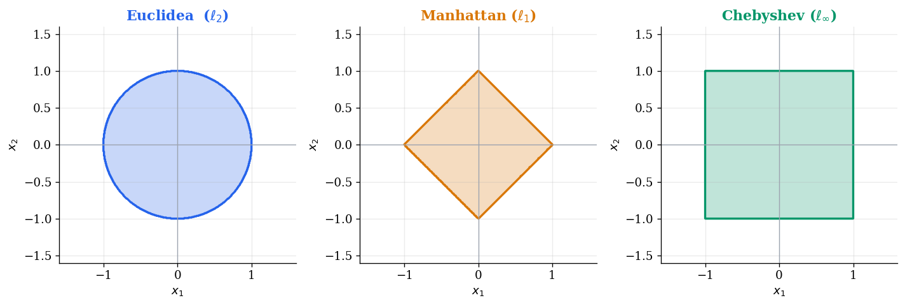


**Similitud coseno y distancia coseno**: Mide el ángulo entre dos vectores, ignorando su magnitud:

$$\text{sim}_{\cos}(\mathbf{x}, \mathbf{y}) = \frac{\mathbf{x} \cdot \mathbf{y}}{\|\mathbf{x}\|\,\|\mathbf{y}\|}, \qquad d_{\cos}(\mathbf{x}, \mathbf{y}) = 1 - \text{sim}_{\cos}(\mathbf{x}, \mathbf{y})$$

Es la métrica estándar para datos de texto. Cuando un documento se representa como un vector de pesos TF-IDF, donde cada dimensión corresponde a un término del vocabulario y su valor refleja cómo de característico es ese término para ese documento, la magnitud del vector depende de la longitud del documento pero no del tema. La similitud coseno elimina ese efecto al medir únicamente el ángulo entre vectores: dos documentos sobre el mismo tema con la misma distribución de términos tendrán similitud coseno cercana a $1$ independientemente de su longitud. Lo mismo aplica a _embeddings_ densos como Word2Vec o BERT, donde la dirección del vector codifica el significado y la magnitud varía por propiedades del entrenamiento, sin codificar nada útil.

En [](#fig-dist-cos) podemos ver un ejemplo del área que abarcarían todos los puntos cuya distancia coseno respecto a un punto $\mathbf{p}$ es menor que diferentes umbrales. 

Figure: Ejemplo de área abarcada para diferentes umbrales de distancia coseno, respecto a un punto p = (1,0). {#fig-dist-cos}

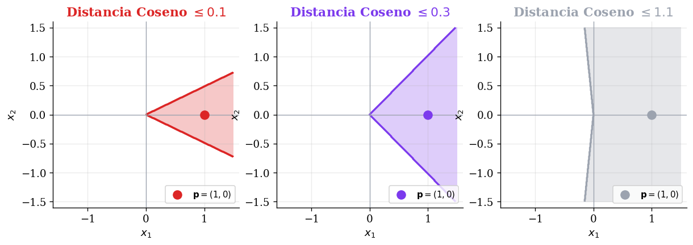


**Distancia de correlación de Pearson**: Mide la similitud en el patrón de variación, independientemente de la escala y del nivel medio,

$$d_{\text{corr}}(\mathbf{x}, \mathbf{y}) = 1 - \frac{(\mathbf{x} - \bar{x}) \cdot (\mathbf{y} - \bar{y})}{\|\mathbf{x} - \bar{x}\|\,\|\mathbf{y} - \bar{y}\|}$$

Donde $\bar{x}$ e $\bar{y}$ son las medias de todas las _features_ de $\mathbf{x}$ e $\mathbf{y}$ respectivamente:  

$$
\bar{x} = \frac{1}{d} \sum_{j=1}^d x_j, \quad \bar{y} = \frac{1}{d} \sum_{j=1}^d y_j
$$

Podemos observar que la métrica es similar a la distancia coseno, pero restando la media, lo cual hace que además de ser invariante a la escala, lo sea también al desplazamiento (valor medio). Esto es especialmente útil en bioinformática y análisis de series temporales, donde interesa agrupar perfiles de expresión génica o curvas con la misma forma aunque tengan distinta amplitud o estén desplazadas.

En la figura [](#fig-dist-serie) se muestra un ejemplo en el que nuestras _features_ representan una serie temporal. Se muestran diferentes casos de comparación de una serie de referencia $\mathbf{p}$ con otra serie a la que se le aplican una serie de transformaciones. En la primera y segunda fila, con transformaciones de escalado observamos que tanto la distancia coseno como la correlación de Pearson son $0$. Sin embargo, cuando sumamos un valor constante a toda la serie, vemos que la correlación de Pearson sigue siendo invariante a la media y se mantiene en $0$, pero la distancia coseno sube a $0.67$. En la cuarta y quinta fila, cuando se introducen series que no están relacionadas con la de referencia, ambas distancias aumentan.

Figure: Ejemplos de distancia coseno y distancia de correlación de Pearson entre dos series temporales. {#fig-dist-serie}

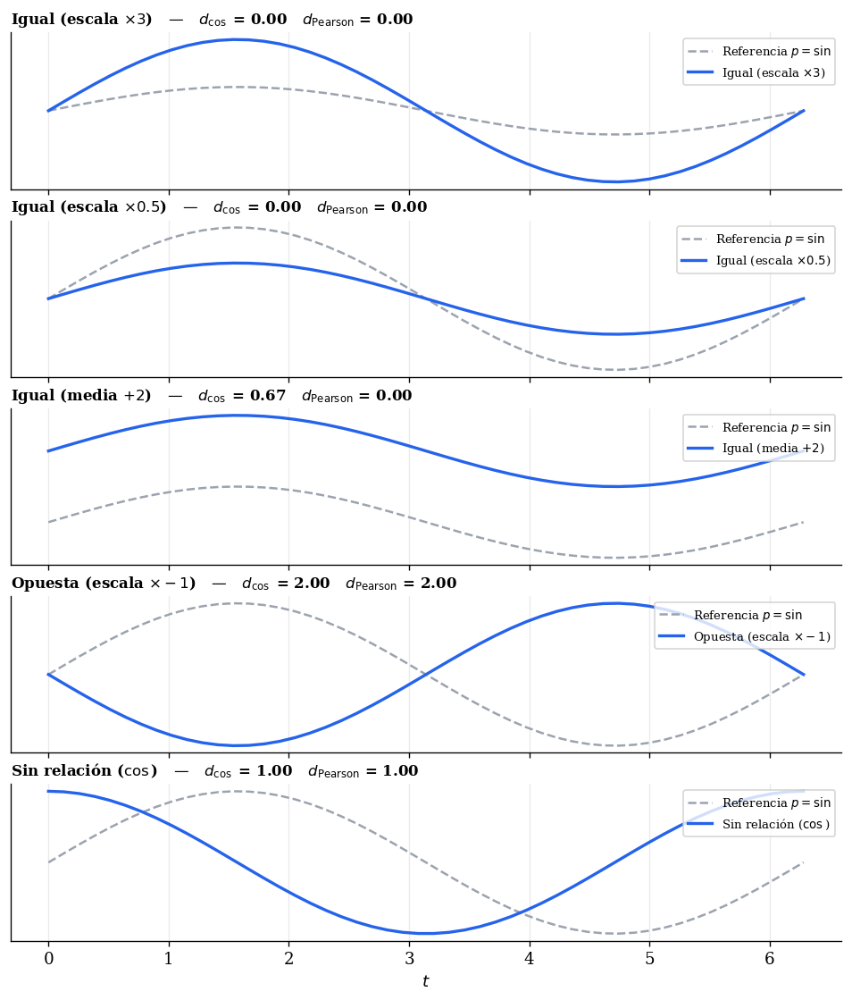


La tabla siguiente resume las propiedades más relevantes de cada métrica para orientar la elección:

| Métrica | Escala | Alta dimensionalidad | Uso principal |
|---|---|---|---|
| Euclídea ($\ell_2$) | Sensible | Concentración de distancias severa | Datos continuos bien escalados |
| Manhattan ($\ell_1$) | Sensible | Concentración de distancias moderada | Datos con _outliers_ |
| Coseno | Invariante | Ruido de dimensiones irrelevantes | Texto, embeddings, vectores dispersos |
| Correlación | Invariante | Ruido de dimensiones irrelevantes | Series temporales, perfiles de expresión |

### Preprocesado para _clustering_

A diferencia del aprendizaje supervisado, donde el riesgo de _overfitting_ va a actuar como aviso de las malas decisiones de preprocesado, en _clustering_ los algoritmos no tienen forma de corregir automáticamente problemas de escala o ruido, los propagan directamente al resultado. Encontramos consideraciones especialmente importantes: el escalado de variables y la maldición de la dimensionalidad.

#### Escalado de variables

Todos los métodos de _clustering_ basados en distancias euclídeas (como por ejemplo K-Means) son sensibles a la escala de las variables. Si una variable tiene valores en el rango $[0, 1]$ y otra en el rango $[0, 10000]$, la segunda dominará completamente el cálculo de distancias y la primera quedará irrelevante.

La solución estándar es aplicar `StandardScaler` antes del _clustering_: transforma cada variable para que tenga media cero y desviación típica uno. En algunos casos puede ser preferible `MinMaxScaler` (cuando la distribución no es aproximadamente normal) o `RobustScaler` (cuando hay _outliers_ que distorsionan la media y la desviación típica).

> **Nota**: El escalado no siempre es deseable. Si las variables tienen unidades comparables y la diferencia de escala es informativa, escalar puede eliminar información relevante. Por ejemplo, en variables monetarias donde podemos tener por ejemplo "Salario" e "Incremento salarial", ambas en euros, escalarlas de forma independiente puede equiparar estadísticamente una diferencia de 500€ en el incremento con una diferencia de 20.000€ en el salario, cuando en realidad ambas magnitudes deberían ser comparables directamente en su escala original. La decisión debe basarse en el conocimiento del dominio.

#### Maldición de la dimensionalidad

En espacios de alta dimensión, todos los puntos tienden a estar aproximadamente a la misma distancia unos de otros [@aggarwal2001surprising]. Como hemos visto, esto afecta más a la distancia Euclídea que a la distancia de Manhattan, y en el caso de la generalización con la distancia de Minkowski el problema se agrava conforme incrementamos el valor de $p$. 

Esto hace que las diferencias de distancia que los algoritmos de _clustering_ usan para separar grupos se diluyan progresivamente. Para más de unas pocas decenas de dimensiones, es habitual aplicar reducción de dimensionalidad (por ejemplo PCA o UMAP) antes del _clustering_, tanto para mejorar la calidad del resultado como para reducir el coste computacional. 

PCA es adecuado para una reducción lineal eficiente, mientras que UMAP puede ser más apropiado cuando la estructura es no lineal. El método t-SNE puede resultar útil para visualizar el resultado del _clustering_, pero no como preprocesado.

### Evaluación de _clustering_

Evaluar la calidad del _clustering_ es más difícil que evaluar un clasificador supervisado, porque no existe una "solución correcta" con la que comparar directamente. Las métricas de evaluación se dividen en dos categorías según si se dispone o no de etiquetas de referencia.

#### Métricas internas

Las _métricas internas_ evalúan la calidad del _clustering_ usando únicamente los datos y las asignaciones producidas, sin necesidad de etiquetas externas. Son las únicas disponibles en un escenario completamente no supervisado, y muchas de ellas podrán ser utilizadas como criterio a la hora de determinar el número óptimo de clases $K$.

**Inercia y criterio del codo (Elbow)**: La _inercia_ mide la suma de distancias al cuadrado (_Within-Cluster Sum of Squares_, WCSS) de cada punto al centroide $\mathbf{\mu}_k$ de su _cluster_:

$$\text{Inercia} = \sum_{k=1}^K \sum_{\mathbf{x}_i \in C_k} \|\mathbf{x}_i - \boldsymbol{\mu}_k\|^2$$

La inercia decrece monotónicamente con $K$, porque añadir más _clusters_ siempre reduce la dispersión interna. En el extremo $K = N$ cada punto forma su propio _cluster_ y la inercia es cero. Por lo tanto, a la hora de utilizar esta métrica como criterio para seleccionar la $K$ óptima su utilidad no está en el valor absoluto sino en la forma de la curva al representarla frente a $K$.

El **criterio del codo** (_elbow method_) busca el valor de $K$ a partir del cual la reducción de inercia se vuelve marginal, es decir, el punto donde la curva deja de caer bruscamente y se aplana. La intuición es que, si existe una estructura real de $K^*$ _clusters_ en los datos, añadir _clusters_ más allá de $K^*$ fragmenta grupos naturales y produce ganancias de inercia cada vez menores. 

En caso de que los datos no tengan estructura clara, el codo podría ser poco pronunciado, por lo que conviene utilizar este método junto a otros que veremos a continuación como Silhouette o CH. Si varios criterios convergen en el mismo $K$, tendremos más confianza en esa elección.

A continuación podemos ver en un fragmento de código cómo representar la inercia frente a $K$:

```python
Ks = range(2, 11)
inercias = []

for k in Ks:
    modelo = KMeans(n_clusters=k, n_init=10)
    modelo.fit(X_scaled)
    inercias.append(modelo.inertia_)

plt.figure(figsize=(6, 4))
plt.plot(Ks, inercias, marker='o')
plt.xlabel('Número de clusters K')
plt.ylabel('Inercia')
plt.title('Criterio del codo')
plt.show()
```

> **Nota**: La inercia está definida para K-Means pero no directamente para otros algoritmos de _clustering_ como el jerárquico o DBSCAN. Para métodos que no producen centroides, Silhouette o CH son las alternativas más adecuadas para seleccionar hiperparámetros equivalentes a $K$.

**Silhouette score** [@rousseeuw1987silhouettes]: Para cada punto $\mathbf{x}_i$, mide cómo de bien encaja en su _cluster_ en comparación con el _cluster_ vecino más cercano. Se define a partir de dos distancias medias:

- $a(i)$: distancia media de $\mathbf{x}_i$ a todos los demás puntos de su _cluster_ (cohesión interna).
- $b(i)$: distancia media de $\mathbf{x}_i$ a todos los puntos del _cluster_ vecino más próximo (separación externa).

El _silhouette_ de un punto es:

$$s(i) = \frac{b(i) - a(i)}{\max(a(i),\, b(i))}$$

El _silhouette score_ global es la media de $s(i)$ sobre todos los puntos, y toma valores en $[-1, 1]$. Un valor cercano a $1$ indica que los _clusters_ están bien separados y son compactos, un valor cercano a $0$ indica que los puntos están en la frontera entre _clusters_, mientras que un valor negativo indica que los puntos están probablemente mal asignados. En la práctica, valores por encima de $0.5$ suelen indicar una estructura de _clustering_ razonablemente buena.

```python
from sklearn.metrics import silhouette_score, silhouette_samples

# Score global (media sobre todos los puntos)
score = silhouette_score(X_scaled, etiquetas)

# Score por punto (útil para detectar puntos mal asignados)
scores_por_punto = silhouette_samples(X_scaled, etiquetas)
```

**Índice de Davies-Bouldin** [@davies1979cluster]: Para cada _cluster_ $C_k$ mide su similitud con el _cluster_ más parecido a él, definida como el cociente entre la dispersión interna de ambos _clusters_ y la distancia entre sus centroides:

$$DB = \frac{1}{K} \sum_{k=1}^K \max_{j \neq k} \left( \frac{s_k + s_j}{d(\boldsymbol{\mu}_k, \boldsymbol{\mu}_j)} \right)$$

Donde $s_k$ es la distancia media de los puntos de $C_k$ a su centroide $\boldsymbol{\mu}_k$. A diferencia del _silhouette_, los **valores más bajos son mejores**. Un índice de Davies-Bouldin bajo indica _clusters_ compactos y bien separados. No requiere cálculo punto a punto, lo que lo hace más eficiente en _datasets_ grandes.

```python
from sklearn.metrics import davies_bouldin_score

db = davies_bouldin_score(X_scaled, etiquetas)
```

**Índice de Calinski-Harabasz** [@calinski1974dendrite] (también conocido como _Variance Ratio Criterion_): Mide la _ratio_ entre la dispersión inter-cluster y la dispersión intra-cluster:

$$CH = \frac{ \frac{\sum_{k=1}^K |C_k| \cdot \| \mathbf{\mu}_k - \mathbf{\mu} \|^2} {(K-1)}}{ \frac{\sum_{k=1}^K \sum_{\mathbf{x}_i \in C_k} \| \mathbf{x}_i - \mathbf{\mu}_k \|^2}{(N-K)} }$$

Podemos observar que en el numerador se suman las distancias al cuadrado del centroide de cada _cluster_ $\mathbf{\mu}_k$ al centroide global $\mathbf{\mu}$, ponderadas por el número de ejemplos del _cluster_ $|C_k|$. El denominador suma las distancias al cuadrado de cada punto al centroide de su _cluster_, midiendo cómo de compacto es el _cluster_ internamente. En este caso **valores más altos son mejores**. Es muy eficiente computacionalmente y especialmente útil para comparar soluciones con distintos valores de $K$.

```python
from sklearn.metrics import calinski_harabasz_score

ch = calinski_harabasz_score(X_scaled, etiquetas)
```

> **Nota**:  Ninguna métrica interna es universalmente fiable. 
Los índices de Davies-Bouldin y Calinski-Harabasz se basan en distancias con los centroides, lo cual supone una asunción de contar con _clusters_ aproximadamente esféricos. El _silhouette score_ trabaja con distancias directas entre pares de puntos, lo cual lo hace algo más robusto frente a _clusters_ de forma no esférica. Sin embargo, sigue favoreciendo _clusters_ convexos porque compara distancias medias intra e inter-_cluster_ asumiendo implícitamente que los puntos de un mismo _cluster_ son más cercanos entre sí que a los del _cluster_ vecino, lo cual no se cumple en estructuras complejas que DBSCAN o el _clustering_ espectral pueden capturar correctamente, como anillos o espirales. Cuando se usan estos algoritmos, la métrica más coherente con la filosofía del método es DBCV [@moulavi2014density]. En cualquier caso, usar varias métricas simultáneamente y contrastarlas entre sí es siempre más informativo que confiar en una sola.


#### Métricas externas

Las _métricas externas_ comparan el _clustering_ obtenido con una asignación de referencia (_ground truth_) $\mathbf{y}$. Se usan principalmente para evaluar algoritmos en _benchmarks_ y _datasets_ con etiquetas conocidas, no en aplicaciones reales donde esas etiquetas no existen.

**Rand Index y Adjusted Rand Index (ARI)** [@hubert1985comparing]: El _Rand Index_ mide la proporción de pares de puntos cuya asignación es consistente entre el _clustering_ obtenido y el de referencia, esto es, los pares que están juntos en ambas soluciones, o separados en ambas. Como el _Rand Index_ tiende a valores altos incluso para asignaciones aleatorias, se usa habitualmente su versión ajustada por azar:

$$ARI = \frac{RI - \mathbb{E}[RI]}{\max(RI) - \mathbb{E}[RI]}$$

El ARI toma valor $1$ cuando hay un acuerdo perfecto entre la agrupación de referencia y la obtenida, $0$ cuando el acuerdo es equivalente al azar y puede ser ligeramente negativo para acuerdos peores que el azar. No requiere que ambas soluciones tengan el mismo número de _clusters_.

**Información mutua normalizada (NMI)** [@strehl2002cluster]: Mide la información compartida entre el _clustering_ obtenido y el de referencia, normalizada por la entropía de cada uno. Definimos $U$ y $V$ como los vectores de asignaciones de _cluster_, donde para cada punto $\mathbf{x}_i$, $U_i \in \{1, \ldots, K \}$ es el _cluster_ que le asigna el algoritmo, mientras que $V_i \in \{1, \ldots, K' \}$ es el _cluster_ de referencia (_ground-truth_), pudiendo ser $K \neq K'$. Con esto, definimos la información mutua normalizada como:

$$NMI(U, V) = \frac{2 \cdot I(U; V)}{H(U) + H(V)}$$

Donde $I(U; V)$ es la información mutua entre las dos asignaciones y $H(\cdot)$ su entropía. Toma valores en $[0, 1]$, indicando $0$ independencia total y $1$ acuerdo perfecto. Es invariante al número de _clusters_ y al tamaño relativo de los mismos.

```python
from sklearn.metrics import adjusted_rand_score, normalized_mutual_info_score

ari = adjusted_rand_score(y_true, etiquetas)
nmi = normalized_mutual_info_score(y_true, etiquetas)
```

#### Resumen de métricas

La siguiente tabla resume en qué contextos es más adecuada cada métrica:

| Métrica | Tipo | Requiere etiquetas | Favorece | Más adecuada cuando |
|---|---|---|---|---|
| Inercia (codo) | Interna | No | _Clusters_ compactos | Selección de $K$ en K-Means |
| Silhouette | Interna | No | _Clusters_ convexos | Exploración general, selección de $K$ |
| Davies-Bouldin | Interna | No | Asume centroides (_Clusters_ esféricos) | Validación con $K$ fijo |
| Calinski-Harabasz | Interna | No | Asume centroides (_Clusters_ esféricos) | Selección de $K$ en _datasets_ grandes |
| ARI | Externa | Sí | Acuerdo global con referencia | _Benchmarking_, evaluación de algoritmos |
| NMI | Externa | Sí | Acuerdo mutuo (Información mutua) | Cuando los _clusters_ tienen tamaños muy distintos |


## _Clustering_ jerárquico

El _clustering jerárquico_ construye una secuencia anidada de particiones de los datos, desde la más fina (cada punto en su propio _cluster_) hasta la más gruesa (todos los puntos en un único _cluster_). Esta secuencia se organiza en forma de árbol binario denominado _dendrograma_, que permite visualizar de un vistazo toda la jerarquía de agrupamientos posibles.

La principal ventaja frente a K-Means es que no necesitamos decidir el número de _clusters_ antes de ejecutar el algoritmo. Podemos explorar el dendrograma y decidir el corte más adecuado una vez visto el resultado.

Existen dos enfoques opuestos para construir esta jerarquía:

- **Aglomerativo (_bottom-up_)**: comienza con cada punto en su propio _cluster_ y va fusionando iterativamente los dos _clusters_ más similares hasta que todos los puntos forman un único grupo. Es el enfoque más utilizado en la práctica.

- **Divisivo (_top-down_)**: comienza con todos los puntos en un único _cluster_ y va dividiéndolo recursivamente hasta que cada punto forma su propio grupo. Es computacionalmente muy costoso en su forma exacta, ya que requiere considerar todas las posibles divisiones en cada paso, y raro en la práctica. Sin embargo, su filosofía de dividir recursivamente usando un criterio global inspirará el _clustering_ espectral, que veremos más adelante en esta sesión.

## _Clustering_ aglomerativo

El _clustering aglomerativo_ es la variante más empleada del _clustering_ jerárquico. El algoritmo, en su forma general, realiza los siguientes pasos:

<!-- 
$$
\begin{align*}
& \text{Entrada: Conjunto de datos } \{\mathbf{x}_1, \ldots, \mathbf{x}_N\} \\
& C_i \leftarrow \{\mathbf{x}_i\} \quad \forall i \in 1, \ldots, N \quad \text{(Inicializa cada punto como su propio cluster)} \\
& \text{Para } t = 1, \ldots, N-1 \\
& \quad (C_i^*, C_j^*) \leftarrow \arg\min_{C_i \neq C_j} D(C_i, C_j) \quad \text{(Encuentra los dos clusters más próximos)} \\
& \quad C_{\text{nuevo}} \leftarrow C_i^* \cup C_j^* \quad \text{(Los fusiona en un nuevo cluster)} \\
& \quad \text{Actualiza el conjunto de clusters eliminando } C_i^*, C_j^* \text{ y añadiendo } C_{\text{nuevo}} \\
& \text{Devuelve: Dendrograma con las } (N-1) \text{ fusiones realizadas}
\end{align*}
$$
-->

!!! abstract "Algoritmo 1 — Clustering aglomerativo"

    **Entrada:** Conjunto de datos $\{\mathbf{x}_1, \ldots, \mathbf{x}_N\}$   
    **Salida:** Dendrograma  

    <div style="margin-left: 1.5em;">
    Inicializa cada punto como su propio _cluster_: $\quad C_i \leftarrow \{\mathbf{x}_i\} \quad \forall i \in 1, \ldots, N \quad$<br/>
    Para $t = 1, \ldots, N-1$:
    </div>

    <div style="margin-left: 3em;">
    Encuentra los dos clusters más próximos: $\quad (C_i^*, C_j^*) \leftarrow \arg\min_{C_i \neq C_j} D(C_i, C_j) \quad$ <br/>
    Los fusiona en un nuevo cluster: $\quad C_{\text{nuevo}} \leftarrow C_i^* \cup C_j^* \quad$<br/>
    Actualiza el conjunto de _clusters_ eliminando $C_i^*, C_j^*$ y añadiendo $C_{\text{nuevo}}$
    </div>

    <div style="margin-left: 1.5em;">
    Devolver Dendrograma con las $(N-1)$ fusiones realizadas
    </div>

La clave del algoritmo está en cómo se define la distancia $D(C_i, C_j)$ entre dos _clusters_. Esta distancia, llamada _linkage_, no es la distancia entre dos puntos sino una distancia entre dos conjuntos de puntos, y su elección tiene un impacto enorme en la forma de los _clusters_ resultantes.

### Criterios de linkage

Los cuatro criterios de _linkage_ más utilizados son los siguientes. Sea $d(\mathbf{x}, \mathbf{y})$ la distancia entre dos puntos individuales (euclídea por defecto):

**Single linkage** (enlace sencillo): la distancia entre _clusters_ es la distancia mínima entre cualquier par de puntos de ambos _clusters_:

$$D_{\text{single}}(C_i, C_j) = \min_{\mathbf{x} \in C_i,\, \mathbf{y} \in C_j} d(\mathbf{x}, \mathbf{y})$$

Tiende a producir el fenómeno conocido como encadenamiento (_chaining_), consistente que en que se generen _clusters_ alargados en cadena, ya que basta con que dos puntos (uno de cada _cluster_) estén cerca para fusionarlos, aunque el resto de puntos estén lejos (ver [](#fig-chaining)). Este fenómeno permite capturar formas arbitrarias no convexas, pero no es un método diseñado para capturar formas no convexas y realmente esto supone una gran fragilidad ante el ruido que lo hace poco adecuado para la mayoría de problemas reales. Un único punto de ruido entre dos _clusters_ podría encadenarlos. Por este motivo es un método que se utiliza muy poco en la práctica.

Figure: Fenómeno de "encadenamiento" con _linkage single_. Los puntos "puente" pueden provocar que dos _clusters_ se unan.  {#fig-chaining}

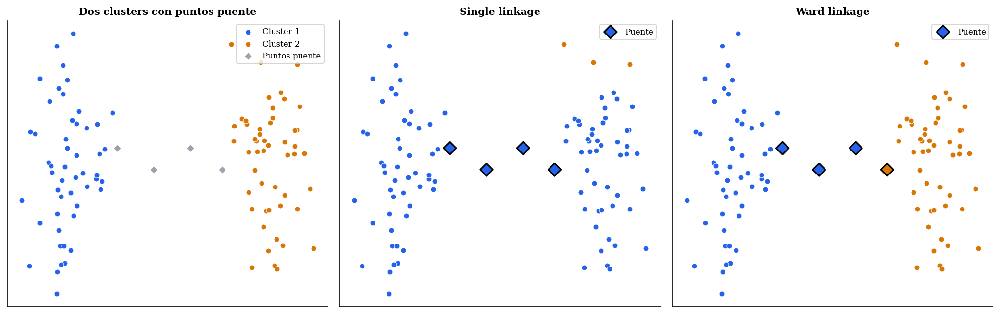

**Complete linkage** (enlace completo): la distancia entre _clusters_ es la distancia máxima entre cualquier par de puntos de ambos _clusters_:

$$D_{\text{complete}}(C_i, C_j) = \max_{\mathbf{x} \in C_i,\, \mathbf{y} \in C_j} d(\mathbf{x}, \mathbf{y})$$

Produce _clusters_ compactos y de diámetro similar, ya que solo fusiona _clusters_ cuando sus puntos más alejados también están razonablemente cerca. Esto lo hace también sensible a _outliers_ en el sentido opusto del _single linkage_. En este caso un punto extremo puede aumentar el diámetro de un _cluster_ y retrasar su fusión. Puede producir _clusters_ que no son geométricamente conexos, fusionando trozos de _clusters_ naturales distintos si eso produce un diámetro menor.

**Average linkage** (UPGMA): la distancia entre _clusters_ es la media de todas las distancias entre pares de puntos de ambos _clusters_:

$$D_{\text{avg}}(C_i, C_j) = \frac{1}{|C_i|  |C_j|} \sum_{\mathbf{x} \in C_i} \sum_{\mathbf{y} \in C_j} d(\mathbf{x}, \mathbf{y})$$

Ofrece un equilibrio entre _single_ y _complete linkage_, siendo menos sensible a _outliers_ que _single_ y menos sesgado hacia _clusters_ esféricos que _complete_.

**Linkage de Ward**: en lugar de medir distancias entre puntos, mide el **incremento en la varianza intra-cluster** que se produciría al fusionar dos _clusters_. Formalmente, si $\bar{\mathbf{x}}_{C}$ es el centroide del _cluster_ $C$, esta métrica se calcula como:

$$D_{\text{Ward}}(C_i, C_j) = \frac{|C_i|  |C_j|}{|C_i| + |C_j|} \|\bar{\mathbf{x}}_{C_i} - \bar{\mathbf{x}}_{C_j}\|^2$$

Ward fusiona los _clusters_ cuya unión produzca el menor aumento de varianza total. Tiende a producir _clusters_ compactos y equilibrados, y es el criterio más utilizado en la práctica. Es el que guarda mayor relación conceptual con K-Means, ya que ambos minimizan la varianza intra-cluster.

> **Nota**: Ward solo está bien definido con distancia euclídea al cuadrado. Si se trabaja con otras métricas (por ejemplo, distancia de Manhattan o correlación), se debe usar _average_ o _complete linkage_.

En la [](#fig-linkages) observamos una comparativa de diferentes métricas de _linkage_. Vemos que el _linkage single_ produce el efecto de encadenamiento cuando tenemos dos grupos de puntos que "se tocan", mientras que en _complete_, cuando tenemos grupos con diámetro muy grande, a veces prefiere unir un trozo del grupo grande a otro _cluster_ si así consigue un diámetro más pequeño. Si bien el _linkage complete_ produce _clusters_ equilibrados en diámetros, los _linkages average_ y _Ward_ producen _clusters_ equilibrados en distancia media a todos los puntos y en la varianza intra-_cluster_, respectivamente. 

Figure: Comparativa de diferentes _linkages_ aplicados para agrupar un conjunto de puntos en $K=3$ _clusters_.   {#fig-linkages}

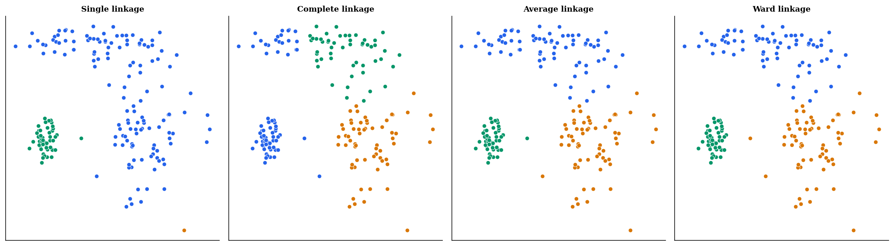


### El dendrograma

El _dendrograma_ es la representación gráfica del proceso de fusión. El eje horizontal muestra los puntos (u hojas del árbol), y el eje vertical indica la distancia o disimilitud a la que se produce cada fusión. Las ramas del árbol se unen a la altura correspondiente a esa distancia (ver [](#fig-dendrograma)).

Figure: Ejemplo de dendrograma con corte a diferentes alturas, produciendo 2 o 4 _clusters_ {#fig-dendrograma}

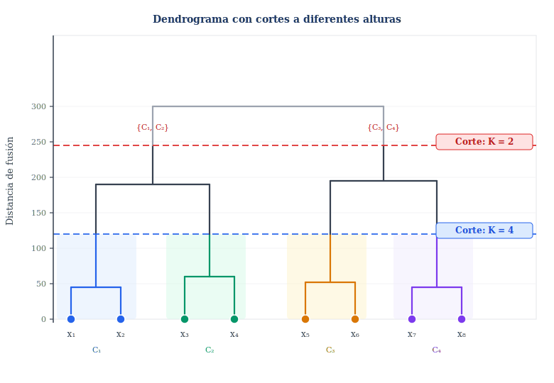


Para obtener una partición en $K$ _clusters_, realizamos un **corte horizontal** del dendrograma. El número de ramas verticales que cruza dicho corte determina el número de _clusters_. El problema de seleccionar $K$ se convierte así en el problema de elegir la altura del corte.

Pero, **¿cómo elegimos dónde cortar?**. La heurística más común consiste en buscar el _salto vertical más grande_ entre dos fusiones consecutivas. Una distancia de fusión mucho mayor que la anterior indica que se han tenido que unir _clusters_ que eran naturalmente distintos. La altura justo por debajo de ese salto suele ser la elección más adecuada. Podemos ver esto ejemplificado en la [](#fig-dendrograma-cut).

Figure: Ejemplo de cortes del dendrograma teniendo en cuenta la distancia de salto. El rango en el que $K=4$ es muy pequeño, por lo que en este caso sería preferible cortar en las regiones con mayor salto ($K=3$ o $K=2$). {#fig-dendrograma-cut}

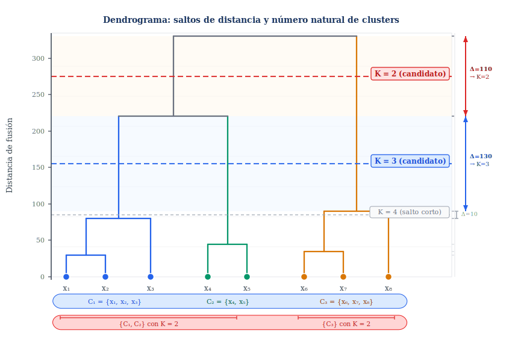

Aunque el _clustering_ aglomerativo tiene su propio criterio de selección de $K$ a través de los **saltos en la distancia de fusión** en el dendrograma, podemos buscar estrategias más robustas combinando este criterio con otros criterios como _Silhouette_ o CH. De esta forma, se utilizaría el dendrograma para identificar una serie de valores $K$ candidatos a partir de los saltos más pronunciados, y posteriormente se confirmaría esa selección con otro de los criterios, como se muestra en la [](#fig-seleccion-k).  

Figure: Ejemplo de combinación de criterios para la selección del $K$ óptimo. {#fig-seleccion-k}

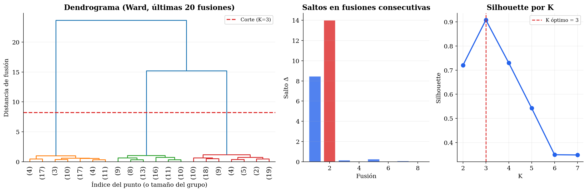

### Complejidad computacional

La complejidad del _clustering_ aglomerativo depende de la implementación. La versión _naïve_, que recalcula todas las distancias entre _clusters_ en cada paso, tiene complejidad $O(N^3)$ en tiempo y $O(N^2)$ en espacio. Con el algoritmo de Murtagh [@murtagh1983survey] y la estructura de datos adecuada se puede reducir a $O(N^2 \log N)$ para la mayoría de _linkages_, y a $O(N^2)$ para _single linkage_ con el algoritmo SLINK [@Sibson1973SLINK]. En cualquier caso, la dependencia cuadrática en espacio necesaria para almacenar la matriz de distancias limita su aplicabilidad a _datasets_ de tamaño moderado (típicamente, no más de unas decenas de miles de puntos).

### Implementación en sklearn

En sklearn el _clustering_ aglomerativo está disponible en [`AgglomerativeClustering`](https://scikit-learn.org/stable/modules/generated/sklearn.cluster.AgglomerativeClustering.html). A diferencia de K-Means, este estimador **no implementa el método `predict`**, ya que el modelo jerárquico no generaliza a nuevos puntos sin reajustar. El resultado es una partición de los datos de entrenamiento, no un clasificador.

```python
# Siempre escalar antes de clustering basado en distancias
X_scaled = StandardScaler().fit_transform(X)

modelo = AgglomerativeClustering(
    n_clusters=3,           # Número de clusters tras el corte
    metric='euclidean',     # Métrica de distancia entre puntos individuales
    linkage='ward',         # Criterio de linkage: 'ward', 'complete', 'average', 'single'
    compute_full_tree=True  # Necesario para visualizar el dendrograma completo
)

etiquetas = modelo.fit_predict(X_scaled)
```

Los parámetros más relevantes son:

- **`n_clusters`**: número de _clusters_ deseado. Determina la altura del corte en el dendrograma. Si se establece a `None`, se construye el árbol completo y se puede usar conjuntamente con `distance_threshold` para cortar por distancia en lugar de por número de _clusters_.

- **`metric`**: métrica para calcular distancias entre puntos individuales. Acepta `'euclidean'`, `'l1'`, `'l2'`, `'manhattan'`, `'cosine'` o `'precomputed'`. Con `linkage='ward'` solo puede usarse `'euclidean'`.

- **`linkage`**: criterio de fusión. Las opciones son `'ward'`, `'complete'`, `'average'` y `'single'`. La elección tiene un impacto decisivo en el resultado, como hemos visto.

- **`distance_threshold`**: si se establece (y `n_clusters=None`), el árbol se corta en la distancia indicada en lugar de a un número fijo de _clusters_. Útil cuando no se conoce $K$ a priori y se prefiere trabajar con un umbral de disimilitud máxima.

- **`compute_distances`**: si es `True`, almacena en `modelo.distances_` las distancias de cada fusión, lo que permite dibujar el dendrograma.

Para **visualizar el dendrograma** es necesario usar la función `dendrogram` de scipy, que trabaja con la representación de _linkage_ que produce `scipy.cluster.hierarchy.linkage`:

```python
from scipy.cluster.hierarchy import dendrogram, linkage
import matplotlib.pyplot as plt

# scipy calcula el linkage de forma independiente a sklearn
Z = linkage(X_scaled, method='ward', metric='euclidean')

plt.figure(figsize=(10, 5))
dendrogram(
    Z,
    truncate_mode='lastp',  # Mostrar solo las últimas p fusiones
    p=20,                   # Número de fusiones a mostrar
    show_leaf_counts=True,  # Mostrar número de puntos en cada hoja
    leaf_rotation=90
)
plt.axhline(y=7.5, color='red', linestyle='--', label='Corte propuesto')
plt.xlabel('Índice del punto (o cluster)')
plt.ylabel('Distancia de fusión')
plt.legend()
plt.show()
```

> **Nota**: _sklearn_ y _scipy_ mantienen implementaciones separadas del _clustering_ jerárquico. Para **obtener los _clusters_** se usa `AgglomerativeClustering` de _sklearn_. Para **visualizar el dendrograma** resulta más cómodo usar `scipy.cluster.hierarchy`, ya que _sklearn_ no proporciona directamente la función de visualización.

### Flujo de trabajo

Un aspecto importante de la implementación es la **normalización previa**. El _clustering_ aglomerativo, al estar basado en distancias, es sensible a la escala de las variables. Si una variable tiene valores en el rango $[0, 1]$ y otra en el rango $[0, 10000]$, la segunda dominará todas las distancias. Por ello es casi siempre necesario aplicar `StandardScaler` antes de ajustar el modelo.

Como hemos visto en la implementación, hay dos formas alternativas de **seleccionar el número de clases $K$**: utilizar `n_classes` para establecer un número específico de clases o proporcionar `distance_threshold` para cortar cuando encontremos un salto mayor a la distancia indicada y determinar así $K$ a partir de los saltos. El problema de esta segunda forma es que no conocemos de antemano la distribución de saltos en el dendrograma. 

Por este motivo, en la práctica el flujo de trabajo habitual consistirá en construir y representar mediante _scipy_ el dendrograma, inspeccionando el rango de distancias y seleccionando el corte a partir de esta información:

```python
from scipy.cluster.hierarchy import linkage, dendrogram, fcluster
import matplotlib.pyplot as plt

# Paso 1: construir la jerarquía y visualizar
Z = linkage(X_scaled, method='ward')

plt.figure(figsize=(10, 5))
dendrogram(Z, truncate_mode='lastp', p=20)  # mostrar solo las últimas 20 fusiones
plt.ylabel('Distancia de fusión')
plt.show()

# Paso 2: tras inspeccionar el dendrograma, elegir K o umbral

# Opción A: cortar por número de clusters
etiquetas = fcluster(Z, t=3, criterion='maxclust')

# Opción B: cortar por umbral de distancia
etiquetas = fcluster(Z, t=10.0, criterion='distance')
```

Una vez hecho esto, podemos utilizar `AgglomerativeClustering` con el número de clases $K$ o el umbral de distancia elegido para obtener las etiquetas finales.

### Reducción de la dimensionalidad

Hasta ahora hemos aplicado el _clustering_ aglomerativo sobre las **observaciones**, esto es, cada punto del _dataset_ es un objeto que se agrupa con otros similares. El mismo algoritmo puede aplicarse de forma transpuesta sobre las **variables**, de forma que en lugar de agrupar filas agrupamos columnas. El resultado es una forma de reducción de dimensionalidad que reemplaza grupos de variables similares por una única variable representativa de cada grupo.


La motivación de este enfoque viene de que en muchos _datasets_ reales, especialmente en bioinformática, señales de sensores o datos de texto, existe alta redundancia entre variables, como por ejemplo un grupo de genes que se coexpresan, un conjunto de sensores que miden fenómenos relacionados, o un conjunto de términos sinónimos en una representación de texto. En lugar de aplicar PCA, que produce componentes abstractas difíciles de interpretar, el _clustering_ de variables agrupa las originales y produce representaciones que mantienen la interpretabilidad.

En sklearn esta funcionalidad está disponible en [`FeatureAgglomeration`](https://scikit-learn.org/stable/modules/generated/sklearn.cluster.FeatureAgglomeration.html), que aplica _clustering_ aglomerativo sobre las columnas del _dataset_ y reemplaza cada grupo de variables por su media:


```python
agglo = cluster.FeatureAgglomeration(n_clusters=32)
agglo.fit(X)
X_reduced = agglo.transform(X)
```

Es conveniente prestar atención a la métrica sobre la que se calcula la similitud entre variables. Por defecto se usa la distancia euclídea entre los vectores de observaciones de cada variable, es decir, dos variables son similares si sus valores numéricos son parecidos punto a punto. Sin embargo, en muchos casos es más adecuado usar la **correlación de Pearson** como medida de similitud, ya que dos variables pueden tener escalas muy distintas pero un patrón de variación idéntico, y son esas variables las que conviene agrupar. Para ello se puede pasar `metric='correlation'` con `linkage='average'` (ya que Ward requiere distancia euclídea y no es compatible con métricas de correlación).

En la [](#fig-feature-agglomeration) se muestra un ejemplo de aplicación de `FeatureAgglomeration` para reducir la dimensionalidad, y se compara con otro método de reducción de dimensionalidad como PCA. En la fila superior izquierda se muestra la matriz de correlación de _features_ originales, y a la derecha se muestran las _features_ ordenadas por grupos tras aplicar `FeatureAgglomeration`. En la fila inferior se evalúa la reducción de dimensionalidad: a la izquierda se muestra la correlación entre las _features_ prototipo obtenidas mediante el promedidado de las columnas agrupadas y las _features_ originales, y a la derecha se muestra la correlación entre las $4$ componentes principales encontradas por PCA y las _features_ originales. Podemos observar que en el caso de PCA todas las _features_ participan de forma más equilibrada en las diferentes componentes, mientras que `FeatureAgglomeration` está más enfocado minimizar la correlación entre las _features_ agrupadas.

Figure: Ejemplo de reducción de la dimensionalidad con `FeatureAgglomeration`, y comparación con PCA.  {#fig-feature-agglomeration}

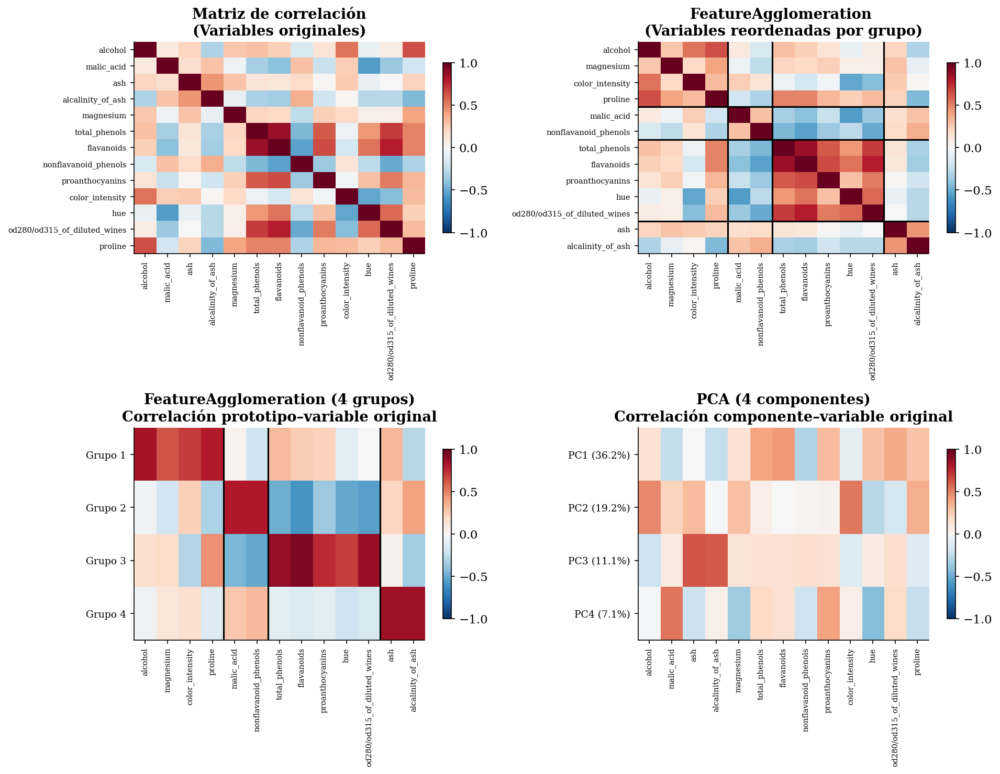


## _Clustering_ espectral

El _clustering espectral_ [@shi2000normalized;@ng2002spectral] aborda una limitación fundamental de K-Means y del _clustering_ aglomerativo con Ward, y es que estos métodos trabajan en el espacio original de características y tienden a encontrar _clusters_ convexos (en el caso de K-Means, exactamente esféricos). Sin embargo, muchos conjuntos de datos tienen estructuras no convexas, como dos círculos concéntricos, espirales entrelazadas o formas de media luna que estos métodos no pueden separar correctamente (ver [](#fig-espectral-motivacion)).

Figure: K-Means falla con círculos concéntricos (izquierda). El _clustering_ espectral los separa correctamente (derecha). {#fig-espectral-motivacion}

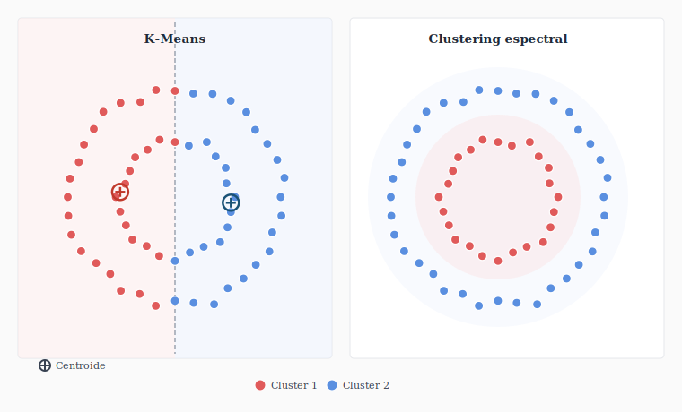

La idea del _clustering_ espectral es **transformar el espacio de representación** utilizando herramientas de teoría de grafos, de forma que los _clusters_ naturales de los datos se conviertan en regiones linealmente separables en el nuevo espacio. Una vez realizada esa transformación, basta aplicar K-Means.

### Filosofía divisiva e inspiración espectral

Antes de desarrollar el algoritmo, conviene situar el _clustering_ espectral en relación con los enfoques jerárquicos que hemos visto.

La variante divisiva del _clustering_ jerárquico divide recursivamente el conjunto completo de datos. El reto es definir un criterio de división que sea significativo a nivel global, no solo local. Una opción natural es formular la división como un problema de **corte de grafo**, es decir, construir un grafo donde los nodos son los puntos de datos y los arcos representan la similitud entre ellos, y buscar la partición que minimice las conexiones entre los dos grupos resultantes.

Este problema de _graph cut_ óptimo tiene, en su versión exacta, complejidad exponencial. Sin embargo, su **relajación continua**, es decir, permitir asignaciones fraccionarias en lugar de binarias, conduce directamente a un problema de autovalores sobre la _matriz laplaciana_ del grafo [@shi2000normalized]. Los autovectores de esta matriz son, en ese sentido, la solución relajada del problema de partición óptima.

El _clustering_ espectral estándar aplica este principio para encontrar $K$ _clusters_ simultáneamente (no de forma recursiva), pero la conexión con la filosofía divisiva es directa, ya que la teoría espectral de grafos proporciona el fundamento matemático que el enfoque divisivo necesitaba para ser computable de forma eficiente.

### Construcción del grafo de similitud

El primer paso es representar los datos como un grafo $G = (V, E)$, donde cada nodo $v_i \in V$ es un punto de datos y cada arista $(v_i, v_j) \in E$ tiene un peso $w_{ij}$ que refleja la similitud entre $\mathbf{x}_i$ y $\mathbf{x}_j$. Los tres esquemas más comunes son:

- **Grafo KNN**: conectar cada punto con sus $K$ vecinos más cercanos. Produce grafos dispersos y es eficiente computacionalmente.
- **$\varepsilon$-neighborhood**: conectar todos los pares con distancia inferior a $\varepsilon$. La elección de $\varepsilon$ puede ser difícil.
- **Grafo completo ponderado**: conectar todos los pares con peso dado por la similitud gaussiana (RBF):

$$w_{ij} = \exp\!\left(-\frac{\|\mathbf{x}_i - \mathbf{x}_j\|^2}{2\sigma^2}\right)$$

Donde $\sigma$ es un parámetro que controla el radio de influencia de cada punto. Esta es la opción más habitual.

En la implementación de _sklearn_ encontraremos un parámetro `gamma` ($\gamma$) con la equivalencia:

$$
\gamma = \frac{1}{2\sigma^2}
$$ 

Es decir, **valores pequeños de $\gamma$** corresponderán a valores altos de $\sigma$, con lo cual cada punto afectará a un radio de vecindad más amplio (estamos "acercando") los puntos, lo cual podría llegar a conectar grupos de puntos alejados entre si. Por el contrario, con un **valor alto de $\gamma$** corresponde a un valor pequeño de $\sigma$, y lo que hará es afectar a un radio de vecindad menor, lo cual podría llegar a fragmentar la estructura en exceso. El **ajuste de este parámetro resulta crítico**, y una posible forma de abordarlo es mediante un análisis de la distribución de distancias entre los vecinos más cercanos en el _dataset_ de entrada.

### La matriz Laplaciana

A partir de la matriz de similitud $W$ (con elementos $w_{ij}$) se construyen las siguientes matrices:

- **Matriz de grado** $D$: matriz diagonal con $D_{ii} = \sum_j w_{ij}$, que recoge el peso total de las conexiones de cada nodo.
- **Laplaciana no normalizada**: $L = D - W$.
- **Laplaciana normalizada** (Shi & Malik): $L_{\text{sym}} = D^{-1/2} L D^{-1/2} = I - D^{-1/2} W D^{-1/2}$.

La propiedad fundamental de la Laplaciana es que **el número de autovalores iguales a cero de $L$ es igual al número de componentes conexas del grafo**. Cuando hay $K$ componentes completamente desconectadas, la Laplaciana tiene $K$ autovalores nulos y los autovectores correspondientes son indicadores binarios de cada componente (cada elemento del vector nos indica si el correspondiente nodo del grafo  pertenece o no a la componente). 

### Criterios de corte

La construcción del grafo y la Laplaciana es la base del _clustering_ espectral, pero el objetivo que buscamos optimizar es un **criterio de corte de grafo**. Hay dos formulaciones principales que dan lugar a variantes distintas del algoritmo.

Dado un grafo con $K$ _clusters_ $C_1, \ldots, C_K$, definimos el _corte_ de un _cluster_ como la suma de pesos de las aristas que lo conectan con el resto de _clusters_:

$$\text{cut}(C_k, \bar{C}_k) = \sum_{i \in C_k,\, j \notin C_k} w_{ij}$$

Minimizar directamente la suma de cortes $\sum_k \text{cut}(C_k, \bar{C}_k)$ no es un buen criterio, ya que favorece soluciones degeneradas donde un _cluster_ tiene un único punto y el resto forman un _cluster_ enorme. Esto es así porque un _cluster_ pequeño tiene pocas aristas que cortar y su coste de separación es mínimo. Vamos a ver dos formulaciones que resuelven esto normalizando el corte.

**Ratio Cut** [@hagen1992new] normaliza por el número de puntos de cada _cluster_:

$$\text{RatioCut}(C_1, \ldots, C_K) = \sum_{k=1}^K \frac{\text{cut}(C_k, \bar{C}_k)}{|C_k|}$$

La normalización por $|C_k|$ penaliza los _clusters_ muy pequeños. Un _cluster_ de un solo punto tendría un denominador mínimo y por lo tanto un gran peso en la suma, lo que desincentiva esa solución degenerada. La relajación continua de este problema de optimización discreto conduce a los autovectores de la **Laplaciana no normalizada** $L = D - W$.

**Normalized Cut** [@shi2000normalized] normaliza por el volumen del _cluster_, definido como la suma de grados de sus nodos:

$$\text{NCut}(C_1, \ldots, C_K) = \sum_{k=1}^K \frac{\text{cut}(C_k, \bar{C}_k)}{\text{vol}(C_k)}, \qquad \text{vol}(C_k) = \sum_{i \in C_k} d_i$$

Normalizar por el volumen en lugar del tamaño tiene en cuenta la densidad de conexiones de cada _cluster_. Esto es, un _cluster_ con nodos muy conectados tiene volumen alto aunque tenga pocos puntos. De esta forma, NCut favorece particiones que preservan comunidades con muchas conexiones internas, en lugar de simplemente equilibrar el número de puntos en cada grupo. La relajación continua de NCut conduce a los autovectores de la **Laplaciana normalizada** $L_{\text{sym}} = D^{-1/2}(D-W)D^{-1/2}$.

> **Nota**: El paper original de Shi y Malik [@shi2000normalized] formula NCut como una bipartición recursiva: en cada paso se resuelve el problema para $K=2$, cuya solución viene dada por el segundo autovector de $L_{\text{sym}}$, y se divide el grafo en dos partes, aplicando el proceso recursivamente a cada subgrafo. El algoritmo de Ng, Jordan y Weiss [@ng2002spectral] que veremos a continuación generaliza este enfoque calculando los $K$ autovectores simultáneamente, evitando la recursión y siendo más eficiente cuando $K>2$.

La elección entre ambas Laplacianas no es arbitraria, sino que refleja cuál de los dos criterios se está optimizando. En la práctica NCut y la Laplaciana normalizada son la opción preferida, y es la que implementa _sklearn_ por defecto.

### Espectro de la Laplaciana

Como hemos mencionado, una de las propiedades de la matriz Laplaciana es que a partir de su espectro (autovalores y autovectores) podemos obtener las diferentes componentes desconectadas que existen en el grafo.

El _clustering_ espectral generaliza esta idea al caso en que los _clusters_ no están perfectamente desconectados pero sí poco conectados entre sí. Toma los $K$ autovectores correspondientes a los $K$ autovalores más pequeños, y construye con ellos una matriz $U \in \mathbb{R}^{N \times K}$, en la que:

- Cada **fila** $i$ representa un punto de entrada $\mathbf{x}_i$.
- Cada **columna** $k$ es el $k$-ésimo autovector de la Laplaciana, que asigna una coordenada a cada uno de los $N$ puntos. 

De esta forma, podemos ver $U$ como una representación de los $N$ puntos en un espacio de dimensión $K$ inducido por la estructura del grafo. 

### Algoritmo de _clustering_ espectral

El algoritmo de Ng, Jordan y Weiss [@ng2002spectral] es la implementación estándar de Normalized Cut, con mejoras en la estabilidad numérica mediante la normalización de filas de $U$:

<!-- 
$$
\begin{align*}
& \text{Entrada: datos } \{\mathbf{x}_1, \ldots, \mathbf{x}_N\}, \text{ número de clusters } K, \text{ parámetro } \sigma \\
& W \leftarrow \text{Construir la matriz de similitud gaussiana} \\
& D \leftarrow \text{Matriz diagonal con } D_{ii} = \sum_j w_{ij} \\
& L_{\text{sym}} \leftarrow D^{-1/2}(D - W)D^{-1/2} \quad \text{(Laplaciana normalizada)} \\
& U \leftarrow \text{Calcular los } K \text{ autovectores de } L_{\text{sym}} \text{ asociados a los } K \text{ autovalores más pequeños} \\
& \tilde{U} \leftarrow \text{Normalizar cada fila de } U \text{ para que tenga norma unitaria} \\
& \text{Aplicar K-Means a las filas de } \tilde{U} \in \mathbb{R}^{N \times K} \\
& \text{Devuelve: la asignación de clusters resultante de K-Means}
\end{align*}
$$
-->

!!! abstract "Algoritmo 2 — Clustering espectral"

    **Entrada:** $\{\mathbf{x}_1, \ldots, \mathbf{x}_N\}$,  $K$, $\sigma$   
    **Salida:** Asignación de _clusters_  

    <div style="margin-left: 1.5em;">
    $W \leftarrow$ Construir la matriz de similitud gaussiana<br/>
    $D \leftarrow$ Matriz diagonal con $D_{ii} = \sum_j w_{ij}$<br/>
    $L_{\text{sym}} \leftarrow D^{-1/2}(D - W)D^{-1/2} \quad$ (Laplaciana normalizada) <br/>
    $U \leftarrow$ Calcular los $K$  autovectores de $L_{\text{sym}}$ asociados a los $K$ autovalores más pequeños<br/>
    $\tilde{U} \leftarrow$ Normalizar cada fila de $U$ para que tenga norma unitaria<br/>
    Aplicar K-Means a las filas de $\tilde{U} \in \mathbb{R}^{N \times K}$<br/>
    Devolver la asignación de _clusters_ resultante de K-Means
    </div>


Desde el punto de vista geométrico podemos interpretar que proyectar los datos en el espacio de autovectores de la Laplaciana "desenreda" la estructura del grafo. Puntos densamente conectados entre sí, pertenecientes al mismo _cluster_ natural, se mapean a regiones cercanas en ese nuevo espacio, aunque estuvieran lejos en el espacio original. Es decir, _clusters_ que en el espacio original se entrelazaban se convierten en grupos linealmente separables, donde K-Means funciona correctamente.

El paso de asignación es conceptualmente independiente de la transformación espectral. Ng et al. propusieron inicialmente K-Means como solución pragmática, pero este método tiene como principal debilidad la inicialización aleatoria de los _clusters_. Trabajos posteriores han desarrollado métodos más directos que explotan la estructura algebraica de $\tilde{U}$ sin introducir inicializaciones aleatorias. Veremos a continuación que en la implementación de _sklearn_ podremos elegir diferentes métodos para hacer esta asignación. 

### Implementación en sklearn

En sklearn el _clustering_ espectral está disponible en [`SpectralClustering`](https://scikit-learn.org/stable/modules/generated/sklearn.cluster.SpectralClustering.html):

```python
modelo = SpectralClustering(
    n_clusters=2,           # Número de clusters K
    affinity='rbf',         # Cómo construir la matriz de similitud
    gamma=1.0,              # Parámetro sigma de la similitud gaussiana (gamma = 1/(2*sigma^2))
    n_neighbors=10,         # Usado solo si affinity='nearest_neighbors'
    assign_labels='kmeans' # Método para asignar clusters en el espacio transformado
)

etiquetas = modelo.fit_predict(X_scaled)
```

Los parámetros más importantes son:

- **`n_clusters`**: número de _clusters_ $K$. Determina cuántos autovectores se calculan.
- **`affinity`**: cómo se construye la matriz de similitud. Las opciones más comunes son `'rbf'` (similitud gaussiana, la opción por defecto), `'nearest_neighbors'` (grafo KNN), o una matriz precalculada pasando `'precomputed'`.
- **`gamma`**: parámetro de la función de similitud gaussiana, equivalente a $\frac{1}{2\sigma^2}$. Valores más altos hacen que la similitud decaiga más rápido con la distancia, produciendo grafos más dispersos.
- **`assign_labels`**: método para la asignación final tras la proyección espectral. `'kmeans'` aplica K-Means estándar, que es eficiente pero sensible a la inicialización. `'discretize'` busca la asignación binaria más cercana a $\tilde{U}
$, siendo más robusto a la inicialización a costa de un mayor coste computacional. `'cluster_qr'` produce una asignación determinista a partir de los autovectores sin inicialización aleatoria y con menor coste computacional. Esta última es actualmente la opción recomendada en _sklearn_, aunque no es el valor por defecto por compatibilidad con código anterior.

> **Nota**: El _clustering_ espectral no implementa `predict` por la misma razón que el aglomerativo. No existe una forma natural de proyectar nuevos puntos al espacio espectral sin re-ajustar el grafo completo. Si se necesita predecir sobre nuevos datos, una opción es usar la proyección espectral como preprocesado y entrenar un clasificador en ese espacio (por ejemplo, entrenar un clasificador KNN con los ejemplos de entrada y con las etiquetas obtenidas a partir del _clustering_ espectral como variable objetivo).

### Ventajas y limitaciones

El _clustering_ espectral detecta _clusters_ de formas arbitrarias y tiene una sólida fundamentación teórica. Sin embargo, su coste computacional es $O(N^3)$ para el cálculo de autovectores (aunque algunas implementaciones aproximadas lo reducen), lo que lo hace inviable para _datasets_ grandes. Además, el resultado es sensible a la elección de la matriz de similitud y su parámetro $\sigma$. Un valor incorrecto puede hacer que _clusters_ naturales queden desconectados o que el grafo sea tan denso que no tenga estructura útil.

### Biclustering y co-clustering

Antes de cerrar el _clustering_ espectral, conviene mencionar dos variantes relacionadas que también se basan en álgebra espectral pero con un objetivo diferente.

El _biclustering_ [@kluger2003spectral] agrupa simultáneamente las filas y las columnas de una matriz de datos. En lugar de buscar grupos de observaciones con características similares, busca submatrices donde un subconjunto de observaciones comparten un patrón coherente en un subconjunto de variables. Su aplicación más conocida es en bioinformática: encontrar grupos de genes que se co-expresan en grupos de condiciones experimentales. Este tipo de agrupación suele crear en la matriz una visualización de tipo "tablero de ajedrez" (ver [](#fig-biclustering)). Es decir, los datos de cada fila pueden estar organizados en varios _biclusters_ de columnas, y los datos de cada columna en varios _biclusters_ de filas. 

Figure: Ejemplo de problema de _bi-clustering_. Las columnas representan diferentes condiciones experimentales y las filas indican el nivel de expresión de diferentes genes en cada caso. A la izquierda vemos la matriz de datos original, y a la derecha vemos la matriz ordenada mediante _bi-clustering_.  {#fig-biclustering}

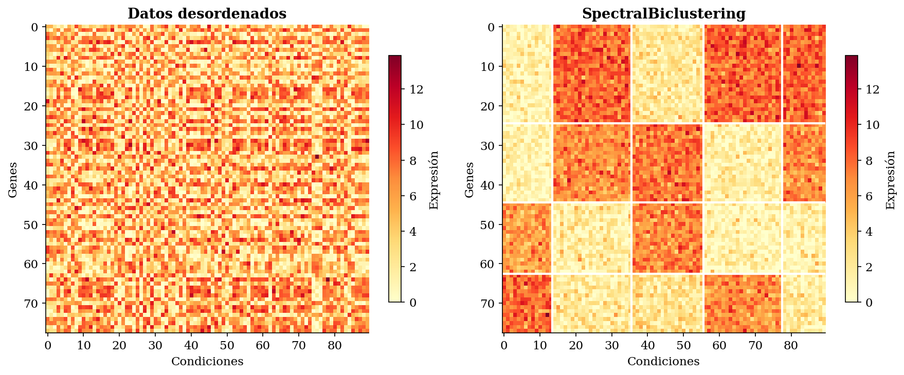


El _co-clustering_ (también llamado _block clustering_) es un término a veces usado como sinónimo de _biclustering_, aunque en algunos contextos se reserva para el caso en que la partición de filas y columnas son mutuamente dependientes, es decir, la asignación de grupos de filas depende de la agrupación de columnas y viceversa. Es decir, en este caso que cada fila y columna corresponde exactamente a un _bicluster_. Esto provoca que la matriz resultante concentre los valores más altos en bloques de su diagonal (ver [](#fig-coclustering)).

Figure: Ejemplo de problema de _co-clustering_, en el que se representa la valoración que hacen los usuarios de diferentes películas. Aplicando _co-clustering_ buscamos definir diferentes perfiles de usuarios, analizando los bloques de la diagonal.   {#fig-coclustering}

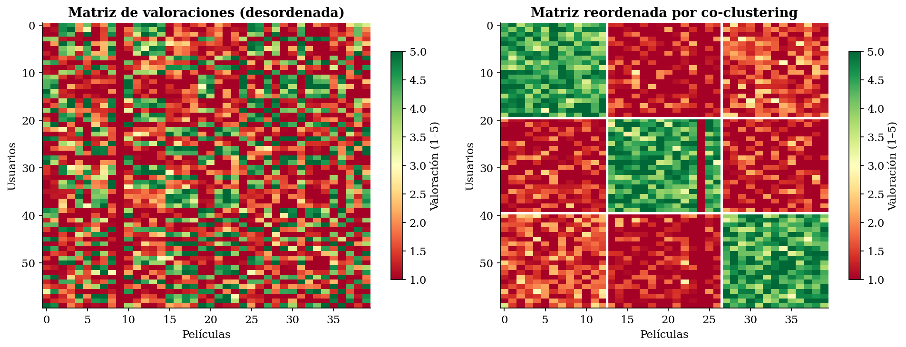

La [](#fig-co-vs-bi) ilustra las diferencias conceptuales entre _bi-clustering_ (derecha) y _co-clustering_ (izquierda). _Bi-clustering_ es un caso más general, donde podemos encontrar bloques parciales o solapados, distribuidos a lo largo de la matriz, mientras que el _co-clustering_ es un caso más concreto en el que tenemos una partición exhaustiva y disjunta, con todos los bloques de agrupaciones en la diagonal de la matriz.

Figure: Comparativa entre _co-clustering_ (izquierda) y _bi-clustering_ (derecha).{#fig-co-vs-bi}

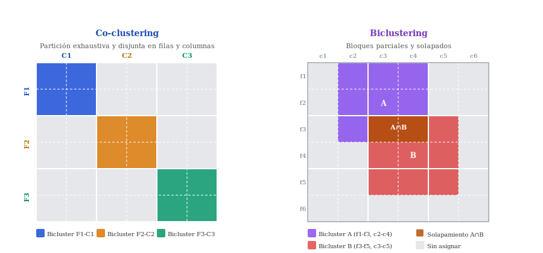

Tanto _biclustering_ como _co-clustering_ son extensiones del _clustering_ espectral al caso bidimensional y no deben confundirse con el _clustering_ espectral estándar, que solo agrupa observaciones.


En _sklearn_ encontramos las implementaciones [`SpectralBiclustering`](https://scikit-learn.org/stable/modules/generated/sklearn.cluster.SpectralBiclustering.html) y [`SpectralCoclustering`](https://scikit-learn.org/stable/modules/generated/sklearn.cluster.SpectralCoclustering.html) de estos métodos.

## Consideraciones finales

En esta sesión hemos visto dos grandes enfoques del _clustering_ que buscan construir una representación auxiliar de los datos (la jerarquía de fusiones en el caso aglomerativo, la proyección espectral en el caso espectral) para luego extraer una partición de ella.

Ambos superan a K-Means en flexibilidad:

- El _clustering_ aglomerativo no requiere especificar $K$ a priori y ofrece toda la jerarquía de posibles particiones
- El _clustering_ espectral detecta formas arbitrarias imposibles para K-Means. 

Pero ninguno de estos métodos escala a millones de puntos.

Conviene recordar también la **elección del linkage** en el _clustering_ aglomerativo, que tiene un efecto tan drástico como la elección del kernel en las SVMs.

En las próximas sesiones estudiaremos dos métodos que abordan las limitaciones restantes de lo visto hasta ahora:

- **DBSCAN** responde a la pregunta "¿qué ocurre cuando los _clusters_ tienen densidades distintas y no sabemos cuántos hay?". Trabaja directamente en el espacio de densidad, no requiere $K$ y detecta _outliers_ de forma natural.

- **GMM (_Gaussian Mixture Models_)** responde a otra pregunta: "¿podemos asignar probabilidades en lugar de etiquetas duras?". Al modelar los datos como una mezcla de gaussianas, GMM produce un _soft clustering_ con base estadística formal, permite _clusters_ elípticos y ofrece criterios estadísticos (BIC, AIC) para elegir $K$.

Juntos, DBSCAN y GMM cubren los casos donde el _clustering_ aglomerativo y el espectral tienen dificultades, como por ejemplo en _datasets_ grandes con formas irregulares y densidades variables, o en situaciones donde la incertidumbre en la asignación es información relevante.


