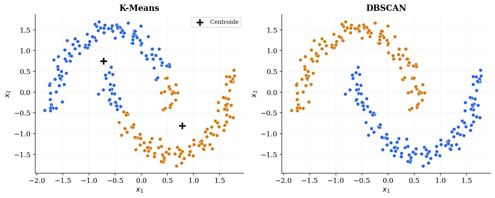
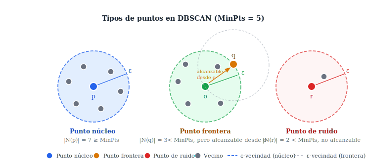
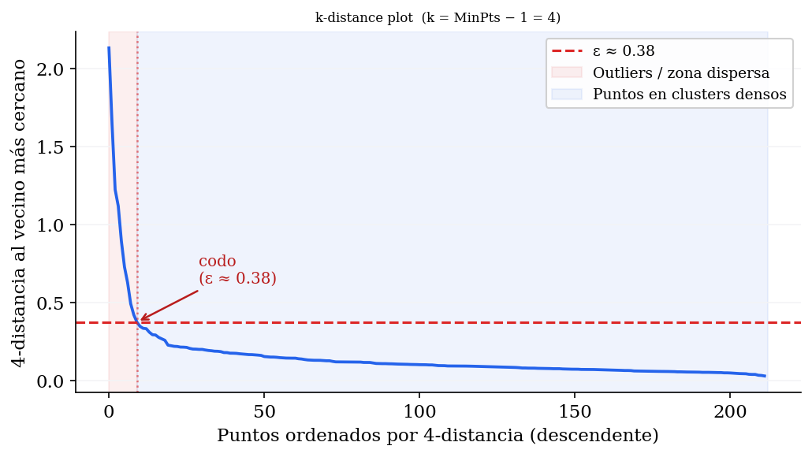
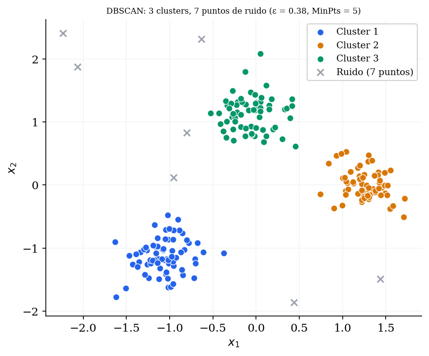
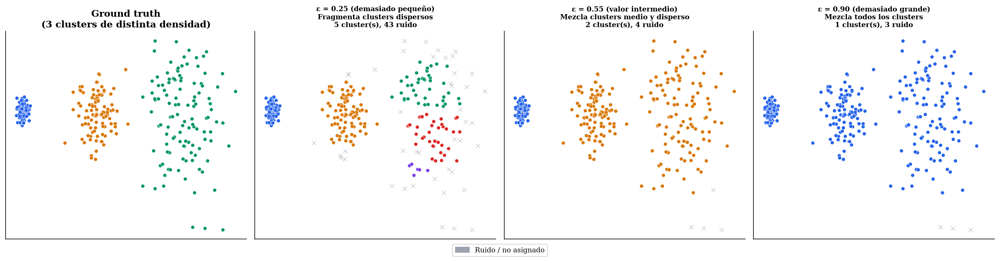
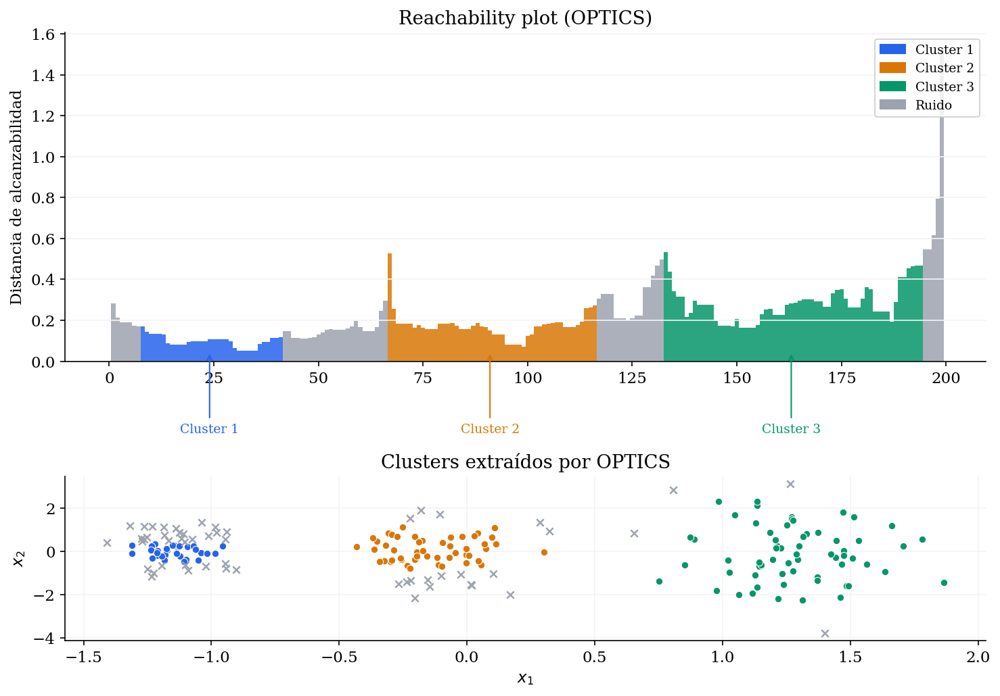
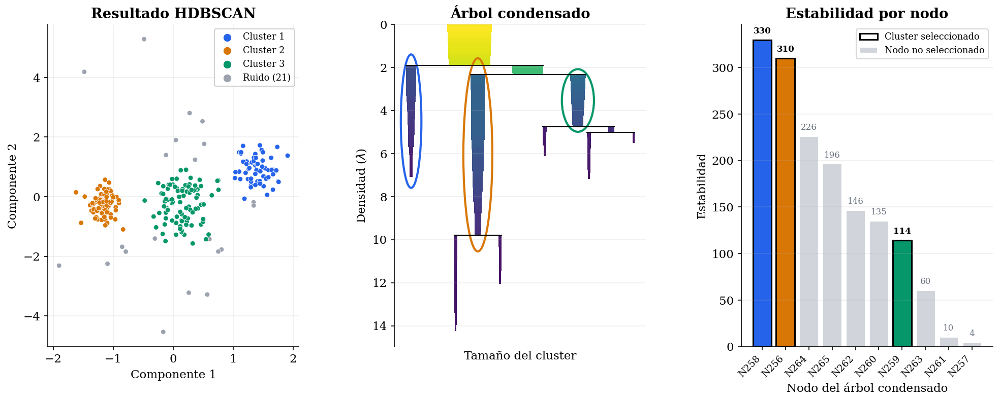
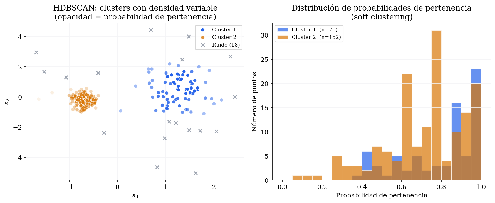
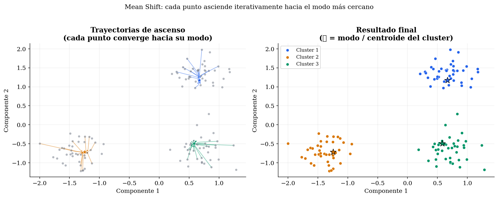
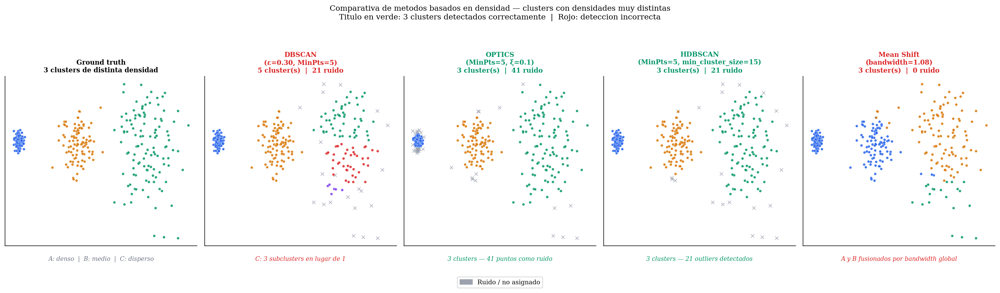

# Clustering Basado en Densidad

En la sesión anterior vimos dos grandes familias de _clustering_: los métodos jerárquicos aglomerativos, que construyen una jerarquía de fusiones, y el _clustering_ espectral, que transforma el espacio de representación mediante teoría de grafos. Ambos superan a K-Means en flexibilidad para representar la forma de los datos, pero los dos tienen una limitación común: asumen implícitamente que los _clusters_ son regiones compactas y bien separadas, y ninguno distingue de forma natural entre puntos que pertenecen a un _cluster_ y puntos que son simplemente ruido.

En muchos problemas reales los datos presentan _clusters_ de **formas arbitrarias y densidades variables**, existiendo además puntos anómalos que no pertenecen a ningún grupo coherente, y ninguno de los métodos anteriores aborda ambos aspectos de forma satisfactoria. En esta sesión estudiaremos el _clustering_ basado en densidad, que parte de una idea radicalmente diferente: definir un _cluster_ no como un conjunto de puntos cercanos a un centroide, sino como una **región densa del espacio de características rodeada de zonas de baja densidad**. Este cambio de perspectiva resuelve simultáneamente la detección de formas arbitrarias y la identificación de ruido.


## DBSCAN

DBSCAN (_Density-Based Spatial Clustering of Applications with Noise_) fue introducido por Ester, Kriegel, Sander y Xu en 1996 [@ester1996density] y recibió en 2014 el premio _Test of Time_ de la conferencia KDD, reconociendo su impacto sostenido en el área. Es el algoritmo de _clustering_ basado en densidad más conocido y la referencia frente a la que se comparan el resto de métodos de esta familia.

En la [](#fig-motivacion) vemos una comparación de K-Means y DBSCAN sobre un problema con formas no convexas (lunas). K-Means, al estar basado en centroides, no es capaz de separarlas correctamente, pero el enfoque basado en densidad de DBSCAN si que es capaz de capturar estas formas. 

Figure: K-Means falla con formas no convexas como las lunas (izquierda). DBSCAN las separa correctamente al trabajar con densidad en lugar de distancia al centroide (derecha) .  {#fig-motivacion}



### Conceptos fundamentales

DBSCAN formaliza la noción de densidad local a través de dos parámetros: $\varepsilon$ (el radio de vecindad) y $\text{MinPts}$ (el número mínimo de puntos para considerar una región como densa). A partir de ellos se define la vecindad de un punto y se clasifican todos los puntos del _dataset_ en diferentes tipos.

Dado un _dataset_ $\mathcal{D} = \{ \mathbf{x}_1, \mathbf{x}_2, \ldots, \mathbf{x}_N \}$ y una función distancia $d(\cdot, \cdot)$, la **$\varepsilon$-vecindad** de un punto $p$ es el conjunto de puntos que se encuentran a distancia menor o igual a $\varepsilon$:

$$N_\varepsilon(p) = \{q \in \mathcal{D} \mid d(p, q) \leq \varepsilon\}$$

A partir de esta vecindad se clasifican los puntos del _dataset_ $\mathcal{D}$ en tres categorías:

- **Punto núcleo (_core point_)**: Los puntos núcleo son los que se encuentran en el interior de una región densa. $p$ es un punto núcleo si su $\varepsilon$-vecindad contiene al menos $\text{MinPts}$ puntos, incluyendo el propio $p$:

$$|N_\varepsilon(p)| \geq \text{MinPts}$$

- **Punto frontera (_border point_)**: Se encuentra en la periferia de una región densa. $p$ no es punto núcleo, pero pertenece a la $\varepsilon$-vecindad de algún punto núcleo. 

- **Punto de ruido (_noise point_)**: Se encuentra en una zona de baja densidad y no pertenece a ningún _cluster_. $p$ no es ni punto núcleo ni punto frontera. 

En la [](#fig-dbscan-tipos) se muestran ejemplos de cada tipo de punto.

Figure: Clasificación de puntos en DBSCAN con $MinPts = 5$. Los puntos núcleo (azul) tienen al menos 5 vecinos en su $\varepsilon$-vecindad. Los puntos frontera (naranja) están en la vecindad de un punto núcleo pero no alcanzan $MinPts$. Los puntos de ruido (rojo) no están en la vecindad de ningún punto núcleo. {#fig-dbscan-tipos}



Para definir qué puntos pertenecen al mismo _cluster_, DBSCAN introduce las nociones de alcanzabilidad por densidad y conectividad por densidad.

Un punto $q$ es **directamente alcanzable por densidad** (_directly density-reachable_) desde $p$ si $p$ es un punto núcleo y $q \in N_\varepsilon(p)$. La alcanzabilidad directa no es simétrica: $q$ puede ser directamente alcanzable desde $p$ sin que $p$ lo sea desde $q$ (si $q$ no es punto núcleo).

Un punto $q$ es **alcanzable por densidad** (_density-reachable_) desde $p$ si existe una cadena de puntos $p_1, p_2, \ldots, p_n$ con $p_1 = p$, $p_n = q$, donde cada $p_{i+1}$ es directamente alcanzable por densidad desde $p_i$. Esta relación tampoco es simétrica.

Dos puntos $p$ y $q$ son **conectados por densidad** (_density-connected_) si existe un punto $o$ tal que tanto $p$ como $q$ son alcanzables por densidad desde $o$. Esta relación sí es simétrica y es la que define la pertenencia al mismo _cluster_.

Un **cluster** en DBSCAN es un conjunto maximal (no se puede extender más sin violar la definición de _cluster_) de puntos mutuamente conectados por densidad. Formalmente, un cluster $C$ satisface:

1. **Maximalidad**: Si $p \in C$ es un punto núcleo y $q$ es alcanzable por densidad desde $p$, entonces $q \in C$.
2. **Conectividad**: todos los puntos de $C$ están mutuamente conectados por densidad.

Podemos determinar con lo anterior que los puntos **no alcanzables** desde ningún otro punto serán los puntos de **ruido**, y no pertenecerán a ningún _cluster_.

### Algoritmo

Con las definiciones anteriores, podemos expresar el algoritmo de la siguiente forma:

<!-- 
$$
\begin{align*}
& \text{Entrada: dataset } \mathcal{D}, \text{ parámetros } \varepsilon, \text{MinPts} \\
& \text{Marcar todos los puntos como no visitados} \\
& \text{Para cada punto } p \in \mathcal{D} \text{ no visitado:} \\
& \quad \text{Marcar } p \text{ como visitado} \\
& \quad N \leftarrow N_\varepsilon(p) \\
& \quad \text{Si } |N| < \text{MinPts}: \text{ marcar } p \text{ como ruido (provisional)} \\
& \quad \text{Si no:} \\
& \quad\quad \text{Crear nuevo cluster } C \\
& \quad\quad \text{ExpandirCluster}(p, N, C, \varepsilon, \text{MinPts}) \\
& \\
& \textbf{ExpandirCluster}(p, N, C, \varepsilon, \text{MinPts}): \\
& \quad \text{Añadir } p \text{ a } C \\
& \quad \text{Para cada punto } q \in N: \\
& \quad\quad \text{Si } q \text{ no fue visitado:} \\
& \quad\quad\quad \text{Marcar } q \text{ como visitado} \\
& \quad\quad\quad N' \leftarrow N_\varepsilon(q) \\
& \quad\quad\quad \text{Si } |N'| \geq \text{MinPts}: N \leftarrow N \cup N' \quad \text{(ampliar la frontera de expansión)} \\
& \quad\quad \text{Si } q \text{ no pertenece aún a ningún cluster: añadir } q \text{ a } C \\
& \text{Devuelve: asignación de clusters y conjunto de puntos de ruido}
\end{align*}
$$
-->

!!! abstract "Algoritmo 1 — DBSCAN"

    **Entrada:** _Dataset_ $\mathcal{D}$, parámetros $\varepsilon$, $\text{MinPts}$   
    **Salida:** Asignación de clusters y conjunto de puntos de ruido  
    <div style="margin-left: 1.5em;">
    Marcar todos los puntos como no visitados <br/>
    Para cada punto $p \in \mathcal{D}$  no visitado: <br/>
    </div>
    <div style="margin-left: 3em;">
    Marcar $p$ como visitado <br/>
    $\mathcal{S} \leftarrow N_\varepsilon(p)$ <br/>
    Si $|\mathcal{S}| < \text{MinPts}$: marcar $p$  como ruido (provisional) <br/>
    Si no: <br/>
    </div>
    <div style="margin-left: 4.5em;">
    Crear nuevo cluster $C$ <br/>
    $\text{ExpandirCluster}(p, \mathcal{S}, C, \varepsilon, \text{MinPts})$ <br/>
    </div>


!!! abstract "Algoritmo 2 — ExpandirCluster"

    **Entrada:** Punto $p$, conjunto de puntos $\mathcal{S}$, _cluster_ $C$, parámetros $\varepsilon$, $\text{MinPts}$   
    **Salida:** Asignación de clusters y conjunto de puntos de ruido  
    <div style="margin-left: 1.5em;">
    Añadir $p$ a $C$ <br/>
    Para cada punto $q \in \mathcal{S}$:<br/>
    </div>
    <div style="margin-left: 3em;">
    Si $q$ no fue visitado:<br/>
    </div>
    <div style="margin-left: 4.5em;">
    Marcar $q$ como visitado <br/>
    $\mathcal{S}' \leftarrow N_\varepsilon(q)$ <br/>
    Si $|\mathcal{S}'| \geq \text{MinPts}: \mathcal{S} \leftarrow \mathcal{S} \cup \mathcal{S}' \quad$ (ampliar la frontera de expansión) <br/>
    </div>
    <div style="margin-left: 3em;">
    Si $q$ no pertenece aún a ningún cluster: añadir $q$ a $C$ <br/>
    </div>


Podemos observar que un punto inicialmente marcado como ruido puede ser añadido a un _cluster_ posteriormente, cuando se procesa algún punto núcleo cercano. Los puntos que permanecen como ruido al finalizar el algoritmo son los verdaderos _outliers_.

> **Nota**: DBSCAN es determinista para los puntos núcleo y los puntos de ruido, pero los puntos frontera alcanzables desde dos _clusters_ distintos tienen una asignación que depende del orden de procesamiento. Este caso es poco frecuente en la práctica pero conviene tenerlo en cuenta al interpretar los resultados.

La **complejidad** del algoritmo es $O(N \cdot \text{coste de la consulta de vecindad})$. Con una estructura de índice espacial adecuada (como un _k-d tree_ o un _ball tree_), la consulta de vecindad cuesta $O(\log N)$ en promedio, dando una complejidad total de $O(N \log N)$. Sin índice espacial la complejidad es $O(N^2)$, lo que lo hace inviable para _datasets_ grandes.

### Selección de parámetros

En la práctica, el principal reto de DBSCAN es la elección adecuada de $\varepsilon$ y $\text{MinPts}$. Una elección incorrecta puede hacer que casi todos los puntos sean ruido (si $\varepsilon$ es demasiado pequeño) o que todos formen un único _cluster_ (si $\varepsilon$ es demasiado grande).

Para **MinPts** existe una guía heurística bien establecida [@ester1996density]: usar $\text{MinPts} \geq d + 1$, donde $d$ es la dimensión del espacio. Un valor común en la práctica es $\text{MinPts} = 2d$. En _datasets_ con ruido considerable conviene aumentar este valor. Podemos destacar que utilizar $\text{MinPts} = 2$ equivale al _clustering_ aglomerativo con _linkage_ de tipo _single_, con corte del dendrograma a la altura $\varepsilon$.  

Para **$\varepsilon$** el método estándar es el _k-distance plot_ [@ester1996density]:

1. Calcular, para cada punto, la distancia a su $k$-ésimo vecino más cercano, tomando $k = \text{MinPts} - 1$.
2. Ordenar estas distancias de mayor a menor y representarlas. Podemos ver un ejemplo de resultado de representación del _k-distance plot_ en la [](#fig-kdistance).
3. Buscar el **codo** (_elbow_) de la curva. El valor de $\varepsilon$ en ese punto es una buena elección, ya que por encima del codo la curva crece bruscamente, lo que indica que estamos alcanzando zonas de baja densidad. 

Figure: K-distance-plot. El codo de la curva señala el valor de $\varepsilon$ más adecuado. En el gráfico se calculan las distancia tomando MinPts=5. El punto más pronunciado del codo corresponde a $\varepsilon=0.38$, por lo que se selecciona ese valor. {#fig-kdistance}



En la [](#fig-resultado-dbscan) podemos observar los resultados que nos proporciona DBSCAN con los valores seleccionados a partir del _k-distance-plot_. Podemos ver que identifica correctamente los $3$ _clusters_.

Figure: Resultado de DBSCAN con los valores seleccionados (`MinPts=5`, $\varepsilon=0.38$).  {#fig-resultado-dbscan}



Para entender por qué el método del codo nos da una buena aproximación, podemos pensar en cómo se distribuyen las $k$-distancias según el tipo de punto. En un _dataset_ con estructura de _clustering_ clara hay tres tipos de puntos con $k$-distancias muy distintas:

- Puntos en el **interior de _clusters_ densos**: Tienen muchos vecinos cerca, así que su $k$-distancia es pequeña. Todos estos puntos tienen $k$-distancias similares entre sí porque la densidad dentro de un cluster es aproximadamente uniforme.
- Puntos en la **frontera de _clusters_**: Tienen algunos vecinos cerca y otros más lejos. Su $k$-distancia es algo mayor que la de los puntos interiores, pero del mismo orden de magnitud.
- **_Outliers_ y puntos de ruido**: Están en zonas dispersas, así que su $k$-ésimo vecino está mucho más lejos. Su $k$-distancia es considerablemente mayor que la de los puntos en _clusters_.

Al ordenar todas las $k$-distancias de mayor a menor, estas tres poblaciones se separan de forma natural en la curva. La parte izquierda de la curva corresponde a los _outliers_, donde tenemos pocas observaciones con $k$-distancias grandes. La curva cae bruscamente porque hay pocos de estos puntos pero con distancias muy superiores al resto, y el codo marca la transición entre _outliers_ y puntos en _clusters_, donde la distribución de $k$-distancias cambia de comportamiento.
La parte derecha corresponde a los puntos en _clusters_, donde hay muchas observaciones con $k$-distancias pequeñas y similares entre sí, formando una zona casi plana.

> **Nota**: Si el _k-distance plot_ no muestra un codo claro, es una señal de que los datos no tienen una estructura de densidad uniforme bien definida. En ese caso, DBSCAN con parámetros globales no es el método más adecuado, y conviene considerar HDBSCAN u OPTICS, que estudiaremos más adelante en esta sesión.


### Ventajas y limitaciones

DBSCAN tiene una serie ventajas sobre los métodos que hemos visto anteriormente:

- No requiere especificar el **número de _clusters_ $K$ a priori**, sino que el número emerge de los datos y los parámetros. 
- Detecta _clusters_ de **formas completamente arbitrarias**, incluyendo no convexas. 
- **Identifica automáticamente los _outliers_** como puntos de ruido. 
- Es **determinista**, salvo empates en la frontera entre _clusters_, y **eficiente** si utilizamos índices espaciales.

Sin embargo, su limitación más importante es la **sensibilidad a _clusters_ de densidad variable**. DBSCAN usa un único par $(\varepsilon, \text{MinPts})$ global, de forma que si los _clusters_ del _dataset_ tienen densidades muy distintas, no existe ningún valor de estos parámetros que funcione bien para todos simultáneamente (ver [](#fig-dbscan-densidad)). Con los parámetros ajustados al _cluster_ denso, el _cluster_ disperso se fragmenta o desaparece como ruido, mientras que con los parámetros ajustados al _cluster_ disperso, el _cluster_ denso se funde en uno solo con sus vecinos.


Figure: Limitación de DBSCAN ante clusters de densidad variable. Ningún valor de $\varepsilon$ separa correctamente los tres clusters. {#fig-dbscan-densidad}



Adicionalmente, DBSCAN funciona mal en **alta dimensionalidad**. La maldición de la dimensionalidad hace que las distancias entre puntos se vuelvan cada vez más uniformes, diluyendo las diferencias de densidad. Por encima de unas pocas decenas de dimensiones es recomendable aplicar reducción de dimensionalidad previa.

### Implementación en sklearn

En sklearn DBSCAN está disponible en [`DBSCAN`](https://scikit-learn.org/stable/modules/generated/sklearn.cluster.DBSCAN.html). Al igual que los métodos jerárquicos, no implementa `predict`, sino que el resultado es una partición del conjunto de entrenamiento. Los puntos de ruido reciben la etiqueta `-1`.

```python
X_scaled = StandardScaler().fit_transform(X)

modelo = DBSCAN(
    eps=0.5,            # Radio de vecindad epsilon
    min_samples=5,      # MinPts: mínimo de puntos para ser core point
    metric='euclidean', # Métrica de distancia
    algorithm='auto'    # Algoritmo para la búsqueda de vecinos: 'auto', 'ball_tree', 'kd_tree', 'brute'
)

etiquetas = modelo.fit_predict(X_scaled)

# Los puntos de ruido reciben etiqueta -1
n_clusters = len(set(etiquetas)) - (1 if -1 in etiquetas else 0)
n_ruido = np.sum(etiquetas == -1)
print(f"Clusters encontrados: {n_clusters}, Puntos de ruido: {n_ruido}")
```

Para construir el _k-distance plot_ y ayudar a seleccionar $\varepsilon$ podemos utilizar el siguiente código:

```python
from sklearn.neighbors import NearestNeighbors
import matplotlib.pyplot as plt

k = 4  # k = MinPts - 1

nn = NearestNeighbors(n_neighbors=k)
nn.fit(X_scaled)
distancias, _ = nn.kneighbors(X_scaled)

# Distancia al k-ésimo vecino de cada punto, ordenada de mayor a menor
k_distancias = np.sort(distancias[:, -1])[::-1]

plt.figure(figsize=(8, 4))
plt.plot(k_distancias)
plt.xlabel('Puntos (ordenados por distancia al k-ésimo vecino)')
plt.ylabel(f'Distancia al {k}-ésimo vecino')
plt.title('K-distance plot')
plt.axhline(y=0.5, color='red', linestyle='--', label='eps = 0.5')
plt.legend()
plt.show()
```

Los parámetros más relevantes son:

- **`eps`**: el radio de vecindad $\varepsilon$. Es el parámetro más crítico. Podemos utilizar el _k-distance plot_ para su selección.
- **`min_samples`**: corresponde a $\text{MinPts}$. Controla cuántos vecinos son necesarios para declarar un punto núcleo. Aumentarlo reduce el número de puntos núcleo y puede dividir los _clusters_ en regiones más densas.
- **`metric`**: la métrica de distancia. Acepta cualquier métrica permitida por [`pairwise_distance`](https://scikit-learn.org/stable/modules/generated/sklearn.metrics.pairwise_distances.html#sklearn.metrics.pairwise_distances) o una función _callable_. Puede usarse `'precomputed'` para pasar una matriz de distancias ya calculada, lo que es útil cuando la distancia es costosa de calcular. Toma `'euclidean'` como valor por defecto.
- **`algorithm`**: nos permite seleccionar la estructura de datos para las consultas de vecindad. `'auto'` (por defecto) elige automáticamente entre `'ball_tree'`, `'kd_tree'` y `'brute'` según las características del _dataset_. Para alta dimensionalidad `'brute'` suele ser más eficiente que los árboles.

## OPTICS

OPTICS (_Ordering Points To Identify the Clustering Structure_) fue propuesto por Ankerst, Breunig, Kriegel y Sander en 1999 [@ankerst1999optics] como una generalización de DBSCAN diseñada específicamente para abordar su limitación ante _clusters_ de densidad variable.

La idea central de OPTICS es no quedarse con un valor fijo de $\varepsilon$, sino en su lugar proporcionar como parámetro un $\varepsilon$ máximo, dejando que el algoritmo se adapte a la densidad de cada _cluster_.

Para detectar _clusters_ con densidad variable, se crea una  **ordenación de los puntos** en la que los puntos espacialmente cercanos sean también vecinos en el ordenamiento, y para cada punto se registra una medida conocida como _reachability distance_ que permite capturar la estructura de densidad a múltiples escalas simultáneamente. La partición en _clusters_ se extrae después, de forma flexible, a partir de ese ordenamiento.

### Distancias en OPTICS

OPTICS introduce dos nuevas definiciones de distancia que generalizan las de DBSCAN: la **distancia núcleo** y la **distancia de alcanzabilidad**. 

La **distancia núcleo** (_core distance_) de un punto $p$ con parámetro $\text{MinPts}$ y vecindad máxima $\varepsilon$ es la distancia al $\text{MinPts}$-ésimo vecino más cercano de $p$:

$$\text{core-dist}_{\varepsilon, \text{MinPts}}(p) = \begin{cases} \text{INDEFINIDA} & \text{si } |N_\varepsilon(p)| < \text{MinPts} \\ d
(p, \text{MinPts-ésimo vecino de } p) & \text{si } |N_\varepsilon(p)| \geq \text{MinPts} \end{cases}$$

Podemos observar que esta distancia no estará definida si en la $\varepsilon$-vecindad de $p$ no hay al menos $\text{MinPts}$ puntos. 

La **distancia de alcanzabilidad** (_reachability distance_) de un punto $q$ con respecto a un punto núcleo $p$ es:

$$\text{reach-dist}_{\varepsilon, \text{MinPts}}(q, p) = \max\bigl(\text{core-dist}_{\text{MinPts}}(p),\; d(p, q)\bigr)$$

Esta definición hace que la distancia de alcanzabilidad nunca pueda ser menor que la distancia núcleo de $p$. Con ello evita que dos puntos muy cercanos dentro de una región densa tengan distancias de alcanzabilidad demasiado pequeñas. Esto nos permite estabilizar el ordenamiento en regiones densas.

Debemos destacar que dado que la distancia de alcanzabilidad depende de la distancia núcleo, tampoco estará definida si no tenemos un _cluster_ con la suficiente densidad, es decir, si no tenemos al menos $\text{MinPts}$ puntos en la $\varepsilon$-vecindad. 

Con valores altos de $\varepsilon$ máximo permitiremos detectar _clusters_ menos densos, pero con un mayor coste computacional, ya que más puntos serán considerados dentro de la $\varepsilon$-vecindad. En la práctica es habitual no limitar el $\varepsilon$ máximo, de forma que puedan considerarse _clusters_ de cualquier densidad. 

### El _reachability plot_

Como hemos comentado, OPTICS produce una secuencia de puntos ordenados. Este orden viene dado por la forma en la que el algoritmo visita los puntos. Para un punto núcleo, visita los $\varepsilon$-vecinos ordenados por distancia, desde los más cercanos hasta los más lejanos, y de esta forma obtendremos una secuencia en la que los puntos espacialmente cercanos aparecerán como consecutivos en el ordenamiento. 

Cada uno de estos puntos tendrá además una distancia de alcanzabilidad con respecto al punto núcleo desde el que fue alcanzado. Si representamos en una gráfica los puntos ordenados en el eje $x$, con su distancia de alcanzabilidad en el eje $y$, obtenemos lo que se conoce como **reachability plot** (ver [](#fig-reachability)).

Figure: Reachability plot producido por OPTICS (arriba) y clusters extraídos (abajo). Los valles corresponden a clusters densos, mientras que los picos indican la transición entre clusters o la presencia de ruido. {#fig-reachability}




De forma intuitiva podemos ver este _reachability plot_ como una especie de dendrograma que nos permite identificar de forma visual qué corte se puede realizar para obtener el particionamiento en _clusters_. En este caso, las regiones de la gráfica con baja distancia de alcanzabilidad corresponderán a zonas densas (_clusters_), mientras que los picos corresponden a zonas de baja densidad (fronteras entre _clusters_ o ruido).

Lo más destacable en este caso es que _clusters_ con diferente densidad aparecerán como valles a diferentes alturas en esta gráfica, lo cual nos permitirá detectarlos todos mediante un único análisis, independientemente de su densidad. 

Para extraer una partición a partir del _reachability plot_ existen varios enfoques:

- Cortar a una altura fija $\varepsilon' < \varepsilon$. Esto equivale a ejecutar DBSCAN con ese $\varepsilon'$, por lo que podemos considerar que OPTICS contiene a DBSCAN como caso especial. Una ventaja que nos proporciona contar con el _reachability plot_, es que una vez obtenido podremos obtener a partir de él cortes a diferentes alturas. Cortar a una altura $\varepsilon'$ hará que todos los puntos por encima de dicha altura sean considerados ruido, y los puntos por debajo serán los pertenecientes a los _clusters_. 
- Usar el algoritmo $\xi$ (`'xi'`, implementado en _sklearn_). Detecta automáticamente los valles significativos basándose en cambios relativos de la distancia de alcanzabilidad. Este enfoque adapta el umbral localmente y es capaz de detectar _clusters_ de densidades muy distintas. Para ello el método necesita recibir un umbral relativo $\xi$ que busca pares de puntos consecutivos en la ordenación en los que la diferencia relativa entre distancias de alcanzabilidad supere dicho umbral $\xi$. Es decir, buscamos bajadas y subidas bruscas en el _reachability plot_. Un _cluster estará delimitado por una bajada brusca (donde empieza el valle) y una subida brusca (donde termina el valle.)

> **Nota:** El algoritmo $\xi$ no forma parte del algoritmo original de OPTICS de 1999, sino que se añadió de forma posterior como método para extraer los _clusters_ del _reachability plot_. 

### Implementación en sklearn

En sklearn OPTICS está disponible en [`OPTICS`](https://scikit-learn.org/stable/modules/generated/sklearn.cluster.OPTICS.html):

```python
modelo = OPTICS(
    min_samples=5,          # MinPts
    max_eps=np.inf,         # Radio máximo considerado (np.inf = sin límite)
    cluster_method='xi',    # Método de extracción de clusters: 'xi' o 'dbscan'
    xi=0.05,                # Parámetro del método xi: mínimo cambio relativo para detectar un valle
    min_cluster_size=0.05,  # Tamaño mínimo de cluster (fracción del total o número absoluto)
    metric='euclidean',
    n_jobs=-1
)

modelo.fit(X_scaled)

# Reachability plot
plt.figure(figsize=(10, 4))
plt.bar(range(len(modelo.reachability_[modelo.ordering_])),
        modelo.reachability_[modelo.ordering_],
        width=1.0, color='steelblue', edgecolor='none')
plt.ylabel('Reachability distance')
plt.xlabel('Puntos (en orden OPTICS)')
plt.title('Reachability plot')
plt.show()

# Etiquetas de cluster (los puntos de ruido reciben -1)
etiquetas = modelo.labels_
```

Los parámetros más relevantes son:

- **`min_samples`**: equivalente a $\text{MinPts}$ en DBSCAN. Controla la densidad mínima para que un punto sea núcleo.
- **`max_eps`**: radio máximo $\varepsilon$ considerado en las consultas de vecindad. Reducirlo acelera el cálculo pero puede limitar la detección de _clusters_ dispersos. Por defecto no tiene límite.
- **`cluster_method`**: Podemos utilizar `'xi'` para realizar un particionamiento automático adaptativo (opción recomendada y por defecto), o `'dbscan'` para realizar un corte a una altura fija $\varepsilon' < \varepsilon$, equivalente a ejecutar DBSCAN.
- **`xi`**: sensibilidad del método de extracción `xi`. Valores más pequeños detectan más _clusters_ (incluidos los muy pequeños o poco pronunciados), mientras que valores más grandes son más conservadores.

## HDBSCAN

HDBSCAN (_Hierarchical DBSCAN_) fue propuesto por Campello, Moulavi y Sander en 2013 [@campello2013density] y en la última década se ha convertido en la opción preferida frente a DBSCAN en la mayoría de aplicaciones prácticas. Su objetivo principal, al igual que OPTICS, es **eliminar la necesidad de especificar $\varepsilon$**, que es el parámetro más difícil de ajustar en DBSCAN. Sin embargo, OPTICS y HDBSCAN presentan enfoques muy diferentes. OPTICS aborda este problema mediante la construcción del _reachability plot_, y requiere un segundo paso para realizar el particionamiento a partir del análisis de ese gráfico (por ejemplo el método $\xi$ o corte a altura $\varepsilon'$). El método HDBSCAN produce de forma automática una jerarquía de _clusters_ que captura la estructura del _dataset_ a múltiples escalas de densidad, e incluye la extracción de _clusters_ como un paso dentro del propio algoritmo.

La idea de HDBSCAN es extender DBSCAN para convertirlo en un algoritmo de _clustering_ jerárquico, que nos permita representar estructuras con diferentes niveles de densidad, y extraer un particionamiento a partir de dicha jerarquía. A continuación describimos los pasos que realiza este algoritmo.

### Distancia de alcanzabilidad mútua

HDBSCAN introduce la **distancia de alcanzabilidad mutua** (_mutual reachability distance_), definida de la siguiente forma:

$$d_{\text{mreach}}(p, q) = \max\bigl(\text{core-dist}_k(p),\; \text{core-dist}_k(q),\; d(p, q)\bigr)$$

Donde $k$ es un parámetro equivalente a $\text{MinPts}$. Esta distancia suaviza el espacio de distancias originales, ya que dos puntos en regiones de alta densidad tendrán una distancia mutua que refleja la densidad de su entorno, no solo su proximidad directa. Esto hace el algoritmo más robusto al ruido.

Calcularemos la distancia de alcanzabilidad mútua para cada par de puntos en el conjunto de entrada.

### Construcción del _Minimum Spanning Tree_

A partir de las distancias de alcanzabilidad mutua tendremos un grafo completo entre todos los puntos de entrada, en el que cada par de puntos $(p,q)$ estarán conectados con una arista con peso $d_{\text{mreach}}(p, q)$. Construiremos el _minimum spanning tree_ (MST) de este grafo completo utilizando el algoritmo de Prim o Kruskal, quedándonos con las $N-1$ aristas que conecten los $N$ puntos de entrada con el mínimo peso total posible. 

El MST nos proporciona un esqueleto mínimo de conectividad entre puntos. Una propiedad fundamental es que captura los cuellos de botella en la estructura de densidad. Es decir, cuando tenemos dos _clusters_ separados por una zona de baja densidad, la arista que los conecta tendrá un peso alto, mientras que los puntos en una región densa estarán conectados por aristas con bajo peso. Es decir, los _clusters_ naturales serán los subárboles que quedarán al eliminar aristas largas (de elevado peso).

### Construcción del dendrograma

Partiremos de los puntos individuales como hojas del dendrograma. A partir de esas hojas recorreremos las aristas del MST en orden de peso creciente, y cada arista fusionará dos componentes. En un primer nivel se fusionarán los puntos individuales conectados por la arista, pero conforme vayamos contando con agrupaciones más grandes que contengan diferentes puntos, la arista seleccionada podrá fusionar agrupaciones. Las fusiones se producirán a la altura del dendrograma correspondiente al peso de la arista (distancia de alcanzabilidad). El nodo raíz de la jerarquía corresponderá a la arista con mayor peso.

### Condensación del árbol

La jerarquía completa puede ser muy compleja, ya que pequeñas variaciones en la densidad producen muchas fusiones irrelevantes. 

HDBSCAN simplifica esta jerarquía introduciendo un parámetro `min_cluster_size`, que produce que un _cluster_ solo se mantenga como entidad diferenciada si tiene al menos ese número de puntos. Es decir, cuando una bifurcación divide un _cluster_ en dos partes y una de ellas tiene menos de ese mínimo número de puntos, se considerará que esos puntos se convierten en ruido potencial y el _cluster_ continuará sin dividirse (solo pierde puntos a esa altura del dendrograma). Sólo cuando ambas partes superen el mínimo número de puntos se registrará como verdadera la bifurcación.

El resultado es un **árbol condensado** con muchas menos ramas que el dendrograma original, donde solo aparecen los _clusters_ significativos (ver [](#fig-hdbscan-tree)).

Figure: Clustering HDBSCAN (izquierda), árbol condensado (centro) y estabilidad de los clusters (derecha). En el árbol condensado cada rama representa un cluster que persiste a lo largo de un rango de densidades. La altura de cada nodo indica la densidad a la que se produce la separación. Aparecen resaltados en el árbol los nodos correspondientes a los clusters seleccionados en el resultado final. Podemos ver también representada la estabilidad de cada nodo del árbol en orden descendente, y resaltada la estabilidad de cada uno de los clusters seleccionados. {#fig-hdbscan-tree}



### Extracción de clusters

Para seleccionar la partición óptima del árbol condensado, de forma intuitiva buscaremos _clusters_ que persistan durante más tiempo en la estructura del árbol condensado.  

Con el objetivo de formalizar esta idea, para cada cluster $C$ en el árbol condensado se define su **estabilidad** como la suma de persistencias de sus puntos, es decir, el tiempo que pertenece cada punto en el _cluster_ a medida que aumenta la densidad mínima requerida.

Considerando $\lambda = \frac{1}{d_{\text{mreach}}}$ como la densidad, definimos $\lambda_{\min}(C)$ como la densidad con la que se crea el _cluster_ $C$, y $\lambda_{\max}(p,C)$ la densidad en la que el punto $p$ cae del _cluster_, bien porque se ha convertido en ruido o bien por una bifurcación. Con esto, definimos la estabilidad del _cluster_ $C$ como:

$$
\text{estabilidad}(C) = \sum_{p \in C} (\lambda_{\max}(p,C)-\lambda_{\min}(C))
$$

Es decir, tendrán más estabilidad aquellos _clusters_ que retengan más puntos durante más tiempo en el árbol condensado (aquellos que ocupen mayor área en el diagrama).

La extracción de _clusters_ se convierte en un problema de optimización sobre el árbol condensado. Se buscará hacer la selección que maximice la estabilidad total, con la restricción de que si se selecciona un nodo no se podrán seleccionar ningún descendiente en el árbol. El algoritmo recorre el árbol desde las hojas hasta la raíz:

- Si la estabilidad de un _cluster_ es mayor que la suma de estabilidades de sus hijos, se selecciona ese _cluster_ y se descartan los hijos. 
- Si la suma de los hijos es mayor, se propagan los hijos hacia arriba y se descarta el padre. 

Los puntos que no pertenezcan a ningún _cluster_ seleccionado serán considerados ruido.

Este proceso es completamente automático: no requiere especificar $\varepsilon$ ni el número de clusters. El único parámetro fundamental es `min_cluster_size`.

### Probabilidad de pertenencia

Como consecuencia del cálculo de la estabilidad, HDBSCAN produce de forma natural una probabilidad de pertenencia para cada punto (_soft clustering_). Este valor se obtendrá del cociente entre $\lambda_{\max} (p, C)$ (densidad hasta la que el punto $p$ permanece en el _cluster_ $C$) y $\lambda_{\max}^* (C)$ (la máxima densidad observada en dicho _cluster_ $C$). 

En la [](#fig-soft-hdbscan) se muestra un ejemplo de _clusters_ obtenidos por HDBSCAN y la probabilidad de pertenencia de cada punto. 

Figure: Ejemplo de _clusters_ producidos por HDBSCAN y probabilidad de pertenencia obtenida (izquierda), y distribución de probabilidades de pertenencia de cada _cluster_ (derecha).  {#fig-soft-hdbscan}




### Implementación

HDBSCAN está disponible en _sklearn_ desde la versión 1.3, y también en el paquete independiente `hdbscan` que incluye funcionalidades adicionales:

```python
modelo = HDBSCAN(
    min_cluster_size=10,    # Tamaño mínimo para que un grupo sea considerado cluster (condensación)
    min_samples=5,          # Equivalente a MinPts/k: controla la robustez al ruido
                            # (por defecto igual a min_cluster_size)
    cluster_selection_method='eom',  # Método de selección: 'eom' (excess of mass) o 'leaf'
    allow_single_cluster=False       # Si True, permite que toda la muestra forme un único cluster
)

etiquetas = modelo.fit_predict(X_scaled)

# Probabilidades de pertenencia (soft clustering)
probabilidades = modelo.probabilities_
print(f"Clusters: {len(set(etiquetas)) - (1 if -1 in etiquetas else 0)}")
print(f"Ruido: {(etiquetas == -1).sum()}")
```

Los parámetros más relevantes son:

- **`min_cluster_size`**: (condensación) el único parámetro verdaderamente crítico. Define cuántos puntos debe tener un grupo para ser considerado un _cluster_. Valores pequeños producen muchos _clusters_ pequeños, mientras que valores grandes los fusionan en estructuras más gruesas.
- **`min_samples`**: (alcanzabilidad) controla la robustez del algoritmo respecto al ruido. Aumentarlo hace que más puntos sean clasificados como ruido. Si no se especifica, toma el valor de `min_cluster_size`.
- **`cluster_selection_method`**: (extracción de _clusters_). Puede tomar como valor `'eom'` (_Excess of Mass_, por defecto), que selecciona _clusters_ maximizando la persistencia con el método que hemos visto, o  `'leaf'` que selecciona siempre las hojas del árbol condensado, produciendo _clusters_ más pequeños y granulares.

## Mean Shift

Mean Shift [@comaniciu2002mean] aborda el _clustering_ desde una perspectiva complementaria a DBSCAN: en lugar de definir _clusters_ como regiones conectadas por densidad, los define como las **cuencas de atracción** de los máximos locales (modos) de una función de densidad estimada. El resultado es similar, tendremos _clusters_ como zonas densas del espacio, pero el mecanismo es totalmente distinto.

El resultado tiene también una analogía superficial con K-Means, ya que cada _cluster_ queda representado por un centroide (el modo), pero a diferencia de K-Means, el número de _clusters_ y la posición de los modos no se especifican _a priori_ sino que emergen de los datos. Por este motivo, en algunos documentos encontraremos Mean Shift englobado en la familia de métodos basados en centroide, junto a K-Means, aunque lo más habitual es encontrarlo agrupado como método basado en densidad.

### Estimación de densidad

Dado un conjunto de puntos $\{ \mathbf{x}_1, \mathbf{x}_2, \ldots, \mathbf{x}_N \}$, una estimación de densidad asigna a cada punto un valor que estima cómo de densa es su vecindad. 

El estimador más común es el _Kernel Density Estimator_ (KDE), que sitúa una función _kernel_ centrada en cada punto y las suma:

$$
\hat{f}(\mathbf{x}) = \frac{1}{Nh^d} \sum_{j=1}^N K\!\left(\frac{\mathbf{x} - \mathbf{x}_j}{h}\right) 
$$

Siendo $d$ la dimensionalidad del espacio de características, $h$  un parámetro que controlará el ancho de banda que controla el suavizado (análogo a $\varepsilon$ en DBSCAN) y $K$ una función _kernel_. Habitualmente se utiliza una función _kernel_ gaussiana (equivalente al _kernel_ RBF en SVM), con la siguiente forma:

$$
K(\mathbf{u}) = \exp\left(-\frac{\|\mathbf{u}\|^2}{2}\right)
$$

Si sustituimos la función _kernel_ en la función de estimación tenemos:

$$
\hat{f}(\mathbf{x}) = \frac{1}{Nh^d} \sum_{j=1}^N exp\!\left(-\frac{\|\mathbf{x} - \mathbf{x}_j\|^2}{2h^2}\right) 
$$

Con esto podemos interpretar que en esta función cada punto $\mathbf{x}_i$ contribuye a la densidad estimada en $\mathbf{x}$ con un peso que decrece exponencialmente con la distancia (una campana gaussiana centrada en $\mathbf{x}_i$). Se recibirá una contribución alta de puntos cercanos y baja de puntos lejanos. Con el parámetro $h$ controlamos la influencia de cada punto. Con un valor pequeño de $h$ cada punto contribuirá solo en su vecindad más inmediata, mientras que con $h$ grande contribuirá sobre una región más amplia, suavizando la superficie de densidad y produciendo pocos máximos locales y por lo tanto _clusters_ grandes. 


### El algoritmo

Mean Shift estima de forma implícita la densidad de los datos como hemos indicado en el punto anterior, y busca sus máximos locales (modos) ascendiendo iterativamente por el gradiente de esa densidad desde cada punto.

Para ello, va desplazando iterativamente los puntos $\mathbf{x}_i$ hacia las zonas cercanas con mayor densidad, utilizando la función _kernel_ definida anteriormente. Podemos ver este funcionamiento en el siguiente algoritmo:

<!-- 
$$
\begin{align*}
& \text{Inicializar: para cada punto } x_i, \text{ establecer } \mathbf{x}_i^{(0)} \leftarrow \mathbf{x}_i \\
& \text{Repetir hasta convergencia:} \\
& \quad m(\mathbf{x}_i^{(t)}) \leftarrow \frac{\sum_{j} K\!\left(\frac{\mathbf{x}_i^{(t)} - \mathbf{x}_j^{(t)}}{h}\right) \mathbf{x}_j}{\sum_{j} K\!\left(\frac{\mathbf{x}_i^{(t)} - \mathbf{x}_j^{(t)}}{h}\right)} \quad \text{(Desplazamiento para cada punto)} \\
& \quad \mathbf{x}_i^{(t+1)} \leftarrow m(\mathbf{x}_i^{(t)}) \quad \text{(Actualizamos las posiciones)} \\
& \text{Agrupar los puntos que han convergido al mismo modo}
\end{align*}
$$
-->

!!! abstract "Algoritmo 3 — Mean Shift"

    **Entrada:** _Dataset_ $\mathcal{D}= \{ \mathbf{x}_1, \mathbf{x}_2, \ldots, \mathbf{x}_N \}$, ancho de banda $h$   
    **Salida:** Asignación de clusters  
    <div style="margin-left: 1.5em;">
    Repetir hasta convergencia: <br/>
    </div>
    <div style="margin-left: 3em;">
    $m(\mathbf{x}_i) \leftarrow \frac{\sum_{j} K\!\left(\frac{\mathbf{x}_i - \mathbf{x}_j}{h}\right) \mathbf{x}_j}{\sum_{j} K\!\left(\frac{\mathbf{x}_i - \mathbf{x}_j}{h}\right)} \quad \forall \mathbf{x}_i \in \mathcal{D}$ <br/>
    $\mathbf{x}_i \leftarrow m(\mathbf{x}_i) \quad \forall \mathbf{x}_i \in \mathcal{D}$ <br/>
    </div>
    <div style="margin-left: 1.5em;">
    Agrupar los puntos que han convergido al mismo modo <br/>
    </div>


El desplazamiento en cada iteración (la diferencia $m(\mathbf{x}_i) - \mathbf{x}_i$) es lo que da nombre al algoritmo: _mean shift_ (desplazamiento hacia la media). Se puede demostrar que este desplazamiento es proporcional al gradiente de la estimación de densidad por _kernel_, por lo que el algoritmo implementa un ascenso de gradiente en la superficie de densidad. Podemos ver este comportamiento ilustrado en la [](#fig-meanshift).

Figure: Trayectorias de convergencia de Mean Shift. Cada punto asciende hacia el modo más cercano. Los colores indican el cluster al que converge cada punto. {#fig-meanshift}



### Parámetro bandwidth y relación con GMM

El único parámetro de Mean Shift es $h$ (`bandwidth`), que controla el ancho del _kernel_ gaussiano. Valores pequeños de este parámetro producen una estimación de densidad muy local y muchos modos (_clusters_ pequeños y numerosos), mientras que valores grandes suavizan la densidad y producen pocos _clusters_ de mayor tamaño.

Podemos establecer una relación entre Mean Shift y GMM, que estudiaremos en la siguiente sesión, ya que ambos estiman la densidad de los datos y definen _clusters_ a partir de esa estimación. A diferencia de Mean Shift, GMM lo hace de forma paramétrica, asumiendo una mezcla de gaussianas y ajustando sus parámetros con el algoritmo EM, mientras que Mean Shift lo hace de forma no paramétrica, estimando la densidad con un _kernel_ sin asumir ninguna forma funcional. La ventaja de Mean Shift es que no requiere especificar el número de _clusters_, pero tiene como  desventaja que es computacionalmente más costoso ($O(N^2)$ por iteración) y sensible al parámetro `bandwidth`.

### Implementación en sklearn

```python
from sklearn.cluster import MeanShift, estimate_bandwidth

# Estimar bandwidth automáticamente a partir de los datos
bandwidth = estimate_bandwidth(X_scaled, quantile=0.2, n_samples=500)

modelo = MeanShift(
    bandwidth=bandwidth,    # Ancho del kernel gaussiano
    bin_seeding=True       # Acelera el cálculo inicializando en una malla
)

etiquetas = modelo.fit_predict(X_scaled)
centros = modelo.cluster_centers_
print(f"Clusters encontrados: {len(centros)}")
```

La función `estimate_bandwidth` estima automáticamente el valor de `bandwidth` a partir de la distribución de distancias en el _dataset_. Usando el cuantil indicado (`quantile=0.2`), considera el 20% de los puntos más cercanos para calcular el ancho. Puede ser un buen punto de partida, aunque podría requerir ajuste manual.

> **Nota sobre escalabilidad**: Mean Shift tiene complejidad $O(N^2)$ por iteración, lo que lo hace inviable para _datasets_ grandes. Para más de unas decenas de miles de puntos es preferible HDBSCAN, que es más rápido y tiene propiedades igual de robustas.


## Consideraciones finales

Los métodos basados en densidad aportan un enfoque alternativo al de los métodos jerárquicos y espectrales, ya que en lugar de buscar particiones que minimicen varianzas o cortes en grafos, buscan la estructura intrínseca del espacio de densidad. Todos los métodos de esta familia comparten tres ventajas principales:

- No requieren $K$ a priori, 
- Detectan formas arbitrarias
- Identifican el ruido

Esto hace que estos métodos sean especialmente valiosos en exploración de datos sin hipótesis previas.

De entre todos ellos, **HDBSCAN es actualmente la opción más recomendable en la práctica**, ya que supera a DBSCAN en robustez (elimina $\varepsilon$ y maneja densidad variable), a OPTICS en facilidad de uso (no requiere interpretar el _reachability plot_ manualmente) y a Mean Shift en escalabilidad. La distinción entre DBSCAN, OPTICS y HDBSCAN no es arbitraria, sino que cada uno responde a una limitación específica del anterior, y entender esa cadena de mejoras es la forma más clara de comprender por qué HDBSCAN toma las decisiones de diseño que toma.

En la [](#fig-comparativa) podemos ver una comparativa de los resultados obtenidos por los diferentes métodos basados en densidad estudiados sobre un problema con $3$ _clusters_ de densidad variable. Podemos comprobar como OPTICS y HDBSCAN obtienen el mejor resultado, ya que son enfoques que han sido diseñados específicamente para ser capaces de manejar densidad variable. 

Figure: Comparativa de métodos basados en densidad en un problema con _clusters_ con densidad variable. {#fig-comparativa}



La siguiente tabla resume las principales características de cada método:

| | DBSCAN | OPTICS | HDBSCAN | Mean Shift |
|---|---|---|---|---|
| **Parámetros clave** | $\varepsilon$, MinPts | MinPts, $\xi$ | MinPts, min\_cluster\_size | bandwidth |
| **Requiere $K$** | No | No | No | No |
| **Densidad variable** | No | Sí | Sí | Parcial* |
| **Soft clustering** | No | No | Sí | No |
| **Outliers** | Explícito | Explícito | Explícito | Implícito |
| **Complejidad** | $O(N \log N)$ | $O(N \log N)$ | $O(N \log N)$ | $O(N^2)$ por iter. |
| **Escalabilidad** | Buena | Buena | Buena | Mala |

> (*) Mean Shift maneja densidad variable de forma limitada. Al usar un ancho de banda $h$ global, _clusters_ con densidades muy distintas pueden requerir valores de $h$ incompatibles, de forma análoga al problema de $\varepsilon$ en DBSCAN.


Una limitación que comparten todos los métodos estudiados en esta sesión es la **maldición de la dimensionalidad**. En alta dimensión las diferencias de densidad se difuminan y los conceptos de vecindad pierden significado. Si los datos tienen más de unas pocas decenas de dimensiones, es recomendable aplicar reducción de dimensionalidad (PCA, UMAP) antes de aplicar _clustering_ basado en densidad.

En la sesión siguiente estudiaremos los **Gaussian Mixture Models (GMM)**, que abordan el _clustering_ desde una perspectiva  completamente diferente. En lugar de definir _clusters_ por densidad geométrica, GMM modela explícitamente que los datos han sido generados por una mezcla de distribuciones gaussianas. Esto proporciona tres ventajas que los métodos de esta sesión no tienen: 

- Asignación probabilística: tendremos _soft clustering_ con una base estadística bien fundamentada
- _Clusters_ elípticos de orientación arbitraria
- Criterios estadísticos formales (BIC, AIC) para elegir $K$. 

El mecanismo de ajuste (el algoritmo EM) es uno de los algoritmos más importantes y versátiles del aprendizaje automático, con aplicaciones que van mucho más allá del _clustering_.
