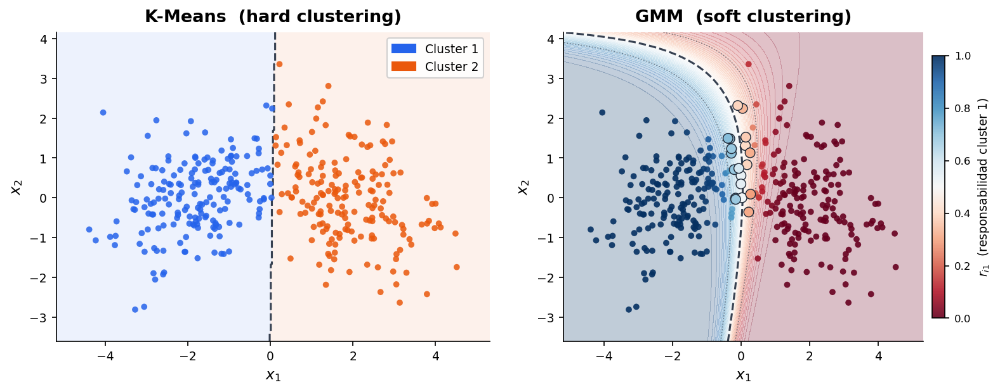
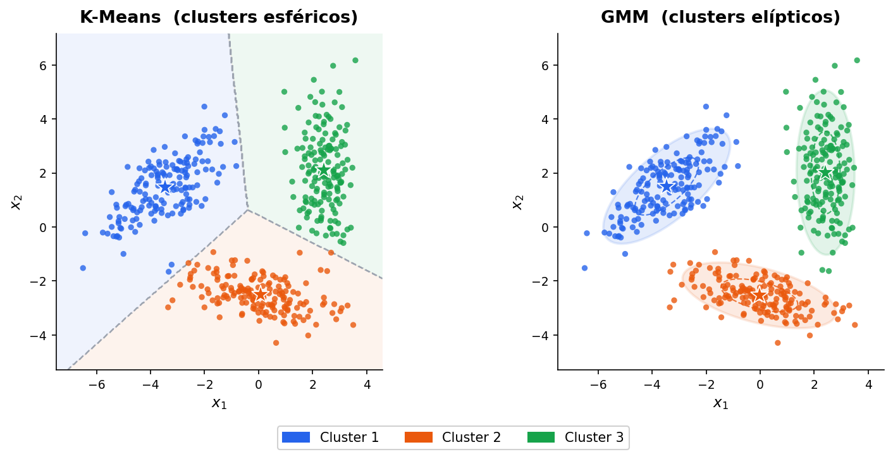
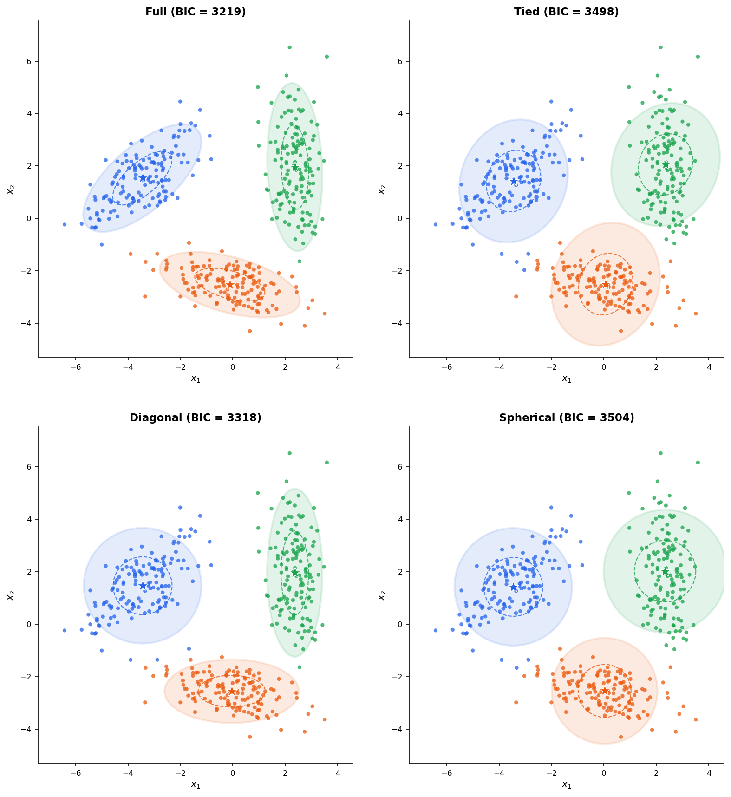
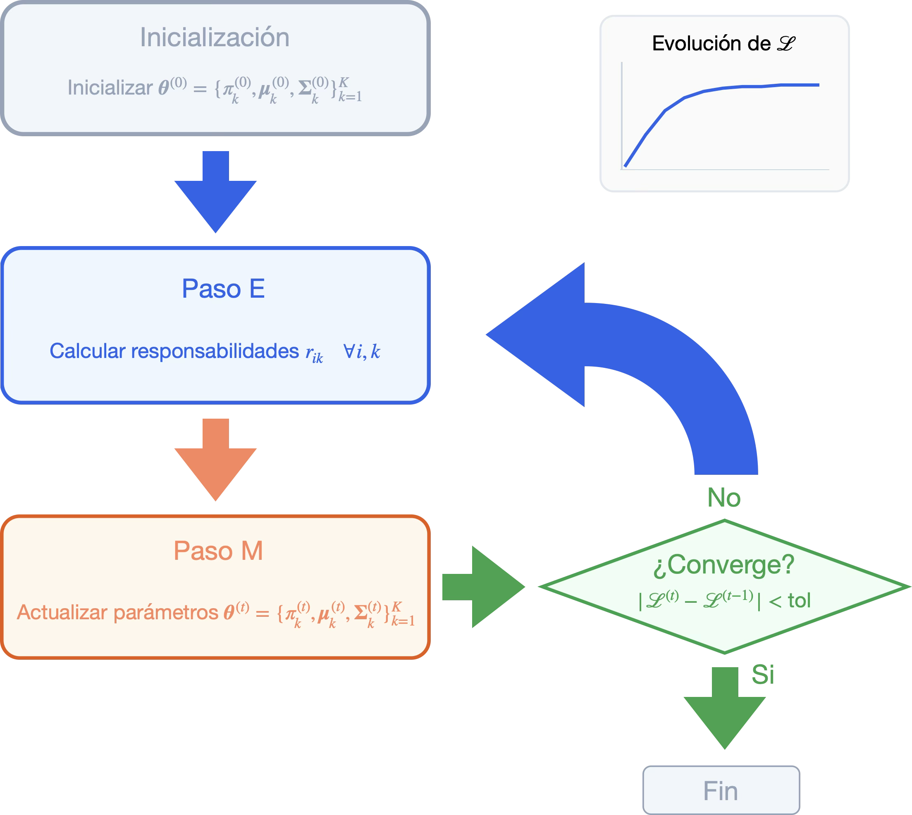
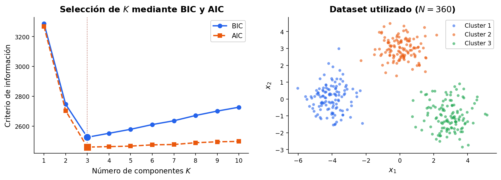
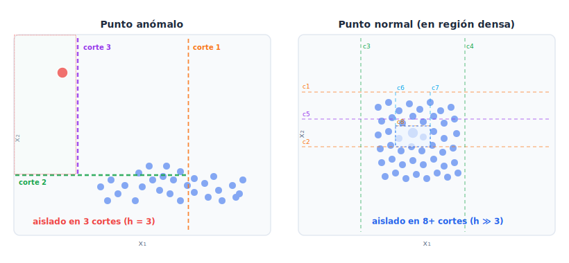
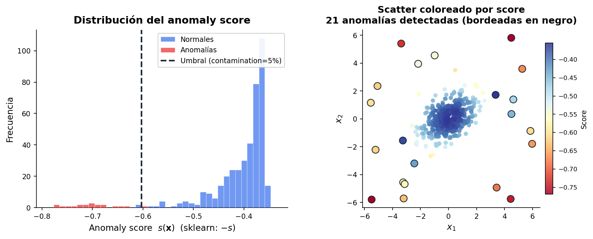
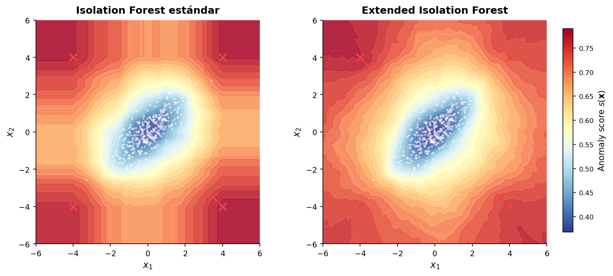

# Gaussian Mixture Models

En las sesiones anteriores hemos visto métodos de _clustering_ que producen asignaciones _hard_ en las que cada punto pertenece exactamente a un _cluster_. Esta clasificación en "dentro" o "fuera" es una simplificación que puede ser problemática cuando los _clusters_ se solapan, cuando un punto se encuentra en la frontera entre dos grupos, o cuando nos interesa cuantificar la incertidumbre en la asignación. Un punto a igual distancia de dos centroides de K-Means recibe una etiqueta arbitraria y no hay forma de saber si esa asignación es segura o completamente ambigua.


Los _Gaussian Mixture Models_ (GMM) resuelven esto mediante un planteamiento estadístico, en el que en lugar de buscar particiones geométricas, se modela explícitamente que los datos han sido **generados por una mezcla de distribuciones gaussianas**. Cada _cluster_ corresponde a una componente gaussiana, y la asignación de un punto a un _cluster_ es una probabilidad, no una etiqueta binaria. Esta diferencia de _"hard"_ a _"soft" clustering_ es el cambio conceptual central que abordaremos en esta sesión.

Más allá del _clustering_, los GMM son un modelo de estimación de densidad de probabilidad de propósito general. El algoritmo que los ajusta es conocido como el algoritmo EM (_Expectation-Maximization_), y constituye una destacable contribución dentro del campo del aprendizaje automático. Tiene múltiples aplicaciones además del ajuste de los GMM, como por ejemplo aplicaciones en la imputación de datos faltantes o en los Modelos Ocultos de Markov (HMM).

## Del _hard_ al _soft clustering_

En K-Means, la asignación de cada punto $\mathbf{x}_i$ a un _cluster_ queda recogida en una variable discreta $z_i \in \{1, \ldots, K\}$. Se trata de un variable **latente**, es decir, no la observamos, el algoritmo la infiere junto con los centroides.

En un GMM la misma variable latente $z_i$ existe, pero en lugar de asignarle un valor fijo, mantenemos una **distribución de probabilidad sobre ella**, siendo $p(z_i = k \mid \mathbf{x}_i)$ la probabilidad de que el punto $\mathbf{x}_i$ haya sido generado por la componente $k$. El resultado es un vector de $K$ probabilidades para cada punto, denominado vector de **responsabilidades**. 

De esta forma, en un caso con $K = 3$ _clusters_, un determinado punto $\mathbf{x}_i$ podrá tener por ejemplo una probabilidad de $0.6$ de pertenecer al _cluster_ $1$, $0.25$ de pertenecer al _cluster_ $2$ y $0.15$ de pertenecer al cluster $3$, siendo su vector de responsabilidades $\mathbf{r}_i = [0.6, 0.25, 0.15]$ (nótese que este vector debe sumar $1$).

Figure: Comparación entre K-Means (_hard clustering_) y GMM (soft _clustering_). K-Means asigna cada punto a un único _cluster_ mientras que GMM asigna una probabilidad de pertenencia a cada _cluster_. Los puntos en la frontera tienen distribuciones de responsabilidades más inciertas. {#fig-hard-vs-soft}




Esta diferencia no tiene únicamente interés teórico, sino que tiene importantes repercusiones en la práctica. El _soft clustering_ permite:

- Capturar la incertidumbre en puntos frontera, que K-Means asignaría arbitrariamente (ver [](#fig-hard-vs-soft)).
- Modelar _clusters_ solapados, donde un punto puede pertenecer parcialmente a dos grupos.
- Obtener una estimación de la densidad de probabilidad de los datos, no solo una partición.
- Usar criterios estadísticos formales (BIC, AIC) para seleccionar el número de _clusters_.

## El modelo probabilístico

Un GMM con $K$ componentes define la siguiente distribución de probabilidad sobre los datos:

$$p(\mathbf{x}) = \sum_{k=1}^{K} \pi_k \, \mathcal{N}(\mathbf{x} \mid \boldsymbol{\mu}_k, \boldsymbol{\Sigma}_k)$$

Donde:

- $\pi_k$ es el **peso** o proporción de mezcla de la componente $k$, con $\pi_k \geq 0$ y $\sum_{k=1}^K \pi_k = 1$.
- $\boldsymbol{\mu}_k \in \mathbb{R}^d$ es el vector de medias de la componente $k$.
- $\boldsymbol{\Sigma}_k \in \mathbb{R}^{d \times d}$ es la matriz de covarianza de la componente $k$, que debe ser semidefinida positiva.
- $\mathcal{N}(\mathbf{x} \mid \boldsymbol{\mu}_k, \boldsymbol{\Sigma}_k)$ es la densidad gaussiana multivariada evaluada en $\mathbf{x}$. 

> **Matriz semidefinida positiva (SDP)**: Una matriz es SDP si y solo si todos sus autovalores son igual o mayor a $0$. Esto es equivalente a que pueda descomponerse como suma de productos exteriores $\mathbf{u} \mathbf{u}^T$. La matriz de covarianza cumple esto por construcción, ya que se calcula exactamente como suma de términos con la forma $\boldsymbol{\Sigma} = \frac{1}{N} \sum_i (\mathbf{x}_i - \boldsymbol{\mu}) (\mathbf{x}_i - \boldsymbol{\mu})^T$.

Decimos que la densidad gaussiana es multivariada porque la variable aleatoria $\mathbf{x}$ no es un número, sino un vector $\mathbf{x} \in \mathbb{R}^d$, y por lo tanto la media también es multivariada $\boldsymbol{\mu}_k \in \mathbb{R}^d$, y como varianza no tenemos únicamente $\sigma^2$, sino una matriz de covarianza $\boldsymbol{\Sigma}_k \in \mathbb{R}^{d \times d}$. Tendremos por lo tanto una campana en $d$ dimensiones.

La ventaja fundamental de las matrices de covarianza $\boldsymbol{\Sigma}_k$ generales frente a los centroides de K-Means es que permiten modelar _clusters_ **elípticos de orientación arbitraria** (ver [](#fig-geometria)). La diagonal de $\boldsymbol{\Sigma}_k$ controla la escala de cada dimensión, mientras que los términos fuera de la diagonal capturan correlaciones entre dimensiones, lo que se traduce geométricamente en una rotación de la elipse. K-Means, en cambio, asume implícitamente $\boldsymbol{\Sigma}_k = \sigma^2 I$ para todo $k$ (todos los _clusters_ son esferas de igual tamaño).

Figure: Comparación de la geometría de K-Means (_clusters_ esféricos, igual tamaño) frente a GMM (_clusters_ elípticos, orientación y tamaño arbitrarios). {#fig-geometria}



### Modelo generativo

La distribución de probabilidad anterior constituye un modelo generativo capaz de generar nuevos datos. El proceso para **generar nuevos ejemplos** a partir de este modelo es el siguiente: 

**Paso 1.** Para generar un nuevo punto de datos, primero se elige una componente $k$ con probabilidad $\pi_k$:  

$$z \sim \text{Categorical}(\boldsymbol{\pi})$$

Es decir, $P(z=k) = \pi_k$. Es como tirar un dado con $K$ caras donde $\pi_k$ nos indica la probabilidad de que salga cada cara. El resultado es un índice $z \in \{1, 2, \ldots, K\}$ seleccionado aleatoriamente que indica de qué gaussiana va a salir el nuevo punto. 

**Paso 2.** Una vez elegida la componente $z=k$, se muestrea un punto desde la gaussiana correspondiente:

$$
\mathbf{x} | z=k \sim \mathcal{N}(\mathbf{x} \mid \boldsymbol{\mu}_k, \boldsymbol{\Sigma}_k)
$$

Decimos que $z$ es la variable latente del modelo porque la variable existe en el proceso generativo pero no es observable directamente, como salida solo observamos los puntos $\mathbf{x}$ generados, no qué componente $z$ los originó.

Partiremos de la asunción que este es el modelo que generó los datos, y a partir de los datos observados $\mathbf{x}$ deberemos aprender los parámetros del modelo que los originó. Una vez aprendidos los parámetros, el modelo define una densidad de probabilidad sobre todo el espacio que permite tanto generar nuevos puntos como evaluar la verosimilitud de cualquier punto bajo el modelo aprendido, lo que podrá también servir como base para la detección de anomalías.


### Tipos de covarianza

En la práctica, la forma de las matrices de covarianza es un hiperparámetro que equilibra expresividad y coste computacional. Los tipos principales son:

- **Full**: Cada componente $k$ tiene su propia matriz de covarianza sin restricciones. Nos da máxima expresividad, pero también mayor número de parámetros ($O(Kd^2)$).
- **Tied**: Todas las componentes $k$ comparten la misma matriz de covarianza. Útil cuando los _clusters_ tienen formas similares pero diferentes posiciones.
- **Diagonal**: Las matrices de covarianza son diagonales (sin correlaciones entre dimensiones). Los _clusters_ son elipses alineadas con los ejes, lo cual simplifica el modelo y lo hace mucho más eficiente ($O(Kd)$ parámetros).
- **Spherical**: Las matrices de covarianza son múltiplos de la identidad $\sigma_k^2 I$. Producirá _clusters_ esféricos de radio variable, lo cual equivale a K-Means con diferente tamaño de _clusters_.

> **Nota**: La elección `covariance_type='full'` maximiza la flexibilidad pero también el riesgo de _overfitting_ en alta dimensionalidad o con pocos datos. En esos casos conviene empezar con `'diag'` o `'tied'`.

Podemos ver los diferentes tipos de matrices de covarianza ilustrados en la [](#fig-covariance).

Figure: Comparativa de los diferentes tipos de matrices de covarianza. {#fig-covariance}




## El algoritmo EM

El objetivo del ajuste de un GMM es encontrar los parámetros $\boldsymbol{\theta} = \{\pi_k, \boldsymbol{\mu}_k, \boldsymbol{\Sigma}_k\}_{k=1}^K$ que maximicen la _log-likelihood_ de los datos observados:

$$\log p(\mathcal{D} \mid \boldsymbol{\theta}) = \sum_{i=1}^N \log \left( \sum_{k=1}^K \pi_k \, \mathcal{N}(\mathbf{x}_i \mid \boldsymbol{\mu}_k, \boldsymbol{\Sigma}_k) \right)$$

> **Nota:** Aplicar el logaritmo nos permite transformar multiplicaciones en sumas, lo cual es conveniente para facilitar la optimización. Por eso utilizamos _log-likelihood_ en lugar de simplemente _likelihood_.

La presencia del logaritmo de una suma hace que no exista solución analítica cerrada. Derivar e igualar a cero las ecuaciones de optimización lleva a un sistema acoplado sin solución directa. El **algoritmo EM** (_Expectation-Maximization_) [@dempster1977maximum] resuelve este problema explotando la estructura de las variables latentes del modelo.

La idea central del EM es que, si conociésemos las asignaciones $z_i$ (las variables latentes), el problema se descompondría en $K$ problemas independientes de ajuste de gaussianas, cada uno con solución analítica trivial. Y a la inversa, si conociésemos los parámetros $\boldsymbol{\theta}$, podríamos calcular la distribución posterior de $z_i$ directamente con el teorema de Bayes. 

Es decir, si conociésemos las asignaciones, a partir de ellas y los puntos de datos podríamos calcular los parámetros de cada distribución. Si conociésemos los parámetros de cada distribución, a partir de ellos podríamos estimar las asignaciones. Encontramos aquí el problema _"del huevo y la gallina"_. Para resolverlo, el EM alterna entre estas dos operaciones hasta llegar a la convergencia.

### E-Step: cálculo de responsabilidades

El objetivo del E-Step
(_Expectation_) es estimar las asignaciones de cada punto a cada _cluster_. 

Dado el conjunto de parámetros actual $\boldsymbol{\theta}^{(t)}$, el E-Step calcula la distribución posterior de la variable latente para cada punto. Esta distribución posterior es la **responsabilidad** $r_{ik}$, es decir, la probabilidad de que el punto $\mathbf{x}_i$ haya sido generado por la componente $k$:

$$
r_{ik} = p(z_i = k \mid \mathbf{x}_i, \boldsymbol{\theta}^{(t)})
$$

Aplicando Bayes tenemos:

$$
\underbrace{p(z_i = k \mid \mathbf{x}_i)}_{\text{posterior}} = 
\frac{
    \overbrace{p(\mathbf{x}_i \mid z_i = k)}^{\text{verosimilitud}} 
    \cdot 
    \overbrace{p(z_i = k)}^{\text{prior}}
}{
    \underbrace{p(\mathbf{x}_i)}_{\text{evidencia}}
}$$

Analizando cada uno de los términos tenemos:

- **Prior**:  $p(z_i = k) = \pi_k$​: Antes de ver $\mathbf{x}_i$ la probabilidad de que venga de $k$ es el peso de la componente $k$.

- **Verosimilitud**: $p(\mathbf{x}_i \mid z_i = k) = \mathcal{N}(\mathbf{x}_i \mid \boldsymbol{\mu}_k, \boldsymbol{\Sigma}_k)$: Indica cómo de probable es $\mathbf{x}_i$ si proviene de la componente $k$. 

- **Evidencia**: $p(\mathbf{x}_i) = \sum_{j=1}^K \pi_j \, \mathcal{N}(\mathbf{x}_i \mid \boldsymbol{\mu}_j, \boldsymbol{\Sigma}_j)$: Indica la probabilidad total de observar $\mathbf{x}_i$​ bajo el modelo, sumando sobre todas las componentes posibles. Como veremos a continuación, actúa como constante de normalización para que todas las responsabilidades sumen uno.

Con todo lo anterior, dados los parámetros $\boldsymbol{\theta}^{(t)}$ en la iteración $t$, podemos calcular las responsabilidades de cada ejemplo de entrada $i$ con cada clase $k$ de la siguiente forma:

$$r_{ik} = p(z_i = k \mid \mathbf{x}_i, \boldsymbol{\theta}^{(t)}) = \frac{\pi_k^{(t)} \, \mathcal{N}(\mathbf{x}_i \mid \boldsymbol{\mu}_k^{(t)}, \boldsymbol{\Sigma}_k^{(t)})}{\sum_{j=1}^K \pi_j^{(t)} \, \mathcal{N}(\mathbf{x}_i \mid \boldsymbol{\mu}_j^{(t)}, \boldsymbol{\Sigma}_j^{(t)})}$$

Como hemos visto, esta expresión es una aplicación directa del teorema de Bayes. El numerador es la probabilidad conjunta de observar $\mathbf{x}_i$ y que haya sido generado por $k$, mientras que el denominador normaliza para obtener la probabilidad condicional. Para cada punto $i$, las responsabilidades forman un vector de probabilidades que suma $1$: $\sum_{k=1}^K r_{ik} = 1$.

### M-Step: actualización de parámetros

Dado el conjunto de responsabilidades $\{r_{ik}\}$ calculadas en el E-Step, el M-Step (_Maximization_) actualiza los parámetros maximizando la _log-likelihood esperada_ (también llamada función $Q$). Las ecuaciones de actualización tienen solución analítica cerrada.

Definimos el número efectivo de puntos asignados a la componente $k$ como $N_k$:

$$N_k = \sum_{i=1}^N r_{ik} $$

Actualizamos las medias a partir de los puntos y las responsabilidades:

$$\boldsymbol{\mu}_k^{(t+1)} = \frac{1}{N_k} \sum_{i=1}^N r_{ik} \, \mathbf{x}_i$$

Actualizamos la matriz de covarianza:

$$\boldsymbol{\Sigma}_k^{(t+1)} = \frac{1}{N_k} \sum_{i=1}^N r_{ik} \, (\mathbf{x}_i - \boldsymbol{\mu}_k^{(t+1)})(\mathbf{x}_i - \boldsymbol{\mu}_k^{(t+1)})^\top$$

Y por último actualizamos los pesos de cada componente:

$$\pi_k^{(t+1)} = \frac{N_k}{N}$$

Comparando con K-Means, la actualización de $\boldsymbol{\mu}_k$ es exactamente la misma que la actualización del centroide, salvo que aquí cada punto contribuye con un peso fraccionario $r_{ik}$ en lugar de $0$ o $1$.

### Algoritmo completo

A continuación se detalla el algoritmo EM completo.

!!! abstract "Algoritmo EM"

    **Entrada:** Datos $\{\mathbf{x}_i\}_{i=1}^N$, número de componentes $K$, tipo de covarianza, umbral de convergencia $\text{tol}$.   
    **Salida:** Parámetros $\boldsymbol{\theta}^* = \{\pi_k, \boldsymbol{\mu}_k, \boldsymbol{\Sigma}_k\}_{k=1}^K \text{ y responsabilidades } \{r_{ik}\}$  

    <div style="margin-left: 1.5em;">
    Inicializar $\boldsymbol{\theta}^{(0)} = \{\pi_k^{(0)}, \boldsymbol{\mu}_k^{(0)}, \boldsymbol{\Sigma}_k^{(0)}\}_{k=1}^K \quad$ (p.e. con K-Means)<br/>
    Repetir hasta convergencia:<br/>
    </div>

    <div style="margin-left: 3em;">
    **E-Step:**
    </div>

    <div style="margin-left: 4.5em;">
    $r_{ik} \leftarrow \frac{\pi_k \, \mathcal{N}(\mathbf{x}_i \mid \boldsymbol{\mu}_k, \boldsymbol{\Sigma}_k)}{\sum_{j} \pi_j \, \mathcal{N}(\mathbf{x}_i \mid \boldsymbol{\mu}_j, \boldsymbol{\Sigma}_j)} \quad \forall i, k$
    </div>

    <div style="margin-left: 3em;">
    **M-Step:**
    </div>

    <div style="margin-left: 4.5em;">
    $N_k \leftarrow \sum_i r_{ik}$ <br/>
    $\boldsymbol{\mu}_k \leftarrow \frac{1}{N_k}\sum_i r_{ik}\,\mathbf{x}_i \quad \forall k$ <br/>
    $\boldsymbol{\Sigma}_k \leftarrow \frac{1}{N_k}\sum_i r_{ik}(\mathbf{x}_i - \boldsymbol{\mu}_k)(\mathbf{x}_i - \boldsymbol{\mu}_k)^\top \quad \forall k$ <br>
    $\pi_k \leftarrow \frac{N_k}{N} \quad \forall k$
    </div>

    <div style="margin-left: 3em;">
    Calcular $\mathcal{L}^{(t)} = \sum_i \log \sum_k \pi_k\,\mathcal{N}(\mathbf{x}_i \mid \boldsymbol{\mu}_k, \boldsymbol{\Sigma}_k)$ <br/>
    Detener si $|\mathcal{L}^{(t)} - \mathcal{L}^{(t-1)}| < \text{tol}$ 
    </div>

    <div style="margin-left: 1.5em;">
    Devuelve: $\boldsymbol{\theta}^* = \{\pi_k, \boldsymbol{\mu}_k, \boldsymbol{\Sigma}_k\}_{k=1}^K$ y responsabilidades $\{r_{ik}\}$
    </div>


En la [](#fig-em-proceso) se resume de forma esquemática el proceso que realiza el algoritmo EM.


Figure: Proceso general del algoritmo EM. {#fig-em-proceso}




### Garantías de convergencia

El algoritmo EM tiene una propiedad de convergencia importante: la _log-likelihood_ **nunca disminuye** entre iteraciones, es decir, $\mathcal{L}^{(t+1)} \geq \mathcal{L}^{(t)}$. Esto se puede demostrar mediante la desigualdad de Jensen y garantiza que el algoritmo siempre converge. Sin embargo, la convergencia es a un **máximo local**, que no necesariamente coincidirá con el global.  La función de _log-likelihood_ de una mezcla gaussiana tiene en general múltiples máximos locales, y el punto al que converge el EM depende de la inicialización.

Por este motivo, en la práctica se ejecuta el algoritmo varias veces con inicializaciones distintas y se queda con la solución de mayor verosimilitud. La inicialización con K-Means (usar los centroides de K-Means como valores iniciales de $\boldsymbol{\mu}_k$) es la estrategia más robusta y la que implementa _sklearn_ por defecto. Una vez inicializadas las medias, la matriz de covarianza inicial se calcula habitualmente como la covarianza global del _dataset_, calculada sobre todos los puntos sin distinción de _cluster_. 

> **Nota**: Si una componente queda asignada a un único punto, su covarianza $\boldsymbol{\Sigma}_k$ puede colapsar a cero, haciendo que la densidad gaussiana diverja. Esto es numéricamente problemático. La solución estándar es añadir un pequeño valor de regularización a la diagonal de todas las matrices de covarianza, tal que $\boldsymbol{\Sigma}_k \leftarrow \boldsymbol{\Sigma}_k + \epsilon I$, que es exactamente lo que controla el parámetro `reg_covar` en _sklearn_.

### K-Means como caso especial de GMM y EM

La relación entre K-Means y GMM se hace explícita cuando se analiza el EM bajo restricciones extremas. Si fijamos todas las matrices de covarianza a $\boldsymbol{\Sigma}_k = \sigma^2 I$ (esféricas e iguales) y establecemos $\sigma^2 \to 0$, las responsabilidades del E-Step degeneran: la componente más probable concentra toda la probabilidad y el resto van a cero. El E-Step se convierte exactamente en la asignación al centroide más cercano de K-Means, y el M-Step en la actualización de centroides. **K-Means es, por tanto, un caso límite del EM para GMM con covarianzas esféricas y fijas.**

Esta conexión tiene implicaciones prácticas, ya que cuando K-Means converge a una solución razonable, ejecutar EM a partir de esa inicialización suele converger más rápido y a una solución de mejor calidad que una inicialización aleatoria.

## Selección del número de componentes

A diferencia de los métodos basados en densidad, que no requieren especificar $K$, los GMM sí lo necesitan. Sin embargo, y también a diferencia de K-Means, ofrecen criterios estadísticos formales para elegirlo: los **criterios de información**.

La idea común es penalizar la _log-likelihood_ del modelo ajustado por la complejidad del mismo, medida por el número de parámetros libres $d_\theta$ (es decir, parámetros que el modelo tiene que aprender de los datos, en este caso son $\boldsymbol{\theta} = \{\pi_k, \boldsymbol{\mu}_k, \boldsymbol{\Sigma}_k\}_{k=1}^K$). 

Un modelo con más componentes siempre tendrá mayor verosimilitud, pero a costa de un mayor número de parámetros. Los criterios de información buscan el equilibrio óptimo.

Los dos criterios más usados son:

$$\text{BIC} = -2 \log p(\mathcal{D} \mid \hat{\boldsymbol{\theta}}) + d_\theta \log N$$

$$\text{AIC} = -2 \log p(\mathcal{D} \mid \hat{\boldsymbol{\theta}}) + 2 d_\theta$$

Donde $\hat{\boldsymbol{\theta}}$ son los parámetros estimados por máxima verosimilitud y $N$ es el número de observaciones. En ambos casos se elige el $K$ que **minimiza** el criterio. El primer término evalúa la capacidad del conjunto estimado de parámetros $\hat{\boldsymbol{\theta}}$ para representar los datos, mientras que el segundo penaliza con el número $d_\theta$ de parámetros utilizados.

BIC penaliza más fuertemente los modelos complejos (la penalización crece con $\log N$), por lo que tiende a seleccionar modelos más simples. AIC es menos conservador y puede preferir modelos con más componentes, tendiendo a sobreestimar $K$, especialmente cuando $N$ es grande.

En la práctica, la forma estándar de usar estos criterios es ajustar GMM para varios valores de $K$ y representar la curva de BIC o AIC (ver [](#fig-bic-aic)). El mínimo de la curva indica el número de componentes más adecuado.

Figure: Curvas de BIC y AIC para diferentes valores de $K$. El mínimo de BIC en $K=3$ indica que ese es el número de componentes más adecuado según este criterio. {#fig-bic-aic}



Como recomendación general, se suele utilizar BIC como criterio principal por sus consistencia, y considerar AIC como cota superior de $K$. 


## Implementación 

En sklearn los GMM están disponibles en la clase [`GaussianMixture`](https://scikit-learn.org/stable/modules/generated/sklearn.mixture.GaussianMixture.html):

```python
X_scaled = StandardScaler().fit_transform(X)

gmm = GaussianMixture(
    n_components=3,             # Número de componentes K
    covariance_type='full',     # Tipo de covarianza: 'full', 'tied', 'diag', 'spherical'
    n_init=10,                  # Número de inicializaciones; se queda con la de mayor verosimilitud
    init_params='kmeans',       # Estrategia de inicialización: 'kmeans' (recomendado) o 'random'
    max_iter=100,               # Máximo de iteraciones EM
    tol=1e-3,                   # Criterio de convergencia (cambio mínimo en log-likelihood)
    reg_covar=1e-6              # Regularización de la diagonal de las covarianzas
)

gmm.fit(X_scaled)

# Hard clustering: etiqueta del cluster más probable para cada punto
etiquetas = gmm.predict(X_scaled)

# Soft clustering: matriz de responsabilidades (N x K)
responsabilidades = gmm.predict_proba(X_scaled)

# Log-likelihood media por punto
print(f"Log-likelihood: {gmm.score(X_scaled):.3f}")
print(f"Convergió: {gmm.converged_}")
print(f"Iteraciones: {gmm.n_iter_}")
```

A diferencia de los métodos jerárquicos, espectrales y de los métodos basados en densidad `DBSCAN`, `OPTICS` y `HDBSCAN`, `GaussianMixture` **sí implementa `predict`**. Dado que el modelo aprende una distribución de probabilidad explícita, puede evaluar cualquier nuevo punto en esa distribución y asignarlo a la componente de mayor responsabilidad. De forma similar, `KMeans` y `MeanShift` también pueden predecir nuevos puntos asignándolos al centroide o modo más cercano, respectivamente. 

Para **seleccionar $K$** usando BIC o AIC, la clase `GaussianMixture` nos da la siguiente información:

```python
Ks = range(1, 11)
bic_scores = []
aic_scores = []

for k in Ks:
    gmm = GaussianMixture(n_components=k, covariance_type='full',
                          n_init=5)
    gmm.fit(X_scaled)
    bic_scores.append(gmm.bic(X_scaled))
    aic_scores.append(gmm.aic(X_scaled))

plt.figure(figsize=(8, 4))
plt.plot(Ks, bic_scores, marker='o', label='BIC')
plt.plot(Ks, aic_scores, marker='s', label='AIC')
plt.xlabel('Número de componentes K')
plt.ylabel('Criterio de información')
plt.legend()
plt.title('Selección de K mediante BIC y AIC')
plt.show()

K_optimo = Ks[np.argmin(bic_scores)]
print(f"K óptimo según BIC: {K_optimo}")
```

Los parámetros más relevantes son:

- **`n_components`**: el número de componentes gaussianas $K$. Podemos seleccionarlo con BIC o AIC como se muestra en el fragmento de código anterior.
- **`covariance_type`**: el tipo de restricción sobre las matrices de covarianza. `'full'` es el más expresivo, `'diag'` el más eficiente, `'spherical'` el más restrictivo (equivalente a K-Means generalizado). La elección depende del volumen de datos disponible, ya que con pocos datos `'full'` puede sobreajustar.
- **`n_init`**: número de veces que se ejecuta el algoritmo desde distintas inicializaciones. Aumentarlo reduce el riesgo de quedarse en un mínimo local, a costa de mayor tiempo de cómputo. Con $n\_init \geq 5$ el riesgo de mínimos locales problemáticos es bajo en la mayoría de casos.
- **`reg_covar`**: valor añadido a la diagonal de las matrices de covarianza para evitar el colapso numérico. El valor por defecto ($10^{-6}$) es adecuado para datos normalizados, aunque puede necesitar aumentarse si el ajuste falla con covarianzas singulares.
- **`init_params`**: la estrategia de inicialización. `'kmeans'` (por defecto) es robusta y rápida, mientras que `'random'` puede ser útil cuando K-Means no converge bien o cuando se sospecha que la solución de K-Means es un mal punto de partida. También podemos aplicar el método de inicialización de K-Means++ con `'k-means++'`. 

### GMM como estimador de densidad

Una capacidad del GMM que no tienen los algoritmos de _clustering_ anteriores es que, una vez ajustado, define una **densidad de probabilidad** sobre todo el espacio. Esto permite evaluar nuevos puntos (obteniendo su _log-likelihood_ a patir del modelo) o utilizarlo como modelo generativo, generando nuevas muestras:

```python
# Log-densidad de nuevos puntos bajo el modelo
log_densidad = gmm.score_samples(X_nuevo)
densidad = np.exp(log_densidad)

# Generar nuevas muestras del modelo aprendido
X_muestras, etiquetas_muestras = gmm.sample(n_samples=500)
```

Esta capacidad generativa conecta los GMM con los modelos generativos más modernos (VAEs, modelos de difusión), y la convierte en la herramienta estándar para **detección de anomalías basada en densidad**: los puntos con baja densidad bajo el modelo aprendido ($p(\mathbf{x}) < \text{umbral}$) se consideran anómalos.

<!--
## El algoritmo EM más allá de los GMM

El algoritmo EM [@dempster1977maximum] es mucho más general que su aplicación a los GMM. Su formulación abstracta es aplicable a cualquier modelo con variables latentes cuya _log-likelihood_ completa (incluyendo las variables latentes) sea más fácil de maximizar que la _log-likelihood_ marginal (solo sobre los datos observados).

Formalmente, el EM maximiza la _log-likelihood_ $\log p(\mathcal{D} \mid \boldsymbol{\theta})$ alternando entre:

- **E-Step**: calcular $Q(\boldsymbol{\theta} \mid \boldsymbol{\theta}^{(t)}) = \mathbb{E}_{z \mid \mathcal{D}, \boldsymbol{\theta}^{(t)}} [\log p(\mathcal{D}, z \mid \boldsymbol{\theta})]$, la esperanza de la _log-likelihood_ completa bajo la distribución posterior actual de las variables latentes.
- **M-Step**: maximizar $Q$ respecto a $\boldsymbol{\theta}$: $\boldsymbol{\theta}^{(t+1)} = \arg\max_{\boldsymbol{\theta}} Q(\boldsymbol{\theta} \mid \boldsymbol{\theta}^{(t)})$.

Esta estructura aparece en muchos modelos clásicos de aprendizaje automático:

- **Hidden Markov Models (HMM)**: las variables latentes son los estados ocultos de la cadena de Markov. El E-Step equivale al algoritmo _forward-backward_, mientras que el M-Step actualiza las probabilidades de transición y emisión.
- **Análisis de Componentes Latentes (PLSA, LDA)**: en modelado de tópicos, las variables latentes son las asignaciones de palabras a tópicos.
- **Imputación de datos faltantes**: los valores faltantes se tratan como variables latentes, y el E-Step calcula su distribución condicional dado el modelo actual y los datos observados.
- **K-Means**: como hemos visto, es el caso límite del EM para GMM cuando las covarianzas son esféricas y fijas.

> **Nota**: La convergencia del EM a un máximo local es la regla, no la excepción, en estos modelos. La estrategia estándar de múltiples inicializaciones (`n_init` en _sklearn_) es aplicable a todos ellos.
-->

## Consideraciones finales

Los GMM completan la revisión de métodos de _clustering_ con una perspectiva que ninguno de los métodos anteriores ofrecía: la perspectiva estadística. En lugar de definir _clusters_ geométricamente (por proximidad a centroides, por densidad, por conectividad en grafos), los GMM definen _clusters_ como componentes de un modelo generativo de los datos. Esto tiene como consecuencias prácticas directas producir asignaciones probabilísticas con incertidumbre explícita, capacidad generativa, y criterios de selección de modelo estadísticamente fundados.

La siguiente tabla resume la revisión completa de métodos de _clustering_ que hemos visto a lo largo del bloque:

| Método | Forma _clusters_ | Requiere $K$ | Outliers | Asignación | Escalabilidad |
|---|---|---|---|---|---|
| K-Means | Esféricas, igual tamaño | Sí | Sensible | Hard | Muy buena |
| Jerárquico aglomerativo | Cualquiera (según linkage) | No (post-hoc) | Moderado | Hard | Mala |
| Espectral | Arbitraria (no convexa) | Sí | Moderado | Hard | Mala |
| DBSCAN | Arbitraria | No | Explícito | Hard + ruido | Buena |
| HDBSCAN | Arbitraria, densidad variable | No | Explícito | Soft parcial | Buena |
| GMM | Elíptica, orientación libre | Sí (BIC/AIC) | Implícito (densidad) | Soft | Moderada |

En este bloque hemos realizado un recorrido que ha pasado por métodos jerárquicos, basados en grafos, basados en densidad hasta llegar a GMM, partiendo  de los métodos más intuitivos hasta llegar a los más estadísticamente sofisticados. 

Cada método responde a una limitación del anterior: el _clustering_ espectral supera la limitación de formas convexas de K-Means, DBSCAN añade detección de ruido y elimina la necesidad de $K$, HDBSCAN generaliza DBSCAN a densidades variables y los GMM añaden la perspectiva probabilística de la que todos los anteriores carecen.

A continuación, cerraremos el bloque de aprendizaje no supervisado con la **detección de anomalías**. Veremos que varios de los métodos estudiados en este bloque producen detección de anomalías de forma natural (los puntos de ruido de DBSCAN, los puntos con baja densidad bajo el GMM, o los puntos alejados de los centroides en K-Means). 

Además, estudiaremos **Isolation Forest**, un método diseñado específicamente para detección de anomalías que parte de una filosofía radicalmente diferente: en lugar de modelar lo que es normal y detectar desviaciones, aísla directamente los puntos anómalos construyendo árboles de decisión aleatorios.


# Detección de Anomalías

A lo largo de este bloque hemos estudiado un gran repertorio de métodos de _clustering_, que buscan estructura de grupo en los datos. En esta última sección cambiaremos nuestro objetivo, y en lugar de encontrar grupos, buscaremos encontrar **puntos que no encajan en ningún grupo**. Esta tarea se denomina _detección de anomalías_ (_anomaly detection_) o _detección de outliers_ (_outlier detection_).

La detección de anomalías es una de las aplicaciones más importantes del aprendizaje no supervisado en la industria. Nos permite detectar cuestiones como fraude en transacciones bancarias, fallos en sistemas industriales, intrusiones en redes, errores de medición en sensores, o resultados clínicos atípicos. Todos estos son problemas donde el interés no está en lo habitual sino en lo excepcional, y donde generalmente no se dispone de ejemplos etiquetados de las anomalías (si las conociésemos de antemano, sería un problema de clasificación supervisada).

## ¿Qué es una anomalía?

Hawkins [@hawkins1980identification] definió una anomalía como _"una observación que se desvía tanto de las demás observaciones que hace sospechar que fue generada por un mecanismo diferente"_. Esta definición, aunque intuitiva, encierra una dificultad fundamental: **¿diferente en qué sentido?** La respuesta depende del tipo de anomalía que buscamos.

Se distinguen habitualmente tres tipos de anomalías:

- **Anomalías puntuales** (_point anomalies_): Se trata de una observación individual que difiere del resto, como puede ser un valor de transacción extraordinariamente alto o una lectura de sensor fuera de rango. Es el caso más común y el que abordaremos en este tema. 

- **Anomalías contextuales** (_contextual anomalies_): Se trata de una observación que es anómala en un contexto específico pero no en general. Una temperatura de 35°C es normal en verano pero anómala en invierno. Requiere definir qué constituye el contexto.

- **Anomalías colectivas** (_collective anomalies_): Se trata de conjuntos de observaciones que individualmente no son anómalas, pero cuyo patrón de conjunto lo es. Una secuencia de transacciones de pequeño importe en localizaciones geográficas incongruentes puede ser normal individualmente pero indicativa de fraude como conjunto.

En esta sesión nos centramos en anomalías puntuales, que son el objetivo de todos los métodos que estudiaremos.

## _Clustering_ para detección de anomalías

Los métodos de _clustering_ que hemos visto a lo largo del bloque producen, como subproducto natural, una forma de detectar anomalías. La idea común es que los puntos anómalos son aquellos que el modelo de _clustering_ no logra explicar bien. Cada algoritmo lo trata de forma diferente:

**K-Means**: Los puntos anómalos son aquellos con mayor distancia al centroide más cercano. Tras ajustar el modelo, se calcula esta distancia para todos los puntos y se marca como anómalos los que superan un umbral.

```python
kmeans = KMeans(n_clusters=5).fit(X_scaled)
distancias = np.min(kmeans.transform(X_scaled), axis=1)

umbral = np.percentile(distancias, 95)  # Top 5% como anomalías
anomalias = distancias > umbral
```

**DBSCAN y HDBSCAN**: Los puntos de ruido (etiqueta `-1`) son directamente las anomalías. No requiere umbral, la detección la realiza el propio algoritmo. HDBSCAN ofrece además probabilidades de pertenencia, por lo que puntos con probabilidad baja pueden etiquetarse como candidatos a anomalías aunque no sean ruido.

```python
hdbscan = HDBSCAN(min_cluster_size=10).fit(X_scaled)
anomalias = hdbscan.labels_ == -1

# HDBSCAN 
sospechosos = hdbscan.probabilities_ < 0.05
```

**GMM**: Los puntos anómalos son aquellos con baja densidad de probabilidad bajo el modelo aprendido. Este enfoque tiene la ventaja de ser estadísticamente fundado. Se puede establecer un umbral basado en un nivel de significación.

```python
from sklearn.mixture import GaussianMixture

gmm = GaussianMixture(n_components=3).fit(X_scaled)
log_densidad = gmm.score_samples(X_scaled)

umbral = np.percentile(log_densidad, 5)  # Bottom 5% de densidad
anomalias = log_densidad < umbral
```

Estos enfoques son razonables y a menudo funcionan bien, pero tienen como limitación estructural que el modelo se ajusta para describir la estructura de los datos normales, y la detección de anomalías es un subproducto de ese ajuste. Los parámetros (número de _clusters_, $\varepsilon$, número de componentes) se optimizan para el _clustering_, no para la detección de anomalías. Cuando la densidad de anomalías es alta, los modelos de _clustering_ pueden incorporarlas en _clusters_ propios, en lugar de marcarlas como atípicas.

Isolation Forest propone una filosofía radicalmente diferente para evitar este problema.

## Isolation Forest

Isolation Forest [@liu2008isolation] fue propuesto por Liu, Ting y Zhou en 2008 y se ha convertido en el algoritmo de referencia para detección de anomalías no supervisada. Su contribución fundamental es cambiar completamente la pregunta: en lugar de modelar qué es normal y detectar desviaciones de ese modelo, **aisla directamente los puntos anómalos**.

### Idea intuitiva

La idea central de la que parte Isolation Forest es que los datos anómalos son fáciles de aislar. Los puntos anómalos son, por definición, escasos y alejados del grueso de los datos. Si construimos una partición aleatoria del espacio de características, eligiendo aleatoriamente un atributo y un valor de corte, los puntos anómalos quedarán aislados con muy pocos cortes. Los puntos normales, inmersos en regiones densas, necesitarán muchos más cortes para quedar solos. Podemos ver esto ejemplificado en la [](#fig-if-intuicion).

Figure: Idea general de Isolation Forest. El punto anómalo (izquierda) queda aislado en pocos cortes. El punto normal (derecha), rodeado de otros puntos, necesita muchos más cortes para quedar solo. {#fig-if-intuicion}




Esta idea tiene una ventaja destacable, y es que no requiere definir qué es "normal", no asume ninguna distribución subyacente de los datos, y la detección de anomalías emerge directamente de la estructura geométrica del espacio. Los puntos anómalos se delatan por sí solos al aislarse rápidamente.

### Isolation Trees

El bloque sobre el que se construye Isolation Forest es el **isolation tree** (_árbol de aislamiento_). Estos árboles se distinguen de los árboles de decisión ordinarios en dos aspectos fundamentalmente:

1. **No hay criterio de pureza**: Los cortes son completamente aleatorios, sin Gini ni entropía. El objetivo no es separar clases sino aislar puntos.
2. Se construye sobre una **submuestra pequeña** del _dataset_ $\mathcal{X}$ (típicamente $\psi = 256$ puntos), no sobre todos los datos.

Definimos la altura límite como $h_{\lim} = \lceil \log_2 \psi \rceil$. Esta limitación garantiza que el árbol no sea más profundo de lo necesario para aislar cualquier punto en una muestra de tamaño $\psi$. En la práctica, los puntos anómalos alcanzan hojas a alturas mucho menores que $h_{\lim}$.

Para construir el árbol de aislamiento utilizamos el siguiente algoritmo:

<!-- 
$$
\begin{align*}
& \textbf{IsolationTree}(\mathcal{X}, h_{\lim}): \\
& \quad \text{Si } |\mathcal{X}| \leq 1 \text{ o } h = h_{\lim}: \text{ devolver nodo hoja con tamaño } |\mathcal{X}| \\
& \quad q \leftarrow \text{elegir aleatoriamente un atributo de } \mathcal{X} \\
& \quad p \leftarrow \text{elegir aleatoriamente un valor de corte entre } \min(q) \text{ y } \max(q) \text{ en } \mathcal{X} \\
& \quad \mathcal{X}_L \leftarrow \{x \in \mathcal{X} \mid x_q < p\} \\
& \quad \mathcal{X}_R \leftarrow \{x \in \mathcal{X} \mid x_q \geq p\} \\
& \quad \text{devolver nodo interno con:} \\
& \quad\quad \text{hijo izquierdo} \leftarrow \textbf{IsolationTree}(\mathcal{X}_L, h_{\lim}) \\
& \quad\quad \text{hijo derecho} \leftarrow \textbf{IsolationTree}(\mathcal{X}_R, h_{\lim})
\end{align*}
$$
-->


!!! abstract "Isolation Tree"

    **Entrada:** Datos $\mathcal{X}$, altura límite $h_{\lim}$   
    **Salida:** Árbol de aislamiento (construido de forma recursiva)  

    <div style="margin-left: 1.5em;">
    Si $|\mathcal{X}| \leq 1$ o $h = h_{\lim}$: 
    </div>

    <div style="margin-left: 3em;">
    Devolver **nodo hoja** con tamaño $|\mathcal{X}|$
    </div>

    <div style="margin-left: 1.5em;">
    $q \leftarrow$ elegir aleatoriamente un atributo de $\mathcal{X}$     
    $p \leftarrow$ elegir aleatoriamente un valor de corte entre $\min(q)$ y $\max(q)$ en  $\mathcal{X}$     
    $\mathcal{X}_L \leftarrow \{x \in \mathcal{X} \mid x_q < p\}$    
    $\mathcal{X}_R \leftarrow \{x \in \mathcal{X} \mid x_q \geq p\}$     
    </div>

    <div style="margin-left: 1.5em;">
    Devolver **nodo interno** con: 
    </div>

    <div style="margin-left: 3em;">
    Hijo izquierdo $\leftarrow \textbf{IsolationTree}(\mathcal{X}_L, h_{\lim})$     
    Hijo derecho $\leftarrow \textbf{IsolationTree}(\mathcal{X}_R, h_{\lim})$
    </div>


### Anomaly Score

Un Isolation Forest consiste en un ensemble de $T$ árboles de aislamiento construidos sobre _subsamples_ independientes. Para puntuar un punto $\mathbf{x}$, se calcula la **longitud de camino** (_path length_) $h(\mathbf{x})$ desde la raíz hasta la hoja donde queda aislado, promediada sobre todos los árboles.

Para normalizar esta longitud y obtener un _score_ en $[0,1]$, se usa como referencia la longitud media esperada en un árbol de búsqueda binaria con $\psi$ puntos, $c(\psi)$, que tiene la siguente expresión analítica:

$$c(\psi) = 2H(\psi - 1) - \frac{2(\psi-1)}{\psi}$$

Donde $H(i) \approx  \ln(i) + \gamma$ es la función armónica, siendo $\gamma$ la constante de Euler-Mascheroni ($\gamma = 0.5772\ldots$). El **anomaly score** es:

$$s(\mathbf{x}, \psi) = 2^{-\frac{\mathbb{E}[h(\mathbf{x})]}{c(\psi)}}$$

La interpretación es la siguiente:

- $s(\mathbf{x}) \to 1$: $\mathbb{E}[h(\mathbf{x})]$ es mucho menor que $c(\psi)$, el punto se aísla muy rápido, por lo que se considera **anomalía**.
- $s(\mathbf{x}) \approx 0.5$: $\mathbb{E}[h(\mathbf{x})] \approx c(\psi)$, el punto tiene longitud de camino media, el punto se considera **normal**.
- $s(\mathbf{x}) \to 0$: $\mathbb{E}[h(\mathbf{x})]$ es mucho mayor que $c(\psi)$, el punto es difícil de aislar, por lo que se considera **muy normal** (pertenece a una región densa).

Podemos observar los _scores_ obtenidos en un ejemplo concreto en la [](#fig-if-score).

Figure: Distribución del anomaly score de Isolation Forest. Los puntos anómalos se acumulan cerca de $s = 1$; los normales cerca de $s = 0.5$. {#fig-if-score}




### El papel de la submuestra

Una característica aparentemente contraintuitiva de Isolation Forest es que funciona mejor con submuestras pequeñas que con el _dataset_ completo. Esto se debe a lo que los autores denominan el **efecto de enmascaramiento** (_masking_) y el **efecto de difuminado** (_swamping_).

El _masking_ ocurre cuando hay muchas anomalías juntas. Si se construye el árbol sobre el _dataset_ completo, las anomalías pueden rodearse entre sí y necesitar caminos largos para aislarse, camuflando su carácter atípico. Con submuestras pequeñas, la probabilidad de que varias anomalías caigan en la misma submuestra es baja.

El _swamping_ ocurre en el extremo opuesto. Puntos normales cercanos a una región anómala pueden quedar clasificados como anómalos si el árbol se construye con todos los datos y la región anómala "contamina" la partición local. Submuestras pequeñas aíslan mejor las escalas locales.

La submuestra de $\psi = 256$ puntos es el valor por defecto y funciona bien en la práctica para una gran variedad de _datasets_. Aumentarla raramente mejora los resultados y sí aumenta el coste computacional.

### Algoritmo completo

<!--
$$
\begin{align*}
& \text{Entrada: datos } \mathcal{X}, \text{ número de árboles } T, \text{ tamaño de submuestra } \psi \\
& \text{Para } t = 1, \ldots, T: \\
& \quad \mathcal{X}' \leftarrow \text{submuestra aleatoria de } \psi \text{ puntos de } \mathcal{X} \text{ (sin reemplazamiento)} \\
& \quad \text{iTrees}[t] \leftarrow \textbf{IsolationTree}(\mathcal{X}', h_{\lim} = \lceil \log_2 \psi \rceil) \\
& \text{Para cada punto } \mathbf{x} \in \mathcal{X}: \\
& \quad h(\mathbf{x}) \leftarrow \frac{1}{T} \sum_{t=1}^T \textbf{PathLength}(\mathbf{x}, \text{iTrees}[t]) \\
& \quad s(\mathbf{x}) \leftarrow 2^{-h(\mathbf{x})/c(\psi)} \\
& \text{Devuelve: scores } s(\mathbf{x}) \in [0,1] \text{ para cada punto}
\end{align*}
$$
-->

!!! abstract "Isolation Forest"

    **Entrada:** Datos $\mathcal{X}$, número de árboles $T$, tamaño de la submuestra $\psi$   
    **Salida:** _Scores_ para cada punto  

    <div style="margin-left: 1.5em;">
    Para $t = 1, \ldots, T$:  
    </div>

    <div style="margin-left: 3em;">
    $\mathcal{X}' \leftarrow$ Submuestra aleatoria de $\psi$  puntos de $\mathcal{X}$  (sin reemplazo)  
    $\text{iTrees}[t] \leftarrow \textbf{IsolationTree}(\mathcal{X}', h_{\lim} = \lceil \log_2 \psi \rceil)$
    </div>

    <div style="margin-left: 1.5em;">
    Para cada punto $\mathbf{x} \in \mathcal{X}$:  
    </div>

    <div style="margin-left: 3em;">
    $h(\mathbf{x}) \leftarrow \frac{1}{T} \sum_{t=1}^T \textbf{PathLength}(\mathbf{x}, \text{iTrees}[t])$.  
    $s(\mathbf{x}) \leftarrow 2^{-h(\mathbf{x})/c(\psi)}$ 
    </div>


    <div style="margin-left: 1.5em;">
    Devuelve _scores_ $s(\mathbf{x}) \in [0,1]$ para cada punto
    </div>
    


Donde $\textbf{PathLength}(\mathbf{x}, T)$ recorre el árbol $T$ siguiendo las particiones hasta llegar al nodo hoja que contiene $\mathbf{x}$ y devuelve la profundidad de ese nodo, ajustada por el tamaño del nodo hoja si no se llegó al aislamiento completo. A continuación se detalla la forma en la que se realiza este ajuste:

Sea $e$ la profundidad del nodo hoja donde cae $x$ en un árbol dado, y $n$ el número de puntos en dicho nodo. El _path length_ se define como:

$$
h(\mathbf{x}) = e + c(n)
$$

Donde la corrección $c(n)$ es la longitud de _path_ esperada en un árbol de búsqueda binario (BST) con $n$ puntos:

$$
c(n) = \begin{cases}
2H(n-1) - \dfrac{2(n-1)}{n} & \text{si } n > 2 \\
1 & \text{si } n = 2 \\
0 & \text{si } n = 1 \quad \text{(Nodo hoja)}
\end{cases}
$$


### Complejidad

El coste de entrenamiento es $O(T  \psi  \log \psi)$, ya que se construyen $T$ árboles sobre submuestras de tamaño $\psi$ con coste logarítmico en $\psi$. Como $\psi$ es una constante pequeña (256 por defecto), esto equivale a $O(T)$ respecto al tamaño total del dataset $N$. El coste de predicción para un punto es $O(T  \log \psi)$, también constante en $N$. Esta eficiencia es una de las principales ventajas de Isolation Forest frente a métodos basados en densidad.

## Isolation Forest e Isolation Forest extendido

Isolation Forest original tiene como limitación conocida que en espacios de alta dimensionalidad los cortes ortogonales (paralelos a los ejes) no son eficientes para aislar puntos en orientaciones oblicuas. Si una anomalía es atípica en una combinación lineal de variables, pero no en ninguna variable individual, los arboles de aislamiento necesitan muchos más cortes de lo esperado para aislarla.

**Extended Isolation Forest** [@hariri2019extended] resuelve esto generalizando los cortes de ser hiperplanos ortogonales a ser hiperplanos de orientación aleatoria. En lugar de elegir un atributo $q$ y un valor de corte $p$, se elige aleatoriamente un vector normal $\mathbf{w} \in \mathbb{R}^d$ y un intercepto $b$, y el corte es $\{\mathbf{x} \mid \mathbf{w}^\top \mathbf{x} \leq b\}$. Esto elimina las bandas verticales y horizontales de _scores_ artificialmente uniformes que produce el Isolation Forest original (ver [](#fig-eif)).

Figure: Comparación de los mapas de _anomaly score_ entre Isolation Forest original (izquierda) y Extended Isolation Forest (derecha). El original produce artefactos en las direcciones de los ejes. {#fig-eif}




Extended Isolation Forest no se encuentra en _sklearn_, pero está disponible en el paquete `eif`:

```python
import eif

modelo = eif.iForest(
    X_scaled,
    ntrees=100,
    sample_size=256,
    ExtensionLevel=X_scaled.shape[1] - 1  # Máxima extensión: cortes totalmente aleatorios
)

scores = modelo.compute_paths(X_in=X_scaled)
# Scores: path length media (menor = más anómalo, inversamente al score de sklearn)
```

El parámetro `ExtensionLevel` controla el grado de aleatoriedad en la orientación de los cortes: $0$ equivale al Isolation Forest original (cortes ortogonales), mientras que `d-1` es la máxima generalización (orientaciones completamente aleatorias en $\mathbb{R}^d$).

## Implementación en sklearn

En _sklearn_ tenemos disponible la clase [`IsolationForest`](https://scikit-learn.org/stable/modules/generated/sklearn.ensemble.IsolationForest.html):

```python
modelo = IsolationForest(
    n_estimators=100,       # Número de isolation trees T
    max_samples=256,        # Tamaño de submuestra psi; 'auto' usa min(256, N)
    contamination=0.05,     # Fracción esperada de anomalías; determina el umbral
    max_features=1.0,       # Fracción de atributos considerados en cada árbol
    bootstrap=False         # Si True, muestreo con reemplazamiento
)

modelo.fit(X_scaled)

# Etiquetas: 1 (normal) o -1 (anomalía), según el umbral de contamination
etiquetas = modelo.predict(X_scaled)

# Anomaly score continuo: valores más negativos = más anómalo
# (sklearn invierte el signo: score_samples devuelve -s(x))
scores = modelo.score_samples(X_scaled)

anomalias = etiquetas == -1
print(f"Anomalías detectadas: {anomalias.sum()} ({anomalias.mean()*100:.1f}%)")
```

> **Nota sobre el signo del score**: `score_samples` en _sklearn_ devuelve el opuesto del _anomaly score_ original del artículo: valores más _negativos_ corresponden a puntos más anómalos. Internamente, _sklearn_ calcula $-s(\mathbf{x})$ para que la API sea consistente con otros estimadores donde puntos con mayor _score_ son más relevantes.

Podemos representar todos los _scores_ en lugar de utilizar el umbral fijo del parámetro `contamination`:

```python
# Inspeccionar la distribución del score para elegir el umbral
plt.figure(figsize=(8, 4))
plt.hist(scores, bins=50, edgecolor='none', color='steelblue', alpha=0.7)
plt.axvline(x=np.percentile(scores, 5), color='red', linestyle='--',
            label='Percentil 5')
plt.xlabel('Anomaly score')
plt.ylabel('Frecuencia')
plt.legend()
plt.show()
```

Los parámetros más relevantes son:

- **`n_estimators`**: número de isolation trees. A diferencia de Random Forest, los rendimientos mejoran poco más allá de 100 árboles. Los _scores_ se estabilizan rápido al promediar. El valor por defecto de 100 es adecuado para la mayoría de casos.
- **`max_samples`**: tamaño de la submuestra $\psi$. El valor por defecto `'auto'` usa $\min(256, N)$. Aumentarlo raramente mejora los resultados salvo en _datasets_ muy pequeños.
- **`contamination`**: fracción esperada de anomalías en los datos. Controla únicamente el umbral del método `predict`. Si `contamination=0.05`, el 5% de los puntos con menor _score_ serán etiquetados como anomalías. No afecta al entrenamiento ni a `score_samples`. En la práctica, se suele explorar el _score_ continuo y elegir el umbral manualmente.
- **`max_features`**: fracción de atributos considerados en cada árbol. Reducirlo introduce mayor diversidad entre árboles, a costa de menor poder discriminativo individual. El valor por defecto de $1.0$ (todos los atributos) es adecuado en la mayoría de casos.

### Comparación con Random Forest

Isolation Forest y Random Forest comparten la arquitectura de _ensemble_ de árboles de decisión, pero sus objetivos y mecanismos son fundamentalmente diferentes. Comprender las diferencias es importante para entender por qué Isolation Forest funciona como funciona.

| | Random Forest | Isolation Forest |
|---|---|---|
| **Paradigma** | Supervisado (clasificación / regresión) | No supervisado (detección de anomalías) |
| **Variable objetivo** | Etiqueta $y_i$ | Ninguna |
| **Criterio de división** | Minimizar impureza (Gini, entropía) | División aleatoria (sin criterio) |
| **Profundidad de árboles** | Profundos (hojas puras o casi puras) | Limitada: $\lceil \log_2 \psi \rceil$ |
| **Datos de entrenamiento** | _Bootstrap_ del _dataset_ completo | Submuestra pequeña fija ($\psi \approx 256$) |
| **Salida** | Clase / valor | _Path length_ (_anomaly score_) |
| **Interpretación de la salida** | Predicción de la variable objetivo | Facilidad de aislamiento |

La diferencia más profunda está en la **finalidad de la aleatorización**. En Random Forest, la aleatorización (_bootstrap_ y selección de atributos) es un mecanismo para reducir la varianza. Cada árbol es un estimador ruidoso, y el promedio de muchos estimadores ruidosos converge al estimador de mínima varianza. En Isolation Forest, la aleatorización es el mecanismo de detección en sí mismo. La aleatoriedad de los cortes es lo que hace que los puntos anómalos (geométricamente aislados) se detecten con caminos cortos.

Lo que ambos comparten es el beneficio del **_ensemble_**. Promediar sobre muchos árboles reduce la varianza del _score_ y lo hace más estable que cualquier árbol individual.

## Otros métodos de detección de anomalías

Además de los métodos basados en _clustering_ e Isolation Forest, existen otras familias de algoritmos para detección de anomalías que conviene conocer, y que también tenemos disponibles en _sklearn_.

**Local Outlier Factor (LOF)** [@breunig2000lof] mide la densidad local de cada punto en comparación con la de sus vecinos. Un punto cuya densidad local es significativamente menor que la de sus vecinos tiene un LOF alto y se considera anómalo. A diferencia de DBSCAN, que usa una densidad global uniforme, LOF adapta la escala de densidad localmente, lo que lo hace robusto a _clusters_ de densidades distintas.

```python
lof = LocalOutlierFactor(
    n_neighbors=20,         # Número de vecinos para estimar la densidad local
    contamination=0.05      # Fracción esperada de anomalías
)
# LOF en sklearn solo soporta fit_predict, no predict en nuevos datos
etiquetas = lof.fit_predict(X_scaled)
scores_lof = lof.negative_outlier_factor_  # Más negativo = más anómalo
```

**One-Class SVM** [@scholkopf2001estimating] aprende una frontera de decisión alrededor de los datos normales en el espacio inducido por un _kernel_. Los puntos fuera de esa frontera se consideran anómalos. Es efectivo en alta dimensionalidad pero costoso computacionalmente ($O(N^2)$) y sensible a la elección del _kernel_.

```python
ocsvm = OneClassSVM(kernel='rbf', gamma='auto', nu=0.05)
# nu controla la fracción máxima de errores de entrenamiento (equivalente a contamination)
ocsvm.fit(X_scaled)
etiquetas = ocsvm.predict(X_scaled)  # 1 = normal, -1 = anomalía
```

**Elliptic Envelope** asume que los datos normales siguen una distribución gaussiana multivariada y ajusta una elipse de covarianza robusta a su alrededor. Es el método más simple y apropiado cuando la distribución de los datos normales es efectivamente gaussiana.

```python
envelope = EllipticEnvelope(contamination=0.05)
etiquetas = envelope.fit_predict(X_scaled)
```

### Comparativa de métodos

| Método | Supuesto sobre los datos | Escala | Nuevos datos | Fortaleza principal |
|---|---|---|---|---|
| K-Means (distancia) | _Clusters_ esféricos | Muy buena | Sí | Simplicidad |
| DBSCAN (ruido) | Densidad uniforme | Buena | No | Formas arbitrarias |
| GMM (densidad) | Mezcla gaussiana | Moderada | Sí | Base estadística formal |
| LOF | Densidad local comparable | Moderada | No* | Anomalías locales |
| One-Class SVM | Frontera en espacio kernel | Mala | Sí | Alta dimensionalidad |
| Isolation Forest | Ninguno | Muy buena | Sí | General, eficiente |
| Extended IF | Ninguno | Muy buena | Sí | Alta dimensionalidad |

\* LOF en sklearn no soporta `predict` en nuevos puntos (solo `fit_predict`). Para predicción online podemos utilizar el parámetro `novelty=True`.

### ¿Cuándo usar cada método?

La elección del método de detección de anomalías depende de varias características del problema:

- **_Dataset_ grande (>100.000 puntos)**: Isolation Forest es prácticamente la única opción viable. LOF y One-Class SVM tienen complejidad cuadrática o mayor.
- **Alta dimensionalidad (>20 variables)**: Extended Isolation Forest o One-Class SVM con kernel RBF. Los métodos basados en distancias euclideas (LOF, K-Means) sufren la maldición de la dimensionalidad.
- **Distribución gaussiana conocida**: Elliptic Envelope es la elección más eficiente y estadísticamente correcta.
- **Clusters de densidad variable**: LOF o HDBSCAN. Isolation Forest también es robusto a esta situación.
- **Se necesita probabilidad de anomalía**: GMM es el único método que produce una probabilidad bien calibrada directamente. Isolation Forest produce un score relativo, no una probabilidad.
- **Sin hipótesis sobre los datos**: Isolation Forest es la opción más segura y la que menos supuestos hace.

## Evaluación de modelos de detección de anomalías

La evaluación de modelos de detección de anomalías plantea desafíos específicos que no aparecen en clasificación estándar.

Encontramos **el problema del desequilibrio**, que consiste en que en un _dataset_ con un 1% de anomalías, un modelo que siempre prediga "normal" tendrá un 99% de _accuracy_, que es completamente inútil como medida de rendimiento. Es necesario usar métricas que tengan en cuenta el desequilibrio de clases.

Cuando se dispone de etiquetas (_ground truth_) para evaluación, las métricas más informativas son:

- **Precision, Recall y F1** calculados sobre la clase anomalía. Miden la fracción de anomalías correctamente detectadas (_recall_) y la fracción de alarmas que son reales (_precision_).
- **Area Under ROC Curve (ROC-AUC)** evalúa la calidad del _score_ continuo independientemente del umbral. Es la métrica más recomendada para comparar métodos.
- **Average Precision (AP)** es similar al ROC-AUC pero más informativa en _datasets_ muy desequilibrados.

```python
from sklearn.metrics import roc_auc_score, average_precision_score

# scores_if: anomaly score continuo (más negativo = más anómalo en sklearn)
# y_true: etiquetas reales (1 = normal, -1 = anomalía)
roc_auc = roc_auc_score(y_true, -scores_if)  # invertir signo para ROC
ap = average_precision_score(y_true == -1, -scores_if)

print(f"ROC-AUC: {roc_auc:.3f}")
print(f"Average Precision: {ap:.3f}")
```

**En ausencia de etiquetas** (el escenario más común en la práctica) la evaluación directa es imposible. Las alternativas son:

- **Validación manual** de una muestra de las anomalías detectadas por un experto de dominio.
- Uso de **métricas de estabilidad**. Un buen modelo produce _scores_ consistentes ante pequeñas perturbaciones de los datos.
- Inyección de anomalías sintéticas conocidas para medir la tasa de recuperación.

## Consideraciones finales

Esta sesión cierra el bloque de aprendizaje no supervisado. A lo largo de este bloque hemos recorrido un camino que va desde los métodos más estructurales, que buscan particiones de los datos, hasta los métodos más estadísticos y los orientados a detectar lo excepcional.

Isolation Forest ocupa un lugar destacado porque su filosofía es inversa a la del resto: no modela lo normal para detectar desviaciones, sino que detecta directamente lo anómalo por su facilidad de aislamiento. Esta diferencia conceptual es la razón por la que Isolation Forest funciona bien incluso cuando la "normalidad" es compleja y difícil de modelar, y explica su adopción generalizada en la industria.

Como reflexión final, todos los métodos que hemos visto comparten la característica de que sus resultados dependen críticamente de las decisiones de preprocesado (escalado, reducción de dimensionalidad, elección de métrica) tanto o más que de la elección del algoritmo. El método DBSCAN o LOF sobre datos sin escalar puede fallar donde K-Means con buen preprocesamiento acierta. El método Isolation Forest con muchas variables irrelevantes puede fallar donde un método más simple con una buena selección de variables acierta. La calidad del aprendizaje no supervisado empieza siempre antes de ejecutar el algoritmo.

