# Aprendizaje por Refuerzo

Estos apuntes siguen principalmente la Parte III del libro The Art of Reinforcement Learning [@hu2023art], centrada en la familia de métodos de Aprendizaje por Refuerzo basados en gradiente de política. En la siguiente sección resumiremos los conceptos previos, abordados en las Partes I y II del citado libro, y estudiados en la asignatura de Agentes Inteligentes.


## Resumen de conceptos previos

El Aprendizaje por Refuerzo (RL, del inglés *Reinforcement Learning*) es la rama del aprendizaje automático dedicada a entrenar a un **agente** para que tome decisiones secuenciales en un **entorno**, con el objetivo de maximizar una **recompensa** numérica acumulada. A diferencia del aprendizaje supervisado, no existe un conjunto de datos etiquetado, sino que el agente debe descubrir qué hacer por ensayo y error, guiado únicamente por la señal de recompensa que recibe como consecuencia de sus propias acciones.


### El Marco del RL

En cada instante de tiempo discreto $t$, el agente y el entorno interactúan según el siguiente bucle:

1. El agente **observa** el estado actual $s_t \in \mathcal{S}$.
2. **Selecciona una acción** $a_t \in \mathcal{A}$ de acuerdo con su política.
3. El entorno **transiciona** a un nuevo estado $s_{t+1}$ y emite una **recompensa** escalar $r_{t+1}$.
4. El agente utiliza la tupla $(s_t, a_t, r_{t+1}, s_{t+1})$ para mejorar su política.

El objetivo del agente es maximizar el **retorno acumulado descontado** desde cualquier instante $t$:

$$
G_t = r_{t+1} + \gamma r_{t+2} + \gamma^2 r_{t+3} + \ldots = \sum_{k=0}^{\infty} \gamma^k r_{t+k+1}\,,
$$

donde $\gamma \in (0, 1)$ es el **factor de descuento**, que hace que el agente prefiera las recompensas inmediatas a las futuras y garantiza que $G_t$ sea finito.

### Procesos de Decisión de Markov

El marco matemático estándar del RL es el **Proceso de Decisión de Markov (MDP)**, definido por la tupla $(\mathcal{S}, \mathcal{A}, p, R, \gamma)$:

- $\mathcal{S}$: Espacio de estados.
- $\mathcal{A}$: Espacio de acciones.
- $p(s' \mid s, a)$: Probabilidad de transición (la probabilidad de llegar al estado $s'$ tras ejecutar la acción $a$ en el estado $s$).
- $R(s, a)$: Función de recompensa (la recompensa esperada al tomar la acción $a$ en el estado $s$).
- $\gamma$: Factor de descuento.

Las transiciones satisfacen la **propiedad de Markov**, es decir, el siguiente estado $s_{t+1}$ depende únicamente del estado actual $s_t$ y de la acción $a_t$, y no de la historia de estados anteriores. Formalmente:

$$
p(s_{t+1} \mid s_t, a_t, s_{t-1}, a_{t-1}, \ldots, s_0, a_0) = p(s_{t+1} \mid s_t, a_t)\,.
$$

Una **política** $\pi(a \mid s)$ es una distribución de probabilidad sobre las acciones dado un estado. Codifica la estrategia de decisión completa del agente, asignando para cada estado $s$ una probabilidad a cada acción $a$. El objetivo del agente es encontrar la **política óptima** $\pi^*$ que maximice la esperanza de $G_t$ desde cualquier estado.

### Funciones de Valor y la Ecuación de Bellman

Dos funciones clave miden cómo de bueno es estar en una situación dada bajo una política $\pi$:

**Función de valor de estado** $V_\pi(s)$: Es el retorno esperado comenzando desde el estado $s$ y siguiendo $\pi$ a partir de entonces.

$$
V_\pi(s) = \mathbb{E}_\pi\left[G_t \mid s_t = s\right]\,.
$$

**Función de valor de acción** $Q_\pi(s, a)$: Es el retorno esperado comenzando desde el estado $s$, ejecutando la acción $a$ y siguiendo $\pi$ después.

$$
Q_\pi(s, a) = \mathbb{E}_\pi\left[G_t \mid s_t = s,\, a_t = a\right]\,.
$$

Ambas funciones están relacionadas por $V_\pi(s) = \sum_a \pi(a|s)\, Q_\pi(s, a)$.

Las dos satisfacen relaciones recursivas conocidas como **ecuaciones de Bellman**. Para $V_\pi$:

$$
V_\pi(s) = \sum_{a} \pi(a \mid s) \left[ R(s, a) + \gamma \sum_{s'} p(s' \mid s, a)\, V_\pi(s') \right]\,.
$$

La **función de valor óptima** $V^*(s) = \max_\pi V_\pi(s)$ satisface la **ecuación de optimalidad de Bellman**:

$$
V^*(s) = \max_{a \in \mathcal{A}} \left[ R(s, a) + \gamma \sum_{s'} p(s' \mid s, a)\, V^*(s') \right]\,.
$$

Iterar esta ecuación (Iteración de Valor) converge a $V^*$, a partir de la cual se deriva la política óptima:

$$
\pi^*(a \mid s) = \begin{cases} 1 & \text{si } a = \arg\max_{a'}\left[R(s,a') + \gamma \sum_{s'} p(s'|s,a')\,V^*(s')\right] \\ 0 & \text{en caso contrario.} \end{cases}
$$

Sin embargo, la Iteración de Valor requiere conocer explícitamente $R(s,a)$ y $p(s'|s,a)$, es decir, un **modelo** del entorno. En la mayoría de problemas prácticos, este modelo es **desconocido**.

### Q-Learning y Deep Q-Learning

Los algoritmos de RL **sin modelo** (*model-free*) aprenden $Q_\pi(s,a)$ directamente de la experiencia, sin necesitar $p(s'|s,a)$.

**Q-Learning** es el algoritmo _model-free_ y _off-policy_ más destacado. Mantiene una tabla $Q(s,a)$ y la actualiza tras cada transición $(s_t, a_t, r_{t+1}, s_{t+1})$ mediante la regla:

$$
Q(s_t, a_t) \leftarrow Q(s_t, a_t) + \alpha \left( \underbrace{r_{t+1} + \gamma \max_{a'} Q(s_{t+1}, a')}_{\text{objetivo TD}} - Q(s_t, a_t) \right)\,,
$$

donde $\alpha$ es la tasa de aprendizaje. La clave es el $\max_{a'}$, ya que Q-Learning siempre actualiza hacia la *mejor acción posible* en el siguiente estado, independientemente de la acción que la política actual del agente hubiera tomado, lo que lo convierte en un algoritmo **off-policy**, a diferencia de algoritmos como SARSA.

La política se extrae de forma voraz de la tabla $Q$ aprendida mediante exploración $\epsilon$-greedy. Es decir, se toma una acción aleatoria (exploración) con probabilidad $\epsilon$, y en caso contrario se toma $\arg\max_a Q(s,a)$ (explotación). A medida que el agente acumula conocimiento $\epsilon$ decrece, de forma que las primeras iteraciones se centran en la exploración, mientras que las últimas se centran en la explotación del conocimiento acumulado.

**Deep Q-Learning (DQN)** reemplaza la tabla $Q$ por una red neuronal $\hat{Q}(s, a; \Theta)$ para manejar espacios de estados grandes o continuos (por ejemplo, entradas de píxeles de juegos Atari). Se introducen dos técnicas de estabilización  esenciales:

- ***Experience Replay***: Las transiciones se almacenan en un _buffer_ $\mathcal{D}$ y se muestrean aleatoriamente para romper las correlaciones temporales en los datos de entrenamiento.
- ***Target Network***: Una red separada $\hat{Q}(s,a;\Theta^-)$, copiada periódicamente, proporciona objetivos TD estables, evitando la inestabilidad del objetivo móvil que surge cuando se usa la misma red tanto para la predicción como para el objetivo.

DQN aprende con éxito políticas a nivel humano en muchos juegos Atari a partir únicamente de píxeles, demostrando el potencial de combinar aprendizaje profundo con RL. Sin embargo, expone como clara limitación el requisito de contar con un **espacio de acciones discreto y finito** (la capa de salida debe tener una neurona por acción). Esta limitación es el punto de partida de la familia de métodos de veremos a continuación.

## Limitaciones de los Métodos Basados en Valor

Todos los algoritmos estudiados hasta ahora (Monte Carlo MDPs, SARSA, Q-Learning y Deep Q-Learning) comparten un enfoque **indirecto** común para encontrar la política óptima: primero aprenden la función de valor $Q_\pi(s,a)$ y luego derivan la política a partir de ella.

Esto funciona bien en entornos con un **espacio de acciones pequeño y discreto**, como las cuatro direcciones en Grid2D o los cuatro movimientos del _paddle_ en Atari Breakout (_quieto, izquierda, derecha, lanzar_). Sin embargo, falla en tres escenarios importantes:

- **Espacios de acción continuos.** Consideremos un brazo robótico que debe elegir un par de torsión $a \in [-5, 5]$ Nm para aplicar a cada articulación. Calcular $\arg\max_{a} Q(s, a)$ requiere resolver un problema de optimización continua en cada paso de tiempo, lo cual es computacionalmente inviable y hace que la regla de actualización de Q-Learning no sea aplicable directamente.


- **Políticas óptimas estocásticas.** Algunos problemas requieren una política óptima estocástica (aleatorizada). Un ejemplo clásico es **Piedra-Papel-Tijera**, donde cualquier política determinista hará que nuestro adversario pueda saber cómo ganarnos, por lo que la estrategia óptima es aleatorizar uniformemente. Un método basado en valor que siempre selecciona $\arg\max_a Q(s,a)$ no puede representar esto (ver [](#fig-rps)).

Figure: Ejemplo de Piedra-Papel-Tijera. A la izquierda se muestra la matriz de recompensas para el jugador 1. En el centro tenemos una política determinista, en la que una misma acción es elegida siempre al tener la mayor probabilidad. A la derecha vemos la política óptima, que es totalmente aleatoria y da la misma probabilidad a cualquier acción. {#fig-rps}

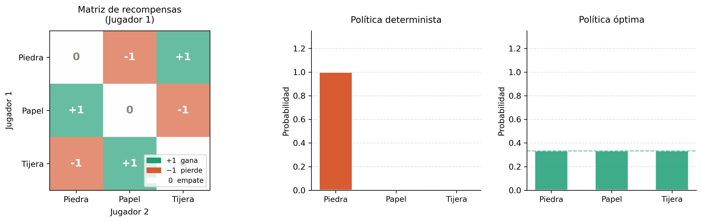


- **Inestabilidad de DQN.** Como vimos, Deep Q-Learning requiere varios trucos de ingeniería (_experience replay_, _target network_, ajuste cuidadoso de hiperparámetros) para evitar oscilaciones o divergencias. La causa raíz es que actualizar $Q(s,a)$ también desplaza el objetivo (al depender el cálculo variable objetivo de los mismos parámetros $\Theta$ que estamos ajustando), creando un problema de objetivo móvil. Esta inestabilidad empeora a medida que los espacios de estado y acción crecen.

La **idea principal** de los métodos que veremos a continuación consiste en que en lugar de aprender la función de valor y *deducir* una política a partir de ella, podemos **parametrizar y optimizar la política directamente** $\pi_\theta(a|s)$. Esta familia de algoritmos se denomina **métodos de Gradiente de Política** (*Policy Gradient*), y constituyen el segundo gran paradigma del RL moderno.


## Parametrización de la Política

### La Política como función diferenciable

En todos los algoritmos anteriores, la política se derivaba de los valores Q, ya sea de forma voraz o mediante $\epsilon$-greedy. Ahora definimos la política **directamente como una función paramétrica**:

$$
\pi_\theta(a \mid s) = P(\text{acción} = a \mid \text{estado} = s\,;\, \theta)\,,
$$

donde $\theta \in \mathbb{R}^d$ es un vector de parámetros ajustables (por ejemplo, los pesos de una red neuronal).

El requisito fundamental es que $\pi_\theta(a|s)$ sea **diferenciable respecto a $\theta$**, de modo que podamos aplicar ascenso por gradiente para mejorarla. La función a aplicar diferirá según si tenemos un espacio discreto de posibles acciones, o si el espacio de acciones es continuo (ver [](#fig-action-space)). Vamos a ver ambos casos.

Figure: Comparación entre un espacio de acciones discreto y continuo. A la izquierda se muestra el espacio de acción discreto para el videojuego Atari Breakout, en el que se debe elegir una acción entre 4 posibles. A la derecha se muestra un ejemplo de control de un brazo robótico, donde la acción debe elegir un valor de giro concreto para el brazo. {#fig-action-space}

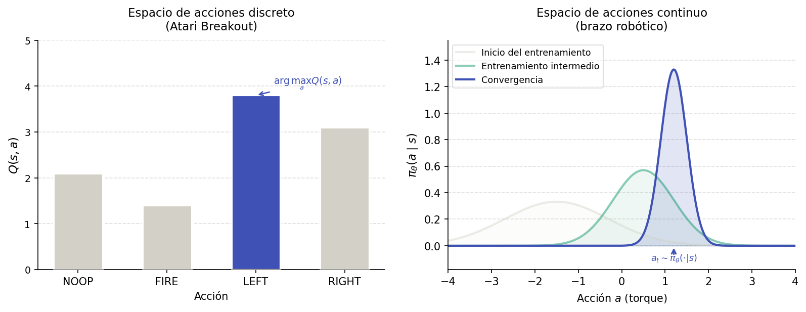

**Espacio de acciones discreto: política softmax** 

Si ${\cal A} = \{a_1, \ldots, a_n\}$ es finito, una elección natural consiste en modelar las preferencias mediante una puntuación $h_\theta(s, a)$ y aplicar una softmax:

$$
\pi_\theta(a \mid s) = \frac{e^{h_\theta(s,a)}}{\sum_{a' \in {\cal A}} e^{h_\theta(s,a')}}\,,
$$

donde $h_\theta(s,a)$ puede ser la salida de una red neuronal. Esta parametrización:

- Siempre produce una distribución de probabilidad válida sobre las acciones.
- Es diferenciable en todas partes respecto a $\theta$.
- Permite que la política siga siendo estocástica incluso tras la convergencia.

**Espacio de acciones continuo: política gaussiana** 

Si $a \in \mathbb{R}^m$ (por ejemplo, pares de torsión en articulaciones), la elección estándar es una **política gaussiana**:

$$
\pi_\theta(a \mid s) = \mathcal{N}\!\left(\mu_\theta(s),\, \sigma_\theta^2(s)\right)\,,
$$

donde $\mu_\theta(s)$ (media) y $\sigma_\theta(s)$ (desviación típica) son ambas salidas de una red neuronal. El agente muestrea acciones de esta distribución. La media se desplaza hacia acciones prometedoras a medida que avanza el entrenamiento, y la varianza disminuye a medida que el agente gana confianza (ver [](#fig-evolucion)).


Figure: Evolución de la política gaussiana con el entrenamiento. En el inicio tiene una alta varianza, y con el entrenamiento la política se va concentrando en un valor concreto. {#fig-evolucion}

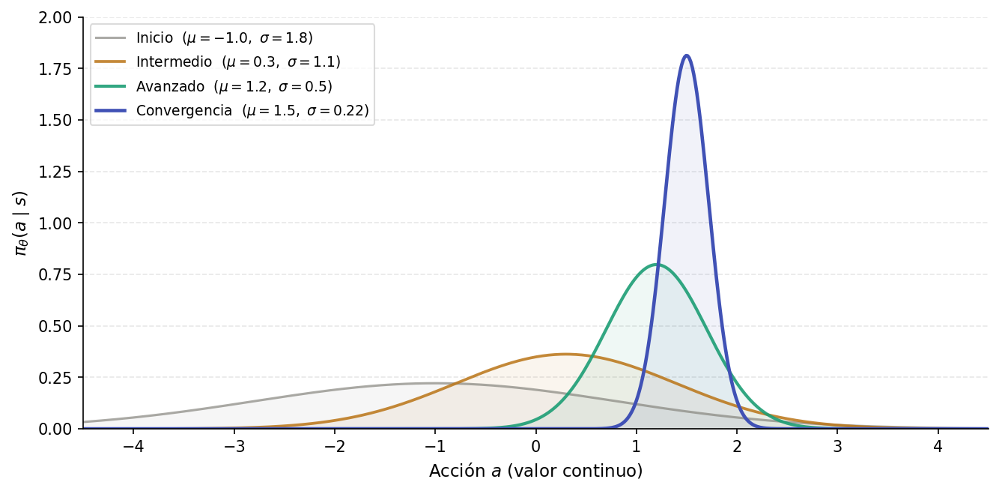


### El objetivo de optimización

Dada $\pi_\theta$, el agente genera trayectorias $\tau = (s_0, a_0, r_1, s_1, a_1, r_2, \ldots, s_{T-1}, a_{T-1}, r_{T}, s_T)$. El **retorno esperado** bajo la política $\pi_\theta$ es:

$$
J(\theta) = \mathbb{E}_{\tau \sim \pi_\theta}\left[G_0\right] = \mathbb{E}_{\tau \sim \pi_\theta}\left[\sum_{t=0}^{T} \gamma^t r_{t+1}\right]\,.
$$

Nuestro objetivo es encontrar:

$$
\theta^* = \arg\max_{\theta}\, J(\theta)\,.
$$

Esto es ahora un problema de **optimización** estocástica estándar. Podemos aplicar ascenso por gradiente:

$$
\theta \leftarrow \theta + \alpha \, \nabla_\theta J(\theta)\,.
$$

El reto central es: **¿cómo calculamos $\nabla_\theta J(\theta)$?** El retorno $G_0$ depende de $\theta$ no solo porque determina las acciones muestreadas de $\pi_\theta$, sino también porque dichas acciones tienen como consecuencia que se visiten diferentes estados a través de la dinámica del entorno $p(s'|s,a)$, y diferentes estados producirán diferentes retornos. El principal problema que encontramos es que la dinámica del entorno normalmente será desconocida. El Teorema del Gradiente de Política nos da la respuesta a este problema.


## El Teorema del Gradiente de Política


El **Teorema del Gradiente de Política** [@sutton2000policy] proporciona una expresión para $\nabla_\theta J(\theta)$ que **no requiere conocer** la dinámica del entorno $p(s'|s,a)$. Vamos a ver paso a paso cómo obtener dicha expresión.

### Demostración

Comenzamos escribiendo el retorno esperado como sumatorio sobre trayectorias:

$$
J(\theta) = \mathbb{E}_{\pi_\theta}\left[G(\tau) \right] = \sum_\tau P(\tau;\theta)\, G(\tau)\,,
$$

donde vemos como al expandir la esperanza aparece $P(\tau;\theta)$, que representa la probabilidad de la trayectoria $\tau$ bajo la política $\pi_\theta$. Calculamos el gradiente respecto a $\theta$:

$$
\nabla_\theta J(\theta) = \sum_\tau \nabla_\theta P(\tau;\theta)\, G(\tau)\
$$

Aplicamos ahora el **truco de la derivada logarítmica**. Este truco consiste en lo siguiente. La derivada del logaritmo de una función es:

$$
\nabla_\theta \log f(\theta) = \frac{1}{f(\theta)} \nabla_\theta f(\theta)
$$

Despejando tenemos:

$$
\nabla_\theta f(\theta)  = f(\theta) \nabla_\theta \log f(\theta)
$$

Aplicamos esto mismo sobre $P(\tau;\theta)$:

$$
\nabla_\theta P(\tau;\theta) = P(\tau;\theta)\, \nabla_\theta \log P(\tau;\theta)\,.
$$

Sustituyendo en la expresión de $\nabla_\theta J(\theta)$ tenemos:

$$
\nabla_\theta J(\theta) = \sum_\tau  G(\tau)  P(\tau;\theta)\, \nabla_\theta \log P(\tau;\theta) 
$$

Podemos volver a expresar esto como una esperanza matemática, de la siguiente forma:

$$
\nabla_\theta J(\theta) = \mathbb{E}_{\pi_\theta}\left[G(\tau) \nabla_\theta \log P(\tau;\theta) \right]
$$


Expandiendo $P(\tau;\theta)$ tenemos el siguiente productorio:

$$
P(\tau;\theta) = \mu(s_0) \prod_{t=0}^{T-1} \pi_\theta(a_t \mid s_t)\, p(s_{t+1} \mid s_t, a_t)\,,
$$

donde $\mu(s_0)$ es la distribución de probabilidad para el estado inicial $s_0$. Hemos de destacar que en el caso de los métodos **sin modelo** no tendremos acceso ni a la distribución $\mu(s_0)$ para el estado inicial ni a la dinámica del entorno $p(s_{t+1} \mid s_t, a_t)$.

Aplicando el logaritmo sobre la expresión anterior con $\log P(\tau;\theta)$ pasamos a tener un sumatorio:

$$
\log P(\tau;\theta) = \log \mu(s_0) + \sum_{t=0}^{T-1} \log \pi_\theta(a_t \mid s_t) + \sum_{t=0}^{T-1} \log p(s_{t+1} \mid s_t, a_t)\,.
$$

Dado que ni $\log \mu(s_0)$ ni $\log p(s_{t+1}|s_t,a_t)$ dependen de $\theta$, sus gradientes se anulan. De esta forma, sustituyendo en la expresión de $\nabla_\theta J(\theta)$ tenemos:

$$
\begin{align*}
\nabla_\theta J(\theta) &= \mathbb{E}_{\tau \sim \pi_\theta}\!\left[ G(\tau) \sum_{t=0}^{T-1} \nabla_\theta \log \pi_\theta(a_t \mid s_t) \right] = \\
&= \mathbb{E}_{\tau \sim \pi_\theta}\!\left[ \sum_{t=0}^{T-1}  G(\tau)\nabla_\theta \log \pi_\theta(a_t \mid s_t) \right] =  \\
&= \mathbb{E}_{\tau \sim \pi_\theta}\!\left[ \sum_{t=0}^{T-1}  \left( \sum_{k=0}^{T-1} \gamma^k r_{k+1} \right) \nabla_\theta \log \pi_\theta(a_t \mid s_t) \right] = \\
&= \mathbb{E}_{\tau \sim \pi_\theta}\!\left[ \sum_{t=0}^{T-1}  \left( \gamma^t \sum_{k=t}^{T-1} \gamma^{k-t} r_{k+1} \right) \nabla_\theta \log \pi_\theta(a_t \mid s_t) \right] = \\
&= \mathbb{E}_{\tau \sim \pi_\theta}\!\left[ \sum_{t=0}^{T-1}  \gamma^t G_t \nabla_\theta \log \pi_\theta(a_t \mid s_t) \right] 
\end{align*}
$$

Nótese que en el desarrollo anterior en el cuarto paso hemos descartado los términos $r_{k+1}$ con $k < t$. Esto es válido ya que, al ser recompensas pasadas independientes de $\pi_\theta(a_t \mid s_t)$, su contribución a la esperanza se anula (la función score tiene media cero bajo cualquier distribución de probabilidad válida). Podemos ver esto ilustrado en la [](#fig-causalidad).

Figure: Las recompensas pasadas se anulan dentro de la esperanza. {#fig-causalidad}

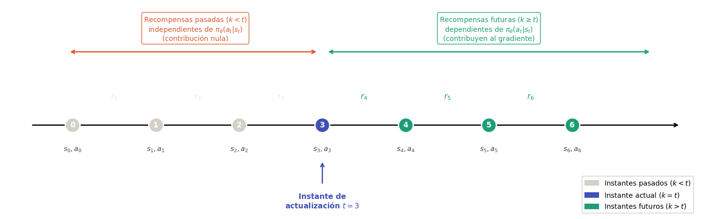

Tenemos aquí un resultado importante, ya que nos indica que el gradiente del retorno esperado depende únicamente de:

1. El gradiente del logaritmo de la política $\nabla_\theta \log \pi_\theta(a_t|s_t)$, que podemos calcular directamente a partir de nuestra parametrización.
2. El retorno futuro $G_t$, que podemos **estimar a partir de la experiencia** (trayectorias muestreadas).

No necesitamos conocer $p(s'|s,a)$, y por lo tanto el Gradiente de Política es un método **sin modelo** (*model-free*), igual que Q-Learning.


El **Teorema del Gradiente de Política** es una generalización de la ecuación anterior, en la que reemplazamos el retorno $G_t$ por la función valor estado-acción $Q_{\pi_\theta}(s_t, a_t)$, ya que en esencia ambas expresiones miden lo mismo: el retorno esperado (ver sección introductoria sobre [funciones de valor](#funciones-de-valor-y-la-ecuación-de-bellman) ). Podemos definir la función objetivo para aprendizaje por refuerzo episódico de la siguiente forma:

$$
\boxed{
\nabla_\theta J(\theta) = \mathbb{E}_{ \pi_\theta}\!\left[ \sum_{t=0}^{T-1}  \gamma^t Q_{\pi_\theta}(s_t, a_t) \nabla_\theta \log \pi_\theta(a_t \mid s_t) \right] 
}
$$

En la práctica, estimaremos el gradiente de la política a partir de muestra obtenidas interactuando con el entorno, utilizando técnicas como el método de Monte Carlo, tal como veremos en la sección dedicada al algoritmo [REINFORCE](#reinforce).

### La función score

El término $\nabla_\theta \log \pi_\theta(a_t|s_t)$ recibe el nombre de **función score** en estadística. Se define como el gradiente del logaritmo de la verosimilitud respecto a $\theta$, y mide cuánto y en qué dirección cambia su _log-likelihood_ cuando modificamos $\theta$. Es decir, nos está indicando en qué dirección del espacio de parámetros $\theta$ hay que moverse para aumentar la probabilidad la acción $a_t$ observada en el estado $s_t$. Su interpretación geométrica es importante:

- Si $G_t > 0$ la actualización **aumenta** la probabilidad de la acción $a_t$ en el estado $s_t$. Es decir, el agente _refuerza_ las acciones que condujeron a retornos positivos.
- Si $G_t < 0$ la actualización **disminuye** esa probabilidad. En este caso el agente penaliza las acciones que condujeron a retornos negativos.

Vemos aquí expresado formalmente algo que resulta intuitivo, que es el comportamiento de **ensayo y error** del RL. Probamos acciones, observamos resultados, y hacemos más de lo que funcionó y menos de lo que no.

Como ejemplo, vamos a calcular la forma de la función score **para la política softmax** considerando que estamos utilizando como modelo una función lineal con la forma $h_\theta(s,a) = \phi(s,a)^T \theta$, donde $\phi(s,a)$ son los vectores de características:

$$
\begin{align*}
\nabla_\theta \log \pi_\theta(a \mid s) &= \nabla_\theta \log \frac{e^{h_\theta(s,a)}}{\sum_{a' \in {\cal A}} e^{h_\theta(s,a')}} = \\
&= \nabla_\theta \log \frac{e^{ \phi(s,a)^T \theta}}{\sum_{a' \in {\cal A}} e^{\phi(s,a')^T \theta}} \\
&= \nabla_\theta \log \left(e^{ \phi(s,a)^T \theta}\right) - \nabla_\theta \log \left(\sum_{a' \in {\cal A}} e^{\phi(s,a')^T \theta}\right) \\
&= \nabla_\theta \left( \phi(s,a)^T \theta \right) - \frac{\nabla_\theta  \left(\sum_{a' \in {\cal A}} e^{\phi(s,a')^T \theta}\right)}{\sum_{a' \in {\cal A}} e^{\phi(s,a')^T \theta}}  \\ 
&= \phi(s,a) - \frac{\sum_{a' \in {\cal A}} \phi(s,a') e^{\phi(s,a')^T \theta}}{\sum_{a' \in {\cal A}} e^{\phi(s,a')^T \theta}}  \\ 
&= \phi(s,a) - \sum_{a' \in {\cal A}} \pi_\theta(a' \mid s) \phi(s,a')  \\
&= \phi(s,a) - \mathbb{E}_{a' \sim \pi_\theta(\cdot|s)}[\phi(s,a')] \\
\end{align*}
$$

Nótese que en el cuarto paso hemos aplicado la derivada del logaritmo en el segundo término, y en el quinto paso hemos aplicado la derivada de la exponencial. En el sexto paso tenemos una suma de los $\phi(s,a')$ ponderados por los pesos $\pi_\theta(a' \mid s)$, que corresponde a la esperanza del vector de características bajo la política actual.

Esto muestra que la actualización refuerza las características de la acción elegida en relación con las características **medias** bajo la política actual.

## REINFORCE

El algoritmo más sencillo basado en el Teorema del Gradiente de Política es **REINFORCE** [@williams1992simple]. Utiliza una estimación Monte Carlo del gradiente, es decir, se muestrean trayectorias completas bajo la política actual y se usan los retornos observados para aproximar la esperanza (ver [](#fig-monte-carlo)).

Figure: Estimación Monte Carlo del gradiente a partir de $K$ episodios. Cada línea muestra el retorno acumulado $G_0$ de un episodio distinto. La alta dispersión de los valores finales ilustra la varianza del estimador. {#fig-monte-carlo}

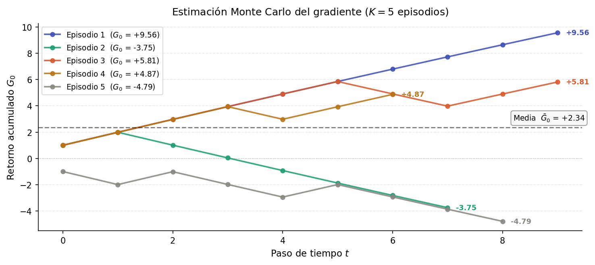

### Algoritmo

En su forma general, si se muestrean $K$ episodios, la estimación Monte Carlo del gradiente es:

$$
\nabla_\theta J(\theta) \approx \frac{1}{K}\sum_{i=1}^{K} \sum_{t=0}^{T-1} \gamma^t G_t^{(i)} \nabla_\theta \log \pi_\theta(a_t^{(i)} \mid s_t^{(i)}) 
$$


En la práctica, REINFORCE actualiza los parámetros al final de cada episodio utilizando únicamente la última trayectoria generada. Para cada instante $t$ del episodio la regla de actualización es la siguiente:

$$
\theta \leftarrow \theta + \alpha \gamma^t G_t \nabla_\theta \log \pi_\theta(a_t \mid s_t) \,,
$$

donde $\alpha$ es la tasa de aprendizaje. 

Esta estrategia de actualizar tras cada episodio completo, en lugar de tras cada paso de tiempo, hace que REINFORCE sea un algoritmo **offline**, ya que necesita observar todas las recompensas futuras $r_{t+1}, \ldots, r_T$​ para poder calcular $G_t$​, por lo que no puede actualizar hasta que el episodio haya concluido.

A continuación se muestra el algoritmo completo:

!!! algorithm "Algoritmo: REINFORCE"

    **Entradas:** Tasa de aprendizaje $\alpha$, factor de descuento $\gamma$, número de episodios $K$  
    **Salida:** Parámetros de política $\theta$

    1. **Inicializar** $\theta$ aleatoriamente
    2. **Para** episodio $i = 1, \ldots, K$:
        1. Generar trayectoria $\tau^{(i)} = (s_0, a_0, r_1, s_1, a_1, r_2, \ldots, s_{T-1}, a_{T-1}, r_T)$ siguiendo $\pi_\theta$
        2. **Para** $t = T-1, T-2, \ldots, 0$:
            1. Calcular $G_t = r_{t+1} + \gamma G_{t+1}$ (con $G_T = 0$)
        3. **Para** $t = 0, 1, \ldots, T-1$:
            1. $\theta \leftarrow \theta + \alpha  \gamma^t  G_t  \nabla_\theta \log \pi_\theta(a_t \mid s_t)$

    **Devolver** $\theta$


Nótese el paso hacia atrás en 2.2 para calcular los retornos futuros de forma eficiente, idéntico al enfoque Monte Carlo MDP que ya conocemos. La actualización en el paso 2.3 es **ascenso por gradiente**, ya que estamos maximizando $J(\theta)$. 

Destacamos también que el factor $\gamma^t$ pondera más las actualizaciones de los primeros pasos del episodio, reflejando que las acciones al comienzo tienen mayor influencia sobre el retorno total.

Por último, cabe también mencionar que en este caso no necesitamos una estrategia $\epsilon$-_greedy_, ya que la política $\pi_\theta(a, s)$ ya es estocástica, y podemos seguir esta misma distribución de probabilidad para la exploración.


### REINFORCE en una Red Neuronal

En la formulación original de REINFORCE, la política $\pi_\theta(a \mid s)$ se parametriza como una softmax lineal sobre características $\phi(s,a)$, la cuales deben diseñarse manualmente. En problemas con espacios de estados complejos, como por ejemplo imágenes, esto limita la expresividad del modelo. La solución más inmediata es sustituir la parametrización lineal por una **red neuronal**, que aprende automáticamente una representación adecuada del estado.

Veremos como la generalización de lineal a red neuronal convierte REINFORCE en un algoritmo de **Deep RL** sin cambiar nada en la teoría subyacente. La salida de la red dependerá de si el espacio de acciones es discreto o continuo. Veremos a continuación ambos casos.

#### Capa de salida para espacio de acciones discreto

La red toma el estado $s$ como entrada y produce una distribución de probabilidad sobre acciones como salida:

$$
\pi_\theta(a \mid s) = \text{softmax}(f_\theta(s)) \,,
$$

donde $f_\theta(s)$ es la salida de la red antes del softmax (vector de logits), y $\theta$ representa todos los parámetros (pesos y sesgos) de la red.
 
#### Capa de salida para espacio de acciones continuo

Cuando el espacio de acciones es continuo, la distribución categórica deja de tener sentido. En su lugar, la red neuronal produce los **parámetros de una distribución continua**, típicamente una distribución normal (con parámetros media $\mu$ y desviación típica $\sigma$), de la que se muestrea la acción:

$$\pi_\theta(a \mid s) = \mathcal{N}(\mu_\theta(s), \sigma_\theta(s)^2)$$

En este caso la red tendrá dos cabezas de salida, una para $\mu$ y otra para $\sigma$.

#### Arquitectura de la red

La elección de arquitectura depende de la naturaleza del espacio de estados:

- **Estados vectoriales** (posición, velocidad, ángulos): Una red completamente conectada (MLP) de una o dos capas ocultas con activaciones ReLU es suficiente. 
- **Estados visuales** (píxeles, fotogramas): Se añaden capas convolucionales antes del MLP para extraer características espaciales (por ejemplo, con una arquitectura similar a la propuesta en la formulación inicial de DQN). La red aprende tanto la representación del estado como la política de forma conjunta.

En general, las redes para política en RL tienden a ser más pequeñas que las usadas en aprendizaje supervisado, ya que el ruido de las señales de entrenamiento hace que arquitecturas muy grandes sean difíciles de estabilizar.

En la [](#fig-nn-discreta) vemos un ejemplo de arquitectura completa de una red de política para un estado de acciones discreto. Como entrada recibe el estado $s$, que en este caso de compone de: posición, velocidad, ángulo y velocidad angular. Tenemos un espacio de acciones discreto, con dos posibles acciones: mover a la izquierda o a la derecha, con lo cual, como salida tenemos una distribución $\text{Categorical}$ que internamente aplica una función $\text{Softmax}$ sobre los _logits_, generando una probabilidad para cada posible acción.

Figure: Ejemplo de arquitectura de red de política para un espacio de acciones discreto, en la que el estado (entrada) se compone de posición, velocidad, ángulo y velocidad angular, y podemos tomar dos posibles acciones: mover a la izquierda o a la derecha. {#fig-nn-discreta}

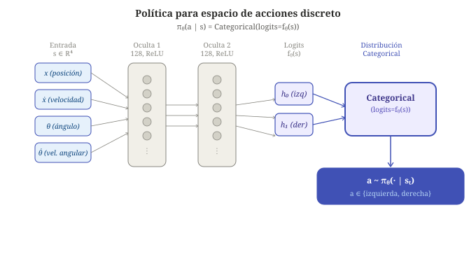

De forma similar, en la [](#fig-nn-continua) tenemos una red similar pero para un espacio de acciones continuo, en la cual recibimos las mismas entradas pero como acción de salida aplicaremos una fuerza a izquierda o derecha dentro del rango continuo $[-3, 3]$. Por lo tanto, en este caso la red tiene dos cabezas de salida: una para la media $\mu$ y otra para la desviación típica $\sigma$. A partir de ellas producimos como salida una distribución $\text{Normal}$, a partir de la cual se generará la acción a aplicar. Nótese que las capas ocultas son reutilizadas por ambas cabezas.

Figure: Ejemplo de arquitectura de red de política para un espacio de acciones continuo, en la que  el estado (entrada) se compone de posición, velocidad, ángulo y velocidad angular, y como acción de salida producimos un valor en el rango $[-3,3]$. {#fig-nn-continua}

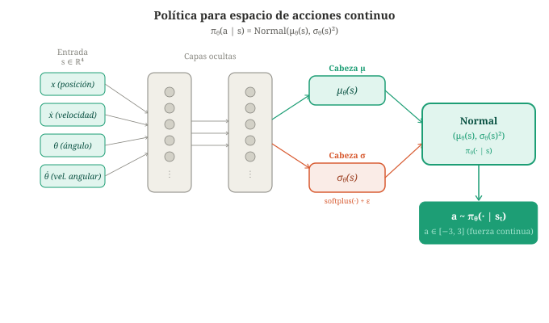


#### Regla de actualización

El teorema del gradiente de política y la regla de actualización de REINFORCE son independientes de cómo se parametrice $\pi_\theta$, por lo que no cambia respecto a lo visto anteriormente:

$$\theta \leftarrow \theta + \alpha \gamma^t  G_t  \nabla_\theta \log \pi_\theta(a_t \mid s_t)$$

Lo que cambia es cómo se calcula $\nabla_\theta \log \pi_\theta(a_t \mid s_t)$. En la versión lineal existía una forma cerrada:

$$\nabla_\theta \log \pi_\theta(a_t \mid s_t) = \phi(s_t, a_t) - \mathbb{E}_{a' \sim \pi_\theta(\cdot \mid s_t)}[\phi(s_t, a')]$$

Con una red neuronal, este gradiente se obtiene mediante **backpropagation** a través de todos los parámetros de la red, lo cual los _frameworks_ de autodiferenciación como PyTorch calculan automáticamente.

Concretamente, lo que haremos es insertar como pérdida $\mathcal{L}$ de la red:

$$
\mathcal{L} = - \gamma^t G_t \log \pi_\theta(a_t \mid s_t)
$$

El signo negativo es fundamental, ya que la red minimiza la pérdida, y nosotros queremos maximizar $J(\theta)$. En el paso de _backpropagation_ se calcularán los gradientes de los parámetros $\theta$: 

$$
\nabla_\theta \mathcal{L} = - \gamma^t G_t \nabla_\theta \log \pi_\theta(a_t \mid s_t) \,,
$$

y posteriormente el optimizador aplicará descenso por gradiente para actualizarlos:

$$
\theta \leftarrow \theta - \alpha \nabla_\theta \mathcal{L} = \theta + \alpha \gamma^t G_t \nabla_\theta \log \pi_\theta(a_t \mid s_t) 
$$


### Implementación en PyTorch

Vamos a ver a continuación detalles de implementación de la red neuronal con PyTorch, tanto considerando un espacio de acciones discreto como continuo.

#### Espacio de acciones discreto: distribución categórica

La red neuronal produce un vector de logits $f_\theta(s)$ (uno por acción), que representan las preferencias no normalizadas de la política. Para obtener una distribución de probabilidad válida sobre acciones se aplica softmax, pero en PyTorch no es necesario hacerlo explícitamente, ya que la clase `Categorical` acepta directamente los logits y los convierte internamente:

```python
logits = policy_network(state)            # f_\theta(s): vector de logits, shape [n_acciones]
dist = Categorical(logits=logits)         # distribución \pi_\theta(· | s)
```

Aquí `dist` es un objeto de tipo `torch.distributions.Categorical` que representa la distribución discreta $\pi_\theta(\cdot \mid s)$. Sobre él se pueden realizar dos operaciones fundamentales:

- `dist.sample()`: Muestrea una acción $a \sim \pi_\theta(\cdot \mid s)$, lo cual nos permite implementar la exploración estocástica de la política.
- `dist.log_prob(a)`: Calcula $\log \pi_\theta(a \mid s)$ para una acción concreta $a$, que es exactamente el término que aparece en la regla de actualización de REINFORCE.

#### Espacio de acciones continuo: distribución normal

En este caso tendremos una red con dos cabezas: una para la media $\mu$ y otra para la desviación típica $\sigma$, y a partir de estos datos devolveremos una distribución normal:

```python
features = self.shared(state)
mean = self.mean_head(features)
std  = torch.nn.functional.softplus(self.std_head(features)) + 1e-6
dist = Normal(mean, std)             # distribución \pi_\theta(· | s)
```

Hay dos detalles de implementación a destacar. El primero es el uso de `softplus` en lugar de `exp` para garantizar que $\sigma > 0$. Aunque ambos producen valores positivos, `softplus` es numéricamente más estable cuando la activación es muy grande. El segundo es la constante `1e-6` que se suma para evitar que $\sigma$ sea exactamente cero, lo que haría la distribución degenerada.


#### Selección de acción y registro del log-prob

Durante la generación de la trayectoria, en cada paso $t$ se realiza:

```python
action = dist.sample()              # a_t ~ \pi_\theta(· | s_t)
                                    # a_t ~ N(\mu_\theta(s_t), \sigma_\theta(s_t)^2)
log_prob = dist.log_prob(action)    # log \pi_\theta(a_t | s_t)
```

Esto es igual tanto en el caso de espacio de acciones discreto como continuo, simplemente cambiará el tipo de acción que se muestreará con `dist.sample()` (una categoría o un valor).  PyTorch trata de forma transparente los diferentes tipos de objetos `dist` utilizados en cada caso.

De la misma forma `log_prob` calculará en el caso discreto el logaritmo de la probabilidad de la acción (obtenida del softmax), y en el caso continuo el logaritmo de la densidad de la normal evaluada en la acción muestreada $\log \pi_\theta(a_t \mid s_t) = \log \mathcal{N}(a_t; \mu_\theta(s_t), \sigma_\theta(s_t)^2)$.

Es fundamental guardar `log_prob` en este momento para poder usarlo posteriormente en la actualización. El tensor `log_prob` conecta ese valor escalar con todos los parámetros $\theta$ de la red, lo cual permite a PyTorch calcular el gradiente mediante _backpropagation_.

#### Cálculo de la pérdida y actualización

Una vez terminado el episodio y calculados los retornos $G_t$, la actualización para cada paso $t$ es:

```python
loss = -(gamma ** t) * G_t * log_prob
optimizer.zero_grad()
loss.backward()                           # \nabla_\theta log \pi_\theta(a_t | s_t) calculado por backprop
optimizer.step()
```

Hay tres elementos a destacar:

**El signo negativo.** La regla de REINFORCE maximiza $J(\theta)$, pero PyTorch (como la mayoría de _frameworks_) minimiza. Minimizar $-G_t \log \pi_\theta(a_t \mid s_t)$ es equivalente a maximizar $G_t \log \pi_\theta(a_t \mid s_t)$, que es lo que indica el teorema del gradiente de política.

**El papel de `log_prob`.** Aunque `G_t` es un escalar constante (no depende de $\theta$), `log_prob` sí está conectado a $\theta$. Cuando se llama a `loss.backward()`, PyTorch diferencia la pérdida respecto a $\theta$ aplicando la regla de la cadena a través de toda la red, obteniendo $\nabla_\theta \log \pi_\theta(a_t \mid s_t)$ sin necesidad de calcularlo analíticamente.

**`optimizer.zero_grad()`.** Antes de cada `backward()` hay que limpiar los gradientes acumulados del paso anterior. Si se omite, los gradientes se suman a los ya existentes en los parámetros, lo que produce actualizaciones incorrectas.

> **Nota de implementación**: El código anterior aplica la actualización para cada paso $t$ de forma independiente, lo que corresponde directamente a la fórmula teórica y facilita su lectura. En la práctica es habitual acumular la pérdida de todos los pasos del episodio en una sola expresión antes de llamar a backward():
> ```python
> loss = sum(-(gamma**t) * G_t * lp
>            for t, (lp, G_t) in enumerate(zip(log_probs, returns)))
> optimizer.zero_grad()
> loss.backward()
> optimizer.step()
> ```
> En ocasiones también se utiliza la media en lugar de la suma, y se omite el factor $\gamma_t$:
> ```python
> log_probs = torch.stack(log_probs)
> loss = -(returns * log_probs).mean()
> optimizer.zero_grad()
> loss.backward()
> optimizer.step()
> ```
> Esta última versión funciona igual de bien en la práctica, aunque sea ligeramente distinta al teorema, y es la que encontramos más habitualmente en las implementaciones actuales. 


#### Inicialización de pesos

La inicialización de los pesos tiene un impacto importante en la estabilidad del entrenamiento. Una mala inicialización puede hacer que la política inicial sea casi determinista, lo que reduciría drásticamente la exploración desde el primer episodio.

Las recomendaciones habituales son:

- Usar **inicialización de Xavier** (o Glorot) para capas con activación ReLU o tanh, ya que mantiene la varianza de las activaciones estable a lo largo de las capas.
- Inicializar los **pesos de la capa de salida con valores pequeños** (por ejemplo, escalando por un factor de $0.01$), de forma que los logits iniciales sean cercanos a cero y la salida del softmax sea aproximadamente uniforme. Esto garantiza que el agente explore todas las acciones al inicio del entrenamiento.
- Inicializar los **sesgos a cero**.

Una política inicial uniforme es deseable, ya que si el agente favorece fuertemente una acción desde el principio puede quedar atrapado en un mínimo local antes de haber explorado el espacio de acciones.


## Entornos de simulación

Antes de ver los ejemplos concretos, vamos a presentar las herramientas de simulación que utilizaremos. En RL no se aprende sobre datos estáticos sino interactuando con un entorno, por lo que necesitamos un simulador que juegue el papel del entorno del MDP.

### Gymnasium

**Gymnasium** es la biblioteca de entornos de referencia para RL en Python, mantenida por la [Fundación Farama](https://farama.org). Es el sucesor oficial de OpenAI Gym, que fue la biblioteca original pero dejó de mantenerse en 2022. Proporciona una colección de entornos estandarizados (juegos, problemas de control, simulaciones físicas) junto con una interfaz uniforme que abstrae completamente el entorno del algoritmo (el mismo código de REINFORCE funciona en cualquier entorno sin modificaciones).

La instalación básica de la biblioteca incluye una serie de entornos clásicos:

```bash
pip install gymnasium
```

La interfaz esencial de la API se reduce a tres elementos:

```python
import gymnasium as gym

env = gym.make("CartPole-v1")          # crear el entorno
state, info = env.reset()              # reiniciar al inicio del episodio
state, reward, terminated, truncated, info = env.step(action)  # ejecutar acción
```

Hay dos atributos del entorno que son especialmente relevantes para construir la red neuronal de la política:

- `env.observation_space`: Describe el espacio de estados $\mathcal{S}$. Su atributo `shape` indica la dimensión del vector de observación, que determina el tamaño de la capa de entrada de la red.
- `env.action_space`: Describe el espacio de acciones $\mathcal{A}$. Si es de tipo `Discrete`, el atributo `n` indica el número de acciones (capa de salida categórica). Si es de tipo `Box`, los atributos `shape`, `low` y `high` describen el rango del espacio continuo (capa de salida gaussiana).


### MuJoCo

**MuJoCo** (*Multi-Joint dynamics with Contact*) es un simulador de física de alta precisión diseñado para el control de sistemas articulados (brazos robóticos, figuras humanoides, péndulos, etc.). Sus entornos tienen espacios de acciones **continuos**, lo que los convierte en el banco de pruebas estándar para algoritmos de gradiente de política como REINFORCE, Actor-Critic o PPO.

Desde 2022 MuJoCo es de uso libre y está integrado en Gymnasium como una familia de entornos adicional. Requiere una instalación separada:

```bash
pip install gymnasium[mujoco]
```

### Entornos utilizados en los ejemplos

Vamos a ver en la siguiente sección dos entornos representativos de cada tipo de espacio de acciones:

| Entorno | Biblioteca | Estados $\mathcal{S}$ | Acciones $\mathcal{A}$ | Política |
|---|---|---|---|---|
| `CartPole-v1` | Gymnasium | $\mathbb{R}^4$ (continuo) | $\{0, 1\}$ (discreto) | Softmax + Categorical |
| `InvertedPendulum-v4` | Gymnasium + MuJoCo | $\mathbb{R}^4$ (continuo) | $[-3, 3]$ (continuo) | Gaussiana |

Ambos comparten el mismo espacio de estados de dimensión 4 y el mismo objetivo (equilibrar un péndulo), lo que los convierte en un par ideal para comparar el tratamiento del espacio de acciones discreto y continuo manteniendo el resto de variables constantes.

### Ejemplos de aplicación

#### Espacio de acciones discreto: CartPole

El entorno **CartPole** es un *benchmark* clásico para los métodos de gradiente de política, donde un agente controla un carrito para equilibrar un poste vertical situado sobre él (ver [](#fig-cartpole)). El agente deberá empujar el carro a la derecha o a la izquierda, y evitar que el poste se caiga. El episodio terminará si el poste se cae o el carro se sale de los límites, o bien cuando hayan transcurrido 500 iteraciones. 

Figure: Entorno de CartPole. Se debe evitar que el poste sobre el carro caiga, empujando el carro a izquierda o derecha. {#fig-cartpole}

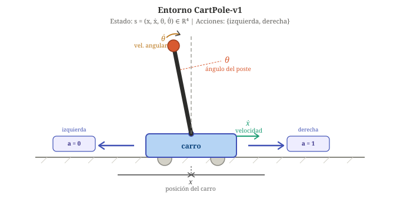


El **estado** es:

$$
s = (\underbrace{x}_{\text{posición del carro}},\; \underbrace{\dot{x}}_{\text{velocidad del carro}},\; \underbrace{\theta}_{\text{ángulo del poste}},\; \underbrace{\dot{\theta}}_{\text{velocidad angular}}) \in \mathbb{R}^4\,.
$$

El **espacio de acciones** es:

$$
{\cal A} = \{0: \text{Empujar a la izquierda}, 1: \text{Empujar a la derecha}\}
$$ 

El episodio **termina** cuando:

- El poste cae (ángulo $> 12°$) 
- El carro se aleja demasiado ($|x| > 2{,}4$)
- Transcurren 500 iteraciones

La **recompensa** es $+1$ por cada paso de tiempo, por lo que maximizar el retorno equivale a mantener el poste en equilibrio el mayor tiempo posible. Por ello, CartPole-v1 se considerará **resuelto** cuando la recompensa promedio de los últimos $100$ episodios sea $\geq 475$. 

CartPole tiene un **estado continuo de baja dimensionalidad**. Aunque es posible discretizar el espacio de estados para aplicar Q-Learning tabular, el número de estados crece exponencialmente con la granularidad elegida y la discretización introduce un error de aproximación que puede degradar la política elegida. Por ello, CartPole en un buen ejemplo para motivar los métodos de gradiente de política que manejas espacios de estados continuos de forma nativa sin necesidad de discretización.

Una red de política simple para CartPole es un MLP de dos capas:

$$
h_\theta(s, a) = W_2\, \text{ReLU}(W_1 s + b_1) + b_2\,,\quad \theta = (W_1, b_1, W_2, b_2)\,,
$$

con $\pi_\theta(a|s) = \text{softmax}(h_\theta(s, \cdot))$.

En este caso la entrada $s$ de la red sería el vector de 4 variables de estado y la salida una distribución sobre las 2 acciones posibles (izquierda y derecha). Una capa oculta de 128 unidades resuelve el problema sin dificultad. 

Vemos a continuación un ejemplo de implementación, en el que la política se modela como una distribución categórica. La red neuronal produce un logit por acción, y la distribución `Categorical` asigna una probabilidad a cada una:

```python
import torch
import torch.nn as nn
from torch.distributions import Categorical

class PolicyDiscreta(nn.Module):
    def __init__(self, state_dim, action_dim, hidden_dim=128):
        super().__init__()
        self.net = nn.Sequential(
            nn.Linear(state_dim, hidden_dim),
            nn.ReLU(),
            nn.Linear(hidden_dim, action_dim)   # logits, sin softmax
        )

    def forward(self, state):
        logits = self.net(state)
        return Categorical(logits=logits)       # distribución \pi_\theta(· | s)
```

En cada paso de la trayectoria, la acción se muestrea de la distribución y se registra su log-probabilidad:

```python
dist = policy(state)
action = dist.sample()              # a_t ~ \pi_\theta(· | s_t)
log_prob = dist.log_prob(action)    # log \pi_\theta(a_t | s_t)
```

En la práctica, REINFORCE típicamente necesita varios cientos de episodios para resolver CartPole, aunque con grandes oscilaciones durante el entrenamiento (ver [](#fig-oscilaciones)). Esto se debe a la alta varianza en las estimaciones de gradiente que produce el algoritmo. Este problema se desarrollará con mayor detalle en próximas secciones. 

Figure: Curva de aprendizaje con CartPole-v1 con datos reales. Se han utilizado como parámetros $\alpha = 0.003$, $\gamma=0.99$ y $600$ episodios. La media móvil muestra una convergencia progresiva con las oscilaciones características de la alta varianza del estimador.{#fig-oscilaciones}

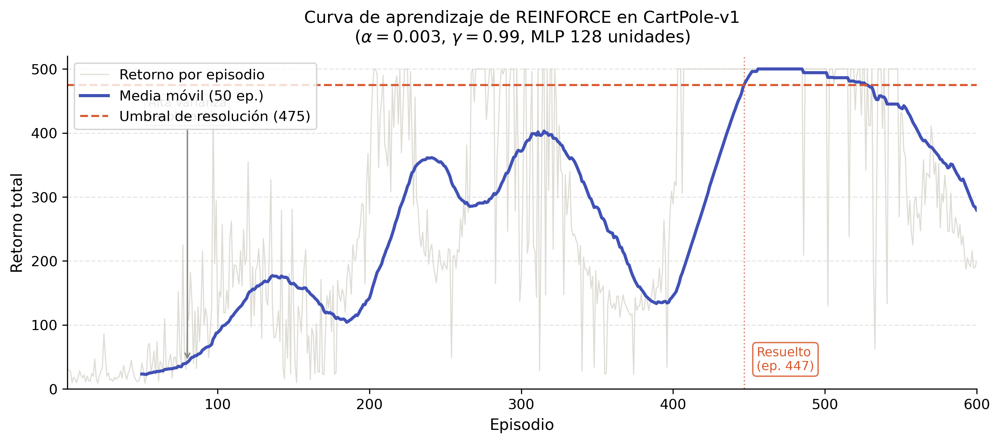


#### Espacio de acciones continuo: InvertedPendulum

El entorno **InvertedPendulum-v4** de MuJoCo es el equivalente continuo de CartPole, en el que el objetivo es también equilibrar un palo sobre un carro, pero la acción es ahora una fuerza real en el intervalo $[-3, 3]$, no una elección discreta. La política produce la media $\mu$ y la desviación típica $\sigma$ de una distribución normal mediante dos cabezas de salida independientes de la red:

```python
from torch.distributions import Normal

class PolicyContinua(nn.Module):
    def __init__(self, obs_dim, action_dim, hidden_dim=128):
        super().__init__()
        # Capas compartidas
        self.shared = nn.Sequential(
            nn.Linear(obs_dim, hidden_dim),
            nn.Tanh(),
            nn.Linear(hidden_dim, hidden_dim),
            nn.Tanh()
        )
        # Cabezas separadas para media y desviación típica
        self.mean_head = nn.Linear(hidden_dim, action_dim)
        self.std_head  = nn.Linear(hidden_dim, action_dim)

    def forward(self, state):
        features = self.shared(state)
        mean = self.mean_head(features)
        std  = torch.nn.functional.softplus(self.std_head(features)) + 1e-6
        return Normal(mean, std)             # distribución \pi_\theta(· | s)
```

El resto del algoritmo REINFORCE no cambia:

```python
dist     = policy(state)
action   = dist.sample()               # a_t ~ \pi_\theta(· | s_t)
log_prob = dist.log_prob(action)       # log \pi_\theta(a_t | s_t)
```

Hemos visto que solo cambia la distribución de salida de la red (categórica o normal), y por lo tanto el tipo de acciones que se muestrean con `sample()`, y que como resultado de `log_prob(a)` podemos tener o la log-probabilidad discreta, o la log-densidad normal. El resto de pasos del algoritmo permanecen igual.

Esta uniformidad es una de las propiedades más interesantes de los métodos basados en política, ya que el algoritmo es el mismo independientemente de la naturaleza del espacio de acciones. Lo único que varía es la familia de distribuciones que parametriza la política.

## Fortalezas y limitaciones de REINFORCE

REINFORCE es el algoritmo más sencillo basado en el teorema del gradiente de política, y es conceptualmente claro y directo. Genera trayectorias completas, calcula los retornos y actualiza la política en la dirección correcta.

Presenta como punto fuerte la capacidad de representar de forma natural tanto un **espacio de acciones discreto** como un **espacio de acciones continuo**, lo cual lo diferencia de los métodos vistos anteriormente. Sin embargo, presenta una limitación fundamental que condiciona su uso en problemas reales, y es su **elevada varianza**. Vamos a cerrar esta sesión con una discusión sobre estas cuestiones, seguida de una primera revisión de las líneas de mejora surgidas para abordar las limitaciones del método. 

### Espacios de estados y acciones: Q-Learning, DQN y REINFORCE

Una de las ventajas más importantes de los métodos basados en política como REINFORCE es su capacidad para trabajar con **espacios de acciones continuos**, algo que los métodos basados en valor no pueden hacer de forma directa. Para entender por qué, es útil comparar los tres algoritmos respecto a los espacios de estados y acciones que manejan.

**Q-Learning tabular** requiere tanto un espacio de estados como un espacio de acciones **discretos y finitos**, ya que la función $Q(s,a)$ se almacena explícitamente en una tabla. El espacio de estados de CartPole, por ejemplo, es continuo (posición, velocidad, ángulo y velocidad angular son valores reales), lo que hace que Q-Learning tabular no sea aplicable directamente. Una solución es **discretizar** el espacio de estados, dividiendo cada variable en intervalos y tratando cada combinación de intervalos como un estado discreto. Esto tiene dos inconvenientes importantes. Por un lado, el número de estados crece exponencialmente con el número de variables (la llamada *maldición de la dimensionalidad*). Por otro, la discretización introduce un error de aproximación que puede degradar la calidad de la política aprendida.

**DQN** resuelve el problema del espacio de estados continuo mediante una red neuronal que aproxima $Q(s,a)$ para cualquier estado $s$. Sin embargo, sigue requiriendo un espacio de acciones **discreto y finito**, ya que en cada paso necesita calcular $\arg\max_a Q(s,a)$ para seleccionar la mejor acción. Este máximo es tratable cuando el número de acciones es pequeño (2 en CartPole), pero se vuelve intratable si las acciones son valores reales continuos como el torque exacto a aplicar en una articulación.

**REINFORCE** parametriza directamente la política $\pi_\theta(a \mid s)$ como una distribución de probabilidad sobre acciones, lo cual elimina la necesidad de calcular un máximo sobre el espacio de acciones. En lugar de buscar la mejor acción, se puede muestrear directamente de la distribución. Como consecuencia, REINFORCE puede manejar tanto espacios de acciones discretos como continuos simplemente cambiando la familia de distribuciones utilizada.

| Algoritmo | Espacio de estados | Espacio de acciones |
|---|---|---|
| Q-Learning tabular | Discreto (o discretizado) | Discreto |
| DQN | Continuo | Discreto |
| REINFORCE | Continuo | Discreto **o continuo** |


### El problema de la varianza

Como hemos visto en los experimentos con CartPole, REINFORCE converge lentamente y con grandes oscilaciones. La causa raíz es la **alta varianza en las estimaciones del gradiente**. Para entender por qué, consideremos dos episodios que pasan por el mismo estado $s_t$ y toman la misma acción $a_t$:

- En el episodio 1, lo que ocurre después conduce a un retorno $G_t = +8.7$.
- En el episodio 2, la aleatoriedad del entorno conduce a $G_t = -3.2$.

Figure: Divergencia de trayectorias de REINFORCE a partir de un mismo estado $(s_t, a_t)$. El retorno acumulado $G_t$​ varía enormemente entre episodios pese a partir del mismo estado y acción, lo que ilustra  el motivo de la alta varianza del estimador. {#fig-divergencia}

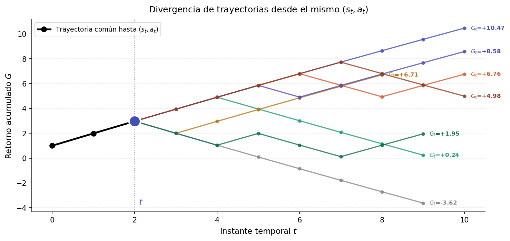

La misma acción en el mismo estado recibe señales de actualización contradictorias según el episodio. REINFORCE usa el retorno completo desde $t$ en adelante, lo que mezcla la calidad propia de la acción $a_t$ en $s_t$ con todo lo que ocurrió después, incluyendo transiciones aleatorias fuera del control del agente (ver [](#fig-divergencia)). Como hemos visto empíricamente, esta varianza **crece con el horizonte temporal** $T$, y cuantos más pasos tiene un episodio, más oportunidades tiene el azar de producir retornos muy distintos para la misma acción (ver [](#fig-varianza)).


Figure: Aumento de la varianza del retorno conforme aumenta el horizonte temporal $T$. {#fig-varianza}

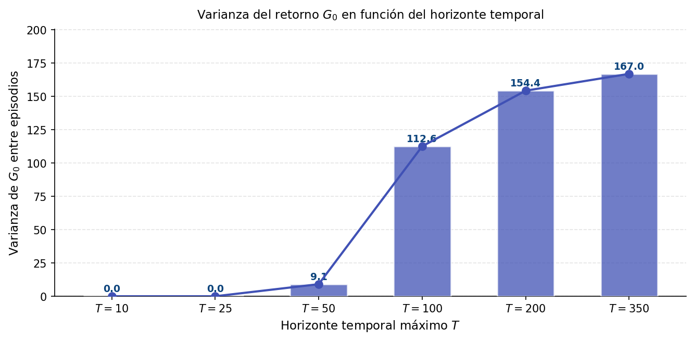


Matemáticamente, la varianza del estimador crece porque $G_t$ acumula términos estocásticos como vemos a continuación:

$$\text{Var}(G_t) = \sum_{k=t}^{T-1} \gamma^{2(k-t)} \text{Var}(r_{k+1})$$

Esto hace que REINFORCE requiera muchos episodios para que el gradiente promediado sea una señal fiable, lo que se traduce en una convergencia lenta y en la necesidad de ajustar cuidadosamente la tasa de aprendizaje para evitar oscilaciones.

### Líneas de mejora

Existen diferentes estrategias para reducir esta varianza, que veremos con mayor detalle en la próxima sesión:

**1. REINFORCE con baseline** [@sutton2018reinforcement]. La idea es restar al retorno una función de referencia $b(s_t)$ que no dependa de la acción, de forma que la actualización pase a ser:

$$\theta \leftarrow \theta + \alpha  \gamma^t  \left(G_t - b(s_t)\right)  \nabla_\theta \log \pi_\theta(a_t \mid s_t)$$

Veremos que restar $b(s_t)$ no introduce sesgo en el gradiente (la esperanza del término añadido es cero), pero sí puede reducir la varianza de forma significativa si la _baseline_ es una buena estimación del retorno esperado. La elección natural es $b(s_t) = V_\pi(s_t)$, el valor esperado de estar en el estado $s_t$, con lo cual convertimos el retorno en lo que se conoce como **ventaja**, calculada como $A_t = G_t - V_\pi(s_t)$, que mide cuánto mejor fue la acción respecto a lo que se esperaba en ese estado.

**2. Actor-Critic** [@konda2000actor;@mnih2016asynchronous]. En lugar de estimar $G_t$ mediante Monte Carlo (esperando al final del episodio), se introduce una segunda red neuronal (conocida como el **crítico**) que aproxima directamente $V_\pi(s)$. Esto permite sustituir el retorno completo por una estimación de menor varianza basada en diferencias temporales (TD), actualizando la política en cada paso sin necesidad de completar el episodio. La red de política pasa a llamarse **actor**, de donde proviene el nombre del método.

**3. PPO.** *Proximal Policy Optimization* [@schulman2017proximal] lleva estas ideas más lejos añadiendo un mecanismo de estabilización que limita cuánto puede cambiar la política en cada actualización, evitando los saltos bruscos que pueden desestabilizar el entrenamiento. Es actualmente el algoritmo de gradiente de política más utilizado en la práctica, abarcando desde aplicaciones robóticas hasta el entrenamiento de modelos de lenguaje.

La tabla siguiente resume las principales diferencias entre los métodos de RL basados en gradiente de políticas más destacados:

| Algoritmo | Estimador de $Q$ | Varianza | Sesgo | Actualización |
|---|---|---|---|---|
| REINFORCE | $G_t$ (Monte Carlo) | Alta | Ninguno | Por episodio |
| REINFORCE + baseline | $G_t - b(s_t)$ | Media | Ninguno | Por episodio |
| Actor-Critic | $r_t + \gamma V(s_{t+1})$ (TD) | Baja | Pequeño | Por paso |
| PPO | Ventaja recortada | Baja | Pequeño | Por lotes |

