# Aprendizaje por Refuerzo

En la sesión anterior estudiamos los fundamentos de los métodos de aprendizaje por refuerzo basados en gradiente de política, y de forma particular el algoritmo REINFORCE [@williams1992simple], que constituye el algoritmo más básico de esta familia de métodos. Vimos que su principal debilidad es su alta varianza. Vamos a ver en esta sesión tres propuestas orientadas a corregir las debilidades de REINFORCE básico: REINFORCE con _baseline_, Actor-Critic y PPO.

## Baseline y reducción de varianza

Una de las formas más sencillas de reducir la varianza consiste en introducir una estimación de la función valor y un término llamado "ventaja".

### La Función de Ventaja

Para introducir la función de ventaja, en primer lugar vamos a ver que el Teorema del Gradiente de Política seguirá siendo válido si restamos cualquier función $b(s)$ que dependa únicamente del estado (no de la acción) [@sutton2000policy]:

$$
\nabla_\theta J(\theta) = \mathbb{E}_{\tau \sim \pi_\theta}\!\left[\sum_{t=0}^{T-1} \gamma^t \left(G_t - b(s_t)\right) \nabla_\theta \log \pi_\theta(a_t \mid s_t) \right]\,.
$$

**Demostración:** Necesitamos mostrar que $\mathbb{E}\left[ b(s) \nabla_\theta \log \pi_\theta(a|s) \right] = 0$. Como $b(s)$ no depende de $a$, es una constante dentro de la esperanza sobre $a$ y puede sacarse fuera de ella:

$$
\mathbb{E}_{a \sim \pi_\theta(\cdot|s)}\!\left[ b(s) \nabla_\theta \log \pi_\theta(a|s)\right] = b(s)\, \mathbb{E}_{a \sim \pi_\theta(\cdot|s)}\!\left[  \nabla_\theta \log \pi_\theta(a|s)\right].
$$

Dado que $\pi_\theta(a \mid s)$ es una distribución de probabilidad, la esperanza de su gradiente logarítmico será siempre 0. Lo podemos ver a continuación, aplicando el "truco del gradiente logarítmico" visto en la sesión anterior:

$$
\begin{align*}
\mathbb{E}_{a \sim \pi_\theta(\cdot|s)}\!\left[\nabla_\theta \log \pi_\theta(a|s)\right]
&= \sum_a \pi_\theta(a|s) \frac{\nabla_\theta \pi_\theta(a|s)}{\pi_\theta(a|s)} \\
&= \nabla_\theta \sum_a \pi_\theta(a|s) \\
&= \nabla_\theta 1 = 0
\end{align*}
$$

Por lo tanto, el término completo es 0, y la _baseline_ no afecta a $\nabla_\theta J(\theta)$.

Vemos entonces que la _baseline_ no introduce sesgo en el gradiente, pero puede reducir drásticamente la varianza si se elige bien.

Una elección óptima para la **baseline** es:

$$
b^\ast(s_t) = V^\pi(s_t) = \mathbb{E}_{\pi}\left[G_t \mid s_t\right]\,,
$$

es decir, **la función de valor bajo la política actual**. Intuitivamente, $V^\pi(s_t)$ representa el retorno *promedio* desde el estado $s_t$, por lo que $(G_t - V^\pi(s_t))$ captura cuánto **mejor o peor** fue la acción $a_t$ respecto al promedio.

Esta cantidad con signo es la **función de ventaja** (*Advantage function*), que se define en términos de las funciones $Q^\pi$ y $V^\pi$:

$$
\boxed{A^\pi(s_t, a_t) = Q^\pi(s_t, a_t) - V^\pi(s_t)}
$$

donde $Q^\pi(s_t, a_t) = \mathbb{E}_\pi[G_t \mid s_t, a_t]$ es el valor esperado del retorno tras tomar la acción $a_t$ en el estado $s_t$ y seguir la política $\pi$ a partir de ahí. La función $V^\pi(s_t) = \mathbb{E}_{a \sim \pi}[Q^\pi(s_t, a)]$ es su promedio sobre todas las acciones posibles. La diferencia entre ambas mide el mérito **relativo** de la acción $a_t$ (será positivo si es mejor que el promedio y negativo si es peor).

En la práctica no conocemos $Q^\pi$ ni $V^\pi$ exactamente, por lo que usamos estimadores. En REINFORCE, el retorno observado $G_t$ es un estimador Monte Carlo no sesgado de $Q^\pi(s_t, a_t)$, de modo que:

$$
\hat{A}_t = G_t - V_\phi(s_t)
$$

es el estimador Monte Carlo de la ventaja que emplearemos en REINFORCE con baseline.

La actualización del gradiente queda entonces:

$$
\nabla_\theta J(\theta) = \mathbb{E}_{\tau \sim \pi_\theta}\!\left[\sum_{t=0}^{T-1} \gamma^t \hat{A}_t \, \nabla_\theta \log \pi_\theta(a_t \mid s_t) \right]\,.
$$

Intuitivamente, si comparamos dos actualizaciones en el mismo estado $s$ con y sin _baseline_, tenemos:

- Sin _baseline_, una acción que produce $G_t = 7$ siempre recibe un empuje positivo, incluso si todas las acciones desde $s$ producen $\approx 7$ de media (lo que significa que esta acción no es especial).
- Con baseline $b = V(s) = 7$, la ventaja es $\approx 0$ y la actualización del gradiente es prácticamente nula, reflejando correctamente que ninguna acción merece ser especialmente reforzada.

Podemos ver eso representado en la  para un estado concreto. Al restar la _baseline_ la distribución de las ventajas estará centrada en $0$, tal como podemos observar en .

Figure: Representación de la función ventaja para un estado. A pesar de tener retornos positivos en las tres primeras acciones, en la primera acción (arriba) la ventaja es negativa al estar por debajo del valor medio esperado en el estado. {#fig-ventaja}

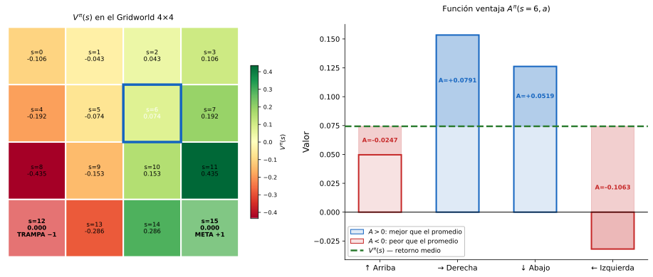

Figure: Comparación de la distribución de valores de $G_t$ (todos positivos) frente a la ventaja. {#fig-ventaja-grad}

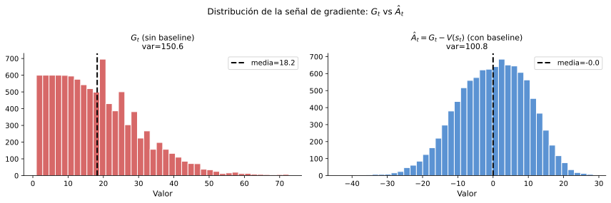

### REINFORCE con Baseline

Podemos estimar $V^\pi(s_t)$ a partir de los propios datos manteniendo una **red de valor** $V_\phi(s)$ con parámetros $\phi$. Tras cada episodio, ajustamos $V_\phi$ a los retornos observados minimizando el error cuadrático medio:

$$
\mathcal{L}(\phi) = \sum_{t=0}^{T-1} \left(G_t - V_\phi(s_t)\right)^2\,.
$$

La estimación de la ventaja se convierte entonces en $\hat{A}_t = G_t - V_\phi(s_t)$.

Es importante destacar que es beneficioso en este caso utilizar tasas de aprendizaje diferentes para la red de política ($\alpha_\theta$) y para la red de valor ($\alpha_\phi$), ya que su naturaleza es distinta. A continuación, mostramos el algoritmo de REINFORCE con baseline:

!!! algorithm "Algoritmo: REINFORCE con baseline"
      **Entradas** Tasas de aprendizaje $\alpha_\theta$, $\alpha_\phi$, descuento $\gamma$, número de episodios $K$

      **Salida** Parámetros de política $\theta$

      1. **Inicializar** $\theta$, $\phi$ aleatoriamente
      2. **Para** cada episodio $i = 1, \ldots, K$:
         1. Generar trayectoria $(s_0, a_0, r_1, \ldots, s_{T-1}, a_{T-1}, r_T)$ siguiendo $\pi_\theta$
         2. Calcular retornos hacia atrás: $G_t = r_{t+1} + \gamma G_{t+1}$, $G_T = 0$
         3. **Para** $t = 0, 1, \ldots, T-1$:
            1. $\hat{A}_t = G_t - V_\phi(s_t)$
            2. $\phi \leftarrow \phi - \alpha_\phi  \nabla_\phi\left(G_t - V_\phi(s_t)\right)^2$
            3. $\theta \leftarrow \theta + \alpha_\theta  \gamma^t  \hat{A}_t  \nabla_\theta \log \pi_\theta(a_t \mid s_t)$

      **devolver** $\theta$

En la práctica, REINFORCE con baseline converge notablemente más rápido que REINFORCE puro (ver ) porque:

- Las actualizaciones están **centradas**, y la señal del gradiente ya no es uniformemente positiva o negativa.
- La varianza de $\hat{A}_t$ es mucho menor que la varianza de $G_t$.

Figure: Convergencia de REINFORCE con baseline frente a REINFORCE estándar. Observamos como la versión con baseline converge de forma más rápida y sin oscilaciones. {#fig-baseline}

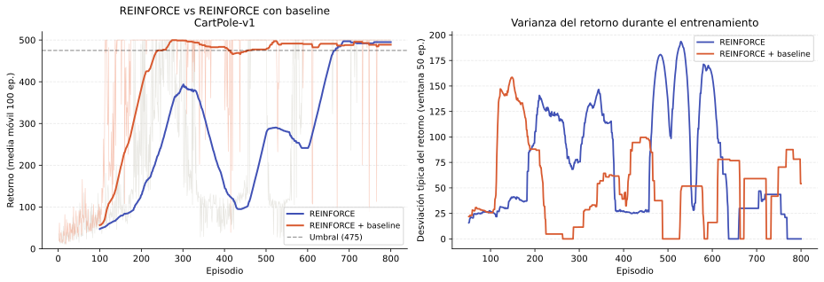

No obstante, seguimos encontrando como limitación que **la actualización sigue siendo por episodios** (Monte Carlo). Debemos esperar al final de cada episodio para calcular $G_t$, lo que impide el aprendizaje en línea. Los métodos Actor-Critic abordan esta limitación.

## Actor-Critic

Como hemos comentado, una desventaja que comparten tanto la versión básica de REINFORCE como su versión con _baseline_ es que son algoritmos _offline_, en los que el agente debe esperar hasta el final del episodio para actualizar los parámetros de la política. La familia de algoritmos Actor-Critic, propuesta por Sutton y Barto [@sutton2018reinforcement] viene a resolver este problema.

En Actor-Critic, denominamos **actor** a la política aprendida $\pi_\theta$, y **crítico** a la red de valor $V_\phi$.

### Retornos de N pasos

Para entender el salto conceptual entre REINFORCE y Actor-Critic conviene introducir brevemente los **retornos de $N$ pasos**. En REINFORCE usamos el retorno completo del episodio:

$$
G_t = r_{t+1} + \gamma r_{t+2} + \gamma^2 r_{t+3} + \cdots + \gamma^{T-1-t} r_T\,,
$$

que corresponde a estimar $Q^\pi(s_t, a_t)$ con todas las recompensas futuras reales. El extremo opuesto es usar únicamente un paso real y sustituir el resto por la estimación del crítico:

$$
G_t^{(1)} = r_{t+1} + \gamma V_\phi(s_{t+1})\,.
$$

Entre ambos extremos existe una familia continua de estimadores de $n$ pasos:

$$
G_t^{(N)} = \left( \sum_{k=0}^{N-1} \gamma^k r_{t+k+1} \right) + \gamma^N V_\phi(s_{t+N})\,.
$$

Con $N \to \infty$ tenemos el retorno Monte Carlo, mientras que con $N = 1$ obtenemos el objetivo TD de un paso. Este planteamiento pone de manifiesto que REINFORCE y Actor-Critic son extremos del mismo espectro, y que la elección de $n$ controla el compromiso entre sesgo (pequeño con $N$ grande, ya que dependemos menos del crítico) y varianza (pequeña con $N$ pequeño, porque promediamos menos ruido estocástico del entorno). Actor-Critic corresponde al caso $N=1$, que veremos a continuación.

### Arquitectura de dos redes

Hemos visto dos grandes familias de métodos de RL: los métodos basados en valor y los métodos basados en gradiente de política. Los métodos **Actor-Critic** combinan lo mejor de ambos mundos:

- El **actor** es la política $\pi_\theta(a|s)$, actualizada mediante gradiente de política.
- El **crítico** (*critic*) es la función de valor $V_\phi(s)$, actualizada mediante Diferencia Temporal (TD).

El cambio fundamental respecto a REINFORCE con _baseline_ es que el **crítico utiliza estimaciones TD** en lugar de retornos Monte Carlo. Esto elimina la necesidad de esperar al final del episodio, permitiendo **actualizaciones en línea, paso a paso**.

La estimación TD de la ventaja en el instante $t$ es:

$$
\hat{A}_t = r_{t+1} + \gamma V_\phi(s_{t+1}) - V_\phi(s_t)\,,
$$

Esta expresión recibe el nombre de **error TD** y se denota habitualmente como $\delta_t$.

Esta cantidad es exactamente la diferencia entre el objetivo (_target_) TD $[r_{t+1} + \gamma V_\phi(s_{t+1})]$ y la estimación actual $V_\phi(s_t)$. La idea es análoga a la regla de actualización de SARSA y Q-Learning ya que en ambos casos se mide la diferencia entre una estimación del valor futuro y la estimación actual. La diferencia es que en los anteriores algoritmos se utilizaba para actualizar $Q(s,a)$, mientras que aquí se aplica como estimador de la ventaja $A^\pi(s_t, a_t)$. Para ver por qué es un estimador válido, debemos considerar que si el crítico estuviera perfectamente entrenado, $V_\phi(s_{t+1}) \approx V^\pi(s_{t+1})$, y entonces:

$$
\mathbb{E}[\delta_t \mid s_t, a_t] = \mathbb{E}[r_{t+1} + \gamma V^\pi(s_{t+1})] - V^\pi(s_t) = Q^\pi(s_t, a_t) - V^\pi(s_t) = A^\pi(s_t, a_t)\,.
$$

Es decir, si el crítico estuviera perfectamente entrenado, $\delta_t$ sería en promedio exactamente $A^\pi(s_t, a_t)$. En la práctica, el error de aproximación de la red introduce un pequeño sesgo. 

El error TD mide cuánto mejor o peor fue la acción tomada respecto a lo que el crítico esperaba en ese estado. En lugar de esperar al final del episodio para conocer el retorno real $G_t$, usamos la recompensa inmediata $r_{t+1}$ más la estimación del valor del siguiente estado $V_\phi(s_{t+1})$ como sustituto del retorno futuro.

A esta técnica de usar la propia estimación aprendida $V_\phi(s_{t+1})$ como sustituto del retorno futuro, en lugar de esperar al valor real observado al final del episodio, se le denomina **bootstrap**. La ventaja es que permite actualizar la política en cada paso de tiempo (o cada $N$ pasos, como hemos visto en el punto anterior) sin esperar al final del episodio, a costa de introducir un pequeño sesgo derivado del error de aproximación del crítico.

De forma análoga a SARSA, así como SARSA hace _bootstrap_ de los valores $Q$, el crítico hace _bootstrap_ de los valores $V$. La diferencia es que aquí la estimación con _bootstrap_ sirve para guiar al actor en lugar de actualizar una tabla $Q$.

En implementaciones basadas en _deep learning_, el actor y el crítico suelen **compartir las capas inferiores** (extracción de características) y divergen únicamente en sus cabezas de salida, lo que mejora la eficiencia en el número de parámetros.

### Actualización TD del Crítico

El crítico se actualiza para minimizar el error TD. Dado que el objetivo TD es $r_{t+1} + \gamma V_\phi(s_{t+1})$, la pérdida del crítico es:

$$
\mathcal{L}(\phi) = \left(r_{t+1} + \gamma V_\phi(s_{t+1}) - V_\phi(s_t)\right)^2 = \delta_t^2\,,
$$

y la actualización es un paso estándar de descenso por gradiente:

$$
\phi \leftarrow \phi - \alpha_\phi  \nabla_\phi \, \delta_t^2.
$$

Destacamos que, como ocurre en Q-Learning, el objetivo TD $r_{t+1} + \gamma V_\phi(s_{t+1})$ se trata como una **constante** al calcular el gradiente (no se diferencia a través de él), ya que queremos mover $V_\phi(s_t)$ hacia un objetivo fijo y no mover ambos extremos simultáneamente, por lo que tenemos:

$$
 \nabla_\phi \, \delta_t^2 = 2 \delta_t \nabla_\phi \, \delta_t = 2 \delta_t \nabla_\phi (- V_\phi(s_t)) = - 2 \delta_t \nabla_\phi V_\phi(s_t).
$$

Por este motivo, podemos reescribir la regla de actualización del crítico como:

$$
\phi \leftarrow \phi + \alpha_\phi  \delta_t  \nabla_\phi V_\phi(s_t)\,.
$$

La actualización del actor utiliza el error TD como estimación de la ventaja:

$$
\theta \leftarrow \theta + \alpha_\theta  \delta_t  \nabla_\theta \log \pi_\theta(a_t \mid s_t)\,.
$$

El factor $\gamma^t$ que aparecía en REINFORCE ha desaparecido aquí. En el caso episódico con horizonte largo, este factor tiende a cero a medida que avanza el episodio, reduciendo las actualizaciones de los pasos tardíos de forma innecesaria. En la práctica, los métodos Actor-Critic paso a paso omiten $\gamma^t$ o lo tratan implícitamente mediante el descuento acumulado en el crítico, lo que simplifica la implementación sin afectar significativamente al rendimiento empírico.

Figure: Arquitectura de los modelos Actor-Critic. {#fig-ac-arq}

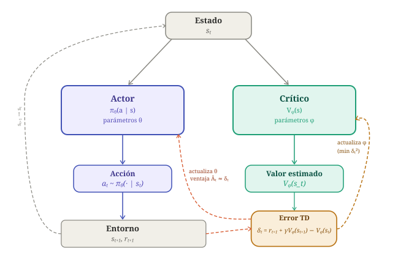

En la  se ilustra la arquitectura general de los modelos Actor-Critic.

### Algoritmo

A continuación mostramos el algoritmo básico Actor-Critic con actualización TD en cada paso:

!!! algorithm "Algoritmo: Actor-Critic"

      **Entradas:** Tasas de aprendizaje $\alpha_\theta$, $\alpha_\phi$, descuento $\gamma$, número de episodios $K$

      **Salida:** Política $\pi_\theta$, función de valor $V_\phi$

      1. **Inicializar** $\theta$, $\phi$ aleatoriamente
      2. **Para** cada episodio $i = 1, \ldots, K$:
         1. $s_t \leftarrow \text{estado inicial}$
         2. **Repetir** hasta que el episodio termine:
            1. Muestrear $a_t \sim \pi_\theta(\cdot \mid s_t)$
            2. Ejecutar $a_t$ y observar $r_{t+1}$, $s_{t+1}$, $\text{done}$
            4. Calcular error TD: 
                  1. $\delta_t = r_{t+1} - V_\phi(s_t)$ **si** $\text{done}$ 
                  2. $\delta_t = r_{t+1} + \gamma V_\phi(s_{t+1}) - V_\phi(s_t)$ en otro caso (aplicando _bootstrap_)
            5. **Actualización del crítico**: $\phi \leftarrow \phi + \alpha_\phi \, \delta_t \, \nabla_\phi V_\phi(s_t)$
            6. **Actualización del actor**: $\theta \leftarrow \theta + \alpha_\theta \, \delta_t \, \nabla_\theta \log \pi_\theta(a_t \mid s_t)$
            7. $s_t \leftarrow s_{t+1}$

      **devolver** $\theta$, $\phi$

El algoritmo anterior realiza la estimación en cada paso, utilizando el retorno inmediato $r_{t+1}$ y haciendo _bootstrap_ del futuro con la estimación del crítico $V_\phi(s_{t+1})$, lo cual se conoce como método TD(0). Sin embargo, podríamos generalizarlo para utilizar retornos de $N$ pasos. En este caso, una vez el agente haya realizado $N$ pasos de simulación utilizaremos las $N$ recompensas obtenidas $r_{t+1}, \ldots, r_{t+N}$ y estimaremos el valor futuro del siguiente estado $s_{t+N}$ mediante _bootstrap_ con $V_\phi(s_{t+N})$:

$$
G_t^{(N)} = \left( \sum_{k=0}^{N-1} \gamma^k r_{t+k+1} \right) + \gamma^N V_\phi(s_{t+N})\,.
$$

A continuación mostramos el algoritmo generalizado para $N$ pasos. En este caso, el agente recopila un bloque de $N$ transiciones antes de actualizar (a este bloque se le denomina _rollout_) y utiliza las $N$ recompensas observadas para calcular un retorno más informado antes de hacer _bootstrap_ con $V_\phi(s_{N})$. Este concepto de _rollout_ será central en PPO, donde se recopila un _rollout_ de longitud fija y se realizan múltiples épocas de actualización sobre él antes de descartarlo.

!!! algorithm "Algoritmo: Actor-Critic con N pasos"

      **Entradas:** Tasas de aprendizaje $\alpha_\theta$, $\alpha_\phi$, 
      descuento $\gamma$, longitud de secuencia $N$, 
      número de pasos de entorno $K$

      **Salida:** Política $\pi_\theta$, función de valor $V_\phi$

      1. **Inicializar** $\theta$, $\phi$ aleatoriamente
      2. **Mientras** pasos de entorno $< K$:
         1. Recopilar una secuencia $\tau$ de hasta $N$ transiciones 
            $(s_t, a_t, r_{t+1}, s_{t+1})$ siguiendo $\pi_\theta$, 
            deteniéndose antes si el episodio termina
         2. Restablecer a $0$ los gradientes: $g_\theta \leftarrow 0$, $g_\phi \leftarrow 0$
         3. **Para** $t = 0, 1, \ldots, N-1$:
            1. Calcular retorno de $N$ pasos desde $t$:
               $G_t = \sum_{k=t}^{N-1} \gamma^{k-t} r_{k+1}$
            2. Aplicar _bootstrap_ si $s_N$ no es terminal:
               $G_t \leftarrow G_t + \gamma^{N-t} V_\phi(s_N)$
            3. Calcular ventaja: $\delta_t = G_t - V_\phi(s_t)$
            4. Acumular gradiente del crítico: 
               $g_\phi \leftarrow g_\phi + \delta_t \, \nabla_\phi V_\phi(s_t)$
            5. Acumular gradiente del actor: 
               $g_\theta \leftarrow g_\theta + \delta_t \, \nabla_\theta \log \pi_\theta(a_t \mid s_t)$
         4. **Actualización del crítico**: $\phi \leftarrow \phi + \alpha_\phi \, g_\phi$
         5. **Actualización del actor**: $\theta \leftarrow \theta + \alpha_\theta \, g_\theta$

      **devolver** $\theta$, $\phi$

Figure: Comparativa de Actor-Critic con diferentes número de pasos $N$. En CartPole, valores pequeños de $N$ convergen más rápido al ser la recompensa densa y los episodios cortos. Con $N$ grande el comportamiento se asemeja a Monte Carlo, con mayor varianza y tendencia a oscilar. {#fig-npasos}

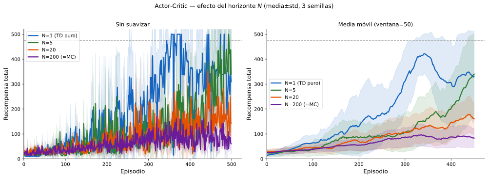

### Comparación con REINFORCE

La tabla siguiente resume las diferencias clave:

| Propiedad | REINFORCE | REINFORCE+Baseline | Actor-Critic TD(0) | Actor-Critic (N)
|---|---|---|---|---|
| Estimación de ventaja | $G_t$ | $G_t - V_\phi(s_t)$ | $\delta_t$ (TD) | $G_t^{(N)} - V_\phi(s_t)$
| Frecuencia de actualización | Fin de episodio | Fin de episodio | Cada paso  | Cada $N$ pasos
| Sesgo | Ninguno (MC) | Ninguno (MC)$^*$ | Mayor (TD) | Menor que TD 
| Varianza | Alta | Media | Baja | Media-baja
| Maneja entornos no episódicos | ✗ | ✗ | ✓ | ✓

> ($^*$) No introduce sesgo el estimador de la ventaja, al utilizar Monte Carlo. La red de valor $V_\phi$ sí que puede introducir un pequeño error de aproximación.

En la práctica, Actor-Critic converge **más rápido y de forma más estable** que REINFORCE porque el crítico TD proporciona una señal de baja varianza y actualizada continuamente, al coste de un pequeño sesgo introducido por el bootstrap. 

La versión con $N$ pasos además tiene la ventaja de permitir paralelizar la recopilación de _rollout_, lo cual es la base de los algoritmos A3C y A2C que veremos en la siguiente sección.

### Variantes y mejoras

El algoritmo Actor-Critic básico presentado opera con un único entorno y actualiza
en cada paso. En la práctica se han propuesto varias mejoras sobre este esquema:

**A3C (Asynchronous Advantage Actor-Critic)** [@mnih2016asynchronous] lanza $N$
trabajadores en paralelo, cada uno con su propia copia del entorno, que actualizan
los parámetros de forma asíncrona e independiente. El paralelismo reduce el tiempo
de entrenamiento y la correlación entre muestras consecutivas.

**A2C (Advantage Actor-Critic)** es una variante síncrona de A3C, con la que en lugar de
actualizar de forma asíncrona, espera a que todos los trabajadores completen un
fragmento de trayectoria y promedia sus gradientes antes de actualizar:

$$\nabla_\theta J(\theta) \approx \frac{1}{N} \sum_{i=1}^{N} \delta_t^{(i)}
\nabla_\theta \log \pi_\theta(a_t^{(i)} \mid s_t^{(i)})$$

Este promedio es equivalente a aumentar el tamaño del _batch_ en aprendizaje
supervisado, reduciendo la varianza del gradiente sin modificar la lógica subyacente
del algoritmo. En la práctica A2C produce resultados equivalentes o mejores que
A3C con una implementación más sencilla.

**Regularización por entropía:** La idea de añadir un bonus de entropía para fomentar la exploración fue introducida por Williams [@williams1992simple] y posteriormente popularizada por A3C y A2C [@mnih2016asynchronous]. Estos algoritmos introducen un término $\beta  \nabla_\theta H(\pi_\theta(\cdot|s_t))$ en la actualización del actor, dirigido a fomentar la exploración. Se trata de un **bonus de entropía**, donde $H(\pi) = -\sum_a \pi(a|s) \log \pi(a|s)$ es la entropía de la política. Maximizar la entropía incentiva que la política **permanezca estocástica** y evita una convergencia prematura a una política determinista subóptima. Se trata de una versión más suave de la exploración $\epsilon$-_greedy_ que usamos en Q-Learning. El coeficiente $\beta$ es un hiperparámetro pequeño (p.ej. $0{,}01$), que regula la influencia de este bonus. Este término se ha convertido en un componente estándar de las implementaciones modernas, y con él la actualización del actor queda de la siguiente forma:

$$
\theta \leftarrow \theta + \alpha_\theta  \delta_t  \nabla_\theta \log \pi_\theta(a_t \mid s_t) + \beta  \nabla_\theta H(\pi_\theta(\cdot|s_t))
$$

PPO, que veremos a continuación, parte de A2C y añade mejoras orientadas a estabilizar el entrenamiento y mejorar la eficiencia de muestras.

## Proximal Policy Optimization (PPO)

Podemos ver Proximal Policy Optimization (PPO) [@schulman2017proximal] como una
evolución de A2C que resuelve **dos problemas prácticos** importantes que veremos a continuación: la inestabilidad por actualizaciones grandes y la ineficiencia en el uso de datos. Constituye en la actualidad el principal algoritmo del estado del arte en Aprendizaje por Refuerzo.

### Problemas de los métodos estándar de gradiente de política

Una cuestión previa que debemos tener en cuenta sobre los métodos basados en gradiente de política es que nuestro _dataset_ se genera a partir de la propia política que estamos estimando. Una mala política puede producir que no se generen datos con la calidad suficiente como para poder estimar una mejor política, teniendo de esta forma el problema de la "pescadilla que se muerde la cola". Por ello, hemos visto que es importante una buena inicialización que genere una política que nos permita explorar todas las posibles acciones. Sin embargo, a pesar de inicializar de forma adecuada, la dependencia de la política para generar datos de entrenamiento puede llevarnos a otros problemas que veremos a continuación.

#### Inestabilidad por actualizaciones grandes

Los métodos Actor-Critic actualizan la política aplicando un paso de gradiente
sobre las estimaciones de ventaja del _rollout_ actual. Esto plantea un problema
que puede parecer menor pero que resulta crítico en la práctica: si el paso de
gradiente desplaza $\theta$ demasiado, la nueva política $\pi_{\theta_\text{new}}$
puede volverse muy diferente de $\pi_{\theta_\text{old}}$.

Para entender por qué esto es peligroso, pensemos en lo que ocurre cuando el
gradiente es grande y la tasa de aprendizaje no lo compensa suficientemente.
El optimizador da un paso grande en la dirección de mayor mejora estimada, y una vez que $\theta$ ha cambiado mucho, la política podría entrar en una región del espacio
de parámetros donde se comporta de forma completamente diferente, y potencialmente mucho peor, sin que el gradiente pueda detectarlo a tiempo para escapar de esa zona. Este fenómeno se conoce como **olvido catastrófico**, y consiste en que el agente pierde comportamientos aprendidos previamente y puede no ser capaz de recuperarlos.

Esto motiva la idea de los métodos de **región de confianza** (*trust region*), que buscan
restringir cada actualización para que la nueva política se mantenga *cerca* de la antigua en un sentido bien definido, garantizando que el agente mejora de forma gradual y estable.

#### Ineficiencia en el uso de datos

El segundo problema es de naturaleza diferente, y viene de que los métodos Actor-Critic y
A2C son **on-policy**, lo que significa que los datos del _rollout_ deben haber
sido generados por la política actual $\pi_\theta$. En consecuencia, cada
_rollout_ se usa para una única actualización y luego se descarta, porque en
cuanto $\theta$ cambia, los datos ya no son representativos de la nueva política.

Esto hace que estos métodos sean muy **ineficientes en el uso de datos**, ya que cada
transición $(s_t, a_t, r_{t+1}, s_{t+1})$ se emplea una sola vez. En entornos
donde la interacción con el entorno es costosa, como por ejemplo en robótica física
o en simulaciones lentas, esto supone un problema serio.

Sería deseable poder realizar **múltiples actualizaciones** sobre el mismo
_rollout_ antes de descartarlo. Pero si actualizamos $\theta$ varias veces, la
política cambia en cada iteración y los datos, que se recopilaron con
$\pi_{\theta_\text{old}}$, dejan de ser _on-policy_. Usarlos directamente
introduciría un sesgo, porque las acciones se muestrearon con probabilidades
distintas a las que asigna la política actual.

Figure: Frecuencia de actualización de la política. REINFORCE y REINFORCE con baseline son _offline_, y necesitan ver un episodio completo, mientras que Actor-Critic y PPO permiten el aprendizaje _online_. En el caso de Actor-Critic permite realizar una actualización en cada paso, mediante TD, mientras que PPO recopila un _rollout_ de N pasos y entrena la política con él. {#fig-freq}

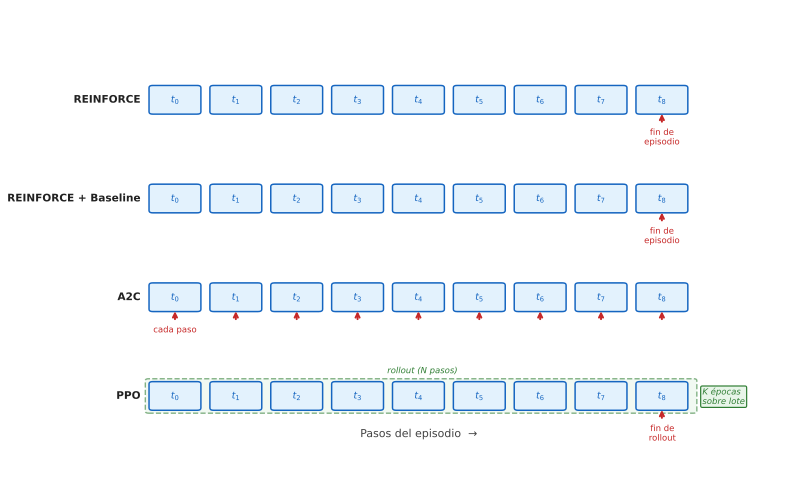

### Importance Sampling

La solución al segundo de los anteriores problemas es el **importance sampling**, una técnica estadística que permite estimar el valor esperado de una función bajo una
distribución $\pi_\theta$ usando muestras generadas por una distribución
diferente $\pi_{\theta_\text{old}}$, siempre que se corrija el desajuste
multiplicando cada muestra por el cociente de probabilidades:

$$
\mathbb{E}_{a \sim \pi_\theta}\!\left[f(a)\right]
= \mathbb{E}_{a \sim \pi_{\theta_\text{old}}}\!\left[
  \frac{\pi_\theta(a \mid s)}{\pi_{\theta_\text{old}}(a \mid s)} f(a)
\right]
$$

Podemos verlo de forma intuitiva de la siguiente forma: si la nueva política asigna el doble de probabilidad a una acción que la antigua, esa acción está infrarrepresentada en los datos
del _rollout_ (con la nueva política se tomaría la acción con mayor frecuencia), y hay que compensarlo dándole el doble de peso. Si la nueva política asigna la mitad de probabilidad, la acción está sobrerrepresentada y hay que reducir su influencia a la mitad.

Los métodos de gradiente de política basados en ventaja optimizan implícitamente el objetivo $J(\theta) = \mathbb{E}_t[\hat{A}_t]$, es decir, queremos que la política elija acciones con ventaja positiva. Para poder reutilizar datos de $\pi_{\theta_\text{old}}$​​ aplicamos **importance sampling** sobre este objetivo, tomando $f(a_t) = \hat{A}_t$ en la expresión anterior, con lo que tenemos:

$$
J(\theta) 
= \mathbb{E}_{a_t \sim \pi_{\theta_\text{old}}}\!\left[
  \frac{\pi_\theta(a_t \mid s_t)}{\pi_{\theta_\text{old}}(a_t \mid s_t)}
  \hat{A}_t
\right]
= \mathbb{E}_t\!\left[r_t(\theta)\, \hat{A}_t\right], 
$$

donde definimos el **cociente de probabilidades**:

$$
r_t(\theta) = \frac{\pi_\theta(a_t \mid s_t)}{\pi_{\theta_\text{old}}(a_t \mid s_t)}
$$

Cuando $r_t(\theta) = 1$ ambas políticas asignan la misma probabilidad a $a_t$
y no es necesaria ninguna corrección. Cuando $r_t(\theta) > 1$ la nueva política
considera $a_t$ más probable que la antigua, y cuando $r_t(\theta) < 1$ la
considera menos probable.

Es importante destacar que en el cociente $r_t(\theta)$  el denominador $\pi_{\theta_\text{old}}(a_t \mid s_t)$ es una constante, calculada una vez cuando se recopila el _rollout_ y congelada a partir de ese momento. El numerador $\pi_\theta(a_t \mid s_t)$ es la única parte que cambia cuando actualizamos $\theta$.

Por lo tanto, maximizar $J(\theta) = \mathbb{E}_t[r_t(\theta)\hat{A}_t]$ es equivalente a ajustar $\pi_\theta$​ para que asigne mayor probabilidad a las acciones con ventaja positiva ($\hat{A}_t > 0$) y menor probabilidad a las acciones con ventaja negativa ($\hat{A}_t < 0$), exactamente como hacíamos en REINFORCE. La diferencia es que ahora el denominador actúa como una escala: si $\pi_{\theta_\text{old}}$​​ ya asignaba probabilidad alta a una acción, el cociente crece más despacio y la actualización es más conservadora. Si $\pi_{\theta_\text{old}}$​​ asignaba probabilidad baja, el cociente puede crecer muy rápido con un pequeño cambio en $\theta$, lo que sin restricciones produciría una actualización demasiado grande.

Gracias a _importance sampling_, podemos optimizar $J(\theta)$ usando datos de
$\pi_{\theta_\text{old}}$, lo que en principio permite hacer múltiples
actualizaciones sobre el mismo _rollout_.

Sin embargo, el _importance sampling_ solo funciona bien cuando las dos
distribuciones ($\pi_\theta$ y $\pi_{\theta_\text{old}}$) no son demasiado
diferentes. Si $\theta$ se aleja mucho de $\theta_\text{old}$, los cocientes
$r_t(\theta)$ se vuelven muy grandes o muy pequeños, la corrección pierde
fiabilidad estadística y el estimador del gradiente se vuelve inestable.
Dicho de otra forma, sin restricciones, maximizar $\mathbb{E}_t[r_t(\theta)
\hat{A}_t]$ empujaría $r_t(\theta)$ hacia el infinito siempre que $\hat{A}_t > 0$,
lo que produciría exactamente el **olvido catastrófico** descrito en el primero de los problemas planteados anteriormente.

Realmente **los dos problemas planteados convergen en la misma solución**, y es que necesitamos mantener $r_t(\theta)$ cerca de $1$, es decir, mantener la nueva política cerca de la antigua. Esto resuelve simultáneamente la inestabilidad de las actualizaciones
grandes y garantiza que el _importance sampling_ sea una corrección válida para
las épocas adicionales.

### El objetivo con _clipping_

PPO implementa esta restricción con una idea simple pero efectiva, que consiste en que en lugar de añadir una penalización explícita cuando $r_t(\theta)$ se aleja de $1$ (como
hacía su predecesor TRPO [@schulman2015trpo], que requería optimización de segundo orden),
simplemente **recorta el cociente** para que el gradiente se anule fuera de
la región de confianza $[1-\epsilon, 1+\epsilon]$:

$$
\boxed{
J^{\text{CLIP}}(\theta) = \mathbb{E}_t\!\left[
  \min\!\left(
    r_t(\theta)\,\hat{A}_t,\;\;
    \text{clip}\!\left(r_t(\theta), 1-\epsilon, 1+\epsilon\right)\hat{A}_t
  \right)
\right]
}
$$

donde $\epsilon$ es un hiperparámetro pequeño (típicamente $0.1$ ó $0.2$) y
$\text{clip}(x, l, u) = \max(l, \min(u, x))$.

El comportamiento del $\min$ depende del signo de la ventaja. Analicemos cada
caso por separado:

**Cuando $\hat{A}_t > 0$**, la acción fue mejor que el promedio, y queremos
reforzarla aumentando la probabilidad de $a_t$:

- Si $r_t \leq 1+\epsilon$: La probabilidad de $a_t$ no ha aumentado todavía más de un factor $1+\epsilon$ respecto a $\pi_{\theta_\text{old}}$, por lo que el recorte no está activo y el gradiente sigue empujando en la dirección correcta.
- Si $r_t > 1+\epsilon$: La política ya ha aumentado la probabilidad de $a_t$​ en más de un factor $1+\epsilon$. El _clipping_ detiene la actualización, haciendo que aumentar  $\pi_\theta(a_t \mid s_t)$ más allá de ese punto ya no mejore el objetivo recortado. El efecto práctico al aplicar _clipping_ será que al pasar a ser la función objetivo una constante $(1+\epsilon)\hat{A}_t​$, el gradiente respecto a $\theta$ será $0$, y por lo tanto se detiene la actualización.

**Cuando $\hat{A}_t < 0$** la acción fue peor que el promedio, y queremos
penalizarla reduciendo la probabilidad de $a_t$:

- Si $r_t \geq 1-\epsilon$: La probabilidad de $a_t$​ no ha disminuido más de un factor $1-\epsilon$, por lo que el _clipping_ no está activo y el gradiente sigue penalizando la acción.

- Si $r_t < 1-\epsilon$: La política ya ha reducido la probabilidad de $a_t$​ en más de un factor $1-\epsilon$. El _clipping_ detiene la actualización, haciendo que reducir  $\pi_\theta(a_t \mid s_t)$ más allá de ese punto ya no mejore el objetivo recortado. En este caso la función objetivo pasa a ser una constante $(1-\epsilon)\hat{A}_t​$ y se detiene la actualización de la política.

Figure: Función objetivo de PPO con recorte, en función de si el valor de la ventaja es positivo o negativo. {#fig-clip}

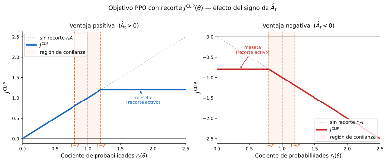

En ambos casos la idea es la misma: PPO permite actualizar la política libremente mientras el cambio sea moderado $r_t \in [1-\epsilon, 1+\epsilon]$, pero deja de dar señal de gradiente en cuanto la política se ha alejado lo suficiente de $\pi_{\theta_\text{old}}$​ (ver )​. Esto garantiza que el _importance sampling_ siga siendo una corrección válida en todas las épocas del _rollout_.

Podemos considerar este recorte como una restricción unilateral que desincentiva los movimientos fuera de la región de confianza sin penalizar los movimientos conservadores. 

Figure: Efecto del clipping en PPO. Sin clipping la convergencia es más lenta y con mayores oscilaciones. {#fig-clip-exp}

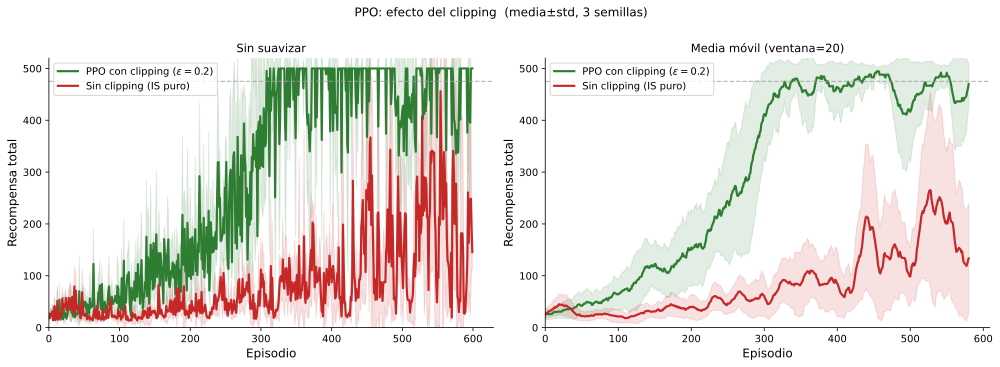

### Estimación Generalizada de Ventaja (GAE)

En Actor-Critic básico estimábamos la ventaja con el error TD de un paso ($N=1$), y en la versión de $N$ pasos con un retorno fijo de horizonte $N$. Ambas opciones presentan un problema en el contexto de PPO, ya que el _rollout_ tiene una longitud fija $N$, y elegir un único horizonte para estimar la ventaja obliga a aceptar el sesgo de TD puro ($N=1$) o la varianza de Monte Carlo ($N \to \infty$) sin posibilidad de ajuste. Esto es especialmente crítico en PPO porque las ventajas $\hat{A}_t$​ se calculan una sola vez al inicio, antes de las épocas de actualización, y se reutilizan en todas ellas. Si la estimación de ventaja es ruidosa (alta varianza), las múltiples épocas de actualización amplifican ese ruido en lugar de promediarlo, produciendo actualizaciones inestables. Si es sesgada (TD puro con crítico impreciso), todas las épocas optimizan en la dirección equivocada. 

En la práctica, PPO no estima la ventaja con un único error TD de un paso,
sino con una combinación ponderada de estimadores de todos los horizontes
$n \in [1, N]$ dentro del _rollout_, conocida como **Estimación Generalizada
de Ventaja** (*Generalized Advantage Estimation*, GAE) [@schulman2016gae]. De esta forma, GAE busca un compromiso óptimo entre sesgo y varianza mediante un parámetro $\lambda$ que ajusta la influencia de cada horizonte en la combinación, sin necesidad de fijar un horizonte concreto. Vamos a ver a continuación cómo se define esta estimación.

Como vimos en la sección de retornos de $N$ pasos, el estimador de $n$ pasos
de la ventaja es:

$$
\hat{A}_t^{(n)} = \sum_{k=0}^{n-1} \gamma^k r_{t+k+1}
                  + \gamma^n V_\phi(s_{t+n}) - V_\phi(s_t)
$$

Como hemos comentado, usar un $n$ pequeño introduce más sesgo (dependemos más del crítico, que puede ser inexacto) pero menos varianza. Usar un $n$ grande reduce el sesgo pero aumenta la varianza. En lugar de elegir un único $n$, GAE promedia todos los
estimadores con pesos que decaen exponencialmente con $n$, controlados por un
parámetro $\lambda \in [0,1]$:

$$
\hat{A}_t^{\text{GAE}(\gamma,\lambda)}
= (1-\lambda)\sum_{n=1}^{\infty} \lambda^{n-1} \hat{A}_t^{(n)}
$$

Esta expresión puede calcularse eficientemente en una única pasada hacia atrás
sobre el _rollout_. Definiendo $\delta_t = r_{t+1} + \gamma V_\phi(s_{t+1}) -
V_\phi(s_t)$ como el error TD de un paso, se puede demostrar que:

$$
\hat{A}_t^{\text{GAE}(\gamma,\lambda)} = \sum_{l=0}^{T-t-1} (\gamma\lambda)^l
\,\delta_{t+l}
$$

El parámetro $\lambda$ controla directamente el compromiso sesgo-varianza:

- **$\lambda = 0$**: $\hat{A}_t^{\text{GAE}} = \delta_t$ (TD puro, un paso).
  Baja varianza, sesgo mayor si el crítico no es exacto.
- **$\lambda = 1$**: $\hat{A}_t^{\text{GAE}} = G_t - V_\phi(s_t)$ (Monte Carlo
  sobre el _rollout_). Sin sesgo adicional del crítico, pero mayor varianza.
- **$0 < \lambda < 1$** (Interpolación suave). En la práctica se usan valores como $\lambda = 0.95$, que dan más peso a los errores TD próximos y reducen progresivamente la influencia de los más lejanos.

<!-- Figura fig_gae_lambda.svg -->

Figure: Comparativa de PPO con diferentes valores de $\lambda$ para GAE. Vemos empíricamente que valores entre 0.9 y 0.95 nos dan el mejor compromiso entre sesgo y varianza. {#fig-gae}

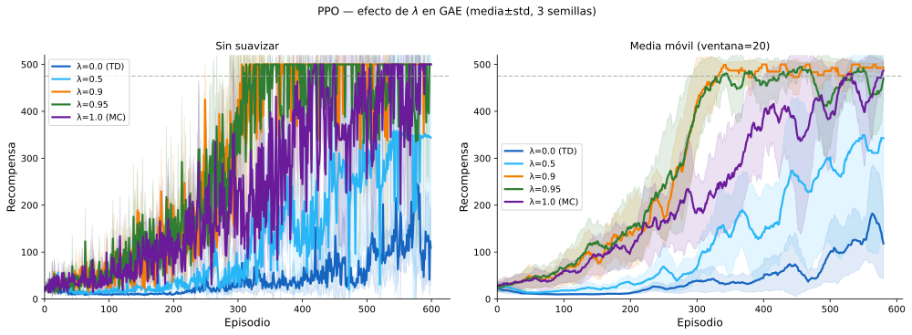

### PPO en la práctica

PPO combina todas las ideas anteriores en un único bucle de entrenamiento con
dos fases claramente diferenciadas:

**Fase 1: Rollout.** Se recopilan $N$ pasos de interacción con el entorno
siguiendo la política actual, se calculan las ventajas GAE y se congela
$\theta_\text{old} \leftarrow \theta$.

**Fase 2: Actualización.** Se realizan $K_\text{epoch}$ épocas de
optimización sobre el _rollout_, procesando los datos en minilotes de tamaño
$M$. En cada minilote se calcula el cociente $r_t(\theta) =
\pi_\theta(a_t|s_t) / \pi_{\theta_\text{old}}(a_t|s_t)$ con la política
actual (que va cambiando en cada época) y la política congelada. El _clipping_
garantiza que aunque se hagan múltiples épocas, la política no se aleje
demasiado de $\pi_{\theta_\text{old}}$, manteniendo válido el _importance
sampling_.

La pérdida completa de PPO combina tres términos:

$$
\mathcal{L}^{\text{PPO}}(\theta, \phi) =
  -J^{\text{CLIP}}(\theta)
  + c_1 \mathcal{L}^{\text{VF}}(\phi)
  - c_2 H(\pi_\theta)
$$

donde:

- $J^{\text{CLIP}}(\theta)$: Objetivo de política. Dado que buscamos **maximizar** esta función objetivo, pero estamos minimizando la pérdida $\mathcal{L}^{\text{PPO}}$, le ponemos un signo negativo.
- $\mathcal{L}^{\text{VF}}(\phi) = \mathbb{E}_t[(V_\phi(s_t) -
  \hat{G}_t)^2]$: Pérdida del crítico (error cuadrático medio respecto al
  retorno objetivo $\hat{G}_t = \hat{A}_t + V_\phi(s_t)$).
- $H(\pi_\theta)$: Bonus de entropía para mantener la exploración. PPO adopta este elemento que se introdujo en predecesores como A2C.
- $c_1, c_2$: Coeficientes de ponderación.

!!! algorithm "Algoritmo: PPO (Proximal Policy Optimization)"

      **Entradas:** Parámetro de recorte $\epsilon$, épocas por actualización
      $K_\text{epoch}$, tamaño de minilote $M$, pasos por rollout $N$,
      coeficientes $c_1$, $c_2$, parámetro GAE $\lambda$, descuento $\gamma$

      **Salida:** Parámetros de política $\theta$, parámetros de valor $\phi$

      1. **Inicializar** $\theta$, $\phi$ aleatoriamente
      2. **Repetir** hasta convergencia:
         1. **Fase de rollout**: recopilar $N$ transiciones
            $(s_t, a_t, r_{t+1}, s_{t+1})$ siguiendo $\pi_\theta$
         2. Calcular errores TD:
            $\delta_t = r_{t+1} + \gamma V_\phi(s_{t+1}) - V_\phi(s_t)$ (con $V_\phi(s_{t+1})=0$ si $s_{t+1}$ es terminal)
         3. Calcular ventajas GAE en pasada hacia atrás:
            $\hat{A}_t = \sum_{l \geq 0}(\gamma\lambda)^l \delta_{t+l}$
         4. Calcular retornos objetivo: $\hat{G}_t = \hat{A}_t + V_\phi(s_t)$
         5. Congelar política antigua: $\theta_\text{old} \leftarrow \theta$
         6. **Para** cada época $k = 1, \ldots, K_\text{epoch}$:
            1. **Para** cada minilote de tamaño $M$ del rollout:
               1. Calcular cocientes:
                  $r_t(\theta) = \pi_\theta(a_t \mid s_t) /
                  \pi_{\theta_\text{old}}(a_t \mid s_t)$
               2. Calcular pérdida:
                  $\mathcal{L} =
                    -\mathbb{E}\!\left[\min\!\left(r_t \hat{A}_t,\,
                    \text{clip}(r_t, 1\!-\!\epsilon, 1\!+\!\epsilon)
                    \hat{A}_t\right)\right]$
                  $+ c_1\, \mathbb{E}\!\left[(V_\phi(s_t) -
                    \hat{G}_t)^2\right]
                    - c_2\, \mathbb{E}\!\left[H(\pi_\theta(\cdot \mid
                    s_t))\right]$
               3. Actualizar $\theta$, $\phi$ por descenso de gradiente
                  sobre $\mathcal{L}$

      **devolver** $\theta$, $\phi$

> El algoritmo presentado sigue la formulación del paper original [@schulman2017proximal], donde actor y crítico se optimizan conjuntamente mediante una única función de pérdida. Esto es especialmente conveniente cuando ambas redes comparten capas inferiores. En implementaciones donde actor y crítico son redes completamente separadas, es equivalente actualizarlos de forma independiente, como se hace en Actor-Critic básico, omitiendo el coeficiente $c_1$​.

Figure: Comparativa de PPO con diferentes números de épocas de entrenamiento. El rendimiento mejora al incrementar $K$, pero se estanca con valores superiores a 10. {#fig-kepochs}

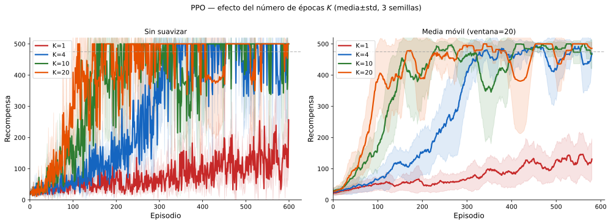

### Consideraciones finales

PPO aborda directamente los dos problemas que se planteaban al inicio:

- **Estabilidad:** El _clipping_ impide actualizaciones catastróficas sin
  necesitar la optimización de segundo orden que requería su predecesor TRPO,
  lo que lo hace sencillo de implementar y computacionalmente eficiente.
- **Eficiencia de muestras:** Las múltiples épocas sobre el mismo _rollout_,
  corregidas por _importance sampling_ y limitadas por el _clipping_, extraen
  mucho más aprendizaje de cada interacción con el entorno que A2C.

Se ha convertido en el **estándar de facto** en RL profundo para control
continuo, robótica y de manera especialmente relevante en el
**Aprendizaje por Refuerzo a partir de Retroalimentación Humana (RLHF)**,
la técnica utilizada para ajustar los grandes modelos de lenguaje como
ChatGPT, Claude o Gemini para que sigan instrucciones y se alineen con las
preferencias humanas.

Figure: Comparativa de la curva de aprendizaje de diferentes modelos. Para comparar en igualdad de condiciones, para todos ellos es utiliza la misma arquitectura de red neuronal, con una cabeza para la política y otra cabeza para el valor. Se puede observar como PPO proporciona la curva que converge más rápidamente y con menor número de oscilaciones. {#fig-comparativa}

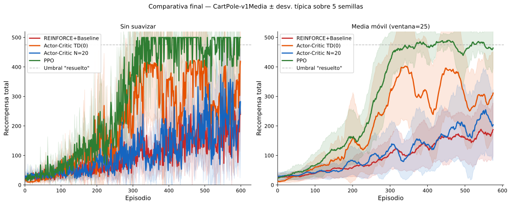

## Resumen

La siguiente tabla sitúa todos los algoritmos de Aprendizaje por Refuerzo vistos tanto en la asignatura de Agentes Inteligentes como en Aprendizaje Avanzado:

| Algoritmo | Paradigma | Sin modelo | En línea | Función V/Q | Función de política |
|---|---|---|---|---|---|
| Iteración de Valor | PD | ✗ | ✗ | $V(s)$ | derivada |
| Monte Carlo MDP | Basado en valor | ✓ | ✗ | $Q(s,a)$ | $\epsilon$-greedy |
| SARSA | Basado en valor | ✓ | ✓ | $Q(s,a)$ | $\epsilon$-greedy |
| Q-Learning | Basado en valor | ✓ | ✓ | $Q(s,a)$ | $\epsilon$-greedy |
| DQN | Basado en valor | ✓ | ✓ | $\hat{Q}_\theta(s,a)$ | $\epsilon$-greedy |
| REINFORCE | **Basado en política** | ✓ | ✗ | — | $\pi_\theta(a \mid s)$ |
| REINFORCE+B | **Basado en política** | ✓ | ✗ | $V_\phi(s)$ | $\pi_\theta(a \mid s)$ |
| Actor-Critic | **Actor-Critic** | ✓ | ✓ (TD(0) o N pasos) | $V_\phi(s)$ | $\pi_\theta(a \mid s)$ |
| PPO | **Actor-Critic** | ✓ | ✓ (por _rollouts_) | $V_\phi(s)$ | $\pi_\theta(a\mid s)$ |

La idea fundamental de este tema es que **optimizar la política directamente**, en lugar de derivarla de una función de valor, abre la puerta a los espacios de acción continuos, a las políticas óptimas estocásticas y a las nuevas técnicas de alineamiento que dan soporte a los grandes modelos de lenguaje actuales.
