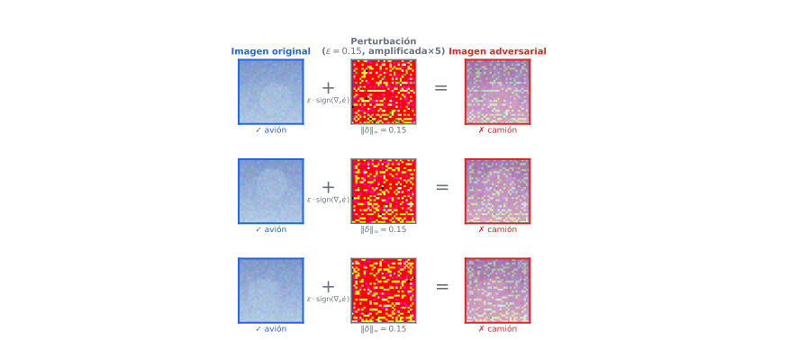
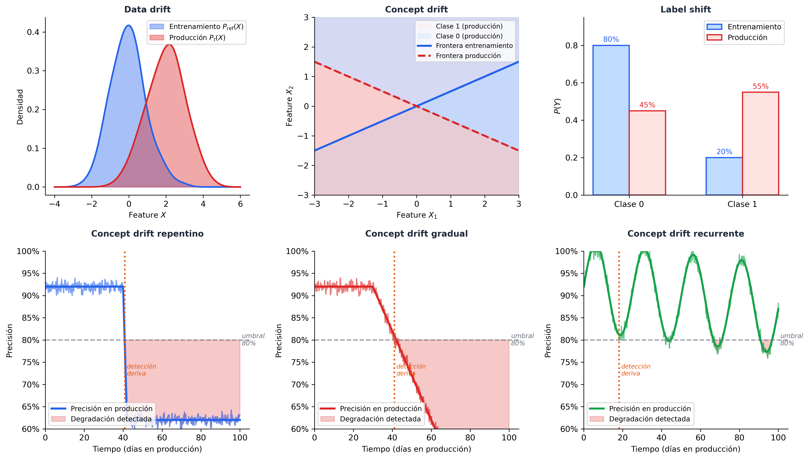
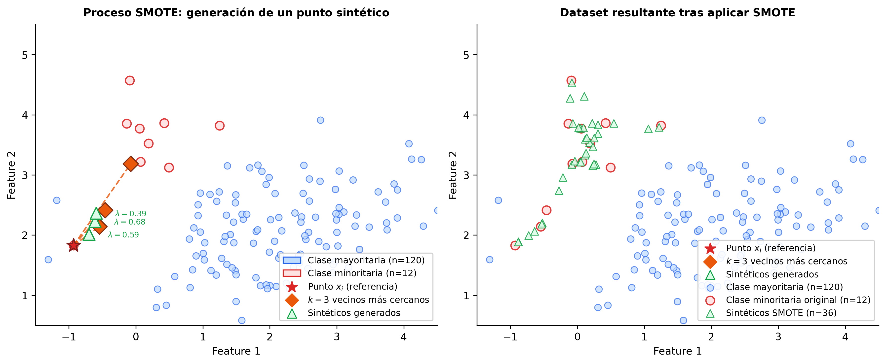

# Aprendizaje Automático en Problemas del Mundo Real

A lo largo de la asignatura hemos estudiado algoritmos de ML bajo el supuesto de que disponemos de un _dataset_ limpio, estático y representativo, lo entrenamos, lo evaluamos y reportamos métricas. Este modelo de trabajo es útil para aprender los fundamentos, pero es una simplificación que omite casi todo lo que hace difícil el ML en la práctica.

Cuando un sistema de ML se despliega en el mundo real, enfrenta al menos cinco problemas que no aparecen en nuestros _datasets_ de prueba:

- **Los datos son privados o sensibles** y no pueden centralizarse libremente.
- **Los datos reflejan sesgos históricos** que el modelo puede amplificar.
- **El modelo es una caja negra** y las decisiones que toma afectan a personas reales.
- **El mundo cambia** y la distribución de los datos en producción difiere de la del entrenamiento.
- **Los atacantes pueden manipular las entradas** para engañar al modelo.

En producción, el ML no es un proyecto con inicio y fin, sino un ciclo continuo, como se muestra en la . Cada paso en este diagrama es un punto donde algo puede salir mal, y en el que nos podremos encontrar problemas como los indicados anteriormente.

Figure: Ciclo de vida de un sistema de ML. {#fig-ciclo}

Este tema revisa cada uno de estos problemas, las herramientas matemáticas y computacionales que la comunidad ha desarrollado para tratarlos, y el marco legal que en Europa obliga a tenerlos en cuenta. 

## Marco Legal y Ético

### El Reglamento General de Protección de Datos (RGPD)

El [RGPD](https://www.boe.es/doue/2016/119/L00001-00088.pdf) [@gdpr2016], en vigor desde 2018, es el marco legal principal que afecta al ML en Europa. Sus implicaciones para los sistemas de aprendizaje automático son directas y no opcionales.

En el Art. 5 se establecen los **principios relativos al tratamiento** que tienen un significativo impacto en su uso en ML:

- **Limitación de la finalidad:** Los datos recogidos para un propósito no pueden usarse para entrenar un modelo con un propósito distinto.
- **Minimización de datos:** Solo se pueden recopilar los datos estrictamente necesarios para el fin declarado. Esto limita la posibilidad de recopilar datos "por si acaso" para entrenar modelos.
- **Exactitud:** Los datos deben ser correctos y estar actualizados, lo que tiene implicaciones para el mantenimiento de los _datasets_ de entrenamiento.
- **Limitación del plazo de conservación:** Los datos no pueden guardarse indefinidamente, por lo que los modelos entrenados con datos que ya no pueden conservarse legalmente plantean preguntas sobre el "derecho al olvido" en ML.
- **Integridad y confidencialidad:** Los datos deben ser tratados de forma que se garantice su seguridad, lo cual tendrá implicaciones en la privacidad de los modelos entrenados. 

**El derecho a explicación (Art. 22):** Cuando una decisión automatizada afecta significativamente a una persona (concesión de crédito, contratación, diagnóstico médico), el interesado tiene derecho a "a no ser objeto de una decisión basada únicamente en el tratamiento
automatizado" y, según se indica en el Art. 13, a obtener "información significativa sobre la lógica aplicada". Esto hace que la explicabilidad no sea solo una buena práctica sino una obligación legal. Los modelos de caja negra como las redes neuronales profundas o los ensembles son problemáticos en estos contextos sin herramientas de XAI adicionales.

### El Reglamento de Inteligencia Artificial de la UE (AI Act)

El [AI Act](https://artificialintelligenceact.eu/es) [@aiact2024], publicado en 2024, es el primer marco regulatorio integral sobre IA del mundo. Clasifica los sistemas de IA en cuatro categorías de riesgo:

**Riesgo inaceptable (prohibidos)**

- Sistemas de puntuación social por parte de gobiernos.
- Manipulación subliminal del comportamiento.
- Reconocimiento facial en tiempo real en espacios públicos (con excepciones muy limitadas).

**Alto riesgo (regulados con obligaciones estrictas)**

Esta categoría incluye la mayoría de aplicaciones ML de impacto real: infraestructura crítica, educación, empleo, crédito, acceso a servicios públicos, justicia penal y gestión de fronteras. Los sistemas de alto riesgo deben cumplir requisitos de gestión de riesgos, calidad de datos (_datasets_ sin sesgos relevantes), transparencia y explicabilidad, supervisión humana, robustez y exactitud. Deben registrarse y someterse a evaluaciones de conformidad.

**Riesgo limitado** 

Sistemas con obligaciones de transparencia (como por ejemplo los _chatbots_, que deben identificarse como IA). La principal obligación en este grupo de riesgo es al menos informar al usuario.

**Riesgo mínimo** 

La mayoría de aplicaciones (como por ejemplo filtros de spam, recomendadores de contenido, videojuegos).

La **implicación práctica para el desarrollo de ML** es que cualquier sistema que se pretenda desplegar en categorías de alto riesgo debe diseñarse desde el principio con estos requisitos en mente, no como una capa añadida al final. Esto implica documentación exhaustiva de los datos de entrenamiento, trazabilidad de las decisiones del modelo, y capacidad de auditoría.

### Ética más allá de la ley

El cumplimiento legal es un mínimo, pero podemos ir más allá. La comunidad de ML ha desarrollado marcos éticos más amplios. Los más influyentes son los [**principios de IA de la OCDE**](https://datos.gob.es/es/blog/los-principios-de-inteligencia-artificial-de-la-ocde) (beneficio para las personas y el planeta, valores centrados en el ser humano, transparencia, robustez y rendición de cuentas) y las [**directrices de IA fiable de la Comisión Europea**](https://digital-strategy.ec.europa.eu/es/library/ethics-guidelines-trustworthy-ai) (agencia y supervisión humanas, solidez técnica y seguridad, privacidad y gobernanza de datos, transparencia, diversidad y no discriminación, bienestar social y medioambiental, y rendición de cuentas).

Estos marcos no tienen fuerza legal directa pero orientan la práctica del sector y están siendo progresivamente incorporados a la regulación.

## Privacidad

### El problema de la centralización de datos

El paradigma clásico del ML asume que todos los datos de entrenamiento están disponibles en un único servidor. Esto es incompatible con muchos dominios reales:

- **Salud:** Los historiales clínicos de diferentes hospitales no pueden compartirse por regulación (RGPD, HIPAA en EEUU). Sin embargo, un modelo entrenado sobre datos de múltiples hospitales sería mucho más potente que uno entrenado en un solo centro.
- **Banca y finanzas:** Los datos de transacciones son sensibles y los bancos no pueden compartirlos entre sí, aunque colaborar mejoraría los modelos de detección de fraude.
- **Dispositivos móviles:** Los teclados predictivos o asistentes de voz aprenden de lo que el usuario escribe o dice, datos que son extremadamente privados.

Existen dos grandes enfoques complementarios para entrenar modelos con garantías de privacidad: el **aprendizaje federado** y la **privacidad diferencial**.

### Federated Learning (FL)

#### Motivación 

El aprendizaje federado fue introducido por Google en 2017 en el contexto de Gboard [@hard2018gboard], su teclado predictivo para móvil, donde el texto escrito por cada usuario es demasiado sensible para enviarse a servidores centrales. Este enfoque invierte el paradigma clásico, y en lugar de llevar los datos al modelo, llevamos el modelo a los datos.

En FL, existe un **servidor central** que coordina el entrenamiento y $K$ **clientes** (hospitales, bancos, dispositivos móviles) que tienen datos locales que nunca salen de su entorno (ver ). El proceso es iterativo:

1. El servidor envía el modelo global actual $w^t$ a un subconjunto de clientes.
2. Cada cliente $k$ entrena el modelo localmente sobre sus datos $\mathcal{D}_k$ durante $E$ épocas locales, obteniendo una actualización $w_k^{t+1}$.
3. Los clientes envían sus actualizaciones (gradientes o pesos) al servidor.
4. El servidor agrega las actualizaciones para obtener el nuevo modelo global $w^{t+1}$.

Figure: Arquitectura de un sistema de Federated Learning. El servidor comparte un modelo central con cada cliente. Cada cliente entrena el modelo con sus propios datos de forma local y devuelve el modelo actualizado al servidor. El servidor promedia los modelos recibidos ponderando por el número de ejemplos de cada cliente. {#fig-fl}

#### FedAvg

El algoritmo **FedAvg** [@mcmahan2017fedavg] es el punto de partida de la mayoría de métodos de FL. La agregación en el servidor se realiza como una media ponderada por el tamaño del _dataset_ local:

$$w^{t+1} = \sum_{k=1}^{K} \frac{n_k}{n} w_k^{t+1}$$

donde $n_k = |\mathcal{D}_k|$ es el número de ejemplos del cliente $k$ y $n = \sum_k n_k$ el total.

La actualización local de cada cliente minimiza su pérdida local mediante SGD, con la siguiente actualización en cada paso del entrenamiento:

$$w_k^{t+1} = w^t - \eta \nabla \mathcal{L}_k(w^t)$$

donde $\mathcal{L}_k$ es la función de pérdida evaluada sobre $\mathcal{D}_k$.

#### El problema de los datos no-IID

El supuesto implícito de FedAvg es que los datos locales son representativos de la distribución global. En la práctica, los datos de cada cliente son **heterogéneos** (non-IID). Por ejemplo, el hospital A puede tener principalmente pacientes diabéticos mientras que el B tiene principalmente cardíacos. Esta heterogeneidad causa **client drift**: el modelo local de cada cliente se aleja del óptimo global durante el entrenamiento local, lo que degrada la convergencia.

**FedProx** [@li2020fedprox] aborda esto añadiendo un término de regularización proximal a la pérdida local que penaliza el alejamiento del modelo global:

$$\mathcal{L}_k^{\text{prox}}(w) = \mathcal{L}_k(w) + \frac{\mu}{2} \|w - w^t\|^2$$

El hiperparámetro $\mu \geq 0$ controla el _trade-off_ entre adaptación local y coherencia global. Cuando $\mu = 0$ recuperamos FedAvg.

#### Limitaciones del FL

El FL no garantiza privacidad perfecta por sí solo. Los gradientes que los clientes envían al servidor pueden filtrar información sobre los datos locales. Ataques como el **gradient inversion** [@zhu2019deep] demuestran que es posible reconstruir las imágenes de entrenamiento a partir de los gradientes con alta fidelidad. Para garantías formales de privacidad es necesario combinar FL con **privacidad diferencial**.

### Privacidad Diferencial (DP)

#### Definición formal

La privacidad diferencial [@dwork2006dp] proporciona una garantía matemática formal sobre cuánta información sobre un individuo puede inferirse a partir de la salida de un algoritmo.

En DP hablamos de **mecanismo aleatorio** $\mathcal{M}: \mathcal{D} \to \mathcal{R}$ para referirnos a un proceso que toma como entrada unos datos $D \in \mathcal{D}$  y produce un resultado aleatorizado $\mathcal{R}$ (nuestro modelo entrenado). En el contexto del entrenamiento de modelos, $\mathcal{M}$ sería el propio proceso de entrenamiento: toma el _dataset_ $D$ como entrada y produce un modelo entrenado $w$ como salida. La aleatoriedad es esencial, ya que un algoritmo determinista siempre produciría la misma salida para el mismo _dataset_, lo que permitiría a un adversario detectar diferencias entre _datasets_ vecinos con certeza absoluta.

**Definición ($\varepsilon, \delta$-DP):** Un mecanismo aleatorio $\mathcal{M}: \mathcal{D} \to \mathcal{R}$ satisface $(\varepsilon, \delta)$-privacidad diferencial si para todo par de _datasets_ vecinos $D, D'$ que difieren en exactamente un individuo, y para todo subconjunto de salidas $S \subseteq \mathcal{R}$:

$$\Pr[\mathcal{M}(D) \in S] \leq e^\varepsilon \cdot \Pr[\mathcal{M}(D') \in S] + \delta$$

La interpretación intuitiva de esta expresión  es que la presencia o ausencia de un individuo en el _dataset_ cambia la distribución de salidas del mecanismo a lo sumo por un factor $e^\varepsilon$ (más un término aditivo $\delta$). Un $\varepsilon$ pequeño (en torno a 1) implica privacidad fuerte, mientras que $\varepsilon > 10$ comienza a ser una garantía débil.

El parámetro $\varepsilon$ se denomina presupuesto de privacidad y cuantifica la garantía de privacidad que ofrece el sistema. Un $\varepsilon$ pequeño significa que es muy difícil inferir si un individuo concreto estaba en el _dataset_, mientras que un $\varepsilon$ grande significa que esa garantía se ha debilitado. En DP-SGD, cada paso de gradiente es un mecanismo DP que añade ruido, pero también revela una pequeña cantidad de información sobre los datos. La combinación de muchos pasos permite a un adversario acumular evidencia progresivamente, por lo que el $\varepsilon$ acumulado crece con cada paso de entrenamiento ($\varepsilon_{\text{total}} = \sum_i \varepsilon_i$​). Esto implica que entrenar durante más épocas mejora la utilidad del modelo pero debilita la garantía de privacidad, por lo que el número de pasos de entrenamiento no es un hiperparámetro libre en DP-SGD.

#### El mecanismo gaussiano

El mecanismo más utilizado en ML consiste en añadir ruido gaussiano calibrado a la sensibilidad $\Delta f$ de la función que se desea privatizar:

$$\mathcal{M}(D) = f(D) + \mathcal{N}(0, \sigma^2 \cdot \mathbf{I})$$

donde la sensibilidad global $\Delta f = \max_{D, D'} \|f(D) - f(D')\|_2$ mide cuánto puede cambiar la salida de $f$ al cambiar un individuo. Para lograr $(\varepsilon, \delta)$-DP se puede demostrar que es suficiente tomar $\sigma = \frac{\Delta f \cdot \sqrt{2 \ln(1.25/\delta)}}{\varepsilon}$.

#### DP-SGD: entrenamiento diferencialmente privado de redes neuronales

El algoritmo **DP-SGD** [@abadi2016dpsgd], implementado en la librería **Opacus** de Meta, adapta SGD para satisfacer DP:

1. Por cada _batch_, calcular el gradiente por cada ejemplo individual: $g_i = \nabla_w \mathcal{L}(w; x_i, y_i)$.
2. **Clipping:** Limitar la norma de cada gradiente a $C$: $\tilde{g}_i = g_i / \max(1, \|g_i\|_2 / C)$. Esto acota la sensibilidad.
3. **Perturbación:** Añadir ruido gaussiano al gradiente agregado: $\tilde{g} = \frac{1}{B}\left(\sum_i \tilde{g}_i + \mathcal{N}(0, \sigma^2 C^2 \mathbf{I})\right)$.
4. Actualizar los pesos con el gradiente privatizado.

El coste de la privacidad diferencial es la **pérdida de utilidad**, ya que el modelo entrenado con DP-SGD suele rendir peor que sin DP. El _trade-off_ privacidad-utilidad es uno de los problemas de investigación activa más importantes del área.

Destacamos en este área **herramientas como** [Opacus](https://opacus.ai/) (PyTorch), [TensorFlow Privacy](https://github.com/tensorflow/privacy), y [diffprivlib](https://diffprivlib.readthedocs.io/) (scikit-learn compatible).

### Ataques de inferencia de pertenencia (Membership Inference Attacks)

#### Motivación

Hasta ahora hemos tratado la privacidad como un problema sobre los **datos**, viendo cómo evitar que los datos brutos salgan del entorno donde residen. Pero el modelo entrenado en sí mismo puede filtrar información sobre los datos de entrenamiento, incluso cuando esos datos nunca se comparten directamente. Los **ataques de inferencia de pertenencia** (MIA) [@shokri2017mia] demuestran que, dado acceso a un modelo entrenado, un adversario puede determinar con notable precisión si un registro concreto formó parte del conjunto de entrenamiento.

Esto tiene consecuencias legales directas bajo el RGPD, ya que si un hospital entrena un modelo sobre historiales clínicos y lo publica, un adversario podría inferir qué pacientes están en el _dataset_, violando su privacidad incluso sin acceder a ningún dato directamente.

#### Mecanismo del ataque

El ataque explota una propiedad bien conocida de los modelos sobreajustados, que consiste en que los modelos tienen mayor confianza (probabilidades de salida más altas y más concentradas) sobre los ejemplos que han visto durante el entrenamiento que sobre los que no han visto.

Formalmente, dado un modelo $f_\theta$ y una instancia $(x, y)$, el objetivo del adversario es construir un clasificador binario $\mathcal{A}$ que prediga:

$$\mathcal{A}(f_\theta(x), y) = \begin{cases} 1 & \text{si } (x, y) \in \mathcal{D}_{\text{train}} \\ 0 & \text{en caso contrario} \end{cases}$$

El ataque de Shokri et al. se basa en **modelos sombra** (*shadow models*). Esto es, el adversario entrena $k$ modelos $\{f_{\theta_i}^{\text{shadow}}\}$ sobre datos con distribución similar a la del modelo objetivo, con la diferencia de que sí conoce qué instancias forman parte del entrenamiento de cada modelo sombra. Con estos modelos genera un _dataset_ de entrenamiento para $\mathcal{A}$:

- Ejemplos positivos ($\text{miembro} = 1$): pares $(f_{\theta_i}^{\text{shadow}}(x), y)$ para $(x, y) \in \mathcal{D}_{\text{train}}^{\text{shadow}_i}$.
- Ejemplos negativos ($\text{miembro} = 0$): pares $(f_{\theta_i}^{\text{shadow}}(x), y)$ para $(x, y) \notin \mathcal{D}_{\text{train}}^{\text{shadow}_i}$.

El clasificador de ataque $\mathcal{A}$ aprende a distinguir los patrones en el vector de probabilidades de salida $f_\theta(x)$ que caracterizan a los miembros del entrenamiento. En la práctica, el vector de salida de los miembros tiende a tener una probabilidad mucho más alta en la clase correcta y una entropía más baja que el de los no miembros (ver ).

Figure: Vulnerabilidad frente a un ataque MIA. Se muestra las distribuciones de la función de pérdida del modelo en dos casos. A la izquierda tenemos un modelo con overfitting, donde los ejemplos de entrenamiento tienen de forma general una pérdida menor que los de test. A la derecha vemos un modelo regularizado en el que apenas existe brecha entre la distribución de train y la de test, siendo de esta forma menos vulnerable a ataques MIA. {#fig-mia}

#### Variantes sin modelos sombra

Yeom et al. [@yeom2018mia] propusieron un ataque más simple que no requiere modelos sombra, y que consiste en clasificar $(x, y)$ como miembro si y solo si la pérdida del modelo sobre ese ejemplo es inferior a la pérdida media sobre el conjunto de entrenamiento:

$$\mathcal{A}(x, y) = \mathbf{1}\left[\mathcal{L}(f_\theta(x), y) < \tau\right]$$

Este ataque es menos preciso pero revela con claridad que la causa raíz del problema es la **brecha de generalización** $\mathcal{L}_{\text{test}} - \mathcal{L}_{\text{train}}$. Cuanto mayor es el sobreajuste, más fácil es el ataque. Un modelo perfectamente generalizado (sin sobreajuste) sería trivialmente resistente a este ataque.

#### Evaluación de la vulnerabilidad

La vulnerabilidad de un modelo ante MIA se cuantifica habitualmente con dos métricas:

- **Ventaja del adversario:** $\text{Adv}(\mathcal{A}) = |P(\mathcal{A}(x,y)=1 \mid \text{miembro}) - P(\mathcal{A}(x,y)=1 \mid \text{no miembro})|$. Un valor de 0 indica que el ataque no es mejor que el azar, mientras que un valor cercano a 1 indica alta vulnerabilidad.
- **AUC de la curva ROC** del clasificador de ataque $\mathcal{A}$. Un AUC de 0.5 equivale a azar, mientras que un AUC alto indica que el modelo es muy vulnerable.

#### Conexión con la privacidad diferencial

La privacidad diferencial ofrece una garantía formal contra los MIA. Bajo $(\varepsilon, \delta)$-DP, puede demostrarse que la ventaja máxima de cualquier adversario está acotada:

$$\text{Adv}(\mathcal{A}) \leq \frac{e^\varepsilon - 1}{e^\varepsilon + 1} + \frac{2\delta}{e^\varepsilon + 1}$$

Para $\varepsilon$ pequeño, esta cota es pequeña, limitando formalmente cuánto puede aprender el adversario sobre la pertenencia de cualquier individuo al conjunto de entrenamiento. Esto refuerza la utilidad de DP-SGD, ya que el ruido añadido durante el entrenamiento no solo protege los datos individuales en el gradiente, sino que también limita la capacidad de un adversario de hacer inferencias sobre el _dataset_ a partir del modelo publicado.

Como **herramientas** destacadas en este campo tenemos la herramienta de auditoría de privacidad basada en MIA [ML Privacy Meter](https://github.com/privacytrustlab/ml_privacy_meter), y [TensorFlow Privacy](https://github.com/tensorflow/privacy), que incluye utilidades de evaluación de MIA.

Respecto a FL, [Flower](https://flower.ai) es uno de los principales _frameworks_ de referencia. 

## Sesgo y Fairness

### Orígenes del sesgo en sistemas de ML

El sesgo en ML no surge de la nada, sino que los modelos aprenden de datos históricos que reflejan desigualdades y discriminaciones del mundo real. Si históricamente ciertos grupos han tenido menos acceso al crédito, los datos de impago reflejarán esa historia, y un modelo entrenado sobre ellos perpetuará esa desigualdad, incluso si no tiene acceso explícito al atributo protegido (raza, género, etc.).

Los orígenes del sesgo pueden clasificarse en tres categorías:

- **Sesgo de representación:** El _dataset_ de entrenamiento no es representativo de la población sobre la que el modelo se aplicará. Por ejemplo, _datasets_ médicos construidos mayoritariamente sobre población masculina caucásica.
- **Sesgo de medición:** Los _proxies_ que se usan como variables objetivo son imperfectos y pueden introducir sesgo. La tasa de reincidencia criminal, por ejemplo, depende de quién es arrestado, no de quién comete delitos.
- **Sesgo de retroalimentación:** Cuando las predicciones del modelo influyen sobre el comportamiento del mundo real, que a su vez genera los próximos datos de entrenamiento. Los modelos de vigilancia policial predictiva son el ejemplo más estudiado.

### Métricas de fairness

El primer problema al que nos enfrentamos es que "justicia" es un concepto ambiguo con múltiples definiciones matemáticamente precisas que son **mutuamente incompatibles** (teorema de imposibilidad de Chouldechova [@chouldechova2017fairness] y Kleinberg et al. [@kleinberg2017fairness]). Definimos las métricas sobre un clasificador binario con predicción $\hat{Y} \in \{0,1\}$, variable objetivo real $Y \in \{0,1\}$ y atributo protegido $A \in \{a, b\}$.

**Paridad demográfica (_Independence_):**

$$P(\hat{Y} = 1 \mid A = a) = P(\hat{Y} = 1 \mid A = b)$$

Evalúa si el modelo predice la clase positiva con la misma tasa para todos los grupos. No tiene en cuenta si las tasas base de $Y=1$ difieren entre grupos.

**Igualdad de oportunidades (_Equal Opportunity_ [@hardt2016equality]) :** 

$$P(\hat{Y} = 1 \mid Y = 1, A = a) = P(\hat{Y} = 1 \mid Y = 1, A = b)$$

Evalúa si la tasa de verdaderos positivos (sensibilidad o _recall_) es igual entre grupos. En el contexto de crédito, por ejemplo, podríamos evaluar si la tasa de aprobación entre quienes realmente devolverían el préstamo es la misma independientemente del grupo.

**Posibilidades igualadas (_Equalized Odds_):**

$$P(\hat{Y} = 1 \mid Y = y, A = a) = P(\hat{Y} = 1 \mid Y = y, A = b) \quad \forall y \in \{0, 1\}$$

Evalúe si tanto la tasa de verdaderos positivos como la de falsos positivos son iguales entre grupos. Es una condición más fuerte que la igualdad de oportunidades.

**Calibración:**

$$P(Y = 1 \mid \hat{p} = p, A = a) = P(Y = 1 \mid \hat{p} = p, A = b) = p$$

Evalúa si la probabilidad predicha tiene el mismo significado independientemente del grupo. Si el modelo predice 0.7 de riesgo, eso debe significar lo mismo para ambos grupos.

#### El teorema de imposibilidad

Chouldechova [@chouldechova2017fairness] demostró que cuando las tasas base (proporciones naturales de la clase positiva en cada grupo) difieren entre grupos, no es posible satisfacer simultáneamente calibración y posibilidades igualadas, y Kleinberg et al. [@kleinberg2017fairness] añade otros resultados complementarios. Esto significa que cualquier decisión de diseño de un sistema de ML que afecte a grupos con tasas base distintas conlleva una decisión ética implícita, ya que elegir una métrica de _fairness_ implica sacrificar otra.

Este resultado tiene consecuencias profundas, no existe una solución técnica "objetiva" al problema del sesgo. La elección de qué métrica priorizar es una decisión política y ética que debe tomarse explícitamente, no delegarse al algoritmo.

### Técnicas de mitigación

Las técnicas de mitigación se clasifican según en qué fase del _pipeline_ actúan:

**Pre-procesamiento (sobre los datos):**

- *Reweighing:* Asignar pesos a los ejemplos de entrenamiento para que la combinación de grupo y etiqueta esté balanceada. Los grupos subrepresentados o con etiquetas históricamente sesgadas reciben mayor peso.
- *Resampling:* Sobremuestrear grupos desfavorecidos o submuestrear los favorecidos.
- *Aprendizaje de representaciones justas:* Entrenar un _encoder_ que elimine la información del atributo protegido de la representación latente antes del entrenamiento del clasificador.

**In-procesamiento (durante el entrenamiento):**

Añadir una restricción de _fairness_ al problema de optimización:

$$\min_w \mathcal{L}(w) \quad \text{sujeto a} \quad |P(\hat{Y}=1|A=a) - P(\hat{Y}=1|A=b)| \leq \gamma_{\text{fair}}$$

Esta restricción puede incorporarse mediante multiplicadores de Lagrange, convirtiendo el problema restringido en uno sin restricciones:

$$\min_w \max_\lambda \; \mathcal{L}(w) + \lambda \cdot g_{\text{fair}}(w)$$

donde $g_{\text{fair}}(w)$ mide la violación de la restricción de fairness.

**Post-procesamiento (sobre las predicciones):**

Una vez entrenado el modelo, se ajustan los umbrales de decisión de forma diferenciada por grupo para satisfacer la métrica de _fairness_ deseada. Es la técnica más sencilla de implementar pero requiere acceso al atributo protegido en tiempo de inferencia.

Como **herramientas** destacadas encontramos [Fairlearn](https://fairlearn.org/) (Microsoft), [AI Fairness 360](https://aif360.readthedocs.io/) (IBM), [What-If Tool](https://pair-code.github.io/what-if-tool/) (Google).

## Explicabilidad (XAI)

### Motivación

Aunque no siempre real, en ocasiones parece existir un conflicto entre la precisión de un modelo y su interpretabilidad. Los modelos lineales y los árboles de decisión son fácilmente interpretables, pero en muchos problemas complejos los modelos de caja negra (redes neuronales, _ensembles_) obtienen mejores resultados. La XAI busca abrir esas cajas negras sin sacrificar su potencia.

Distinguimos dos tipos de explicaciones:

- **Explicaciones globales:** Describen el comportamiento del modelo en general. ¿Qué variables son más importantes para el modelo en conjunto?
- **Explicaciones locales:** Describen por qué el modelo tomó una decisión particular para una instancia concreta. ¿Por qué se denegó *este* crédito?

Y dos tipos de métodos según su relación con el modelo:

- **Métodos agnósticos al modelo (model-agnostic):** Funcionan para cualquier modelo tratándolo como caja negra. SHAP y LIME son los ejemplos principales.
- **Métodos específicos del modelo:** Aprovechan la estructura interna del modelo. Grad-CAM para redes convolucionales, por ejemplo.

### SHAP (SHapley Additive exPlanations)

SHAP [@lundberg2017shap] es el método de explicabilidad más utilizado en la práctica. Se basa en los **valores de Shapley** de la teoría de juegos cooperativos.

#### Valores de Shapley

En un juego cooperativo con $d$ jugadores (_features_), el valor de Shapley $\phi_j$ del jugador $j$ mide su contribución marginal promedio sobre todas las posibles coaliciones (subconjuntos) de jugadores:

$$\phi_j(f, x) = \sum_{S \subseteq \mathcal{F} \setminus \{j\}} \frac{|S|!(d - |S| - 1)!}{d!} \left[ f_{S \cup \{j\}}(x_{S \cup \{j\}}) - f_S(x_S) \right]$$

donde $\mathcal{F}$ es el conjunto de todas las features, $S$ es una coalición que no incluye a $j$, y $f_S(x_S)$ es la predicción del modelo usando solo las features en $S$ (marginalizando el resto). Intuitivamente, podemos observar que lo que estamos midiendo es cuánto mejor incluir $j$ en cada una de las posibles combinaciones sin $j$, para así estimar la importancia de la _feature_ $j$.

Los valores de Shapley satisfacen cuatro propiedades axiomáticas deseables: eficiencia ($\sum_j \phi_j = f(x) - \mathbb{E}[f(x)]$, las contribuciones suman la diferencia entre la predicción y la media), simetría, nulidad (_features_ que no afectan al modelo tienen $\phi_j = 0$), y aditividad.

#### Variantes de SHAP según el tipo de modelo

El cálculo exacto de los valores de Shapley requiere $O(2^d)$ evaluaciones del modelo, lo que es inviable para $d$ grande. Sin embargo, existen variantes enfocadas a diferentes familias de modelos, que permiten optimizar el cálculo de estos valores.

**Tree SHAP** se aplica a modelos basados en árboles (Random Forest, XGBoost, etc.). Lundberg et al. (2018) [@lundberg2018treeshap] desarrollaron un algoritmo exacto en $O(TLD^2)$ donde $T$ es el número de árboles, $L$ el número de hojas y $D$ la profundidad máxima, polinomial en lugar de exponencial. De esta forma, los modelos basados en árboles tienen la gran ventaja de poder aplicar SHAP sobre ellos de forma eficiente.

**Linear SHAP** se aplica a modelos lineales. En este caso los valores de Shapley se obtienen analíticamente a partir de los coeficientes del modelo y la covarianza entre _features_, sin necesidad de muestreo. Es exacto y prácticamente instantáneo, aunque asume que las _features_ son independientes entre sí. Cuando hay correlaciones fuertes, la atribución puede distorsionarse.

**Deep SHAP** está diseñado para redes neuronales. Aproxima los valores de Shapley propagando hacia atrás las diferencias en la activación de cada neurona respecto a una instancia de referencia (el vector de medias del _dataset_, habitualmente), aprovechando la estructura del grafo computacional de la red para hacerlo eficiente [@shrikumar2017deeplift]. Es más rápido que el cálculo exacto, pero la aproximación se degrada en arquitecturas con no-linealidades complejas.

**Kernel SHAP** es la variante agnóstica al modelo, es decir, funciona con cualquier modelo tratándolo como caja negra. Estima los valores de Shapley ajustando un modelo lineal ponderado sobre coaliciones de _features_ muestreadas aleatoriamente, usando un núcleo de pesos determinado por la teoría de juegos (no un hiperparámetro del usuario). Esto lo hace más estable que LIME (que veremos a continuación), pero la calidad de la estimación depende del número de coaliciones muestreadas y el coste crece con $d$.

La tabla siguiente resume cuándo usar cada variante:

| Variante | Modelo objetivo | Exactitud | Coste |
|---|---|---|---|
| **TreeSHAP** | Árboles, Random Forest, XGBoost | Exacto | $O(TLD^2)$ |
| **Linear SHAP** | Modelos lineales | Exacto | $O(d)$ |
| **Deep SHAP** | Redes neuronales | Aproximado | $O(d \cdot \text{backprop})$ |
| **Kernel SHAP** | Cualquier modelo | Aproximado | $O(M \cdot d)$ |

La recomendación práctica es usar la variante específica del modelo siempre que esté disponible, y recurrir a Kernel SHAP únicamente cuando el modelo no encaje en ninguna de las otras categorías o se necesite un método verdaderamente agnóstico.

#### Interpretación de los valores SHAP

Para una instancia $x$, la predicción del modelo se descompone como:

$$f(x) = \mathbb{E}[f(X)] + \sum_{j=1}^{d} \phi_j$$

donde $\mathbb{E}[f(X)]$ es la predicción base (media sobre el _dataset_) y $\phi_j$ es la contribución de la feature $j$, que será positiva si empuja la predicción hacia arriba, negativa si la empuja hacia abajo.

El **summary plot** de SHAP muestra, para cada feature, la distribución de valores de Shapley sobre todo el _dataset_, y permite identificar qué features son globalmente más importantes y cómo su valor se relaciona con su contribución (ver ).

Figure: Summary Plot de SHAP aplicado a un dataset sintético basado en la estructura de Adult Income. Vemos un resumen sobre cómo contribuye cada característica de cada ejemplo de entrada en la decisión, ordenado de mayor a menor importancia.  {#fig-shap}

### LIME (Local Interpretable Model-agnostic Explanations)

LIME [@ribeiro2016lime] genera explicaciones locales construyendo un modelo interpretable (habitualmente lineal) que aproxima el modelo de caja negra en el entorno de la instancia a explicar.

El proceso para explicar la predicción $f(x)$ sobre una instancia $x$ es el siguiente:

1. Generar una muestra de instancias $\{z_i\}$ perturbando $x$ (activando/desactivando features o añadiendo ruido). Con ello, generamos un conjunto de datos en la vecindad del punto $x$ a analizar. 
2. Obtener las predicciones $f(z_i)$ del modelo de caja negra sobre esas instancias.
3. Ponderar cada $z_i$ según su proximidad a $x$: $\pi_x(z_i) = \exp(-d(x, z_i)^2 / \sigma^2)$.
4. Ajustar un modelo lineal $g$ minimizando la pérdida local ponderada con una penalización de complejidad $\Omega(g)$:

$$\xi(x) = \arg\min_{g \in G} \mathcal{L}(f, g, \pi_x) + \Omega(g)$$

Los coeficientes del modelo lineal $g$ son la explicación local, y nos indican qué _features_ contribuyeron positiva o negativamente a la predicción en el entorno de $x$.

Es importante destacar que aunque los datos a escala global no sean linealmente separables, a escala local podríamos aproximar la frontera mediante un hiperplano (ver ), y en este modelo local podemos interpretar de forma directa cómo contribuye cada _feature_.

Figure: Ejemplo de aplicación de LIME sobre un conjunto de datos con forma de doble luna (izquierda). La instancia a explicar está marcada con forma de estrella. Se generan perturbaciones de esta instancia (derecha), y se evalúan con el modelo de "caja negra" (la salida generada por el modelo se muestra en una escala de color de azul a rojo, según si pertenece a la clase 0 o a la clase 1). Cada una recibe un peso en función de su distancia al ejemplo a explicar (se representan con mayor radio las de mayor peso), y se entrena un modelo interpretable sobre este dataset local. Se muestra en verde el hiperplano de separación obtenido. Los coeficientes del hiperplano nos dan la importancia de cada variable. {#fig-lime}

Como **limitación crítica** encontramos la inestabilidad de LIME. Pequeñas variaciones en el muestreo de perturbaciones o en el ancho de banda $\sigma$ pueden producir explicaciones muy diferentes para la misma instancia. Esto es un problema grave en contextos de alto impacto donde la consistencia de las explicaciones es necesaria.

### Explicaciones contrafactuales con DiCE

Las explicaciones contrafactuales responden a la pregunta **"¿qué tendría que cambiar en mi situación para obtener una decisión diferente?"**. En el contexto de un crédito denegado, por ejemplo, podríamos indicar "si sus ingresos fueran 5.000€ en lugar de 3.000€, el crédito habría sido aprobado".

**DiCE** (Diverse Counterfactual Explanations) [@mothilal2020dice] genera múltiples explicaciones contrafactuales diversas $c_1, c_2, \ldots, c_k$, que son versiones modificadas del punto original $x$. Por ejemplo, si $x$ representa a una persona con ingresos de 2.000€, edad 25 y deuda 10.000€, entonces $c_1$ podría ser esa misma persona pero con ingresos 3.500€ y deuda 8.000€, $c_2$​ con ingresos 4.000€ y edad 30, etc. Buscamos minimizar el siguiente objetivo:

$$\min_{c_1, \ldots, c_k} \frac{1}{k} \sum_{i=1}^k \text{yloss}(f(c_i), \hat{y}) + \frac{\lambda_1}{k} \sum_{i=1}^k \text{dist}(c_i, x) - \frac{\lambda_2}{k^2} \sum_{i,j} \text{dist}(c_i, c_j)$$

Donde $\hat{y}$ se refiere a la **clase deseada** (esto es, la alternativa que se desea obtener, por ejemplo, "crédito aprobado"), $\lambda_1$ y $\lambda_2$ son hiperparámetros que controlan el equilibrio de los tres términos. El primer término obliga a que los contrafactuales tengan la clase deseada ($\text{yloss}$ mide cuánto se aleja la predicción de cada contrafactual de la clase deseada), el segundo que sean cercanos al punto original $x$ (cambios mínimos), y el tercero que sean diversos entre sí (no todos el mismo cambio).

**Herramientas** clave en este campo son [SHAP](https://shap.readthedocs.io/), [LIME](https://github.com/marcotcr/lime), [DiCE](https://github.com/interpretml/DiCE) y [Captum](https://captum.ai/) (para redes neuronales, basado en gradiente).

## Robustez y Ataques Adversariales

### El fenómeno adversarial

En 2013, Szegedy et al. [@szegedy2014adversarial] descubrieron que los clasificadores de imagen basados en redes neuronales profundas son extremadamente vulnerables a perturbaciones imperceptibles al ojo humano. Una imagen correctamente clasificada puede modificarse con un ruido pequeño que un humano no sería capaz de detectar, pero que causa que la red neuronal cambie su predicción completamente, y con alta confianza.

Este fenómeno no es exclusivo de imágenes, sino que se ha demostrado en texto, audio, series temporales, grafos y datos tabulares. La existencia de ejemplos adversariales es una propiedad estructural de los clasificadores de alta dimensión, no un fallo de implementación.

### Clasificación de ataques

**Por el conocimiento del atacante:**

- **Caja blanca (white-box):** El atacante conoce la arquitectura del modelo, sus pesos y puede calcular gradientes. Es el escenario más favorable para el atacante y el más usado en investigación para encontrar cotas superiores de vulnerabilidad.
- **Caja negra (black-box):** El atacante solo puede hacer consultas al modelo (suministrar entradas y observar salidas) sin acceder a su estructura interna. Es un escenario más realista en la práctica.

**Por el objetivo del ataque:**

- **No dirigido (_untargeted_):** Consiste en hacer que el modelo prediga cualquier clase incorrecta.
- **Dirigido (_targeted_):** Consiste en hacer que el modelo prediga una clase específica.

**Por el momento del ataque:**

- **Ataques de evasión (evasion):** Consiste en modificar las entradas en tiempo de prueba para engañar al modelo sin modificarlo.
- **Ataques de envenenamiento (_poisoning_):** Consiste en modificar el _dataset_ de entrenamiento para que el modelo aprendido tenga el comportamiento deseado por el atacante.
- **Ataques de _backdoor_:** insertar un patrón "_trigger_" en el _dataset_ de entrenamiento de modo que el modelo se comporte correctamente en general pero prediga una clase específica cuando aparece el _trigger_.

### Ataques de evasión principales

#### FGSM (_Fast Gradient Sign Method_)

FGSM [@goodfellow2015fgsm] es el ataque más simple y sirvió para establecer la conexión entre la linealidad de las redes neuronales en el espacio de entrada y su vulnerabilidad adversarial. Dado un ejemplo $(x, y)$, genera un ejemplo adversarial $x'$ con:

$$x' = x + \varepsilon \cdot \text{sign}(\nabla_x \mathcal{L}(\theta, x, y))$$

Podemos ver que al ejemplo de entrada se le añade una perturbación $\varepsilon$ en la dirección que maximiza la pérdida $\text{sign}(\nabla_x \mathcal{L})$, para provocar que el modelo se equivoque. Es decir, movemos cada _feature_ de entrada (por ejemplo píxeles de una imagen) en un paso de tamaño $\varepsilon$, en la dirección que hace aumentar más el error. Dicha dirección se obtiene a partir del gradiente de la función de pérdida $\mathcal{L}$ respecto a la entrada $x$, quedándonos solo con el signo (dirección) y no su magnitud. Podemos ver este proceso ilustrado en la .

La perturbación está acotada en $\varepsilon$ por _feature_, lo que en caso de píxeles la hace imperceptible visualmente. Considerando que la norma $L_\infty$ se calcula como la diferencia máxima de todas las dimensiones, podemos decir que la perturbación aplicada está acotada por $\varepsilon$ en la norma $L_\infty$. De esta forma, se puede decir que todas las posibles perturbaciones están contenidas en una bola $L_\infty$ de radio $\varepsilon$.

Es importante destacar que se trata de un ataque de caja blanca, ya que para aplicarlo necesitamos acceso completo al modelo para poder calcular los gradientes respecto a $x$. Es un ataque de un solo paso, computacionalmente barato pero no el más fuerte.

Figure: Ejemplo de aplicación de FGSM para alterar la clase predicha. A la izquierda se muestran las imágenes originales, que el modelo clasifica correctamente como "avión". Sobre ellas se aplica una pequeña perturbación que provoca que la predicción del modelo cambie. {#fig-fgsm}

#### PGD (Projected Gradient Descent)

PGD [@madry2018pgd] es la versión iterativa de FGSM. En lugar de un único paso grande, aplica $T$ pasos de tamaño pequeño $\alpha$, lo que le permite explorar mejor el espacio de perturbaciones y encontrar ejemplos adversariales más efectivos. Tras cada paso, se proyecta sobre la bola $L_\infty$ de $\varepsilon$ centrada en $x$, es decir, se recorta cualquier _feature_ que haya superado el límite $\varepsilon$ respecto al valor original, garantizando que la perturbación acumulada siga siendo imperceptible:

$$x'^{(t+1)} = \Pi_{x, \varepsilon} \left( x'^{(t)} + \alpha \cdot \text{sign}(\nabla_x \mathcal{L}(\theta, x'^{(t)}, y)) \right)$$

donde $\Pi_{x, \varepsilon}$ es la proyección sobre el hipercubo $[x - \varepsilon, x + \varepsilon]^d$. PGD con múltiples reinicios aleatorios es considerado el ataque de caja blanca más fuerte bajo la norma $L_\infty$.

#### C&W (Carlini & Wagner)

El ataque C&W [@carlini2017cw] formula la búsqueda del ejemplo adversarial como un problema de optimización con dos objetivos: (i) encontrar la perturbación $\delta$ más pequeña posible en norma $L_2$​ que (ii) consiga que el modelo clasifique $x + \delta$ como la clase objetivo $t$:

$$\min_\delta \|\delta\|_2 + c \cdot \max(\max_{j \neq t} f(x + \delta)_j - f(x + \delta)_t, -\kappa)$$

El primer término minimiza el tamaño de la perturbación. El segundo penaliza que la clase objetivo $t$ no sea la más probable: es negativo (y por tanto no penaliza) cuando $t$ supera a cualquier otra clase con margen $\kappa$, y positivo en caso contrario. El hiperparámetro $c$ controla el equilibrio entre ambos objetivos y se determina mediante búsqueda binaria. Es más caro computacionalmente que FGSM y PGD, pero produce perturbaciones mucho más pequeñas e imperceptibles al optimizar directamente sobre $L_2$ en lugar de $L_\infty$.

**Transferibilidad:** Un hallazgo importante es que los ejemplos adversariales generados sobre un modelo $A$ son frecuentemente efectivos también sobre un modelo $B$ diferente (incluso si $B$ tiene arquitectura distinta). Esto hace que los ataques de caja negra sean más peligrosos de lo que parecería, ya que un atacante puede entrenar un modelo sustituto sobre el que generar ejemplos adversariales.

### Defensa: Adversarial Training

El método de defensa más efectivo conocido hasta la fecha es el **entrenamiento adversarial** [@madry2018pgd], que consiste en aumentar el _dataset_ de entrenamiento con ejemplos adversariales generados durante el propio entrenamiento. El objetivo de optimización se convierte en un minimax:

$$\min_\theta \mathbb{E}_{(x,y) \sim \mathcal{D}} \left[ \max_{\delta \in \mathcal{B}(0, \varepsilon)} \mathcal{L}(\theta, x + \delta, y) \right]$$

donde $\mathcal{B}(0, \varepsilon)$ es la bola de perturbaciones admisibles, de radio $\varepsilon$ en norma $L_\infty$.

El problema interno ($\max$) se resuelve con PGD, y el problema externo ($\min$) con SGD estándar. El coste es un mayor tiempo de entrenamiento y habitualmente una degradación de la precisión en ejemplos limpios.

**Herramientas** destacadas en este contexto son [Adversarial Robustness Toolbox](https://adversarial-robustness-toolbox.readthedocs.io/) (IBM), que soporta múltiples ataques y defensas, [Foolbox](https://foolbox.jonasrauber.de/) y [CleverHans](https://github.com/cleverhans-lab/cleverhans).

## Deriva del Modelo y MLOps

### El supuesto de estacionariedad

Todos los modelos de ML que hemos estudiado asumen implícitamente que la distribución de los datos es estacionaria, es decir, que los datos de producción siguen la misma distribución que los de entrenamiento. En la práctica, el mundo cambia, y los modelos que no se monitorizan ni actualizan se degradan con el tiempo.

### Clasificación de la deriva

**Data drift (covariable shift):** La distribución marginal de las entradas $P(X)$ cambia, pero la relación $P(Y|X)$ se mantiene. Por ejemplo, el perfil demográfico de los usuarios de un sistema cambia con el tiempo, pero el comportamiento de cada tipo de usuario es el mismo.

**Concept drift:** La relación $P(Y|X)$ cambia. Por ejemplo, el fraude bancario evoluciona y los patrones que antes eran fraudulentos ya no lo son, o nuevos patrones emergen. Es el tipo de deriva más dañino y difícil de detectar, porque el modelo puede seguir viendo entradas similares pero con una relación distinta con la salida. A su vez, el _concept drift_ puede ser:

- **Repentino**: Ocurre de forma abrupta (por ejemplo, un cambio normativo que altera el comportamiento). 
- **Gradual**: Evolución lenta de los hábitos.
- **Recurrente**: Patrones estacionales que se repiten.

**Label shift (prior probability shift):** La distribución marginal de $P(Y)$ cambia. Por ejemplo, la prevalencia de una enfermedad aumenta estacionalmente.

En la  se ilustran los diferentes tipos de deriva del modelo que hemos descrito.

Figure: En la fila superior se ilustra la diferencia entre los datos de entrenamiento y los datos de producción para diferentes tipos de deriva del modelo: _Data drift_ (izquierda), _Concept drift_ (centro) y _Label shift_ (derecha).  En la fila inferior se muestra como se degrada la precisión del modelo para diferentes subtipos de _Concept drift_: repentino (izquierda), gradual (centro) y recurrente (derecha). {#fig-drift}

### Detección de deriva

La detección de deriva en la distribución de las entradas puede abordarse estadísticamente. Para cada _feature_ $j$, queremos contrastar si la distribución en producción $P_t(X_j)$ difiere de la distribución de referencia $P_{\text{ref}}(X_j)$.

El enfoque general consiste en formular un test de hipótesis: se parte de una hipótesis nula $H_0$​ que asume que no hay deriva (ambas distribuciones son iguales), y se evalúa si los datos en producción dan suficiente evidencia estadística para rechazarla. Si el _test_ rechaza $H_0$​, se concluye que la deriva es estadísticamente significativa y que el modelo debe ser revisado.

**Para variables continuas utilizamos Kolmogorov-Smirnov**, que mide la mayor discrepancia entre las funciones de distribución acumulada (CDA) de referencia y producción:

$$D = \sup_x |F_{\text{ref}}(x) - F_t(x)|$$

donde $F$ denota la función de distribución acumulada (CDA) empírica y $\sup_x$​ indica que se toma el máximo sobre todos los posibles valores de $x$. Un valor de $D$ grande indica que las dos distribuciones difieren significativamente en algún punto, lo que llevaría a rechazar $H_0$​ y detectar deriva. 

**Para variables categóricas utilizamos chi-cuadrado:**

$$\chi^2 = \sum_{k} \frac{(O_k - E_k)^2}{E_k}$$

donde $O_k$ son las frecuencias observadas en producción y $E_k$ las esperadas según la distribución de referencia para cada posible valor $k$ de la variable categórica.

**Population Stability Index (PSI):** Es ampliamente usado en el sector financiero, y mide el cambio global en la distribución de una variable:

$$\text{PSI} = \sum_{k=1}^{K} (p_k^t - p_k^{\text{ref}}) \cdot \ln\frac{p_k^t}{p_k^{\text{ref}}}$$

donde $p_k$ es la proporción de observaciones en el bin $k$. Como regla práctica, a partir de observaciones empíricas en el sector financiero se considera $\text{PSI} < 0.1$ estable, $0.1–0.25$ requiere atención, y $\text{PSI} > 0.25$ cambio significativo.

La detección del _concept drift_ es más difícil porque requiere etiquetas en producción, que habitualmente llegan con retraso (o no llegan). Cuando se dispone de etiquetas, se pueden monitorizar las métricas del modelo (precisión, F1, AUC) con _tests_ estadísticos sobre ventanas temporales deslizantes.

### Estrategias de reentrenamiento

Una vez detectada la deriva, hay que decidir cómo actualizar el modelo:

- **Reentrenamiento completo:** Descartar el modelo actual y entrenar desde cero con datos recientes. Garantiza que el modelo refleja la distribución actual pero es costoso y puede perder patrones que sí son estables.
- **Reentrenamiento incremental (_online learning_):** actualizar el modelo continuamente con cada nuevo dato o _batch_. La librería [River](https://riverml.xyz/) implementa algoritmos de ML online (Hoeffding Trees, etc.) diseñados para este escenario.
- **Ventana deslizante:** Entrenar solo con los datos más recientes (últimos $N$ días/meses). El tamaño de la ventana es un hiperparámetro que controla el _trade-off_ entre adaptabilidad y estabilidad.
- **Ponderación temporal:** Mantener todos los datos pero asignar mayor peso a los más recientes.

### MLOps

**MLOps** (_Machine Learning Operations_) es el conjunto de prácticas, herramientas y culturas organizativas que permiten desplegar y mantener sistemas de ML de forma fiable y escalable. Es la aplicación de los principios de DevOps al ciclo de vida del ML.

Los componentes principales de una infraestructura MLOps son:

- **Tracking de experimentos:** Registro de hiperparámetros, métricas y artefactos de cada experimento. [MLflow](https://mlflow.org/), [Weights & Biases](https://wandb.ai/).
- **Versionado de datos y modelos:** [DVC](https://dvc.org/) permite versionar _datasets_ y modelos de la misma forma que Git versiona el código.
- **Pipelines reproducibles:** [Kedro](https://kedro.org/), [ZenML](https://zenml.io/).
- **Serving y despliegue:** [BentoML](https://bentoml.com/), [Seldon Core](https://www.seldon.io/), [Ray Serve](https://docs.ray.io/en/latest/serve/index.html).
- **Monitorización en producción:** [Evidently AI](https://www.evidentlyai.com/), [WhyLogs/WhyLabs](https://whylabs.ai/).

## Datos Escasos y Sintéticos

### El problema de los datos escasos

En muchos dominios críticos, los datos etiquetados son escasos o muy desbalanceados, como por ejemplo:

- **Enfermedades raras:** Pocos casos disponibles por definición.
- **Eventos de fraude:** Tasas de fraude del 0.1-1% generan datasets extremadamente desbalanceados.
- **Accidentes industriales:** Afortunadamente son infrecuentes, pero eso hace difícil aprender a predecirlos.
- **Etiquetado caro:** El etiquetado por expertos (radiólogos, juristas, lingüistas) es lento y costoso.

### Técnicas de aumentación clásica

La **aumentación de datos** aplica transformaciones que preservan la etiqueta para generar nuevas instancias de entrenamiento a partir de las existentes.

**Para imágenes:** Aplicamos rotaciones, traslaciones, recortes, volteos horizontales, cambios de brillo y contraste, mezclas de imágenes (Mixup, CutMix).

**Para series temporales:** Aplicamos escalado temporal (_time warping_), _jitter_ (adición de ruido), permutación de segmentos, inversión temporal.

**Para datos tabulares:** El enfoque más directo es la interpolación en el espacio de _features_, implementada por la familia de métodos SMOTE.

#### SMOTE (Synthetic Minority Over-sampling Technique)

SMOTE [@chawla2002smote] genera instancias sintéticas de la clase minoritaria interpolando entre instancias reales. Para cada instancia $x_i$ de la clase minoritaria seguimos el siguiente proceso:

1. Encontrar sus $k$ vecinos más cercanos en la clase minoritaria: $\{x_{i_1}, \ldots, x_{i_k}\}$.
2. Seleccionar aleatoriamente uno de ellos: $x_{i_j}$.
3. Generar un nuevo ejemplo: $x_{\text{new}} = x_i + \lambda (x_{i_j} - x_i)$, donde $\lambda \sim U(0,1)$.

El resultado es un punto aleatorio en el segmento entre $x_i$ y $x_{i_j}$ (ver ). Variantes como **SMOTE-NC** manejan variables categóricas, **SMOTE-ENN** combina sobremuestreo con submuestreo eliminando ejemplos ruidosos, y **ADASYN** pondera más los ejemplos de la clase minoritaria que son más difíciles de aprender.

Figure: Aumentación de datos con SMOTE. A la izquierda se muestra cómo se generan nuevos datos. Se identifican los k=3 puntos más cercanos a $x_i$ y se genera un nuevo punto en una posición aleatoria dentro del segmento que une $x_i$ con cada uno de estos vecinos. A la derecha vemos el resultado final de la aumentación, donde la clase minoritaria ha pasado de tener $12$ ejemplos a tener $48$. {#fig-smote}

### Generación de datos sintéticos

Más allá de la aumentación, los modelos generativos permiten aprender la distribución de los datos y muestrear instancias completamente nuevas.

#### CTGAN para datos tabulares

Los datos tabulares son más difíciles de modelar que las imágenes porque mezclan variables continuas y categóricas con distribuciones arbitrarias (no gaussianas). **CTGAN** [@xu2019ctgan], implementado en la librería [SDV](https://sdv.dev/), adapta las GANs a este dominio con dos innovaciones:

- **Mode-specific normalization:** En lugar de normalizar las variables continuas con media y varianza, estima una mezcla de gaussianas (VGM) y normaliza cada muestra relativa al modo más probable. Esto maneja distribuciones multimodales o sesgadas.
- **Conditional generator con training-by-sampling:** El generador recibe como condición el valor de una variable categórica y el entrenamiento muestrea condiciones con frecuencia inversamente proporcional a su frecuencia real, mejorando la generación de categorías raras.

La GAN tiene la arquitectura estándar: generador $G$ que transforma ruido $z \sim \mathcal{N}(0, I)$ en datos sintéticos, y discriminador $D$ que intenta distinguir datos reales de sintéticos. La arquitectura base sigue el objetivo minimax estándar de las GANs, al que CTGAN añade el condicionamiento sobre variables categóricas:

$$\min_G \max_D \; \mathbb{E}_{x \sim p_{\text{data}}}[\log D(x)] + \mathbb{E}_{z \sim p_z}[\log(1 - D(G(z)))]$$

#### Evaluación de datos sintéticos

La evaluación de la calidad de los datos sintéticos es un problema complejo que debe cubrir tres dimensiones:

1. **Fidelidad estadística:** Nos preguntamos si se parece la distribución sintética a la real. Como métricas podemos utilizar la distancia de Jensen-Shannon entre distribuciones marginales, Wasserstein distance o diferencias en correlaciones entre variables.

2. **Utilidad:** Nos preguntamos si sirven los datos sintéticos para entrenar modelos. El protocolo **Train-on-Synthetic, Test-on-Real (TSTR)** entrena un clasificador sobre datos sintéticos y lo evalúa sobre datos reales, comparando con el resultado de Train-on-Real, Test-on-Real (TRTR). Una brecha pequeña indica alta utilidad.

3. **Privacidad:** Los datos sintéticos pueden filtrar información sobre los datos de entrenamiento. Como métricas para evaluar esto tenemos:
      - **Membership inference attack:** Nos preguntamos si puede un atacante determinar si un registro específico estaba en el _dataset_ de entrenamiento. 
      - **Attribute disclosure:** Nos preguntamos si puede inferirse un atributo sensible de un individuo a partir de los datos sintéticos.

Como **herramientas destacadas** en este campo encontramos [SDV/CTGAN](https://sdv.dev/), [Imbalanced-learn](https://imbalanced-learn.org/) (SMOTE y variantes), [TimeGAN](https://github.com/jsyoon0823/TimeGAN) (series temporales) y [Gretel.ai](https://gretel.ai/).

## Hacia una Evaluación Responsable de Modelos

A lo largo de este tema hemos estudiado cinco dimensiones que el paradigma clásico de entrenamiento y evaluación ignora: privacidad, sesgo, explicabilidad, robustez adversarial y deriva. Para finalizar, lo natural es preguntarnos cómo integrar estos análisis en el flujo de trabajo real de un proyecto de ML.

El esquema básico que hemos aprendido a lo largo de la asignatura sigue siendo el punto de partida correcto, consistente en dividir los datos en _train_ y _test_, ajustar hiperparámetros mediante validación cruzada sobre _train_, y evaluar el modelo final sobre _test_. Lo que este tema añade es una capa de análisis adicional en cada fase de ese proceso.

**Durante el diseño del _dataset_**, antes de entrenar el modelo, es el momento de examinar los orígenes del sesgo y preguntarnos ¿es el _dataset_ representativo de la población sobre la que se desplegará el modelo? ¿Las variables objetivo pueden introducir sesgo de medición? ¿Existen atributos protegidos cuya distribución deba analizarse? Todo ello puede abordarse dentro del Análisis Exploratorio de los Datos (EDA). Si se trabaja con datos sensibles, también es el momento de decidir si es necesario FL o DP-SGD, ya que estas decisiones afectan a la arquitectura del sistema y no pueden añadirse fácilmente al final.

**Durante el entrenamiento**, si se usa DP-SGD, el número de épocas deja de ser un hiperparámetro libre y debe gestionarse junto al presupuesto de privacidad $\varepsilon$. Si se trabaja con clases desbalanceadas, las técnicas de aumentación (SMOTE, CTGAN) se aplican exclusivamente sobre el conjunto de _train_, nunca sobre _test_, para no contaminar la evaluación.

**Durante la evaluación sobre test**, las métricas clásicas (_accuracy_, F1, AUC) deben complementarse con:

- **Métricas de fairness** desagregadas por grupo: No basta con un AUC global si el modelo rinde de forma muy distinta entre subpoblaciones. La elección de qué métrica de _fairness_ priorizar (paridad demográfica, igualdad de oportunidades, calibración) debe estar justificada explícitamente.
- **Evaluación de robustez adversarial**: Medir la precisión del modelo bajo ataques FGSM y PGD con distintos valores de $\varepsilon$, para tener una cota de vulnerabilidad. En sistemas de alto riesgo esto debería ser un requisito, y no una opción.
- **Análisis de explicabilidad**: Aplicar SHAP para identificar qué _features_ dominan las predicciones globalmente y verificar que son las esperadas desde el conocimiento del dominio. Una _feature_ con alta importancia SHAP que no debería ser relevante es una señal de fuga de datos o sesgo no detectado.
- **Auditoría de privacidad**: Si el modelo se va a publicar, estimar la vulnerabilidad ante MIA mediante la brecha de generalización o herramientas como ML Privacy Meter.

**Tras el despliegue**, la evaluación no termina. Es necesario monitorizar la deriva de la distribución de entradas con los _tests_ estadísticos descritos (KS, chi-cuadrado, PSI) y, cuando se disponga de etiquetas, las métricas del modelo sobre ventanas temporales. La detección de deriva debe estar conectada a un protocolo de reentrenamiento definido de antemano.

En la siguiente tabla resumimos en qué punto del ciclo de vida actúa cada una de las herramientas estudiadas en este tema:

| Fase | Herramientas  |
|---|---|
| Diseño del _dataset_ | Análisis de sesgo, FL, decisión sobre DP |
| Entrenamiento | DP-SGD, _adversarial training_, técnicas de _fairness in-processing_, SMOTE/CTGAN |
| Evaluación _offline_ | Métricas de _fairness_, robustez adversarial, SHAP, auditoría MIA |
| Despliegue y monitorización | Detección de deriva (KS, PSI), MLOps |
| Reentrenamiento | Estrategias de ventana deslizante, _online learning_ |

Como cierre, podemos decir que ninguna de estas dimensiones es un añadido opcional que pueda dejarse para el final. El AI Act lo hace explícito desde el punto de vista legal para sistemas de alto riesgo, pero la práctica responsable del ML exige tenerlas presentes desde el inicio del proyecto, independientemente del marco regulatorio.