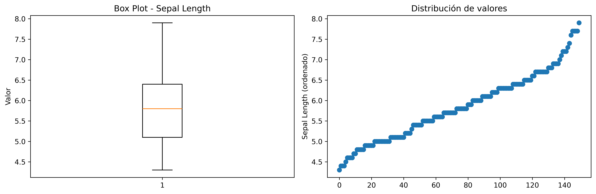
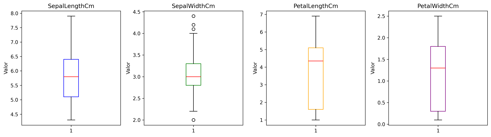
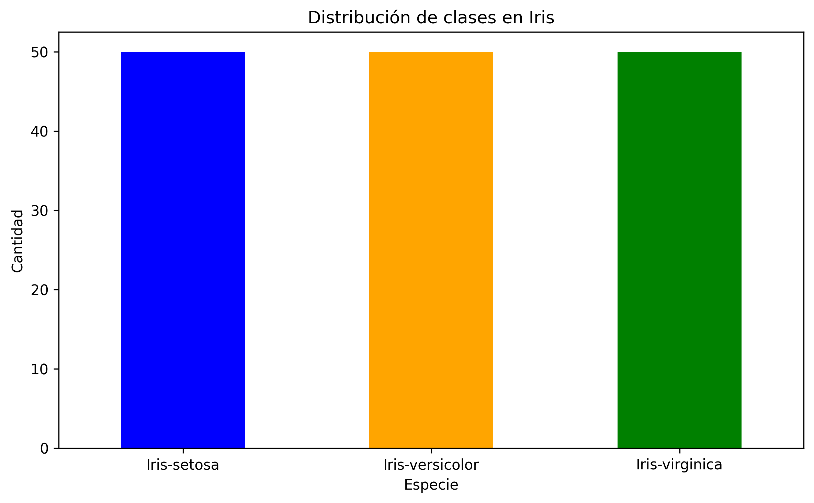

# Clase 0: Flujo Completo de Machine Learning - De Datos a Modelo

!!! info "Contexto"
    Esta es la clase inaugural de Aprendizaje Avanzado. Cubriremos el flujo end-to-end de un problema de ML: desde datos crudos hasta un modelo desplegado y rastreado. No nos enfocamos en implementación, sino en **por qué** cada paso importa.

---

## 1. Preprocesamiento de Datos

El preprocesamiento es donde invertirás el 60-70% del tiempo en un proyecto real de ML. Es tentador saltárselo, pero **un buen preprocesamiento es la diferencia entre un modelo mediocre y uno excelente**.

### 1.1 Exploración Inicial y Tipos de Datos

**¿Qué hacemos aquí?**

Lo primero es entender qué tenemos entre manos. Necesitas responder:

- ¿Cuántas muestras y características tengo?
- ¿Qué tipo de datos son? (numéricas, categóricas, de fecha, texto)
- ¿Hay valores faltantes? ¿Cuántos?
- ¿Cuál es mi variable objetivo?

**¿Por qué importa?**

Diferentes tipos de datos requieren diferentes tratamientos. Una variable categórica no se puede alimentar directamente a sklearn. Los valores faltantes pueden sesgar tu modelo. Los tipos incorrectos causan errores silenciosos.

**En la práctica:**

```python
import pandas as pd
import numpy as np

# Cargar datos
df = pd.read_csv('./datasets/Iris.csv')

# Dimensiones
print("*" * 40)
print(f"Shape: {df.shape}")  # (150, 5)
print("*" * 40)
# Tipos de datos
print(df.dtypes)
print("*" * 40)
# Primeras filas
print(df.head())
print("*" * 40)
# Resumen rápido
print(df.info())
print("*" * 40)
# Valores faltantes
print(df.isnull().sum())
```

**Output esperado para Iris:**
```
****************************************
Shape: (150, 6)
****************************************
Id                 int64
SepalLengthCm    float64
SepalWidthCm     float64
PetalLengthCm    float64
PetalWidthCm     float64
Species           object
dtype: object
****************************************
   Id  SepalLengthCm  SepalWidthCm  PetalLengthCm  PetalWidthCm      Species
0   1            5.1           3.5            1.4           0.2  Iris-setosa
1   2            4.9           3.0            1.4           0.2  Iris-setosa
2   3            4.7           3.2            1.3           0.2  Iris-setosa
3   4            4.6           3.1            1.5           0.2  Iris-setosa
4   5            5.0           3.6            1.4           0.2  Iris-setosa
****************************************
<class 'pandas.core.frame.DataFrame'>
RangeIndex: 150 entries, 0 to 149
Data columns (total 6 columns):
 #   Column         Non-Null Count  Dtype  
---  ------         --------------  -----  
 0   Id             150 non-null    int64  
 1   SepalLengthCm  150 non-null    float64
 2   SepalWidthCm   150 non-null    float64
 3   PetalLengthCm  150 non-null    float64
 4   PetalWidthCm   150 non-null    float64
 5   Species        150 non-null    object 
dtypes: float64(4), int64(1), object(1)
memory usage: 7.2+ KB
None
****************************************
Id               0
SepalLengthCm    0
SepalWidthCm     0
PetalLengthCm    0
PetalWidthCm     0
Species          0
dtype: int64
```

**Nota importante:** Iris no tiene valores faltantes (es por eso que es un dataset "juguete"). En la vida real, rara vez verás datos tan limpios.

---

### 1.2 Manejo de Valores Faltantes

**¿Qué son y por qué aparecen?**

Valores faltantes (NaN, None) aparecen por:
- Errores en la recopilación
- Equipos que no registraron datos
- Confidencialidad (datos intencionalmente omitidos)
- Procesos de limpieza anteriores

**Estrategias de manejo:**

| Estrategia | Cuándo usar | Ventajas | Desventajas |
|-----------|-----------|----------|-----------|
| **Eliminación de fila** | <5% de datos faltantes en esa fila | Simple, limpio | Pierdes información |
| **Eliminación de columna** | >50% de valores faltantes | Limpio | Pierdes feature |
| **Imputación por media/mediana** | Datos numéricos, MCAR* | Rápido | Reduce varianza, sesgado |
| **Imputación por forward fill** | Series temporales | Preserva contexto | Solo para datos ordenados |
| **Métodos avanzados (KNN, IterativeImputer)** | Datos con patrones | Más preciso | Computacionalmente caro |

*MCAR = Missing Completely At Random

**Ejemplo conceptual:**

```python
# Chequear valores faltantes
missing = df.isnull().sum()
print(missing)

# Estrategia 1: Eliminar filas con cualquier faltante
df_clean = df.dropna()

# Estrategia 2: Eliminar columnas con >50% faltantes
df_clean = df.dropna(thresh=len(df)*0.5, axis=1)

# Estrategia 3: Imputación
df_imputed = df.fillna(df.mean())  # numéricas
df_imputed = df.fillna(df.mode()[0])  # categóricas

# Estrategia 4: Imputación avanzada (sklearn)
from sklearn.impute import SimpleImputer, KNNImputer

imputer = KNNImputer(n_neighbors=5)
df_imputed = imputer.fit_transform(df)
```

**Decisión crítica:** La estrategia que elijas introduce sesgo. Documentalo siempre.

---

### 1.3 Tratamiento de Outliers

**¿Qué son outliers?**

Valores que se desvían significativamente del resto de la distribución. Pueden ser:
- **Errores reales:** Tipográficos, sensores rotos
- **Valores legítimos:** Comportamientos extremos pero reales (ej: un cliente que compra 1000 veces)

**Métodos de detección:**

| Método | Fórmula/Criterio | Cuándo usar |
|--------|---------|-----------|
| **Desviación estándar** | μ ± 3σ | Datos normales |
| **IQR** | Q1 - 1.5×IQR, Q3 + 1.5×IQR | Datos sesgados, robusta |
| **Z-score** | \|z\| > 3 | Datos normalizados |
| **Visualización** | Box plots, scatter plots | Siempre, como primer paso |

**Ejemplo:**

```python
import matplotlib.pyplot as plt
import seaborn as sns

# Detección por IQR
Q1 = df['SepalLengthCm'].quantile(0.25)
Q3 = df['SepalLengthCm'].quantile(0.75)
IQR = Q3 - Q1

outliers = (df['SepalLengthCm'] < Q1 - 1.5*IQR) | (df['SepalLengthCm'] > Q3 + 1.5*IQR)
print(f"Outliers detectados: {outliers.sum()}")

# Visualización
fig, axes = plt.subplots(1, 2, figsize=(12, 4))

# Box plot
axes[0].boxplot(df['SepalLengthCm'])
axes[0].set_title('Box Plot - Sepal Length')
axes[0].set_ylabel('Valor')

# Scatter plot
axes[1].scatter(range(len(df)), df['SepalLengthCm'].sort_values())
axes[1].set_title('Distribución de valores')
axes[1].set_ylabel('Sepal Length (ordenado)')

plt.tight_layout()
plt.savefig('./images/outliers_detection.png', dpi=300, bbox_inches='tight')
plt.close()
```
Output esperado: 

Figure: Detección de outliers usando box plot y scatter plot.

!!! warning "¿Eliminar o transformar?"
    - **Elimina si:** Es claramente un error (ej: edad = -5 años)
    - **Transforma si:** Es extremo pero legítimo. Usa transformaciones (log, raíz cuadrada) para reducir su impacto sin perder información

---

### 1.4 Transformación de Variables

**Normalización vs Estandarización:**

Ambas escalan los datos, pero de formas diferentes:

| Técnica | Fórmula | Rango | Cuándo usar |
|---------|---------|-------|-----------|
| **Normalización (Min-Max)** | (x - min) / (max - min) | [0, 1] | Cuando sabes el rango y quieres limites fijos |
| **Estandarización (Z-score)** | (x - μ) / σ | Aproximadamente [-1, 1] | Por defecto para modelos lineales, SVM, NN |
| **Robust Scaling** | (x - Q2) / IQR | - | Cuando hay outliers (menos sensible) |

**¿Por qué es crítico?**

Algoritmos como regresión logística, SVM y redes neuronales son **sensibles a la escala**. Una característica con rango [0, 10000] domina sobre otra en [0, 1]. El modelo aprenderá más lentamente o convergerá a soluciones subóptimas.

**Ejemplo:**

```python
from sklearn.preprocessing import StandardScaler, MinMaxScaler

# Valores originales
print("*" * 40)
print("Valores originales:")
print(f"Min: {df[['SepalLengthCm', 'SepalWidthCm', 'PetalLengthCm', 'PetalWidthCm']].min().values}")
print(f"Max: {df[['SepalLengthCm', 'SepalWidthCm', 'PetalLengthCm', 'PetalWidthCm']].max().values}")
print("*" * 40)
# Estandarización (recomendado para modelos lineales)
scaler = StandardScaler()
X_scaled = scaler.fit_transform(df[['SepalLengthCm', 'SepalWidthCm', 'PetalLengthCm', 'PetalWidthCm']])

# Después de estandarizar, cada feature tiene media=0 y std=1
print(f"Media: {X_scaled.mean(axis=0)}")  # ~0
print(f"Std: {X_scaled.std(axis=0)}")     # ~1
print("*" * 40)
# Normalización (alternativa)
normalizer = MinMaxScaler()
X_normalized = normalizer.fit_transform(df[['SepalLengthCm', 'SepalWidthCm', 'PetalLengthCm', 'PetalWidthCm']])

# Rango: [0, 1]
print(f"Min: {X_normalized.min(axis=0)}")
print(f"Max: {X_normalized.max(axis=0)}")
print("*" * 40)
```


### 1.5 Codificación de Variables Categóricas

**El problema:** Los modelos numéricos no entienden "setosa", "versicolor", "virginica".

**Dos enfoques principales:**

| Técnica | Ejemplo | Cuándo usar |
|---------|---------|-----------|
| **Label Encoding** | setosa → 0, versicolor → 1, virginica → 2 | Variables **ordinales** (pequeño < medio < grande) |
| **One-Hot Encoding** | setosa → [1,0,0], versicolor → [0,1,0], virginica → [0,0,1] | Variables **nominales** (sin orden natural) |

**¿Por qué importa la elección?**

Con Label Encoding, le dices al modelo "2 > 1 > 0". Eso introduce un orden falso en variables sin orden natural, sesgando el aprendizaje.

**Ejemplo:**

```python
from sklearn.preprocessing import LabelEncoder
import pandas as pd

# Label Encoding (solo si es ordinal)
le = LabelEncoder()
df['species_encoded'] = le.fit_transform(df['Species'])
# setosa → 0, versicolor → 1, virginica → 2

# One-Hot Encoding (para nominales - RECOMENDADO para Iris)
df_encoded = pd.get_dummies(df, columns=['Species'], drop_first=True)
# Crea: species_versicolor, species_virginica (drop_first evita multicolinealidad)

print(df_encoded.tail())
```

**Output:**
```
Id  SepalLengthCm  SepalWidthCm  PetalLengthCm  PetalWidthCm  \
145  146            6.7           3.0            5.2           2.3   
146  147            6.3           2.5            5.0           1.9   
147  148            6.5           3.0            5.2           2.0   
148  149            6.2           3.4            5.4           2.3   
149  150            5.9           3.0            5.1           1.8   

     species_encoded  Species_encoded  Species_Iris-versicolor  \
145                2                2                    False   
146                2                2                    False   
147                2                2                    False   
148                2                2                    False   
149                2                2                    False   

     Species_Iris-virginica  
145                    True  
146                    True  
147                    True  
148                    True  
149                    True
```
!!! tip "One-Hot Encoding: drop_first=True"
    Con 3 clases, necesitas solo 2 variables dummy. La tercera es redundante (si no es versicolor ni virginica, es setosa). Omitirla evita **multicolinealidad perfecta**.

---

## 2. Análisis Exploratorio de Datos (EDA)

El EDA es donde empiezas a **entender tus datos** y a generar hipótesis. Es detective work.

### 2.1 Estadística Descriptiva

**¿Qué números resumidos nos dicen los datos?**

```python
# Resumen rápido
print(df.describe())
```
**Output para Iris:**
```
Id  SepalLengthCm  SepalWidthCm  PetalLengthCm  PetalWidthCm
count  150.000000     150.000000    150.000000     150.000000    150.000000
mean    75.500000       5.843333      3.054000       3.758667      1.198667
std     43.445368       0.828066      0.433594       1.764420      0.763161
min      1.000000       4.300000      2.000000       1.000000      0.100000
25%     38.250000       5.100000      2.800000       1.600000      0.300000
50%     75.500000       5.800000      3.000000       4.350000      1.300000
75%    112.750000       6.400000      3.300000       5.100000      1.800000
max    150.000000       7.900000      4.400000       6.900000      2.500000
```

**¿Qué significa cada línea?**

- **count:** Número de valores no-nulos (verificar valores faltantes)
- **mean:** Promedio. Si es muy diferente de la mediana, hay sesgos
- **std:** Desviación estándar. Mide dispersión. Alto = datos heterogéneos
- **min/max:** Rango. Busca valores imposibles o sospechosos
- **25%, 50%, 75%:** Cuartiles. Son robustos a outliers, a diferencia de media
---

### 2.2 Distribuciones Univariadas

**Un gráfico vale más que 1000 números.**

Visualizar cómo se distribuye cada variable te muestra:
- Forma (normal, sesgada, bimodal)
- Concentración de valores
- Presencia de outliers

```python
import matplotlib.pyplot as plt
import seaborn as sns

fig, axes = plt.subplots(2, 2, figsize=(12, 10))

features = ['SepalLengthCm', 'SepalWidthCm', 'PetalLengthCm', 'PetalWidthCm']
colors = ['skyblue', 'lightgreen', 'salmon', 'plum']
for idx, feature in enumerate(features):
    ax = axes[idx // 2, idx % 2]
    
    # Histograma con KDE
    sns.histplot(data=df, x=feature, kde=True, bins=20, ax=ax, color=colors[idx])
    ax.set_title(f'Distribución de {feature}')
    ax.set_xlabel('Valor')
    ax.set_ylabel('Frecuencia')

plt.tight_layout()
plt.savefig('./images/distribuciones_univariadas.png', dpi=300, bbox_inches='tight')
plt.close()
```
Output esperado:

Figure: Distribuciones univariadas de las características del dataset Iris.
**¿Qué buscar?**

- **Forma normal (campana):** Indicador de datos bien comportados
- **Sesgada (skewed):** Cola larga en un lado. Petal length está sesgada a la izquierda (muchos flores pequeñas)
- **Bimodal:** Dos picos. Sugiere dos subgrupos (en Iris: especies con flores grandes vs pequeñas)

---

### 2.3 Box Plots

**Resumen rápido de distribución y outliers:**

```python
fig, axes = plt.subplots(1, 4, figsize=(14, 4))

for idx, feature in enumerate(features):
    axes[idx].boxplot(df[feature])
    axes[idx].set_title(feature)
    axes[idx].set_ylabel('Valor')

plt.tight_layout()
plt.savefig('images/boxplots.png', dpi=300, bbox_inches='tight')
plt.close()
```

Output esperado:

Figure: Box plots de las características del dataset Iris.

**Interpretación:**
- **Línea central:** Mediana (Q2)
- **Caja:** IQR (50% central de datos)
- **Bigotes:** Límites (Q1 - 1.5×IQR hasta Q3 + 1.5×IQR)
- **Puntos:** Outliers

Para Iris, notarás que **petal_length y petal_width tienen distribuciones claramente bimodales** → Diferentes especies tienen tamaños muy distintos.

---

### 2.4 Relaciones Bivariadas

**¿Cómo se relacionan dos variables?**

La correlación mide relación lineal:
- **r = 1:** Perfecta positiva (X aumenta → Y aumenta)
- **r = 0:** Sin relación lineal
- **r = -1:** Perfecta negativa (X aumenta → Y disminuye)

```python
# Matriz de correlación
corr_matrix = df[features].corr()
print(corr_matrix)

# Visualización
fig, ax = plt.subplots(figsize=(8, 6))
sns.heatmap(corr_matrix, annot=True, fmt='.2f', cmap='coolwarm', center=0, 
            square=True, ax=ax, cbar_kws={'label': 'Correlación'})
ax.set_title('Matriz de Correlación - Iris Features')
plt.tight_layout()
plt.savefig('./images/correlacion_matrix.png', dpi=300, bbox_inches='tight')
plt.close()
```

**Output esperado:**
```
SepalLengthCm  SepalWidthCm  PetalLengthCm  PetalWidthCm
SepalLengthCm       1.000000     -0.109369       0.871754      0.817954
SepalWidthCm       -0.109369      1.000000      -0.420516     -0.356544
PetalLengthCm       0.871754     -0.420516       1.000000      0.962757
PetalWidthCm        0.817954     -0.356544       0.962757      1.000000
```

Figure: Matriz de correlación entre las características del dataset Iris.


**Interpretación:**
- **Sepal_length vs petal_length: 0.87** → Fuerte relación positiva (flores grandes en ambas medidas)
- **Sepal_width vs petal_length: -0.42** → Relación negativa moderada (flores anchas tienden a ser pequeñas en pétalos)
- **Petal_length vs petal_width: 0.96** → Casi perfecta (pétalos grandes implican anchos grandes)

---

### 2.5 Scatter Plots

**Para visualizar relaciones bivariadas directamente:**

```python
fig, axes = plt.subplots(1, 2, figsize=(20, 10))

# Scatter simple: sepal_length vs petal_length
axes[0].scatter(df['sepal_length'], df['petal_length'], alpha=0.6)
axes[0].set_xlabel('Sepal Length')
axes[0].set_ylabel('Petal Length')
axes[0].set_title('Correlación: 0.87 (fuerte positiva)')
axes[0].grid(True, alpha=0.3)

# Scatter coloreado por species
for species in df['species'].unique():
    mask = df['species'] == species
    axes[1].scatter(df[mask]['sepal_length'], df[mask]['petal_length'], 
                    label=species, alpha=0.7)
axes[1].set_xlabel('Sepal Length')
axes[1].set_ylabel('Petal Length')
axes[1].set_title('Por especie')
axes[1].legend()
axes[1].grid(True, alpha=0.3)

plt.tight_layout()
plt.savefig('./images/scatter_plots.png', dpi=300, bbox_inches='tight')
plt.close()
```

Figure: Scatter plots de Sepal Length vs Petal Length, sin y con color por especie.

**¿Por qué colorear por species?** Ves que Iris setosa (pequeña) se agrupa en esquina inferior-izquierda, mientras que Iris virginica (grande) en esquina superior-derecha. **Las clases son linealmente separables** → Un clasificador lineal funcionará bien.

---

### 2.6 Multicolinealidad

**¿Por qué importa?**

Multicolinealidad = Dos features muy correlacionadas. En regresión/clasificación lineal, causa:
- Coeficientes inestables (pequeños cambios en datos → grandes cambios en coeficientes)
- Dificultad interpretando importancia de features
- Overfitting potencial

**Detección:**

```python
# Mira correlaciones > 0.9
print(corr_matrix[corr_matrix > 0.9].sum())

# En Iris: petal_length y petal_width están altamente correlacionadas (0.96)
# Pero con 4 features, no es crítico
```

**Decisión:** En Iris, no es problema (dataset pequeño, modelos simples). En datasets grandes, considera:
- Eliminar una de las features correlacionadas
- Usar regularización (L1/L2)
- PCA (reducción de dimensionalidad)

---

### 2.7 Imbalance y Representatividad

**¿Están todas las clases bien representadas?**

```python
# Conteo de clases
print(df['species'].value_counts())

# Visualización
fig, ax = plt.subplots(figsize=(8, 5))
df['species'].value_counts().plot(kind='bar', ax=ax, color=['blue', 'orange', 'green'])
ax.set_title('Distribución de clases en Iris')
ax.set_xlabel('Especie')
ax.set_ylabel('Cantidad')
ax.set_xticklabels(ax.get_xticklabels(), rotation=0)
plt.tight_layout()
plt.savefig('./images/class_distribution.png', dpi=300, bbox_inches='tight')
plt.close()
```

**Output:**
```
species
setosa        50
versicolor    50
virginica     50
```


Figure: Distribución de clases en el dataset Iris.


**Interpretación para Iris:** Perfectamente balanceado (50 cada una). En la vida real, raro. Titanic, por ejemplo, tiene ~62% supervivientes, 38% no. En dataset muy desbalanceado (ej: detección de fraude con 0.1% fraude), métricas como Accuracy engañan.

---

### 2.8 Patrones, Anomalías e Insights

**Último paso del EDA: Storytelling.**

Pregúntate:
- ¿Cuál es la característica más importante para predecir la clase?
- ¿Hay grupos naturales en los datos?
- ¿Qué anomalías notaste?

**Para Iris:**
- Petal_length es el mejor discriminante entre especies
- Las clases son casi linealmente separables
- No hay outliers obvios
- Dataset es pequeño pero limpio

**Visualización final: PCA para contexto (opcional, solo visualización)**

```python
from sklearn.decomposition import PCA

pca = PCA(n_components=2)
X_pca = pca.fit_transform(df[features].values)

fig, ax = plt.subplots(figsize=(10, 7))

for species in df['Species'].unique():
    mask = df['Species'] == species
    ax.scatter(X_pca[mask, 0], X_pca[mask, 1], label=species, s=100, alpha=0.7)

ax.set_xlabel(f'PC1 ({pca.explained_variance_ratio_[0]:.2%} varianza)')
ax.set_ylabel(f'PC2 ({pca.explained_variance_ratio_[1]:.2%} varianza)')
ax.set_title('Proyección PCA 2D - Iris Species')
ax.legend()
ax.grid(True, alpha=0.3)

plt.tight_layout()
plt.savefig('./images/pca_visualization.png', dpi=300, bbox_inches='tight')
plt.close()
```

Figure: Proyección PCA 2D de las especies del dataset Iris.


---
## 3. Train-Test Split y Estandarización

### 3.1 Separación Train-Test

**¿Por qué es crítico?**

Entrenar y evaluar en los **mismos datos** es trampa. El modelo memoriza. La métrica resultante **no estima performance en datos nuevos** (que es lo que importa).

**Analogía:** Es como estudiante que memoriza las preguntas exactas de un examen pasado. Cuando llega el examen real con preguntas similares pero no idénticas, se hunde.

```python
from sklearn.model_selection import train_test_split

# Split 80-20
X = df[features].values
y = df['species'].values

X_train, X_test, y_train, y_test = train_test_split(
    X, y, test_size=0.2, random_state=42, stratify=y
)

print(f"Train: {X_train.shape}, Test: {X_test.shape}")
# Train: (120, 4), Test: (30, 4)

# stratify=y asegura que cada split tenga proporción similar de clases
print(f"Train - setosa: {sum(y_train == 'setosa')}/120")
print(f"Test - setosa: {sum(y_test == 'setosa')}/30")
```
**Output esperado:**
```
Train: (120, 4), Test: (30, 4)
Train - setosa: 0/120
Test - setosa: 0/30
```
!!! warning "NUNCA hagas normalización/imputación antes de splitear"
    **INCORRECTO:**
    ```python
    X_normalized = scaler.fit_transform(X)  # FIT EN TODO
    X_train, X_test, ... = train_test_split(X_normalized, y, ...)
    ```
    
    **CORRECTO:**
    ```python
    X_train, X_test, ... = train_test_split(X, y, ...)
    scaler.fit(X_train)  # FIT solo en train
    X_train_norm = scaler.transform(X_train)
    X_test_norm = scaler.transform(X_test)
    ```

---

### 3.2 Estandarización del Conjunto de Entrenamiento

Recuerda: La estandarización es **crítica para modelos lineales** (logistic regression, SVM, etc.).

```python
from sklearn.preprocessing import StandardScaler

scaler = StandardScaler()
scaler.fit(X_train)  # FIT SOLO en train

X_train_scaled = scaler.transform(X_train)
X_test_scaled = scaler.transform(X_test)

# Verificar
print(f"Train mean: {X_train_scaled.mean(axis=0)}")  # ~0
print(f"Train std: {X_train_scaled.std(axis=0)}")    # ~1
print(f"Test mean: {X_test_scaled.mean(axis=0)}")    # No es ~0 (datos nuevos)
```

**Output esperado:**
```
Train mean: [-1.20829273e-15 -2.53315887e-15  1.48029737e-16  1.55246186e-15]
Train std: [1. 1. 1. 1.]
Test mean: [ 0.00995126  0.11078352 -0.03456365 -0.03615399]
```

!!! info "¿Por qué test no tiene mean=0?"
    El scaler fue ajustado con estadísticas del train. Al aplicarlo al test (datos nuevos), el test conserva su propia distribución. Esto es **correcto**: validamos con datos en su distribución real.

---

### 3.3 Modelo: Regresión Logística

**¿Qué es?**

A pesar del nombre, es un **clasificador**, no regresión. Predice probabilidades de pertenencia a clases.

**Conceptualmente:**
- Para 2 clases: P(Y=1) = sigmoid(w₀ + w₁X₁ + w₂X₂ + ...)
- Para 3+ clases (como Iris): Softmax (extensión de sigmoid)

**Interpretación:**
- **Coeficientes positivos:** Aumentan probabilidad de la clase
- **Coeficientes negativos:** Disminuyen probabilidad

```python
from sklearn.linear_model import LogisticRegression

# Crear modelo
model = LogisticRegression(
    max_iter=1000,
    random_state=42,
    multi_class='multinomial'  # Para 3+ clases
)

# Entrenar
model.fit(X_train_scaled, y_train)

# Predicciones
y_pred_train = model.predict(X_train_scaled)
y_pred_test = model.predict(X_test_scaled)

# Probabilidades
y_proba_test = model.predict_proba(X_test_scaled)
print(y_proba_test[:5])  # [prob_setosa, prob_versicolor, prob_virginica]
```

**Output esperado (probabilidades):**
```
Probabilidades de las primeras 5 muestras del test:
[
    [9.79355498e-01 2.06441434e-02 3.58223033e-07]
    [3.77309225e-03 3.69498929e-01 6.26727979e-01]
    [1.49647017e-01 8.41581277e-01 8.77170654e-03]
    [9.58890418e-02 8.94120385e-01 9.99057342e-03]
    [9.88807815e-01 1.11920151e-02 1.69552410e-07]
]
```

---

### 3.4 Métricas de Clasificación

!!! danger "⚠️ ATENCIÓN"
    Las métricas que ves a continuación son **para CLASIFICACIÓN**.
    
    Para **REGRESIÓN**, usarías:
    - **MSE (Mean Squared Error):** Promedio de (y_true - y_pred)²
    - **RMSE (Root MSE):** √MSE (misma escala que y)
    - **MAE (Mean Absolute Error):** Promedio de |y_true - y_pred|

**Clasificación - Métricas principales:**

```python
from sklearn.metrics import (
    accuracy_score, precision_score, recall_score, f1_score, 
    confusion_matrix, classification_report
)

# Accuracy: % correcto
acc = accuracy_score(y_test, y_pred_test)
print(f"Accuracy: {acc:.4f}")  # 1.0 (perfecto en este dataset)

# Precision (para clase i): TP / (TP + FP) - "de lo que predije positivo, cuánto fue correcto"
# Recall (para clase i): TP / (TP + FN) - "de los verdaderos positivos, cuántos encontré"
#
#  F1: Media armónica de Precision y Recall - "balance entre ambos"

print(classification_report(y_test, y_pred_test))
```

**Output típico:**
```
              Accuracy: 0.9333
                 precision    recall  f1-score   support

    Iris-setosa       1.00      1.00      1.00        10
Iris-versicolor       0.90      0.90      0.90        10
 Iris-virginica       0.90      0.90      0.90        10

       accuracy                           0.93        30
      macro avg       0.93      0.93      0.93        30
   weighted avg       0.93      0.93      0.93        30
```

**Matriz de confusión:**

```python
cm = confusion_matrix(y_test, y_pred_test)
print(cm)

# Visualización
fig, ax = plt.subplots(figsize=(8, 6))
sns.heatmap(cm, annot=True, fmt='d', cmap='Blues', ax=ax,
            xticklabels=model.classes_, yticklabels=model.classes_)
ax.set_xlabel('Predicho')
ax.set_ylabel('Real')
ax.set_title('Matriz de Confusión')
plt.tight_layout()
plt.savefig('./images/confusion_matrix.png', dpi=300, bbox_inches='tight')
plt.close()
```


Figure: Matriz de confusión del modelo de regresión logística en el dataset Iris.

**Interpretación:**
- Diagonal principal: Aciertos
- Fuera de diagonal: Errores

---

### 3.5 Validación Cruzada

**Problema:** Un único split train-test puede ser afortunado (test fácil) o desafortunado (test difícil).

**Solución:** Validación cruzada (k-fold)

Divide datos en k folds. Entrena k modelos, cada uno dejando un fold para validar:

```python
from sklearn.model_selection import cross_validate

# 5-fold cross-validation
cv_results = cross_validate(
    model,
    X_train_scaled, y_train,
    cv=5,
    scoring=['accuracy', 'precision_weighted', 'recall_weighted', 'f1_weighted']
)

print(f"CV Accuracy: {cv_results['test_accuracy'].mean():.4f} ± {cv_results['test_accuracy'].std():.4f}")
print(f"CV F1: {cv_results['test_f1_weighted'].mean():.4f} ± {cv_results['test_f1_weighted'].std():.4f}")
```

**Output:**
```
CV Accuracy: 0.9583 ± 0.0264
CV F1: 0.9580 ± 0.0268
```

!!! info "¿Qué significa?"
    Media 95.83% ± 2.64% → En promedio, 95.83%, pero varía ±2.68% entre folds. **Desviación baja = modelo estable.**

---

## 4. Pipelines en Machine Learning

Los **pipelines** encadenan múltiples transformaciones y modelos en un único objeto reutilizable y reproducible. Es la forma profesional de hacer ML.

### 4.1 ¿Por qué Pipelines?

**Sin pipeline (Frágil):**

```python
scaler = StandardScaler()
X_train_s = scaler.fit_transform(X_train)
X_test_s = scaler.transform(X_test)

model = LogisticRegression(max_iter=1000)
model.fit(X_train_s, y_train)
y_pred = model.predict(X_test_s)
```

**Problemas:**
- Fácil olvidar pasos
- Data leakage accidental
- Código repetitivo
- Difícil de reproducir

**Con pipeline (Profesional):**

```python
from sklearn.pipeline import Pipeline
from sklearn.preprocessing import StandardScaler
from sklearn.linear_model import LogisticRegression

pipe = Pipeline([
    ('scaler', StandardScaler()),
    ('model', LogisticRegression(max_iter=1000, random_state=42))
])

pipe.fit(X_train, y_train)
y_pred = pipe.predict(X_test)
```

**Ventajas:**
- Código limpio y legible
- Imposible data leakage
- Fácil cambiar componentes
- Funciona automáticamente con validación cruzada y grid search
- Production-ready

### 4.2 Pipeline Básico

```python
from sklearn.pipeline import Pipeline
from sklearn.preprocessing import StandardScaler
from sklearn.linear_model import LogisticRegression
from sklearn.metrics import accuracy_score, f1_score

# Crear pipeline
pipe = Pipeline([
    ('scaler', StandardScaler()),
    ('logistic', LogisticRegression(max_iter=1000, random_state=42, multi_class='multinomial'))
])

# Entrenar
pipe.fit(X_train, y_train)

# Predecir
y_pred = pipe.predict(X_test)
y_proba = pipe.predict_proba(X_test)

# Evaluar
acc = accuracy_score(y_test, y_pred)
f1 = f1_score(y_test, y_pred, average='weighted')

print(f"Accuracy: {acc:.4f}")
print(f"F1: {f1:.4f}")
```

### 4.3 ColumnTransformer (para múltiples tipos de datos)

Aunque Iris solo tiene numéricas, enseñamos el patrón completo:

```python
from sklearn.compose import ColumnTransformer
from sklearn.pipeline import Pipeline

# Definir tipos de features
numeric_features = ['sepal_length', 'sepal_width', 'petal_length', 'petal_width']

# Transformer para numéricas
numeric_transformer = Pipeline([
    ('scaler', StandardScaler())
])

# Combinar transformers
preprocessor = ColumnTransformer([
    ('num', numeric_transformer, numeric_features)
])

# Pipeline completo
full_pipeline = Pipeline([
    ('preprocessor', preprocessor),
    ('model', LogisticRegression(max_iter=1000, random_state=42))
])

# Usar igual que antes
full_pipeline.fit(X_train, y_train)
y_pred = full_pipeline.predict(X_test)
```

### 4.4 Pipeline con GridSearchCV

**Tunear automáticamente TODO:**

```python
from sklearn.model_selection import GridSearchCV

pipe = Pipeline([
    ('scaler', StandardScaler()),
    ('model', LogisticRegression(random_state=42))
])

# Parámetros a tunear
param_grid = {
    'model__C': [0.01, 0.1, 1, 10],
    'model__max_iter': [1000, 2000]
}

# Grid search
grid = GridSearchCV(pipe, param_grid, cv=5, scoring='f1_weighted', n_jobs=-1)
grid.fit(X_train, y_train)

print(f"Mejor C: {grid.best_params_['model__C']}")
print(f"Mejor max_iter: {grid.best_params_['model__max_iter']}")
print(f"Mejor score CV: {grid.best_score_:.4f}")

# Predecir con mejor modelo
y_pred = grid.predict(X_test)
```

### 4.5 Ventajas de Pipelines - Tabla Resumen

| Aspecto | Sin Pipeline | Con Pipeline |
|---------|-------------|--------------|
| **Data leakage** | Fácil olvidarse | Imposible |
| **Reproducibilidad** | Frágil | Robusta |
| **Código** | Repetitivo | Limpio |
| **Cambiar componentes** | Tedioso | Una línea |
| **CV/GridSearch** | Manual | Automático |
| **Producción** | Frágil | Ready |

---
## 5. Tareas para Casa

### Objetivo
Replicar el flujo completo de ML en un dataset de tu elección.

### Opciones de Dataset

**Opción 1: Titanic** (Recomendado para empezar)
- 890 registros, 11 features
- Objetivo: Supervivencia (binaria)
- Desafío: Valores faltantes, mezcla de tipos
- Descarga: https://www.kaggle.com/c/titanic/data

**Opción 2: Wine Quality**
- 1,600 registros, 12 features
- Objetivo: Calidad (0-10)
- Descarga: https://www.kaggle.com/datasets/yasserh/wine-quality-dataset

**Opción 3: Adult Income**
- 32,500 registros, 14 features
- Objetivo: Ingresos >50K (binaria)
- Descarga: https://archive.ics.uci.edu/ml/datasets/Adult

**Opción 4: Tu propio dataset**
- Mínimo 2,000-4,000 registros
- Mínimo 10+ columnas
- Mezcla de numéricas y categóricas
- Variable objetivo clara

### Estructura de Entrega

**MEMORÍA EN LATEX (Overleaf)**