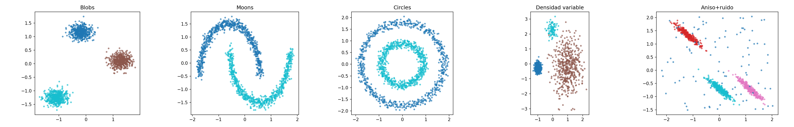

# Práctica 2: Aprendizaje No Supervisado

## Objetivo

Aplicar los principales algoritmos de aprendizaje no supervisado vistos en teoría, comparando su rendimiento y analizando el efecto de sus hiperparámetros.

- **Parte 1 — Clustering**: Se estudian K-Means (referencia), Clustering Espectral, DBSCAN y OPTICS. Primero se comparan sobre datasets sintéticos diseñados para exponer las fortalezas y debilidades de cada método. Después se aplican sobre un dataset real con etiquetas conocidas para una evaluación cuantitativa completa.
- **Parte 2 — Detección de anomalías**: Se trabaja con un dataset tabular etiquetado para evaluar Gaussian Mixture Models (GMM), Isolation Forest y DBSCAN como detectores de anomalías.

Se asume que ya dominas el preprocesamiento básico visto en la Práctica 0.

---

## Parte 1: Clustering

### 1.0 Datasets y Herramientas de Evaluación (Código Proporcionado)

#### Datasets sintéticos

Se proporcionan cinco escenarios sintéticos, cada uno diseñado para ilustrar una propiedad clave de los algoritmos de clustering. Las etiquetas reales se usan solo para evaluación, nunca como entrada a los algoritmos.



Los cinco escenarios son:

- **Blobs isotrópicas**: Tres clusters esféricos, bien separados. El caso ideal para K-Means.
- **Lunas entrelazadas**: Dos clusters con forma de media luna. K-Means no puede separarlos porque asume clusters convexos.
- **Círculos concéntricos**: Dos clusters anidados. Requiere detectar formas no convexas.
- **Clusters de densidad variable**: Tres clusters con densidades muy distintas (uno denso, otro disperso, otro pequeño). La limitación principal de DBSCAN con un único ε global.
- **Blobs anisotrópicas con ruido**: Clusters alargados (no esféricos) con 100 puntos de ruido uniforme añadidos.

```python
import numpy as np
import matplotlib.pyplot as plt
from sklearn.datasets import make_moons, make_circles, make_blobs
from sklearn.preprocessing import StandardScaler

np.random.seed(42)

# ── Escenario 1: Blobs isotrópicas ──────────────────────────────────────────
X_blobs, y_blobs = make_blobs(n_samples=1500, centers=3, cluster_std=1.0,
                               random_state=42)
X_blobs = StandardScaler().fit_transform(X_blobs)

# ── Escenario 2: Lunas entrelazadas ─────────────────────────────────────────
X_moons, y_moons = make_moons(n_samples=1500, noise=0.05, random_state=42)
X_moons = StandardScaler().fit_transform(X_moons)

# ── Escenario 3: Círculos concéntricos ──────────────────────────────────────
X_circles, y_circles = make_circles(n_samples=1500, noise=0.05, factor=0.5,
                                     random_state=42)
X_circles = StandardScaler().fit_transform(X_circles)

# ── Escenario 4: Clusters de densidad variable ──────────────────────────────
X_dense = np.vstack([
    np.random.randn(500, 2) * 0.3 + [0, 0],     # cluster denso
    np.random.randn(500, 2) * 1.5 + [6, 0],      # cluster disperso
    np.random.randn(100, 2) * 0.5 + [3, 4],      # cluster pequeño y denso
])
y_dense = np.array([0]*500 + [1]*500 + [2]*100)
X_dense = StandardScaler().fit_transform(X_dense)

# ── Escenario 5: Blobs anisotrópicas con ruido ──────────────────────────────
X_aniso_base, y_aniso_base = make_blobs(n_samples=1000, centers=3, random_state=42)
transformation = [[0.6, -0.6], [-0.4, 0.8]]
X_aniso_base = X_aniso_base @ transformation
n_noise = 100
noise_pts = np.random.uniform(X_aniso_base.min(axis=0) - 1,
                               X_aniso_base.max(axis=0) + 1,
                               size=(n_noise, 2))
X_aniso = np.vstack([X_aniso_base, noise_pts])
y_aniso = np.concatenate([y_aniso_base, np.full(n_noise, -1)])
X_aniso = StandardScaler().fit_transform(X_aniso)


scenarios = {
    'Blobs':              (X_blobs,   y_blobs,   3),
    'Moons':              (X_moons,   y_moons,   2),
    'Circles':            (X_circles, y_circles,  2),
    'Densidad variable':  (X_dense,   y_dense,    3),
    'Anisotrópico+ruido': (X_aniso,   y_aniso,    3),
}
```

#### Dataset real: Digits con UMAP

El dataset Digits de sklearn contiene 1.797 imágenes de dígitos manuscritos (8×8 píxeles, 10 clases). Las 64 dimensiones originales se reducen a 2 con UMAP, un método de reducción de dimensionalidad no lineal que preserva la estructura local y produce clusters bien definidos pero de formas complejas: el escenario ideal para comparar algoritmos de clustering.

```python
from sklearn.datasets import load_digits
import umap   # pip install umap-learn

digits = load_digits()
X_digits_raw = digits.data       # (1797, 64)
y_digits     = digits.target     # 10 clases (0-9)

reducer   = umap.UMAP(n_components=2, random_state=42, n_neighbors=15,
                       min_dist=0.1)
X_digits  = reducer.fit_transform(X_digits_raw)
X_digits  = StandardScaler().fit_transform(X_digits)
```

> ℹ️ **¿Por qué UMAP y no PCA?** PCA es una proyección lineal que no separa bien clusters que viven en variedades no lineales. UMAP preserva la estructura de vecindad local y produce clusters compactos pero de formas irregulares, lo que hace que K-Means falle en algunos de ellos mientras que Spectral Clustering y los métodos basados en densidad pueden capturarlos.

#### Métricas de evaluación

Al disponer de etiquetas reales, se utilizan **métricas externas**:

- **Adjusted Rand Index (ARI)**: concordancia entre partición predicha y real, corregida por azar. Rango [-0.5, 1]; 1 = perfecto, ~0 = aleatorio. **Mayor es mejor.**
- **Normalized Mutual Information (NMI)**: información compartida entre ambas particiones. Rango [0, 1]; 1 = perfecto. **Mayor es mejor.**

Para métodos que producen ruido (label = −1), las métricas se calculan **solo sobre los puntos no ruidosos**, reportando además el porcentaje de ruido.

Se complementan con métricas **internas** (Silhouette, Davies-Bouldin) para analizar la discrepancia entre lo que los algoritmos optimizan y la concordancia real con la estructura de los datos.

---

### 1.1 K-Means (Referencia)

**a) Sobre los escenarios sintéticos:**

Aplica K-Means con el K correcto (indicado en `scenarios`) a cada escenario. Calcula ARI, NMI y Silhouette. Visualiza los clusters asignados junto a las etiquetas reales.

**Reporta en una tabla:**

| Escenario | K | ARI | NMI | Silhouette |
|-----------|---|-----|-----|------------|
| Blobs | 3 | ... | ... | ... |
| Moons | 2 | ... | ... | ... |
| Circles | 2 | ... | ... | ... |
| Densidad variable | 3 | ... | ... | ... |
| Anisotrópico+ruido | 3 | ... | ... | ... |

Comenta en qué escenarios K-Means funciona bien y en cuáles falla. Justifica por qué a partir de las propiedades del algoritmo.

**b) Sobre Digits:**

El dataset tiene 10 clases, así que fija **K=10**. Reporta ARI, NMI y Silhouette. Visualiza los clusters sobre la proyección UMAP 2D junto al ground truth.

Como referencia adicional, dibuja las curvas del método del codo (inercia vs. K) y de Silhouette para K de 2 a 15 para verificar que K=10 es razonable, pero la evaluación principal se hace con K=10.

---

### 1.2 Clustering Espectral

**a) Sobre los escenarios sintéticos:**

Aplica Spectral Clustering con el K correcto. Usa `affinity='nearest_neighbors'` y explora al menos 2 valores de `n_neighbors` (por ejemplo 5 y 15). Compara con K-Means.

**Reporta en una tabla:**

| Escenario | n_neighbors | ARI | NMI | Silhouette |
|-----------|-------------|-----|-----|------------|
| Blobs | 5 | ... | ... | ... |
| Blobs | 15 | ... | ... | ... |
| Moons | 5 | ... | ... | ... |
| Moons | 15 | ... | ... | ... |
| Circles | 5 | ... | ... | ... |
| Circles | 15 | ... | ... | ... |
| ... | ... | ... | ... | ... |

Comenta: ¿en qué escenarios mejora Spectral a K-Means? ¿En cuáles empata o empeora?

**b) Sobre Digits (K=10):**

Explora `n_neighbors` ∈ {5, 10, 15, 30, 50} con `affinity='nearest_neighbors'` y al menos 2 valores de `gamma` con `affinity='rbf'`. Reporta ARI, NMI y tiempo.

**Reporta en una tabla:**

| affinity | n_neighbors / gamma | ARI | NMI | Tiempo (s) |
|----------|---------------------|-----|-----|------------|
| nn | 5 | ... | ... | ... |
| nn | 15 | ... | ... | ... |
| nn | 30 | ... | ... | ... |
| rbf | γ=0.1 | ... | ... | ... |
| rbf | γ=1.0 | ... | ... | ... |
| **Mejor** | **...** | **...** | **...** | **...** |

---

### 1.3 DBSCAN

**a) Sobre los escenarios sintéticos:**

Para cada escenario, construye el **gráfico de k-distancias** para orientar la selección de `eps`. Ajusta DBSCAN con al menos 2 configuraciones de `(eps, min_samples)`. Reporta ARI, número de clusters y porcentaje de ruido.

**Reporta en una tabla:**

| Escenario | eps | min_samples | N° Clusters | % Ruido | ARI |
|-----------|-----|-------------|-------------|---------|-----|
| Blobs | ... | ... | ... | ... | ... |
| Moons | ... | ... | ... | ... | ... |
| Circles | ... | ... | ... | ... | ... |
| Densidad variable | ... | ... | ... | ... | ... |
| Anisotrópico+ruido | ... | ... | ... | ... | ... |

Comenta: ¿en qué escenarios DBSCAN supera a K-Means y Spectral? ¿En cuál falla y por qué? (Pista: el escenario de densidad variable.)

**b) Sobre Digits:**

Construye el k-distance plot y explora al menos 8 combinaciones de `(eps, min_samples)`. Reporta clusters, ruido, ARI y NMI.

**Reporta en una tabla:**

| eps | min_samples | N° Clusters | % Ruido | ARI | NMI |
|-----|-------------|-------------|---------|-----|-----|
| ... | ... | ... | ... | ... | ... |
| **Mejor** | **...** | **...** | **...** | **...** | **...** |

---

### 1.4 OPTICS

OPTICS aborda la principal limitación de DBSCAN: la incapacidad de manejar clusters de densidad variable con un único ε global. Genera un *reachability plot* del que se extraen clusters a distintos niveles de densidad.

**a) Sobre los escenarios sintéticos:**

Aplica OPTICS al escenario de **densidad variable** (donde DBSCAN falla). Dibuja el reachability plot. Explora los métodos de extracción `'xi'` y `'dbscan'` con al menos 3 configuraciones cada uno. Compara el ARI con el mejor DBSCAN del apartado anterior.

Aplica también al resto de escenarios con una configuración razonable y reporta ARI.

**Reporta en una tabla:**

| Escenario | min_samples | Método | xi / eps | N° Clusters | % Ruido | ARI |
|-----------|-------------|--------|----------|-------------|---------|-----|
| Densidad variable | 5 | xi | 0.05 | ... | ... | ... |
| Densidad variable | 10 | xi | 0.1 | ... | ... | ... |
| Densidad variable | 10 | dbscan | ... | ... | ... | ... |
| Blobs | ... | ... | ... | ... | ... | ... |
| Moons | ... | ... | ... | ... | ... | ... |
| ... | ... | ... | ... | ... | ... | ... |

**b) Sobre Digits:**

Explora al menos 4 valores de `min_samples` y 3 de `xi`. Incluye el reachability plot del mejor resultado.

**Reporta en una tabla:**

| min_samples | xi | N° Clusters | % Ruido | ARI | NMI |
|-------------|-----|-------------|---------|-----|-----|
| ... | ... | ... | ... | ... | ... |
| **Mejor** | **...** | **...** | **...** | **...** | **...** |

---

### 1.5 Comparativa Final (Parte 1)

#### a) Resumen sobre escenarios sintéticos

**Tabla resumen (ARI de cada método en cada escenario):**

| Escenario | K-Means | Spectral | DBSCAN | OPTICS |
|-----------|---------|----------|--------|--------|
| Blobs | ... | ... | ... | ... |
| Moons | ... | ... | ... | ... |
| Circles | ... | ... | ... | ... |
| Densidad variable | ... | ... | ... | ... |
| Anisotrópico+ruido | ... | ... | ... | ... |

**Incluye una figura de 5×5 (escenarios × métodos) con las visualizaciones de todos los resultados.**

#### b) Resumen sobre Digits

**Tabla comparativa:**

| Método | Configuración | N° Clusters | % Ruido | ARI | NMI | Silhouette | Tiempo (s) |
|--------|---------------|-------------|---------|-----|-----|------------|------------|
| K-Means | K=10 | 10 | 0% | ... | ... | ... | ... |
| Spectral | K=10, ... | 10 | 0% | ... | ... | ... | ... |
| DBSCAN | eps=..., ms=... | ... | ...% | ... | ... | ... | ... |
| OPTICS | ms=..., xi=... | ... | ...% | ... | ... | ... | ... |

**Incluye una figura con las visualizaciones de todos los métodos sobre Digits junto al ground truth.**

Comenta:

1. ¿Qué método obtiene el mejor ARI en Digits?
2. ¿Cómo afecta el ruido de los métodos basados en densidad al ARI?
3. ¿Las métricas internas (Silhouette) coinciden con las externas (ARI)?
4. ¿Qué método recomendarías si no tuvieras etiquetas? Justifica.

---

## Parte 2: Detección de Anomalías en Datos Tabulares

La detección de anomalías consiste en identificar observaciones que difieren significativamente del patrón general de los datos.

### 2.0 Dataset

Elige uno de los siguientes:

- **Opción A:** *Credit Card Fraud Detection* ([Kaggle](https://www.kaggle.com/datasets/mlg-ulb/creditcardfraud)). 284.807 transacciones, 0,17 % de fraudes.
- **Opción B:** Subconjunto SA del KDD Cup 99, accesible desde sklearn:

```python
from sklearn.datasets import fetch_kddcup99
from sklearn.preprocessing import LabelEncoder, StandardScaler
import pandas as pd

data = fetch_kddcup99(subset='SA', shuffle=True, percent10=True, random_state=42)
df   = pd.DataFrame(data.data, columns=data.feature_names)

for col in df.select_dtypes(include='object').columns:
    df[col] = LabelEncoder().fit_transform(df[col])

X      = StandardScaler().fit_transform(df.values)
y_true = (data.target != b'normal.').astype(int)   # 1 = ataque, 0 = normal
```

- **Opción C:** Cualquier dataset de detección de anomalías con etiquetas, al menos 1.000 muestras y tasa de anomalías entre el 1 % y el 20 %.

**Requisito:** `X` numérico escalado, `y_true` binario (0 = normal, 1 = anomalía).

---

### 2.1 Exploración del Dataset

Reporta dimensiones, número y porcentaje de anomalías, varianza explicada por 2 PCs. Incluye proyección PCA 2D coloreando normales y anomalías.

---

### 2.2 Gaussian Mixture Models (GMM)

**a) Selección del número de componentes:** GMMs con n ∈ {2, 3, 5, 8, 10, 15}. Curvas BIC y AIC. K óptimo por BIC.

**b) Efecto del tipo de covarianza:** Con K óptimo, comparar `full`, `tied`, `diag`, `spherical`.

**c) GMM como detector de anomalías:** `-gmm.score_samples(X)` como score. Umbrales por percentil (95, 97, 99). Precision, Recall, F1, ROC-AUC, Average Precision.

**Reporta en una tabla:**

| covariance_type | n_components | Percentil | Precision | Recall | F1-Score | ROC-AUC | Avg Precision |
|-----------------|-------------|-----------|-----------|--------|----------|---------|---------------|
| ... | ... | ... | ... | ... | ... | ... | ... |
| **Mejor** | **...** | **...** | **...** | **...** | **...** | **...** | **...** |

---

### 2.3 Isolation Forest

**a) Efecto de `contamination`:** 0.01, 0.05, 0.10, 0.15, 0.20.

**b) Efecto de `n_estimators`:** Con la mejor contamination, al menos 5 valores.

**Visualización:** Score de anomalía en PCA 2D + mapa TP/FP/FN/TN.

**Reporta en una tabla:**

| contamination | n_estimators | Precision | Recall | F1-Score | ROC-AUC | Avg Precision |
|---------------|--------------|-----------|--------|----------|---------|---------------|
| ... | ... | ... | ... | ... | ... | ... |
| **Mejor** | **...** | **...** | **...** | **...** | **...** | **...** |

---

### 2.4 DBSCAN como Detector de Anomalías

**a)** k-distance plot sobre los datos.

**b)** Al menos 6 combinaciones de `(eps, min_samples)`. Ruido = anomalía. Precision, Recall, F1.

**Reporta en una tabla:**

| eps | min_samples | % Ruido | Precision | Recall | F1-Score |
|-----|-------------|---------|-----------|--------|----------|
| ... | ... | ... | ... | ... | ... |
| **Mejor** | **...** | **...** | **...** | **...** | **...** |

---

### 2.5 Evaluación Final (Parte 2)

`classification_report` y **matriz de confusión** de cada método.

**Tabla comparativa:**

| Modelo | Configuración | Precision | Recall | F1-Score | ROC-AUC | Avg Precision |
|--------|---------------|-----------|--------|----------|---------|---------------|
| GMM | ... | ... | ... | ... | ... | ... |
| Isolation Forest | ... | ... | ... | ... | ... | ... |
| DBSCAN | ... | ... | ... | ... | N/A | N/A |

> ℹ️ Comenta qué métrica priorizarías en tu dataset y justifícalo.

---

## Entregas

### 1. Memoria en LaTeX (PDF)
- Usa la plantilla proporcionada.
- Incluye todas las tablas con resultados.
- Figuras de los escenarios sintéticos y de Digits (Parte 1).
- Figuras de anomalías y matrices de confusión (Parte 2).
- Máximo 20 páginas.

### 2. Notebook de Python (.ipynb)
- Código completo y ejecutable.
- Comentado apropiadamente.
- Organizado en secciones.

---

## Recursos

- KMeans: https://scikit-learn.org/stable/modules/generated/sklearn.cluster.KMeans.html
- SpectralClustering: https://scikit-learn.org/stable/modules/generated/sklearn.cluster.SpectralClustering.html
- DBSCAN: https://scikit-learn.org/stable/modules/generated/sklearn.cluster.DBSCAN.html
- OPTICS: https://scikit-learn.org/stable/modules/generated/sklearn.cluster.OPTICS.html
- GaussianMixture: https://scikit-learn.org/stable/modules/generated/sklearn.mixture.GaussianMixture.html
- IsolationForest: https://scikit-learn.org/stable/modules/generated/sklearn.ensemble.IsolationForest.html
- UMAP: https://umap-learn.readthedocs.io/en/latest/
