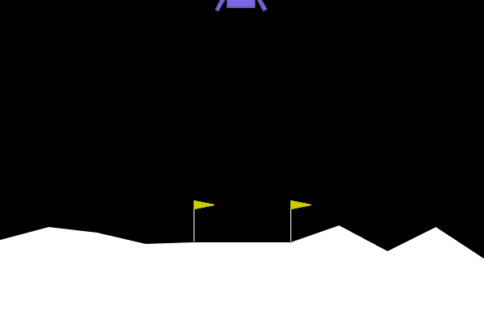
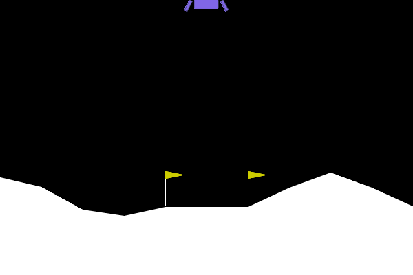

# Práctica 3: Aprendizaje por Refuerzo

## Introducción

En esta práctica, profundizaremos en el campo del **Aprendizaje por Refuerzo (RL)**, una rama del Aprendizaje Automático donde un **agente** aprende a tomar decisiones interactuando continuamente con un **entorno**. A diferencia del Aprendizaje Supervisado, donde el modelo aprende a partir de un conjunto de datos estático y etiquetado previamente, un agente de RL descubre qué acciones maximizan una serie de recompensas a través de un proceso de prueba y error.

El objetivo fundamental del agente es aprender una **política** óptima $\pi$—un mapeo de estados a acciones—que maximice la suma de **recompensas** descontadas (retorno) a lo largo del tiempo.

## Descripción del Problema: Entorno LunarLander-v3

Para esta práctica, nos centraremos en el entorno **LunarLander-v3**, un problema clásico de optimización de trayectorias disponible en la librería [Gymnasium](https://gymnasium.farama.org/environments/box2d/lunar_lander/).

En este escenario, controlamos un módulo de aterrizaje lunar. El objetivo es pilotar la nave para que aterrice de forma segura y suave en una plataforma de aterrizaje designada, que siempre se encuentra en las coordenadas $(0, 0)$. El combustible es infinito, por lo que el agente tiene libertad para aprender a volar, estabilizarse y finalmente aterrizar en su primer intento. Se trata de un entorno desafiante debido a la inercia de la nave, la gravedad y las posibles turbulencias.

### Proceso de Decisión de Markov

Para resolver este problema utilizando algoritmos de Aprendizaje por Refuerzo, primero debemos formalizarlo como un **Proceso de Decisión de Markov (MDP)**, definido por la tupla $(S, A, P, R)$:

**Espacio de Estados ($S$)**

El estado u observación es un **vector continuo formado por 8 valores** que describe la cinemática de la nave y el contacto con el suelo. Un estado está compuesto por:

- Posición de la nave en los ejes $X$ e $Y$.
- Velocidades lineales en $X$ e $Y$.
- Ángulo u orientación de la nave.
- Velocidad angular.
- Dos variables _booleanas_ que indican si la pata izquierda y/o derecha están en contacto con el suelo.

**Espacio de Acciones ($A$)**

El espacio de acciones es discreto, de acuerdo con el principio del máximo de Pontryagin, que sugiere que en este tipo de problemas es óptimo encender el motor al máximo o apagarlo por completo. En cada paso de tiempo, el agente puede ejecutar una de **4 posibles acciones**:

- $a = 0$: No hacer nada.
- $a = 1$: Encender el motor de orientación izquierdo.
- $a = 2$: Encender el motor principal.
- $a = 3$: Encender el motor de orientación derecho.

**Función de Recompensa ($R$)**

La función de recompensa $R(s, a)$ está diseñada para guiar a la nave hacia un aterrizaje seguro:

- Se otorgan **recompensas positivas** por acercarse a la plataforma de aterrizaje y por moverse lentamente al hacerlo.
- Se otorgan **recompensas negativas** por una mayor inclinación de la nave (ángulo no horizontal), por alejarse de la plataforma de aterrizaje y por moverse rápidamente al hacerlo.
- Para fomentar la eficiencia, se penaliza el uso de los motores laterales (**-0.03** puntos) y del motor principal (**-0.3** puntos).
- El contacto de cada pata con el suelo otorga **+10** puntos. Una vez producido el contacto, la pérdida del mismo otorga **-10** puntos.
- El episodio termina otorgando **+100** puntos si la nave aterriza de forma segura o **-100** puntos si se estrella.

Un episodio se considera oficialmente "resuelto" cuando el agente logra una puntuación igual o superior a **200** puntos.

**Función de Transición ($P$)**

La dinámica del entorno, $P(s^{\prime} | s, a)$, viene dictada de forma interna por el motor de físicas bidimensionales **Box2D**. Aunque las leyes físicas son **deterministas**, el entorno introduce **estocasticidad** mediante perturbaciones iniciales aleatorias (fuerzas) al comienzo de cada episodio, lo que obliga al agente a generalizar su política en lugar de memorizar una única trayectoria.

### Interacción Agente-Entorno

A continuación, se presenta el pseudocódigo que ilustra el bucle básico de interacción entre nuestro agente y el entorno de Gymnasium. Este bucle será la columna vertebral de vuestra implementación, independientemente de si usáis una política aleatoria o basada en gradientes.

!!! example "Algoritmo: Bucle de Interacción Agente-Entorno"
    1. Inicializar el entorno $Env$.
    2. Inicializar la política $\pi$ del agente.
    3. **Para** cada episodio:
        1. Reiniciar el entorno $Env$ y obtener el estado inicial $s_{0}$.
        2. **Para** cada paso $t$ del episodio:
            1. Seleccionar la acción $a_t$ en función de la política $\pi$.
            2. Ejecutar la acción $a_t$ en el entorno $Env$.
            3. Observar la recompensa $r_t$ y el nuevo estado $s_{t + 1}$.
            4. (Opcional)   Actualizar $\pi$ en función de $(s_t, a_t, r_t, s_{t + 1})$.
            5. $s_t \leftarrow s_{t + 1}$.

### Política ($\pi$)

Para que podáis observar el contraste entre un agente sin conocimiento del entorno y uno plenamente entrenado, a continuación os mostramos dos ejecuciones de prueba:

**Agente No Entrenado**

Este agente toma decisiones de forma aleatoria. Un agente con este comportamiento suele malgastar combustible y, normalmente, termina estrellándose o saliéndose de los límites de la pantalla.

<figure markdown="span">
  { width="500" align="center" }
  <figcaption>Agente que selecciona acciones aleatorias sin ningún tipo de entrenamiento previo.</figcaption>
</figure>

**Agente Entrenado**

Tras un proceso de entrenamiento guiado por algoritmos de RL, el agente aprende a encender los motores direccionales en los momentos precisos para contrarrestar la inercia, estabilizar su caída y aterrizar de forma segura entre las balizas.

<figure markdown="span">
  { width="500" align="center" }
  <figcaption>Agente que ha aprendido a tomar decisiones inteligentes mediante Aprendizaje por Refuerzo.</figcaption>
</figure>

## Ejercicio 1: Política Aleatoria

### Objetivos

En este primer ejercicio, deberéis implementar el bucle de interacción básico donde el agente selecciona acciones de forma puramente aleatoria en el entorno **LunarLander-v3**. Evaluar el rendimiento de un agente aleatorio nos permitirá cuantificar la dificultad del entorno y valorar objetivamente la mejora que aportan los métodos de aprendizaje por refuerzo.

### Tareas a Realizar

1.  **Implementación del Bucle de Interacción**: Desarrollad un _script_ en Python que ejecute **100 episodios consecutivos** de evaluación. En cada paso de tiempo, el agente debe seleccionar una acción utilizando `env.action_space.sample()`.

2.  **Recogida de Métricas**: Durante la ejecución de estos 100 episodios, deberéis almacenar los siguientes datos:

    - **Recompensa Acumulada**: La suma de todas las recompensas obtenidas por el agente desde el inicio hasta el final de cada episodio.
    - **Duración del Episodio**: El número total de pasos de tiempo que el agente sobrevive o tarda en alcanzar un estado terminal.

3.  **Visualización de los Resultados**: Utilizando la librería **Matplotlib**, generad dos gráficas que muestren la evolución de estas métricas a lo largo de los 100 episodios y calculad el **valor medio** y la **desviación estándar** para cada métrica.

4.  **Visualización de la Política**: Para ilustrar el comportamiento del agente, deberéis renderizar uno de los episodios y guardarlo como un archivo **GIF**. Para ello, aseguraos de renderizar el entorno con el modo `rgb_array` y de almacenar los _frames_ resultantes dentro del bucle de interacción agente-entorno.

### Creación de los GIFs

Para facilitar la exportación de vuestros resultados visuales, utilizad la siguiente función. Esta permite procesar la lista de _frames_ (imágenes RGB) capturadas durante el renderizado del entorno:

```python
import moviepy as mp
from IPython.display import Image

def save_gif(frames, filename, fps = 30):
    """
    Crea y serializa un archivo GIF a partir de un conjunto de frames RGB.
    """
    clip = mp.ImageSequenceClip(frames, fps = fps)
    clip.write_gif(filename, fps = fps) 
```

### Análisis de Resultados

Una vez completada la ejecución, incluid en vuestra memoria un breve análisis respondiendo a las siguientes cuestiones:

- ¿Por qué la política aleatoria es ineficaz en el entorno `LunarLander-v3`?

- Observando el GIF, ¿qué comportamientos erráticos impiden que el agente aterrice correctamente?

- ¿Cuál es la recompensa media obtenida y qué distancia existe respecto a los 200 puntos necesarios para considerar el entorno como "resuelto"?

### Preparación del Entorno

Para poder realizar esta práctica, necesitaréis instalar las librerías básicas de **Gymnasium** junto con las dependencias de **Box2D** y las herramientas de visualización. Ejecutad los siguientes comandos en vuestro terminal:

```bash
pip install "gymnasium[box2d]" numpy matplotlib moviepy
```

## Ejercicio 2: REINFORCE

### Objetivos

En este segundo ejercicio, deberéis implementar el algoritmo **REINFORCE**, un método _on-policy_ basado en **Gradientes de Políticas** fundamental en Aprendizaje por Refuerzo. En este caso, representaremos a nuestro agente (la política $\pi$) directamente como una **Red Neuronal**. Aquí es donde entra en juego [PyTorch](https://pytorch.org), uno de los _frameworks_ de Aprendizaje Profundo más utilizados en investigación y la industria por su facilidad para calcular gradientes de forma dinámica.

Para instalar PyTorch en vuestro entorno virtual, ejecutad el siguiente comando `pip`:

```bash
pip install torch
```

### La Arquitectura del Agente

A continuación, se os proporciona la clase base en PyTorch que representará el "cerebro" de vuestro agente:

```python
import torch
from torch import nn
import torch.nn.functional as F

class PolicyNetwork(nn.Module):

    def __init__(self, input_shape, n_actions, n_hidden):
        super(PolicyNetwork, self).__init__()
        self.fc1 = nn.Linear(input_shape, n_hidden)
        self.fc2 = nn.Linear(n_hidden, n_hidden)
        self.fc3 = nn.Linear(n_hidden, n_actions)

    def forward(self, x):
        x = F.relu(self.fc1(x))
        x = F.relu(self.fc2(x))
        x = self.fc3(x)
        
        # Creación de una distribución categórica a partir de los logits
        distribution = torch.distributions.Categorical(logits = x)
        
        # Muestreo de la acción y obtención de logaritmos y entropía
        action = distribution.sample()
        entropy = distribution.entropy()
        log_prob = distribution.log_prob(action)
        
        return action, log_prob, entropy
```

**Explicación de la Arquitectura**

- **Capas Completamente Conectadas**: La red consta de un Perceptrón Multicapa (MLP) con dos capas ocultas y una capa de salida. `input_shape` recibirá los 8 valores del estado, y la última capa generará salidas (logits) para las 4 posibles acciones.
- **Activaciones**: Se utiliza la Unidad Lineal Rectificada (ReLU) para llevar a cabo transformaciones no lineales, permitiendo a la red aprender mapeos complejos entre los estados y las acciones.
- **Distribución Categórica**: A diferencia del Aprendizaje Supervisado clásico, el agente debe explorar. Por ello, la salida de la red define una distribución de probabilidad sobre las acciones. El agente utiliza esta distribución para muestrear (`sample()`) una acción. Además, la red devuelve el logaritmo de la probabilidad (`log_prob`), un valor estrictamente necesario para nuestra función de pérdida.

### La Regla de Actualización de REINFORCE

El algoritmo **REINFORCE** actualiza los parámetros de la Red Neuronal $\theta$ en la dirección que maximiza el retorno esperado.

La regla de actualización basada en el descenso del gradiente estocástico (ascenso en este caso, ya que queremos maximizar la recompensa) se define matemáticamente como:

$$
\theta \leftarrow \theta + \alpha \gamma^t G_t \nabla_\theta \log \pi(a_t | s_t; \theta).
$$

Donde:

- $\theta$: Son los pesos y sesgos de la Red Neuronal (`PolicyNetwork`).
- $\alpha$: Es la **Tasa de Aprendizaje** del optimizador.
- $\gamma$: Es el **Factor de Descuento**, utilizado para cuantificar la importancia de las recompensas futuras.
- $G_t$: Es el retorno descontado acumulado desde el instante $t$ hasta el final del episodio ($G_t = \sum_{k=t}^{T} \gamma^{k-t} r_k$). Actúa como un factor de escala: si la trayectoria fue buena ($G_t > 0$), la probabilidad de la acción aumentará. Si fue mala ($G_t < 0$), disminuirá.
- $\nabla_\theta \log \pi(a_t | s_t; \theta)$: Es el gradiente del logaritmo de la probabilidad de haber tomado la acción $a_t$ en el estado $s_t$. Representa la dirección en la que hay que modificar los pesos para aumentar la probabilidad de tomar esa acción en el futuro.

### Tareas a Realizar

En este ejercicio, deberéis dividir vuestra implementación en dos fases claramente diferenciadas:

**Fase A: Entrenamiento**

Deberéis implementar el bucle principal de entrenamiento del algoritmo **REINFORCE** puro a lo largo de **1000 episodios** en el entorno **LunarLander-v3**.

- **Hiperparámetros**: El éxito del Aprendizaje por Refuerzo Profundo depende en gran medida de los hiperparámetros. Deberéis realizar pruebas empíricas para determinar y fijar la **Tasa de Aprendizaje** ($\alpha$), el **Factor de Descuento** ($\gamma$) y el **número de neuronas ocultas** (`n_hidden`) de la red neuronal.

- **Optimizador**: La elección del optimizador neuronal en PyTorch es crucial. Debéis instanciar un optimizador apropiado (por ejemplo, Adam o SGD).

- **Justificación**: En la memoria, justificad exhaustivamente la elección de los hiperparámetros y del optimizador. ¿Qué ocurre si la tasa de aprendizaje es demasiado alta? ¿Y si $\gamma$ es cercano a 0?

- **Calidad del Código**: Todo el proceso de cálculo de retornos descontados, la construcción de la función de pérdida y el paso de optimización (retropropagación) debe estar **debidamente comentado** para demostrar que comprendéis la mecánica interna del algoritmo.

- **Visualización del Progreso**: Utilizando la librería Matplotlib, generad dos gráficas que muestren la evolución de la **recompensa acumulada** y el **número total de pasos de tiempo** a lo largo de los 1000 episodios de entrenamiento y calculad el **valor medio** y la **desviación estándar** para cada métrica.

**Fase B: Evaluación**

Una vez que el modelo esté entrenado, evaluaréis sus pesos finales a lo largo de **100 episodios**.

- **Métricas y Gráficas**: Al igual que en el primer ejercicio, debéis generar gráficas con Matplotlib mostrando la **recompensa acumulada** y la **duración** (pasos de tiempo) de cada episodio de evaluación.

- **Análisis Visual y Estadístico**: Generad un nuevo **GIF** con un episodio completo guiado por la red neuronal entrenada. En la memoria, comparad rigurosamente estos resultados con los obtenidos mediante fuerza bruta en el Ejercicio 1. Discutid cómo el gradiente de la política ha transformado un comportamiento aleatorio en uno sistemático e inteligente.

### Tarea Opcional

La versión _vanilla_ de **REINFORCE** que implementaréis en la parte obligatoria suele sufrir de **alta varianza** durante el entrenamiento, lo que provoca curvas de aprendizaje inestables. Para obtener una puntuación extra, podéis implementar una de (o ambas) las siguientes mejoras en el algoritmo básico:

1.  **Normalización de Retornos**: Antes de multiplicar el logaritmo de las probabilidades por el retorno $G_t$, normalizad el tensor de retornos de cada episodio.

2.  **Bonus de Entropía**: Modificad la función de pérdida usando el valor de la entropía. La entropía, que la clase `PolicyNetwork` ya devuelve, mide la incertidumbre de la política. Fomentar una alta entropía evita la convergencia prematura a políticas subóptimas y fomenta la exploración.

Si implementáis estas mejoras, incluid nuevas gráficas para las dos métricas, tanto en la fase de entrenamiento como en la fase de evaluación. Redactad una breve discusión analizando empíricamente cómo la normalización o la entropía estabilizan y/o aceleran la convergencia del agente en el entorno **LunarLander-v3**.

## Ejercicio 3: REINFORCE con Línea Base

### Objetivos

Como seguramente habréis notado al analizar los resultados del Ejercicio 2, el algoritmo **REINFORCE** en su versión más básica (o _vanilla_) presenta un problema fundamental: **una alta varianza** durante el proceso de entrenamiento. Al depender de la recompensa total de una trayectoria completa, una única mala acción puede penalizar injustamente a todo un conjunto de buenas decisiones anteriores, haciendo que el aprendizaje sea inestable y requiera muchos episodios para converger.

Para mitigar este problema, en este tercer y último ejercicio, deberéis mejorar vuestro algoritmo introduciendo una **Línea Base** (_baseline_). Matemáticamente, podemos restar un valor $b(s_t)$ al retorno $G_t$ sin introducir sesgo en el gradiente de la política, siempre y cuando $b(s_t)$ no dependa de la acción $a_t$.

La elección óptima para esta línea base es la **Función de Valor del Estado** $V(s_t)$. Al hacer esto, la actualización de nuestra política ya no dependerá de si el retorno absoluto es alto o bajo, sino de la **ventaja** $\delta_t$: ¿fue el retorno obtenido tras ejecutar una acción mejor o peor de lo que esperábamos obtener desde ese estado?

$$
\delta_t = G_t - V(s_t)
$$

### La Arquitectura del Crítico

Dado que $V(s_t)$ es generalmente desconocida, la aproximaremos utilizando una segunda red neuronal (`ValueNetwork`). A esta red, que "critica" o evalúa lo bueno que es un estado, la llamaremos **Crítico**, mientras que nuestra `PolicyNetwork` original actuará como el **Actor**.

A continuación, se os proporciona la implementación en PyTorch de la red de valor. Podéis utilizar el mismo valor para el hiperparámetro `n_hidden` que usasteis en la red de la política:

```python
class ValueNetwork(nn.Module):
    
    def __init__(self, n_features, n_hidden):
        super(ValueNetwork, self).__init__()
        self.fc1 = nn.Linear(n_features, n_hidden)
        self.fc2 = nn.Linear(n_hidden, n_hidden)
        self.fc3 = nn.Linear(n_hidden, 1)

    def forward(self, x) -> torch.Tensor:
        x = F.relu(self.fc1(x))
        x = F.relu(self.fc2(x))
        x = self.fc3(x)
        return x
```

A diferencia de la red de la política, observad que la capa de salida de la `ValueNetwork` consta de una única neurona sin función de activación final (salida lineal), ya que su objetivo es predecir un valor continuo escalar: el retorno esperado $G_t$.

### Pseudocódigo de REINFORCE con Línea Base

Para facilitar vuestra implementación, a continuación se presenta el esquema algorítmico básico que debéis seguir en la fase de entrenamiento:

!!! example "Algoritmo: REINFORCE con Línea Base"
    1. Inicializar `PolicyNetwork` (Actor) con pesos $\theta$.
    2. Inicializar `ValueNetwork` (Crítico) con pesos $\phi$.
    3. **Para** cada episodio:
        1. Generar una trayectoria completa usando la política $\pi_\theta$.
        2. Calcular los retornos descontados $G_t$ para cada paso $t$.
        3. **Para** cada paso $t$ en la trayectoria:
            1. Obtener la estimación de valor: $V_\phi(s_t)$.
            2. Calcular la ventaja: $\delta_t = G_t - V_\phi(s_t)$.
            3. Calcular la pérdida del Actor.
            4. Calcular la pérdida del Crítico.
        4. Actualizar $\phi$ minimizando la pérdida del Crítico.
        5. Actualizar $\theta$ minimizando la pérdida del Actor.

### Tareas a Realizar

Al igual que en el ejercicio anterior, estructuraréis vuestra solución en dos fases:

**Fase A: Entrenamiento**

Implementad el bucle de entrenamiento descrito en el pseudocódigo durante **1000 episodios** en el entorno **LunarLander-v3**.

- **Optimizadores**: Necesitaréis instanciar dos optimizadores (uno para los parámetros de la red de la política y otro para la red de valor). Reflexionad y justificad si ambas redes deben aprender a la misma velocidad (**Tasa de Aprendizaje**) o si una debería ser más rápida que la otra.

**Fase B: Evaluación**

Evaluad los pesos finales de vuestro **Actor** (`PolicyNetwork`) a lo largo de **100 episodios** en modo inferencia.

- **Métricas y Visualización**: Generad las gráficas de **recompensa acumulada** y **duración** de los episodios. Cread el **GIF** del agente interactuando con el entorno.

- **Discusión Crítica**: Comparad directamente estas gráficas con las obtenidas en el Ejercicio 2 (**REINFORCE** puro). ¿Cómo ha afectado la introducción de la línea base a la velocidad de aprendizaje y a la estabilidad de la curva de recompensas?

### Tarea Opcional

De manera análoga al ejercicio anterior, para obtener la máxima puntuación posible, podéis implementar un sistema de mejoras sobre vuestro algoritmo **REINFORCE** con línea base.

Integrad en vuestro bucle de entrenamiento:

1. **Normalización de Retornos/Ventajas:** Normalizad matemáticamente las **Ventajas** ($\delta_t$) obtenidas en cada episodio.

2. **Bonus de Entropía:** Añadid el término de entropía a la pérdida del **Actor** para fomentar la exploración.

En vuestra memoria, estableced una comparación empírica entre esta versión mejorada del algoritmo **REINFORCE** con línea base y el algoritmo **REINFORCE** con línea base que implementaréis en la parte obligatoria de este ejercicio.